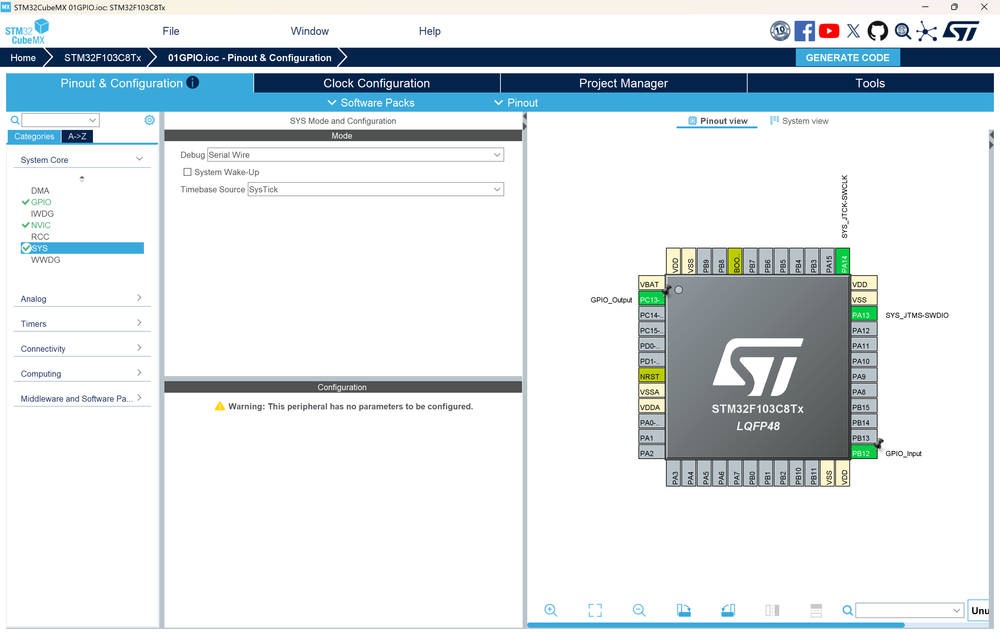

# 作业1：STM32 GPIO 输入输出实验

## 作业要求

使用 STM32CubeMX 生成工程框架，在 `main.c` 中编写用户代码，通过 HAL 库实现：

- **输入**：读取按键（PB12）的电平状态
- **输出**：将读取到的电平状态直接驱动 LED（PC13）

即按键按下时 LED 亮，松开时 LED 灭（或相反，取决于硬件连接极性）。

---

## STM32CubeMX 配置步骤

### 1. 新建工程

1. 打开 STM32CubeMX，点击 **File → New Project**
2. 在芯片选择界面搜索 `STM32F103C8T6`，选中后点击 **Start Project**


### 2. 配置系统时钟（RCC）

1. 左侧 **Pinout & Configuration → System Core → RCC**
2. **High Speed Clock (HSE)** 选择 `Disable`（使用内部 HSI，8 MHz）

3. 切换到 **Clock Configuration** 标签页，确认 SYSCLK 来源为 HSI，频率为 8 MHz


### 3. 配置调试接口（SYS）

1. 左侧 **Pinout & Configuration → System Core → SYS**
2. **Debug** 下拉菜单选择 `Serial Wire`


**为什么必须选择 Serial Wire：**

STM32F103C8T6 支持两种调试接口：

| 选项 | 引脚占用 | 说明 |
|------|----------|------|
| `No Debug` | 无 | 禁用调试接口，PA13/PA14 作为普通 GPIO |
| `Serial Wire` | PA13 (SWDIO)、PA14 (SWCLK) | SWD 调试接口，ST-Link 使用此协议 |
| `JTAG (4 pins)` | PA13/PA14/PA15/PB3 | 完整 JTAG，占用引脚多 |
| `JTAG (5 pins)` | 上述 + PB4 | 完整 JTAG + TRST |

**选择 `No Debug` 后烧录程序会发生什么：**

CubeMX 生成的初始化代码会将 PA13/PA14 重映射为普通 GPIO，**SWD 接口被禁用**。烧录该程序后：

- ST-Link 无法再通过 SWD 连接芯片
- 后续无法使用 ST-Link 烧录新程序或调试
- 表现为 ST-Link 报错：`No target connected` 或 `Cannot connect to target`

**这会让 STM32 变砖吗？**

不会永久变砖，但需要通过**串口 ISP（UART 引导加载程序）**恢复：

1. 将 BOOT0 引脚拉高（接 VCC），BOOT1 拉低（接 GND）
2. 芯片上电后进入内置 Bootloader 模式
3. 使用 **STM32CubeProgrammer** 通过 UART（PA9/PA10）连接芯片
4. 烧录一个正确配置了 Serial Wire 的新程序
5. 将 BOOT0 重新拉低，复位芯片，SWD 恢复正常

**BOOT0 / BOOT1 引脚详解：**

STM32F103 上电或复位时采样 BOOT0 和 BOOT1 电平，决定启动来源：

| BOOT0 | BOOT1 | 启动模式 | 说明 |
|-------|-------|----------|------|
| 0（GND） | 任意 | 主闪存（Flash）启动 | 正常运行用户程序，**默认模式** |
| 1（VCC） | 0（GND） | 系统存储器启动 | 运行出厂 Bootloader，支持串口 ISP 烧录 |
| 1（VCC） | 1（VCC） | SRAM 启动 | 从 SRAM 运行代码，极少使用 |

Blue Pill 板上有两个跳线帽，标注 `BOOT0` 和 `BOOT1`，拨到 `0` 侧接 GND，拨到 `1` 侧接 VCC。

进入串口 ISP 模式步骤：
1. **BOOT0 跳线拨到 `1`**，BOOT1 保持 `0`
2. 按 RESET 或重新上电，芯片进入系统 Bootloader
3. USB-TTL 模块连接：PA9 → RX，PA10 → TX，GND → GND
4. STM32CubeProgrammer 选接口 `UART`，选对应串口，点击 Connect
5. 烧录完成后 **BOOT0 拨回 `0`**，按 RESET 正常启动

> 结论：选择 `No Debug` 不会物理损坏芯片，但会导致 SWD 调试接口失效，必须通过串口 Bootloader 才能恢复，操作繁琐。**务必选择 `Serial Wire`。**

**利用 Reset 按键配合 ST-Link 恢复 SWD 的方法：**

如果 SWD 已被禁用，ST-Link 无法正常连接，可以尝试以下方法，利用芯片复位瞬间 SWD 尚未被用户代码覆盖的时间窗口强行连接：

1. 打开 **STM32CubeProgrammer**，连接方式选择 `ST-LINK`，Mode 选择 `Under Reset`
2. 用手按住开发板上的 **RESET 按键不松开**（保持芯片处于复位状态）
3. 点击 STM32CubeProgrammer 的 **Connect** 按钮
4. 在 Connect 的同时**松开 RESET 按键**，让芯片开始运行
5. 芯片刚上电的极短时间内，SWD 引脚尚处于默认复用状态，STM32CubeProgrammer 可以在用户代码将其重映射为 GPIO 之前抢先建立连接
6. 连接成功后，立即烧录一个正确配置了 `Serial Wire` 的新程序

> 此方法成功率取决于时序配合，需要多试几次。若多次失败，则改用串口 ISP（BOOT0 拉高）方式恢复。

### 4. 配置 GPIO 引脚

#### **PC13（LED 输出）：**
1. 在芯片引脚图上点击 **PC13**，选择 `GPIO_Output`
2. 左侧 **System Core → GPIO**，点击 PC13 行进行详细配置：
   - GPIO output level：`Low`
   - GPIO mode：`Output Push Pull`（推挽输出）
   - GPIO Pull-up/Pull-down：`No pull-up and no pull-down`
   - Maximum output speed：`Low`
   - User Label：`LED`（可选）

#### **PB12（按键输入）：**
1. 在芯片引脚图上点击 **PB12**，选择 `GPIO_Input`
2. 点击 PB12 行进行详细配置：
   - GPIO mode：`Input mode`
   - GPIO Pull-up/Pull-down：`Pull-up`（上拉）
   - User Label：`KEY`（可选）


### 4. 配置工程输出

1. 切换到 **Project Manager** 标签页
2. **Project** 子页：
   - Project Name：填写工程名（如 `01GPIO`）
   - Project Location：选择保存路径
   - Toolchain/IDE：根据开发环境选择，各选项区别如下：

     | 选项 | 说明 | 适用场景 |
     |------|------|----------|
     | `STM32CubeIDE` | ST 官方 IDE，基于 Eclipse，开箱即用 | 使用 STM32CubeIDE 开发 |
     | `MDK-ARM` | Keil MDK，商业 IDE，调试功能强 | 使用 Keil 开发 |
     | `EWARM` | IAR Embedded Workbench，商业 IDE | 使用 IAR 开发 |
     | `Makefile` | 生成 Makefile，命令行构建 | Linux 环境或自定义工具链 |
     | `CMake` | 生成 CMakeLists.txt，跨平台构建系统 | VSCode + STM32 插件 |

     **本实验选择 `CMake`**，原因是使用 VSCode 配合 **STM32 VS Code Extension** 插件`STM32CubeIDE for VS Code`进行开发。该插件原生支持 CMake 工程，可在 VSCode 中直接完成编译、烧录和调试，无需安装 STM32CubeIDE 或 Keil。
   
3. **Code Generator** 子页：
   - 勾选 **Generate peripheral initialization as a pair of '.c/.h' files per peripheral**（可选）
   

### 5. 生成代码

点击右上角 **GENERATE CODE**，CubeMX 自动生成包含 `MX_GPIO_Init` 的工程框架。

### 6. 添加用户代码

在生成的 `Core/Src/main.c` 中，找到 `while (1)` 循环内的 `USER CODE BEGIN 3` 注释区域，添加：

```c
GPIO_PinState key_state = HAL_GPIO_ReadPin(GPIOB, GPIO_PIN_12);
HAL_GPIO_WritePin(GPIOC, GPIO_PIN_13, key_state);
```

---

## 核心代码解析

### 1. GPIO 初始化（`MX_GPIO_Init`）

```c
// 使能 GPIO 时钟
__HAL_RCC_GPIOC_CLK_ENABLE();
__HAL_RCC_GPIOB_CLK_ENABLE();

// 配置 PC13 为推挽输出
GPIO_InitStruct.Pin   = GPIO_PIN_13;
GPIO_InitStruct.Mode  = GPIO_MODE_OUTPUT_PP;  // 推挽输出
GPIO_InitStruct.Pull  = GPIO_NOPULL;          // 无上下拉
GPIO_InitStruct.Speed = GPIO_SPEED_FREQ_LOW;
HAL_GPIO_Init(GPIOC, &GPIO_InitStruct);

// 配置 PB12 为上拉输入
GPIO_InitStruct.Pin  = GPIO_PIN_12;
GPIO_InitStruct.Mode = GPIO_MODE_INPUT;       // 输入模式
GPIO_InitStruct.Pull = GPIO_PULLUP;           // 内部上拉
HAL_GPIO_Init(GPIOB, &GPIO_InitStruct);
```

**关键点：**
- 使用 GPIO 外设前必须先使能对应端口的时钟，否则寄存器写入无效。
- `GPIO_InitTypeDef` 结构体复用时，只需重新赋值需要改变的字段，再调用 `HAL_GPIO_Init`。

### 2. 主循环逻辑

```c
while (1)
{
    GPIO_PinState key_state = HAL_GPIO_ReadPin(GPIOB, GPIO_PIN_12);
    HAL_GPIO_WritePin(GPIOC, GPIO_PIN_13, key_state);
}
```

- `HAL_GPIO_ReadPin` 返回 `GPIO_PIN_SET`（1）或 `GPIO_PIN_RESET`（0）。
- 将读取值直接写入输出引脚，实现输入到输出的直通映射。
- 由于 PB12 配置了内部上拉，未按键时读到高电平（SET），按下后拉低读到低电平（RESET）。

---

## 不同 GPIO 配置对结果的影响分析

### 输入配置

| 配置 | 宏定义 | 未接外部信号时的引脚状态 | 典型应用场景 |
|------|--------|--------------------------|--------------|
| 上拉输入 | `GPIO_PULLUP` | 默认高电平（1） | 按键低电平有效（按下接 GND） |
| 下拉输入 | `GPIO_PULLDOWN` | 默认低电平（0） | 按键高电平有效（按下接 VCC） |
| 浮空输入 | `GPIO_NOPULL` | 不确定，易受干扰 | 外部已有确定驱动时使用 |

**本实验使用上拉输入（`GPIO_PULLUP`）：**
- 未按键：PB12 通过内部上拉电阻接 VCC → 读到 `GPIO_PIN_SET` → PC13 输出高电平
- 按键按下（接 GND）：PB12 被拉低 → 读到 `GPIO_PIN_RESET` → PC13 输出低电平

若改为**下拉输入（`GPIO_PULLDOWN`）**，逻辑相反：
- 未按键：默认低电平 → LED 状态翻转
- 需要按键接 VCC 才能触发

若改为**浮空输入（`GPIO_NOPULL`）**：
- 引脚悬空时电平不确定，LED 会随机闪烁，不可靠

### 输出配置

| 配置 | 宏定义 | 特性 | 典型应用场景 |
|------|--------|------|--------------|
| 推挽输出 | `GPIO_MODE_OUTPUT_PP` | 可主动输出高/低电平，驱动能力强 | 直接驱动 LED、继电器等 |
| 开漏输出 | `GPIO_MODE_OUTPUT_OD` | 只能主动拉低，高电平需外部上拉 | I2C 总线、电平转换 |

**本实验使用推挽输出（`GPIO_MODE_OUTPUT_PP`）：**
- 输出高电平时，内部 P-MOS 导通，引脚直接驱动到 VCC
- 输出低电平时，内部 N-MOS 导通，引脚直接拉到 GND
- 驱动能力强，适合直接点亮 LED

若改为**开漏输出（`GPIO_MODE_OUTPUT_OD`）**：
- 写高电平时引脚处于高阻态，需外部上拉电阻才能输出高电平
- 若无外部上拉，LED 将无法被点亮（引脚悬空）

### 输出速度配置

| 配置 | 宏定义 | 最大翻转频率 | 说明 |
|------|--------|-------------|------|
| 低速 | `GPIO_SPEED_FREQ_LOW` | ~2 MHz | 功耗低，EMI 小，适合低频信号 |
| 中速 | `GPIO_SPEED_FREQ_MEDIUM` | ~10 MHz | 平衡选择 |
| 高速 | `GPIO_SPEED_FREQ_HIGH` | ~50 MHz | 适合高频通信（SPI、高速 PWM） |

本实验 LED 控制对速度无要求，使用低速即可，可减少电磁干扰。

---

## 硬件连接说明

| 引脚 | 功能 | 配置 |
|------|------|------|
| PC13 | LED 输出 | 推挽输出，低电平点亮（板载 LED 通常低有效） |
| PB12 | 按键输入 | 上拉输入，按下接 GND |
