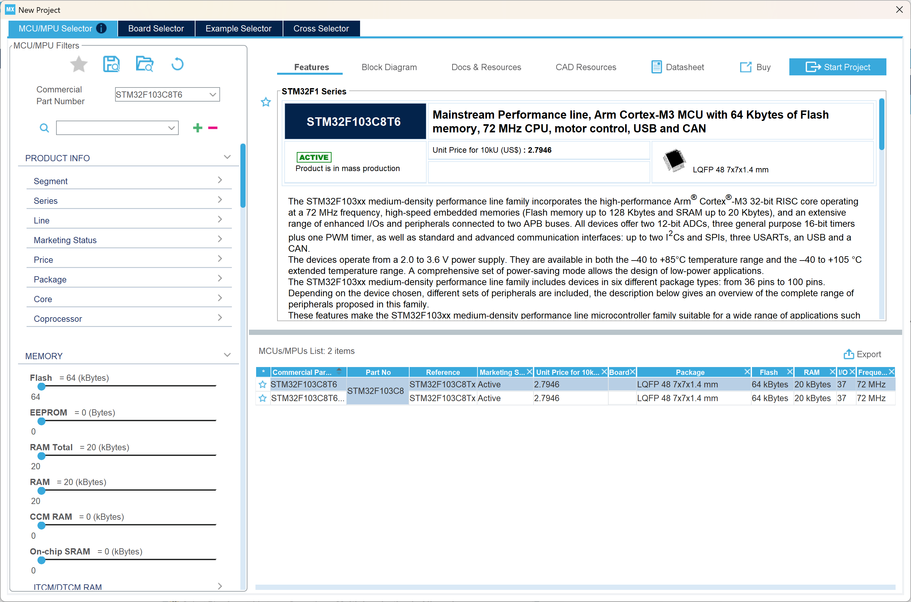
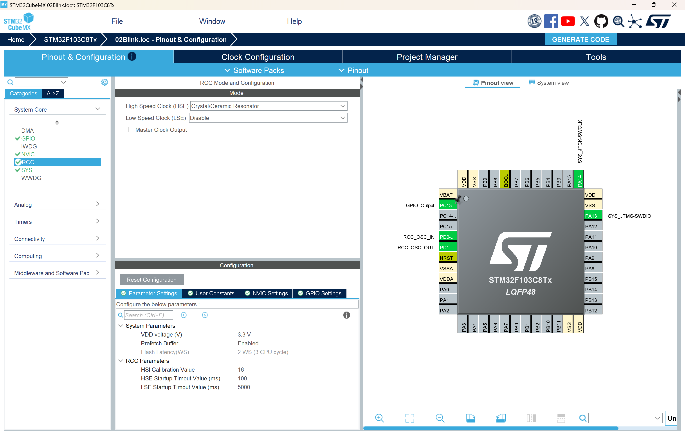
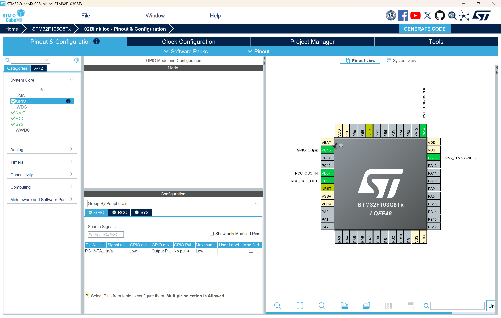
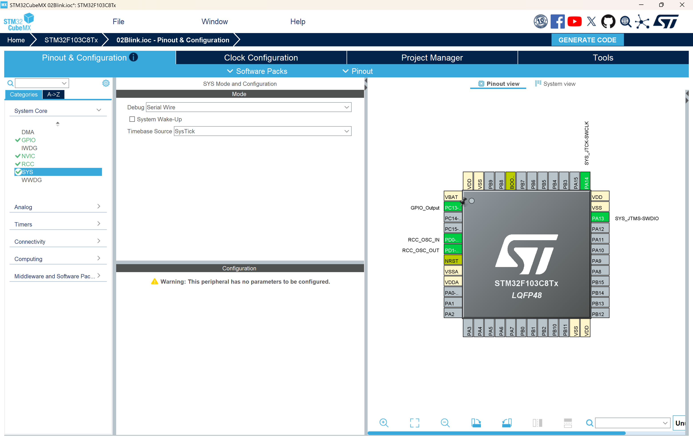
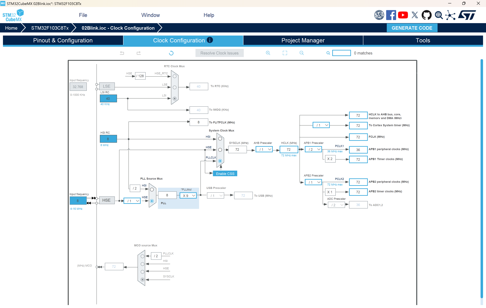
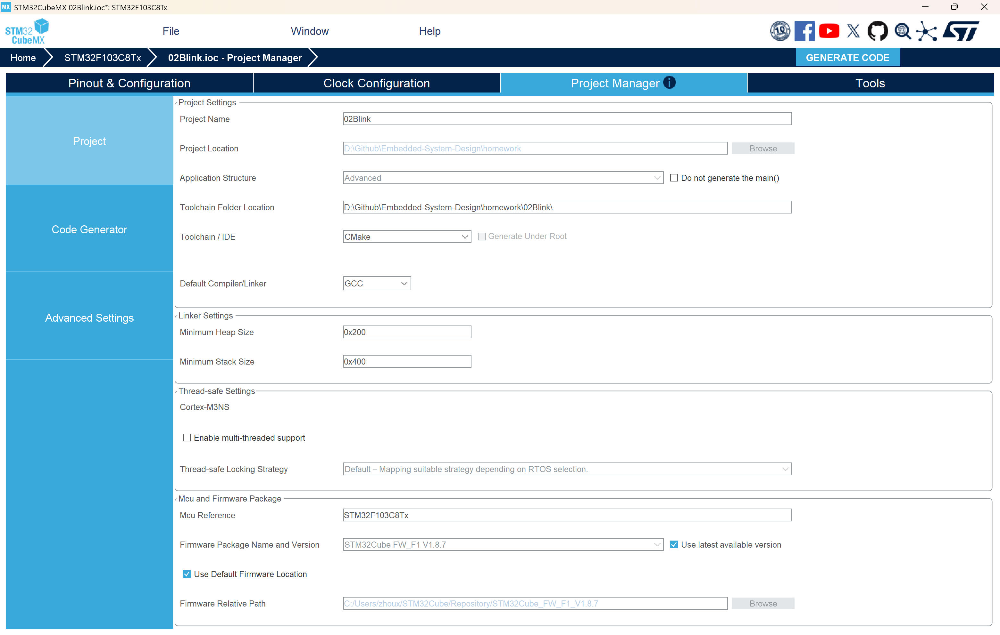

# 作业2：LED闪烁实验

## 一、实验目的

1. 掌握STM32 GPIO的基本配置方法
2. 学习使用STM32CubeMX进行工程配置
3. 理解HAL库的GPIO操作函数
4. 掌握延时函数的使用方法
5. 完成一个简单的LED闪烁程序

## 二、基础知识

在开始实验之前，我们需要理解两个核心概念：RCC时钟系统和HAL_Delay延时函数。这两个知识点是本次实验的理论基础。

### 2.1 RCC（Reset and Clock Control）时钟系统

#### 2.1.1 什么是RCC？

RCC是STM32的复位和时钟控制模块，负责管理整个芯片的时钟系统。可以把它理解为STM32的"心脏起搏器"，为所有外设提供工作节拍。

**为什么需要时钟？**
- 数字电路需要时钟信号来同步各种操作
- 没有时钟，CPU无法执行指令，外设无法工作
- 不同的外设可能需要不同频率的时钟

#### 2.1.2 STM32F103的时钟源

STM32F103有多个时钟源可供选择：

1. **HSI（High Speed Internal）**：内部高速时钟
   - 频率：8MHz
   - 优点：无需外部元件，成本低
   - 缺点：精度较低（约1%误差），温度漂移大
   - 适用场景：对时钟精度要求不高的应用

2. **HSE（High Speed External）**：外部高速时钟
   - 频率：通常为8MHz（由外部晶振决定）
   - 优点：精度高（通常<50ppm），稳定性好
   - 缺点：需要外部晶振，增加成本
   - 适用场景：需要精确时钟的应用（如USB、CAN通信）
   - **本实验使用HSE**

3. **LSI（Low Speed Internal）**：内部低速时钟
   - 频率：40kHz
   - 用途：独立看门狗、RTC（实时时钟）

4. **LSE（Low Speed External）**：外部低速时钟
   - 频率：32.768kHz
   - 用途：RTC，功耗敏感应用

#### 2.1.3 STM32F103时钟树结构

STM32的时钟系统是一个复杂的树状结构，从时钟源到各个外设经过多级分频和选择：

```
HSE (8MHz) ──→ PLL ×9 ──→ SYSCLK (72MHz) ──→ AHB预分频器 ──→ HCLK (72MHz)
                                                    │
                                                    ├──→ APB1预分频器 (/2) ──→ PCLK1 (36MHz)
                                                    │         │
                                                    │         └──→ TIM2-7时钟 (×2) = 72MHz
                                                    │
                                                    ├──→ APB2预分频器 (/1) ──→ PCLK2 (72MHz)
                                                    │         │
                                                    │         └──→ TIM1,8时钟 = 72MHz
                                                    │
                                                    └──→ Cortex系统定时器 (SysTick)
```

**关键时钟说明**：

- **SYSCLK（系统时钟）**：CPU的工作时钟，本实验配置为72MHz
- **HCLK（AHB时钟）**：AHB总线、内核、内存、DMA的时钟
- **PCLK1（APB1时钟）**：低速外设时钟（最高36MHz），包括TIM2-7、USART2-5、I2C、SPI2等
- **PCLK2（APB2时钟）**：高速外设时钟（最高72MHz），包括TIM1/8、USART1、SPI1、ADC、GPIO等

#### 2.1.4 PLL（锁相环）倍频

STM32F103的最高工作频率是72MHz，但外部晶振通常只有8MHz，如何达到72MHz？答案是使用PLL倍频。

**PLL工作原理**：
```
输出频率 = 输入频率 × 倍频系数
72MHz = 8MHz × 9
```

在本实验中：
- 输入：HSE = 8MHz
- 倍频系数：9
- 输出：SYSCLK = 72MHz

**为什么要用72MHz？**
- 更高的时钟频率意味着更快的运算速度
- 72MHz是STM32F103的最高安全工作频率
- 更高的频率也意味着更高的功耗

#### 2.1.5 外设时钟使能

在STM32中，为了降低功耗，所有外设的时钟默认是关闭的。使用外设前必须先使能其时钟。

例如，使用GPIOC之前必须执行：
```c
__HAL_RCC_GPIOC_CLK_ENABLE();
```

这个宏展开后实际上是操作RCC寄存器：
```c
// 等价于
RCC->APB2ENR |= RCC_APB2ENR_IOPCEN;
```

**为什么要这样设计？**
- 节省功耗：未使用的外设不消耗时钟功耗
- 灵活性：可以根据需要动态开关外设时钟
- 低功耗模式：可以选择性关闭部分外设时钟

### 2.2 HAL_Delay()延时函数详解

#### 2.2.1 HAL_Delay()函数原型

```c
void HAL_Delay(uint32_t Delay);
```

- 参数：延时时间，单位为毫秒（ms）
- 返回值：无
- 功能：阻塞式延时，延时期间CPU一直等待

#### 2.2.2 实现原理：基于SysTick定时器

HAL_Delay()的实现依赖于ARM Cortex-M3内核的SysTick定时器。

**SysTick定时器简介**：
- SysTick是ARM Cortex-M内核自带的24位递减定时器
- 专门用于提供系统时基（System Tick）
- 每个Cortex-M内核都有一个SysTick
- 不占用STM32的通用定时器资源

**SysTick工作原理**：
```
1. 设置重装载值（RELOAD）
2. 启动定时器，开始递减计数
3. 计数到0时产生中断
4. 自动重装载，继续计数
```

#### 2.2.3 HAL_Delay()的实现流程

**第一步：HAL_Init()初始化SysTick**

在`HAL_Init()`函数中，会调用`HAL_InitTick()`配置SysTick：

```c
HAL_StatusTypeDef HAL_InitTick(uint32_t TickPriority)
{
  // 配置SysTick为1ms中断一次
  // HCLK = 72MHz，需要72000个时钟周期产生1ms
  HAL_SYSTICK_Config(SystemCoreClock / 1000U);
  
  // 设置SysTick中断优先级
  HAL_NVIC_SetPriority(SysTick_IRQn, TickPriority, 0U);
  
  return HAL_OK;
}
```

**关键计算**：
```
SysTick重装载值 = SystemCoreClock / 1000
                = 72,000,000 Hz / 1000
                = 72,000

即每72,000个时钟周期产生一次中断（1ms）
```

**第二步：SysTick中断服务函数**

每1ms，SysTick会产生一次中断，执行中断服务函数：

```c
void SysTick_Handler(void)
{
  HAL_IncTick();  // 增加系统滴答计数
}

void HAL_IncTick(void)
{
  uwTick += uwTickFreq;  // uwTick是全局变量，记录系统运行的毫秒数
}
```

**第三步：HAL_Delay()延时实现**

```c
void HAL_Delay(uint32_t Delay)
{
  uint32_t tickstart = HAL_GetTick();  // 获取当前时间戳
  uint32_t wait = Delay;

  // 等待指定的时间
  while((HAL_GetTick() - tickstart) < wait)
  {
    // 空循环等待
  }
}

uint32_t HAL_GetTick(void)
{
  return uwTick;  // 返回当前系统滴答数（毫秒）
}
```

**工作流程图**：
```
HAL_Delay(500) 调用
    ↓
记录起始时间 tickstart = HAL_GetTick()  // 假设为1000ms
    ↓
进入while循环
    ↓
每次循环检查：HAL_GetTick() - tickstart < 500 ?
    ↓
SysTick每1ms中断一次，uwTick++
    ↓
当 uwTick = 1500 时，(1500 - 1000) = 500，退出循环
    ↓
延时结束
```

#### 2.2.4 HAL_Delay()的特点

**优点**：
1. **使用简单**：一行代码实现延时
2. **精度较高**：基于硬件定时器，精度为1ms
3. **不受编译优化影响**：不像软件延时会被编译器优化
4. **时间准确**：只要系统时钟配置正确，延时就准确

**缺点**：
1. **阻塞式延时**：延时期间CPU无法执行其他任务
2. **浪费CPU资源**：CPU在while循环中空转
3. **不适合多任务**：无法同时处理多个事件
4. **功耗较高**：CPU一直运行，无法进入低功耗模式

#### 2.2.5 延时精度分析

**理论精度**：1ms（SysTick中断周期）

**实际精度**：
```c
HAL_Delay(500);  // 实际延时：500ms ± 1ms
```

**误差来源**：
1. SysTick中断响应延迟（几个时钟周期）
2. 函数调用开销
3. while循环判断时间

**精度测试**：
```c
// 使用示波器测量GPIO翻转周期
HAL_GPIO_WritePin(GPIOC, GPIO_PIN_13, GPIO_PIN_SET);
HAL_Delay(500);
HAL_GPIO_WritePin(GPIOC, GPIO_PIN_13, GPIO_PIN_RESET);
// 测量高电平持续时间，应该非常接近500ms
```

#### 2.2.6 HAL_Delay()与系统时钟的关系

HAL_Delay()的准确性完全依赖于系统时钟配置：

**情况1：时钟配置正确（72MHz）**
```c
SystemCoreClock = 72,000,000 Hz
SysTick重装载值 = 72,000
实际中断周期 = 72,000 / 72,000,000 = 1ms ✓
HAL_Delay(500) = 500ms ✓
```

**情况2：时钟配置错误（8MHz，未使能PLL）**
```c
SystemCoreClock = 8,000,000 Hz
SysTick重装载值 = 8,000（按8MHz计算）
但实际SystemCoreClock = 72,000,000 Hz
实际中断周期 = 8,000 / 72,000,000 = 0.111ms ✗
HAL_Delay(500) = 500 × 0.111ms = 55.5ms ✗（延时变短）
```

**情况3：时钟配置错误（使用HSI而非HSE）**
```c
如果误用HSI（8MHz）但代码按HSE+PLL（72MHz）配置
可能导致时钟配置失败，系统运行在默认的HSI（8MHz）
HAL_Delay(500)实际延时 = 500 × (8/72) = 55.5ms
```

**结论**：正确配置RCC时钟是HAL_Delay()准确工作的前提！

### 2.3 本实验中RCC和HAL_Delay的配合

在本实验中，RCC和HAL_Delay()的关系如下：

```
1. RCC配置HSE（8MHz）和PLL（×9）
   ↓
2. 系统时钟SYSCLK = 72MHz
   ↓
3. HAL_Init()根据SystemCoreClock配置SysTick
   ↓
4. SysTick每1ms产生中断，uwTick++
   ↓
5. HAL_Delay(500)通过检查uwTick实现500ms延时
   ↓
6. LED每500ms翻转一次，实现1Hz闪烁
```

**关键点**：
- RCC提供稳定的72MHz系统时钟
- SysTick基于72MHz时钟产生精确的1ms时基
- HAL_Delay()基于1ms时基实现毫秒级延时
- LED闪烁频率的准确性最终取决于RCC时钟配置

## 三、实验要求

### 硬件要求
- STM32F103C8T6开发板
- LED连接到PC13引脚
- USB转串口下载器（ST-Link或其他）

### 软件要求
- STM32CubeMX（用于配置工程）
- CMake构建工具
- ARM GCC工具链
- 支持CMake的IDE（如CLion、VSCode等）

### 功能要求
1. LED灯以1Hz频率闪烁（每秒闪烁1次）
2. 使用HAL库的延时函数实现
3. 使用GPIO翻转函数控制LED

## 三、实验步骤

### 步骤1：使用STM32CubeMX配置工程

1. **创建新工程**
   - 打开STM32CubeMX
   - 选择芯片型号：STM32F103C8T6
   - 点击"Start Project"



2. **配置RCC（时钟源）**
   - 在左侧Pinout & Configuration中找到System Core → RCC
   - 将HSE（High Speed External）设置为"Crystal/Ceramic Resonator"
   - 这样使用外部8MHz晶振作为时钟源



3. **配置GPIO**
   - 在芯片引脚图中找到PC13引脚
   - 点击PC13，选择"GPIO_Output"
   - 在左侧System Core → GPIO中可以看到PC13的配置
   - 默认配置即可：
     - GPIO output level: Low
     - GPIO mode: Output Push Pull
     - GPIO Pull-up/Pull-down: No pull-up and no pull-down
     - Maximum output speed: Low



4. **配置Debug模式**
   - 在System Core → SYS中配置Debug为Serial Wire
   - 这样可以使用ST-Link进行调试和下载



5. **配置时钟树**
   - 切换到Clock Configuration标签页
   - 设置HCLK为72MHz（STM32F103的最高频率）
   - 系统会自动计算PLL倍频系数



6. **生成代码**
   - 切换到Project Manager标签页
   - 设置Project Name：02Blink
   - 设置Toolchain/IDE：CMake
   - 点击"GENERATE CODE"



### 步骤2：编写LED闪烁代码

打开生成的`Core/Src/main.c`文件，在主循环中添加LED控制代码：

```c
/* Infinite loop */
/* USER CODE BEGIN WHILE */
while (1)
{
  /* USER CODE END WHILE */

  /* USER CODE BEGIN 3 */
  HAL_GPIO_TogglePin(GPIOC, GPIO_PIN_13);  // 翻转PC13引脚电平
  HAL_Delay(500);                           // 延时500ms
}
/* USER CODE END 3 */
```

**注意**：代码必须写在`USER CODE BEGIN`和`USER CODE END`之间，这样重新生成代码时不会被覆盖。

### 步骤3：编译工程

使用CMake编译工程：

```bash
# 配置CMake
cmake -B build -G "Ninja"

# 编译
cmake --build build
```

编译成功后会在`build`目录下生成`02Blink.elf`、`02Blink.hex`和`02Blink.bin`文件。

### 步骤4：下载程序

使用ST-Link或其他下载工具将程序下载到开发板：

```bash
# 使用OpenOCD下载（示例）
openocd -f interface/stlink.cfg -f target/stm32f1x.cfg -c "program build/02Blink.elf verify reset exit"
```

或使用STM32CubeProgrammer图形界面下载。

### 步骤5：观察现象

程序运行后，PC13引脚连接的LED应该以1秒闪烁1次的频率闪烁（亮500ms，灭500ms）。

## 四、代码详解

### 4.1 主要函数说明

#### HAL_Init()
```c
HAL_Init();
```
- 功能：初始化HAL库
- 作用：配置SysTick定时器、初始化Flash接口等
- 必须在使用HAL库函数前调用

#### SystemClock_Config()
```c
void SystemClock_Config(void)
{
  RCC_OscInitTypeDef RCC_OscInitStruct = {0};
  RCC_ClkInitTypeDef RCC_ClkInitStruct = {0};

  // 配置HSE和PLL
  RCC_OscInitStruct.OscillatorType = RCC_OSCILLATORTYPE_HSE;
  RCC_OscInitStruct.HSEState = RCC_HSE_ON;
  RCC_OscInitStruct.PLL.PLLState = RCC_PLL_ON;
  RCC_OscInitStruct.PLL.PLLSource = RCC_PLLSOURCE_HSE;
  RCC_OscInitStruct.PLL.PLLMUL = RCC_PLL_MUL9;  // 8MHz * 9 = 72MHz
  HAL_RCC_OscConfig(&RCC_OscInitStruct);

  // 配置系统时钟
  RCC_ClkInitStruct.ClockType = RCC_CLOCKTYPE_HCLK|RCC_CLOCKTYPE_SYSCLK
                              |RCC_CLOCKTYPE_PCLK1|RCC_CLOCKTYPE_PCLK2;
  RCC_ClkInitStruct.SYSCLKSource = RCC_SYSCLKSOURCE_PLLCLK;
  RCC_ClkInitStruct.AHBCLKDivider = RCC_SYSCLK_DIV1;    // HCLK = 72MHz
  RCC_ClkInitStruct.APB1CLKDivider = RCC_HCLK_DIV2;     // PCLK1 = 36MHz
  RCC_ClkInitStruct.APB2CLKDivider = RCC_HCLK_DIV1;     // PCLK2 = 72MHz
  HAL_RCC_ClockConfig(&RCC_ClkInitStruct, FLASH_LATENCY_2);
}
```
- 功能：配置系统时钟
- 时钟源：外部8MHz晶振
- 系统时钟：72MHz（通过PLL倍频）

#### MX_GPIO_Init()
```c
void MX_GPIO_Init(void)
{
  GPIO_InitTypeDef GPIO_InitStruct = {0};

  // 使能GPIOC时钟
  __HAL_RCC_GPIOC_CLK_ENABLE();

  // 设置PC13初始电平为低
  HAL_GPIO_WritePin(GPIOC, GPIO_PIN_13, GPIO_PIN_RESET);

  // 配置PC13为推挽输出
  GPIO_InitStruct.Pin = GPIO_PIN_13;
  GPIO_InitStruct.Mode = GPIO_MODE_OUTPUT_PP;    // 推挽输出
  GPIO_InitStruct.Pull = GPIO_NOPULL;            // 无上下拉
  GPIO_InitStruct.Speed = GPIO_SPEED_FREQ_LOW;   // 低速
  HAL_GPIO_Init(GPIOC, &GPIO_InitStruct);
}
```
- 功能：初始化GPIO
- 配置PC13为推挽输出模式
- 初始电平为低

#### HAL_GPIO_TogglePin()
```c
HAL_GPIO_TogglePin(GPIOC, GPIO_PIN_13);
```
- 功能：翻转GPIO引脚电平
- 参数1：GPIO端口（GPIOC）
- 参数2：GPIO引脚（GPIO_PIN_13）
- 作用：如果当前是高电平则变为低电平，反之亦然

#### HAL_Delay()
```c
HAL_Delay(500);
```
- 功能：毫秒级延时
- 参数：延时时间（单位：毫秒）
- 实现原理：基于SysTick定时器
- 注意：这是阻塞式延时，延时期间CPU无法执行其他任务

### 4.2 LED闪烁原理

```c
while (1)
{
  HAL_GPIO_TogglePin(GPIOC, GPIO_PIN_13);  // 翻转电平
  HAL_Delay(500);                           // 延时500ms
}
```

**工作流程**：
1. 第1次循环：PC13从低电平变为高电平 → LED点亮 → 延时500ms
2. 第2次循环：PC13从高电平变为低电平 → LED熄灭 → 延时500ms
3. 第3次循环：重复步骤1
4. 以此类推...

**闪烁频率计算**：
- 一个完整周期 = 亮500ms + 灭500ms = 1000ms = 1秒
- 频率 = 1/周期 = 1/1s = 1Hz
- 即每秒闪烁1次

### 4.3 GPIO工作模式说明

STM32的GPIO有多种工作模式：

1. **输入模式**
   - 浮空输入（GPIO_MODE_INPUT）
   - 上拉输入（GPIO_MODE_INPUT + GPIO_PULLUP）
   - 下拉输入（GPIO_MODE_INPUT + GPIO_PULLDOWN）
   - 模拟输入（GPIO_MODE_ANALOG）

2. **输出模式**
   - 推挽输出（GPIO_MODE_OUTPUT_PP）：本实验使用
   - 开漏输出（GPIO_MODE_OUTPUT_OD）

3. **复用功能模式**
   - 复用推挽（GPIO_MODE_AF_PP）
   - 复用开漏（GPIO_MODE_AF_OD）

**推挽输出特点**：
- 可以输出高电平和低电平
- 驱动能力强
- 适合驱动LED、蜂鸣器等负载

## 五、思考题

1. **如果要让LED闪烁频率变为2Hz（每秒闪烁2次），应该如何修改代码？**

2. **HAL_Delay()函数的延时精度如何？它适合用在什么场合？不适合用在什么场合？**

3. **除了使用HAL_GPIO_TogglePin()函数，还可以用哪些HAL库函数控制LED？请写出至少两种方法。**

4. **如果将GPIO配置为开漏输出模式（GPIO_MODE_OUTPUT_OD），LED还能正常工作吗？为什么？**

5. **在主循环中使用HAL_Delay()会导致什么问题？如果需要同时控制多个LED以不同频率闪烁，应该如何实现？**

6. **STM32F103C8T6的PC13引脚有什么特殊性？它的驱动能力如何？**

7. **如果LED不亮或不闪烁，应该从哪些方面排查问题？请列出至少5个排查步骤。**

8. **计算一下：如果系统时钟配置错误，HCLK只有8MHz而不是72MHz，HAL_Delay(500)实际延时多长时间？**

## 六、讨论与扩展

### 讨论1：延时方式的优缺点

请讨论以下几种延时方式的优缺点，并说明各自的适用场景：

1. **软件延时**（空循环）
   ```c
   for(int i = 0; i < 1000000; i++);
   ```

2. **HAL_Delay()延时**（本实验使用）
   ```c
   HAL_Delay(500);
   ```

3. **定时器中断延时**
   ```c
   // 使用TIM2定时器产生1ms中断
   ```

4. **SysTick中断延时**
   ```c
   // 在SysTick中断中计数
   ```

### 讨论2：LED驱动电路

请分析以下两种LED连接方式的区别：

1. **共阳极连接**：LED正极接VCC，负极接GPIO
   - GPIO输出低电平时LED亮
   - GPIO输出高电平时LED灭

2. **共阴极连接**：LED正极接GPIO，负极接GND
   - GPIO输出高电平时LED亮
   - GPIO输出低电平时LED灭

思考：
- 你的开发板使用的是哪种连接方式？
- 如何通过实验判断LED的连接方式？
- 两种方式各有什么优缺点？

### 讨论3：功耗优化

如果这是一个电池供电的设备，需要尽可能降低功耗，请讨论：

1. 在延时期间，CPU一直在执行HAL_Delay()函数，这样功耗高吗？
2. 如何让CPU在延时期间进入低功耗模式？
3. 使用定时器中断方式是否能降低功耗？为什么？
4. STM32有哪些低功耗模式？各有什么特点？

### 扩展任务1：呼吸灯效果

修改程序，实现LED呼吸灯效果（亮度逐渐增加再逐渐减小）。

提示：
- 需要使用PWM（脉宽调制）
- 配置定时器输出PWM信号
- 通过改变占空比控制LED亮度

### 扩展任务2：多LED流水灯

如果有8个LED连接到PA0-PA7，编写程序实现流水灯效果。

要求：
- LED依次点亮，每个LED亮200ms
- 实现循环流动效果
- 使用数组和循环简化代码

### 扩展任务3：按键控制LED

添加一个按键（连接到PB0），实现以下功能：
- 按键按下时LED闪烁
- 按键松开时LED常亮或常灭
- 需要考虑按键消抖

## 七、实验报告要求

请提交实验报告，包含以下内容：

1. **实验目的和要求**（简述）

2. **实验原理**
   - GPIO工作原理
   - HAL库函数说明
   - LED闪烁原理

3. **实验步骤**
   - STM32CubeMX配置截图
   - 关键代码及注释
   - 编译和下载过程

4. **实验结果**
   - LED闪烁现象描述
   - 实验现象照片或视频

5. **思考题解答**
   - 回答所有8个思考题

6. **讨论与扩展**
   - 至少完成3个讨论题
   - 可选：完成1个扩展任务

7. **实验总结**
   - 遇到的问题及解决方法
   - 实验心得体会

## 八、评分标准

| 项目 | 分值 | 说明 |
|------|------|------|
| 程序功能 | 40分 | LED能否正常闪烁，频率是否正确 |
| 代码规范 | 15分 | 代码注释、命名规范、结构清晰 |
| 思考题 | 20分 | 回答的完整性和正确性 |
| 讨论题 | 15分 | 分析的深度和广度 |
| 实验报告 | 10分 | 报告格式、内容完整性 |
| 扩展任务 | 加分项 | 每完成一个扩展任务加5-10分 |

## 九、参考资料

1. STM32F103C8T6数据手册
2. STM32F1系列参考手册
3. STM32 HAL库用户手册
4. STM32CubeMX用户指南

## 十、常见问题FAQ

**Q1：编译时提示找不到arm-none-eabi-gcc？**

A：需要安装ARM GCC工具链，并将其添加到系统PATH环境变量中。

**Q2：下载程序后LED不闪烁？**

A：检查以下几点：
- 硬件连接是否正确
- 程序是否成功下载
- 时钟配置是否正确
- GPIO配置是否正确
- LED极性是否接反

**Q3：LED闪烁频率不对？**

A：检查HAL_Delay()的参数和系统时钟配置。

**Q4：重新用CubeMX生成代码后，我的代码丢失了？**

A：代码必须写在`USER CODE BEGIN`和`USER CODE END`之间，否则会被覆盖。

**Q5：如何调试程序？**

A：可以使用以下方法：
- 使用ST-Link的SWD调试功能
- 在代码中添加断点
- 使用串口打印调试信息
- 使用逻辑分析仪观察GPIO波形

---

**作业提交截止时间**：请在课程安排的时间内完成并提交实验报告。

**联系方式**：如有问题请在课程讨论区提问或发送邮件至教师邮箱。