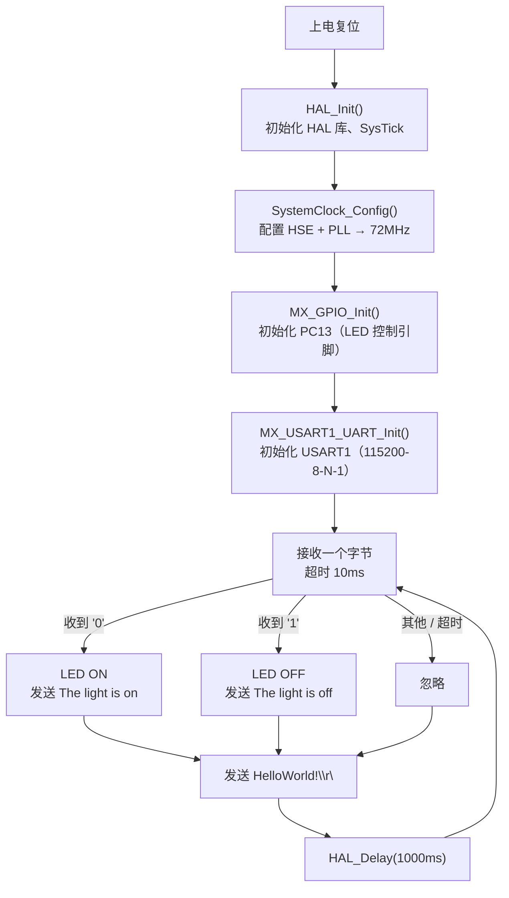

# STM32 UART 串口通信实验

## 1. 实验概述

本实验基于 **STM32F103C8T6** 微控制器，通过 **USART1** 实现 PC 与开发板之间的串口通信。用户通过串口助手发送命令控制板载 LED（PC13）的亮灭，同时 MCU 会周期性向串口发送心跳消息。

**核心知识点：**
- STM32 UART/USART 外设的配置与使用
- HAL 库中 UART 轮询收发 API：`HAL_UART_Receive` / `HAL_UART_Transmit`
- 开漏输出（Open-Drain）模式驱动 LED
- STM32CubeMX 图形化配置引脚与外设

---

## 2. 硬件需求

| 器件 | 说明 |
|------|------|
| STM32F103C8T6 最小系统板（Blue Pill / 核心板） | 主控 MCU |
| USB-TTL 串口模块（如 CH340 / CP2102） | 与 PC 通信 |
| ST-Link / J-Link 调试器 | 烧录程序 |
| 板载 LED（PC13） | 被控指示灯 |

**引脚连接：**

| STM32 引脚 | 功能 | 连接目标 |
|------------|------|---------|
| PA9 | USART1_TX | USB-TTL 模块 RX |
| PA10 | USART1_RX | USB-TTL 模块 TX |
| PC13 | GPIO_Output (LED) | 板载 LED（低电平点亮） |
| PA13 | SWDIO | ST-Link SWDIO |
| PA14 | SWCLK | ST-Link SWCLK |
| GND | 地 | USB-TTL 模块 GND + ST-Link GND |

---

## 3. STM32CubeMX 配置步骤

### 3.1 新建工程

1. 打开 **STM32CubeMX**（本工程使用 6.17.0 版本）
2. 点击 **File → New Project**
3. 在 **MCU Selector** 中搜索 `STM32F103C8Tx`，选中后点击 **Start Project**

（如图：在 MCU Selector 搜索框中输入 "STM32F103C8"，在列表中选择对应型号。）

### 3.2 配置时钟源（RCC）

1. 点击左侧 **Pinout & Configuration** 标签
2. 在左侧 **Categories** 中找到 **System Core → RCC**
3. 将 **High Speed Clock (HSE)** 设为 **Crystal/Ceramic Resonator**（外部晶振）

> **说明：** STM32F103C8T6 核心板通常板载 8MHz 晶振，通过 HSE + PLL 倍频到 72MHz 作为系统主频。

{ width=72% }

### 3.3 配置调试接口（SYS）

1. 在 **System Core → SYS** 中
2. 将 **Debug** 设为 **Serial Wire**（关闭 JTAG，仅保留 SWD，释放 PA15/PB3/PB4 给 GPIO）

> **为什么要这样做？** STM32F103 默认同时启用 JTAG 和 SWD。关闭 JTAG 只保留 SWD 不仅节省引脚（PA15、PB3、PB4 可作普通 GPIO），SWD 本身也足以完成烧录和调试。

{ width=72% }

### 3.4 配置 USART1

1. 在 **Connectivity → USART1** 中
2. 将 **Mode** 设为 **Asynchronous**（异步模式）
3. 参数保持默认即可：
   - **Baud Rate:** 115200
   - **Word Length:** 8 Bits
   - **Parity:** None
   - **Stop Bits:** 1
   - **Hardware Flow Control:** None

> **关键概念：异步串口 (Asynchronous UART)** 是最常见的串口模式，仅需 TX、RX 两根信号线。同步模式 (Synchronous USART) 还需 CLK 时钟线，本实验不涉及。

{ width=72% }

### 3.5 配置 GPIO（PC13 LED）

1. 在 **Pinout View** 中找到 **PC13** 引脚（通常在芯片图右侧）
2. 点击 PC13，在下拉菜单中将其设为 **GPIO_Output**
3. 在 **System Core → GPIO** 中找到 PC13，设置如下：
   - **GPIO output level:** Low
   - **GPIO mode:** Output Open Drain
   - **GPIO Pull-up/Pull-down:** No pull-up and no pull-down
   - **Maximum output speed:** Low

> **为什么要用开漏模式？** STM32F103C8T6 核心板的 LED 通常连接在 PC13 与 VDD 之间，因此 PC13 输出 **低电平** 时 LED 点亮，输出 **高阻态**（开漏输出高）时 LED 熄灭。使用推挽输出（Push-Pull）也可以正常工作，但开漏模式在此场景下更安全，可避免因灌电流过大损坏引脚。

{ width=72% }

### 3.6 配置时钟树（Clock Configuration）

1. 点击顶部 **Clock Configuration** 标签
2. 按如下参数配置：
   - **HSE:** 8 MHz（外部晶振）
   - **PLL Source:** HSE
   - **PLL Mul:** x9 → 8 MHz × 9 = **72 MHz**
   - **System Clock Mux:** PLLCLK
   - **AHB Prescaler:** /1 → **HCLK = 72 MHz**
   - **APB1 Prescaler:** /2 → **APB1 = 36 MHz**
   - **APB2 Prescaler:** /1 → **APB2 = 72 MHz**

> **为什么 APB1 要二分频？** STM32F103 的 APB1 总线最高频率为 36MHz，因此必须对 72MHz 的 AHB 进行二分频。而 APB2 总线最高可达 72MHz，所以无需分频。USART1 挂在 APB2 总线上。

{ width=72% }

### 3.7 配置工程输出

1. 点击 **Project Manager** 标签
2. **Project Name:** `05UART`
3. **Project Location:** 选择你的工作目录
4. **Application Structure:** Basic
5. **Toolchain / IDE:** 选择 **STM32CubeIDE**

> **注意：** 本工程采用 STM32CubeIDE 工具链，配合 VS Code 中的 **STM32CubeIDE for VS Code** 插件进行开发、编译和烧录。后文将介绍插件的安装与使用。

### 3.8 生成代码

1. 点击右上角 **GENERATE CODE** 按钮
2. 等待代码生成完成
3. 点击 **Open Project** 或直接进入工程目录

---

## 4. 程序结构

```
05UART/
├── 05UART.ioc                    # CubeMX 工程配置文件
├── CMakeLists.txt                # 顶层 CMake 构建文件
├── CMakePresets.json             # CMake 预设（Debug）
├── STM32F103XX_FLASH.ld          # 链接脚本（Flash/RAM 布局）
├── cmake/                        # CMake 工具链文件
│   ├── gcc-arm-none-eabi.cmake   #   ARM GCC 工具链配置
│   ├── starm-clang.cmake         #   Clang 工具链配置
│   └── stm32cubemx/
│       └── CMakeLists.txt        #   自动生成的子模块 CMake
├── Core/
│   ├── Inc/                      # 头文件
│   │   ├── main.h                #   主头文件（含 HAL 库引用）
│   │   ├── stm32f1xx_hal_conf.h  #   HAL 库配置文件
│   │   └── stm32f1xx_it.h        #   中断服务函数声明
│   └── Src/                      # 源文件
│       ├── main.c                #   ★ 主程序（用户代码在此）
│       ├── stm32f1xx_hal_msp.c   #   HAL 外设底层初始化（MSP）
│       ├── stm32f1xx_it.c        #   中断服务函数实现
│       ├── system_stm32f1xx.c    #   系统初始化
│       ├── sysmem.c              #   动态内存管理桩
│       └── syscalls.c            #   系统调用桩（_write 等）
├── Drivers/                      # HAL 驱动库
│   ├── CMSIS/                    #   ARM CMSIS 核心头文件
│   └── STM32F1xx_HAL_Driver/     #   STM32F1 HAL 库源码
└── startup_stm32f103xb.s         # 启动文件（汇编）
```

### 文件职责速览

| 文件 | 职责 |
|------|------|
| `main.c` | 用户程序入口，包含 `main()` 函数和业务逻辑 |
| `stm32f1xx_hal_msp.c` | MSP（MCU Support Package）层：初始化外设对应的 GPIO 引脚和时钟 |
| `stm32f1xx_it.c` | 中断向量表实现，可在此编写中断回调 |
| `stm32f1xx_hal_conf.h` | 裁剪 HAL 库：启用/禁用各外设模块 |
| `system_stm32f1xx.c` | `SystemInit()` 函数：上电后最早的时钟初始化 |
| `startup_stm32f103xb.s` | 启动汇编：初始化堆栈、跳转到 `main()` |

---

## 5. 核心代码详解

### 5.1 程序流程图



### 5.2 代码逐段解析

#### (1) HAL 库初始化与时钟配置

```c
HAL_Init();              // 初始化 HAL 库，配置 SysTick 为 1ms 中断
SystemClock_Config();    // 配置系统时钟：HSE(8MHz) → PLL×9 → 72MHz
```

`HAL_Init()` 是所有 HAL 库程序的第一步，它会：
- 设置 Flash 延迟周期（72MHz 需要 2 个等待周期）
- 配置 SysTick 定时器产生 1ms 中断
- 初始化 NVIC 优先级分组

`SystemClock_Config()` 由 CubeMX 自动生成，依次配置 HSE、PLL、AHB/APB 总线的分频系数。

#### (2) 外设初始化

```c
MX_GPIO_Init();          // 初始化 GPIO：PC13 设为开漏输出
MX_USART1_UART_Init();   // 初始化 USART1：波特率 115200，8 数据位，无校验，1 停止位
```

这两个函数也是 CubeMX 自动生成的。`MX_USART1_UART_Init()` 内部调用 `HAL_UART_Init()`，后者会触发 `HAL_UART_MspInit()` 回调（位于 `stm32f1xx_hal_msp.c`），在回调中完成 GPIO 引脚复用和时钟使能。

#### (3) 用户变量声明

```c
/* USER CODE BEGIN 2 */
uint8_t rx_buffer[1];  // 接收缓冲区，每次接收 1 字节
/* USER CODE END 2 */
```

**为什么放在 while 循环外面？** 每次循环迭代都在栈上分配和释放 `rx_buffer` 虽然开销微小，但将其放在循环外部声明更加清晰高效。

#### (4) UART 接收与命令处理

```c
if (HAL_UART_Receive(&huart1, rx_buffer, 1, 10) == HAL_OK) {
    switch (rx_buffer[0]) {
        case '0':
            HAL_GPIO_WritePin(GPIOC, GPIO_PIN_13, GPIO_PIN_RESET);  // LED ON
            HAL_UART_Transmit(&huart1, (uint8_t*)"The light is on\r\n", 17, 10);
            break;
        case '1':
            HAL_GPIO_WritePin(GPIOC, GPIO_PIN_13, GPIO_PIN_SET);    // LED OFF
            HAL_UART_Transmit(&huart1, (uint8_t*)"The light is off\r\n", 18, 10);
            break;
        default:
            break;
    }
}
```

**关键细节：**

- **`HAL_UART_Receive(&huart1, rx_buffer, 1, 10)`：** 轮询模式接收，每次尝试读 1 个字节，超时时间 10ms。如果在 10ms 内收到数据，返回 `HAL_OK`，否则返回 `HAL_TIMEOUT`。
- **`HAL_UART_Transmit(&huart1, ..., 17, 10)`：** 轮询模式发送，第三个参数是**实际要发送的字节数**。`"The light is on\r\n"` 正好 17 个字符，`"The light is off\r\n"` 正好 18 个字符。**务必确保长度参数与实际字符串长度一致**，否则会发送垃圾数据。
- **GPIO 控制 LED 的逻辑：** 由于 LED 连接在 PC13 与 VDD 之间，且 PC13 配置为开漏输出——`GPIO_PIN_RESET`（低电平）点亮 LED，`GPIO_PIN_SET`（高阻态）熄灭 LED。

#### (5) 心跳消息与延时

```c
HAL_UART_Transmit(&huart1, (uint8_t*)"HelloWorld!\r\n", 13, 1000);
HAL_Delay(1000);
```

每轮循环都会发送一条 `"HelloWorld!\r\n"` 心跳消息（13 字符），然后延时 1000ms。`\r\n` 是回车换行，确保串口助手中每条消息单独一行显示。

---

## 6. API 函数详解

### HAL_UART_Receive

```c
HAL_StatusTypeDef HAL_UART_Receive(
    UART_HandleTypeDef *huart,  // UART 句柄指针
    uint8_t           *pData,   // 接收数据缓冲区
    uint16_t           Size,    // 期望接收的字节数
    uint32_t           Timeout  // 超时时间（毫秒）
);
```

- **功能：** 在轮询模式下从 UART 接收指定数量的数据
- **返回值：** `HAL_OK`（成功接收）、`HAL_TIMEOUT`（超时未收完）、`HAL_ERROR`（错误）
- **阻塞行为：** 在收到指定数量数据或超时前，CPU 将在此函数内等待
- **适用场景：** 简单、低速的通信；不适用于多任务或高实时性场景

### HAL_UART_Transmit

```c
HAL_StatusTypeDef HAL_UART_Transmit(
    UART_HandleTypeDef *huart,  // UART 句柄指针
    uint8_t           *pData,   // 待发送数据缓冲区
    uint16_t           Size,    // 发送字节数
    uint32_t           Timeout  // 超时时间（毫秒）
);
```

- **功能：** 在轮询模式下通过 UART 发送数据
- **注意：** `Size` 参数必须与 `pData` 指向的数据的实际长度严格一致

### HAL_GPIO_WritePin

```c
void HAL_GPIO_WritePin(
    GPIO_TypeDef *GPIOx,        // GPIO 端口（如 GPIOC）
    uint16_t      GPIO_Pin,     // 引脚号（如 GPIO_PIN_13）
    GPIO_PinState PinState      // 输出状态：GPIO_PIN_RESET（低） / GPIO_PIN_SET（高）
);
```

### HAL_Delay

```c
void HAL_Delay(uint32_t Delay);  // 毫秒级延时（依赖 SysTick 中断）
```

---

## 7. 使用说明

### 7.1 编译与烧录

本工程使用 **STM32CubeIDE for VS Code** 插件进行开发，无需手动配置 ARM GCC 工具链，插件会自动管理编译器和调试器依赖。

#### 安装插件

1. 打开 VS Code，点击左侧 **Extensions** 图标（或按 `Ctrl+Shift+X`）
2. 搜索 **STM32CubeIDE**，找到 STMicroelectronics 官方发布的插件
3. 点击 **Install**，安装完成后重启 VS Code

#### 导入工程

1. 启动 VS Code，打开本工程根目录（`05UART/` 文件夹）
2. 插件会自动识别 `.ioc` 文件和 `.cproject` 文件，加载 STM32CubeIDE 工程配置
3. 等待插件完成索引和构建配置（首次打开可能需要几分钟）

#### 编译

点击 VS Code 底部状态栏的 **Build** 按钮（锤子图标），或使用快捷键 `Ctrl+Shift+B`。编译输出将显示在终端面板中，成功信息如下：

```
Finished building target: 05UART.elf
```

#### 烧录（ST-Link）

1. 通过 ST-Link 调试器连接开发板与 PC
2. 点击底部状态栏的 **Run** 按钮（播放图标），或按下 `F5`
3. 插件将自动执行编译 → 烧录 → 运行，完成后程序开始在开发板上执行

> **提示：** 如果烧录失败，检查 ST-Link 驱动是否已安装、连接是否正确。状态栏应可看到 ST-Link 设备被识别。

### 7.2 串口助手配置

1. 将 USB-TTL 模块连接到 PC
2. 打开串口助手（推荐使用 **SSCOM**、**PuTTY** 或 **MobaXterm**）
3. 配置参数：

| 参数 | 值 |
|------|-----|
| 端口号 | USB-TTL 对应的 COM 口 |
| 波特率 | 115200 |
| 数据位 | 8 |
| 校验位 | None |
| 停止位 | 1 |
| 流控 | None |

4. 点击 **打开串口**

### 7.3 预期现象

1. 串口助手中每隔约 1 秒收到一条 `HelloWorld!`
2. 在发送区输入字符 `0`，点击发送 → LED 点亮，同时收到 `The light is on`
3. 在发送区输入字符 `1`，点击发送 → LED 熄灭，同时收到 `The light is off`
4. 输入其他字符（如 `abc`、`2`）→ LED 状态不变，无额外响应

### 7.4 调试技巧

- **收不到数据？** 检查 TX/RX 是否交叉连接（STM32 TX → USB-TTL RX，STM32 RX ← USB-TTL TX）
- **收到乱码？** 确认串口助手波特率设为 115200，与代码一致
- **LED 不亮？** 确认 PC13 配置为开漏输出（Open Drain），电平逻辑是反的（`RESET` = 亮）
- **`HAL_UART_Receive` 一直超时？** 这是正常的——10ms 超时是设计行为。如果希望提高响应速度，可使用**中断模式**（`HAL_UART_Receive_IT`）或**DMA 模式**

---

## 8. 常见问题

### Q1: 为什么不用中断或 DMA 接收 UART？

**A:** 本实验作为教学案例，首要目标是让初学者理解 HAL 库中 UART 最基本的轮询模式用法。轮询模式简单直观、易于调试。中断和 DMA 模式将在后续实验中引入。

### Q2: 延时 1 秒会影响命令响应吗？

**A:** 会。当前设计下，串口接收仅在 10ms 超时窗口内生效，如果在这 10ms 内没有命令到达，就需要等待下一轮循环（约 1 秒后）。这意味着最坏情况下命令响应延迟为 ~1 秒。对于本教学实验这完全可接受，但在实际项目中应考虑中断或 DMA 方案。

### Q3: PC13 开漏输出为什么这样控制 LED？

**A:** STM32F103C8T6 核心板（Blue Pill）的板载 LED 阳极接 VDD（3.3V），阴极通过限流电阻接 PC13。因此：
- PC13 = **低电平** → LED 两端有电压差 → **LED 亮**
- PC13 = **高电平/高阻态** → 无电压差 → **LED 灭**

使用开漏输出（OD）而非推挽输出（PP）的好处是：当 PC13 输出"高"时实际上是高阻态，不会向 LED 灌电流，对引脚更安全。

### Q4: 如何使用虚拟串口（Virtual COM Port）？

**A:** 如果你的开发板自带 USB 转串口芯片（如 CH340G），只需一根 USB 线即可。否则需要外接 USB-TTL 模块。相关配置请参考课件中关于虚拟串口的章节。

---

## 9. 扩展练习

1. **中断接收改造：** 将 `HAL_UART_Receive` 改为 `HAL_UART_Receive_IT`，在 `HAL_UART_RxCpltCallback` 回调中处理命令，观察响应速度的变化。

2. **多字符命令：** 支持更复杂的命令格式，如 `LED ON`、`LED OFF`（需要更大的接收缓冲区和字符串比较）。

3. **回显功能：** 将接收到的字符原样发回（echo），实现一个简易的串口回显终端。

4. **ADC 数据上报：** 结合 ADC 外设，通过串口周期上报温度/电压等传感器数值。

---

## 10. 参考资料

- [STM32F103C8T6 数据手册](https://www.st.com/resource/en/datasheet/stm32f103c8.pdf)
- [STM32F1xx HAL 库用户手册 (UM1850)](https://www.st.com/resource/en/user_manual/um1850-description-of-stm32f1-hal-and-lowlayer-drivers-stmicroelectronics.pdf)
- [RM0008 — STM32F1xx 参考手册](https://www.st.com/resource/en/reference_manual/rm0008-stm32f101xx-stm32f102xx-stm32f103xx-stm32f105xx-and-stm32f107xx-advanced-armbased-32bit-mcus-stmicroelectronics.pdf)
- [ARM GCC 工具链下载](https://developer.arm.com/tools-and-software/open-source-software/developer-tools/gnu-toolchain/gnu-rm/downloads)
