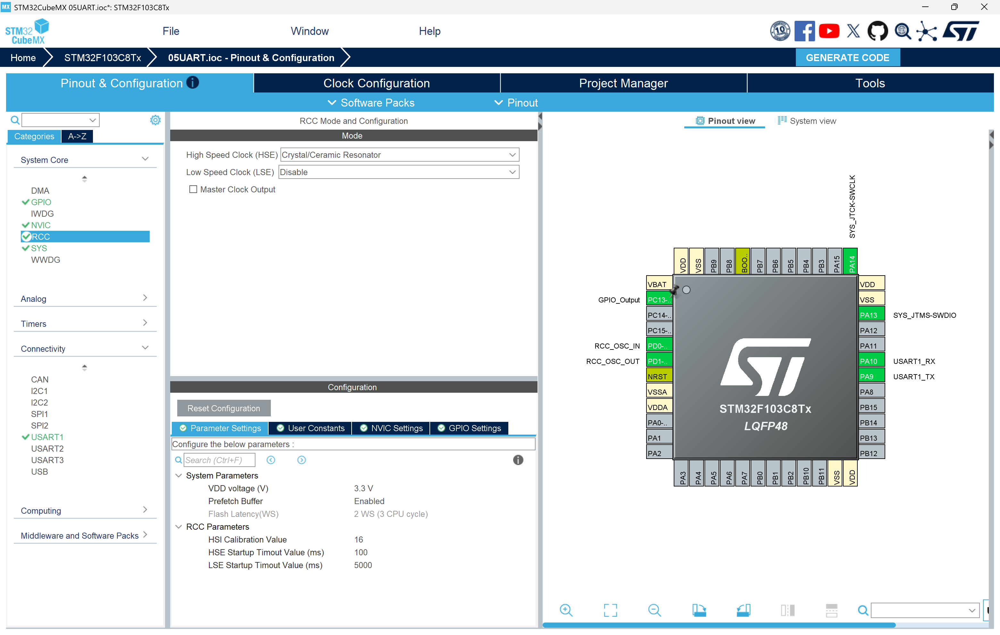
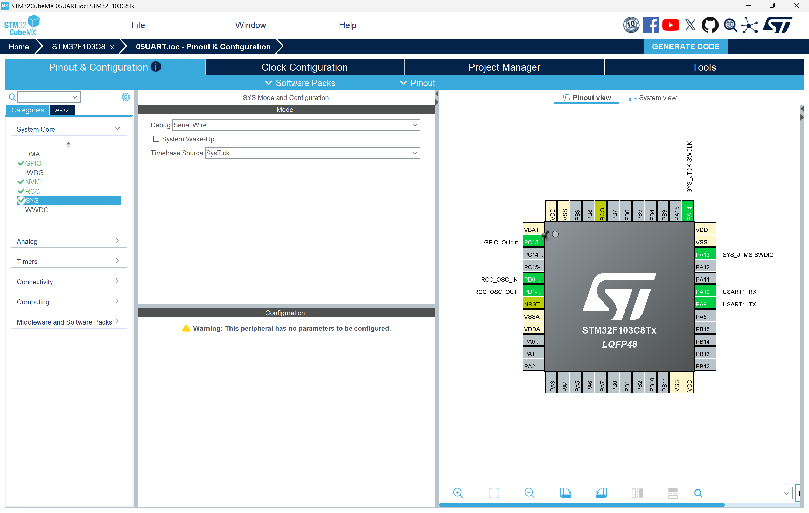
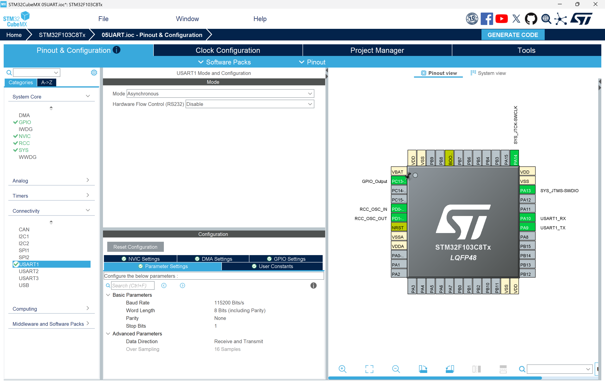
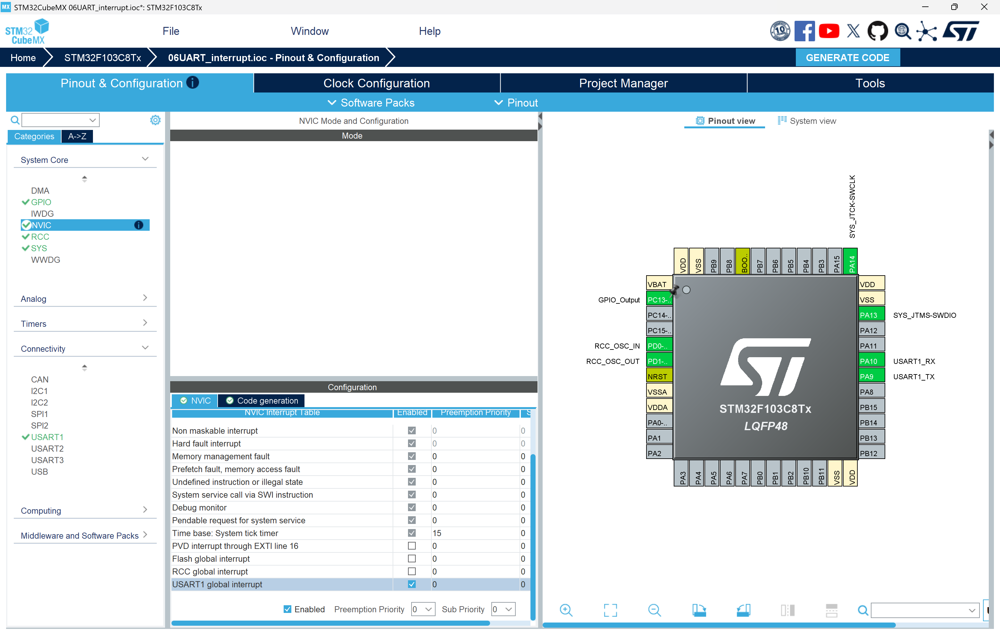
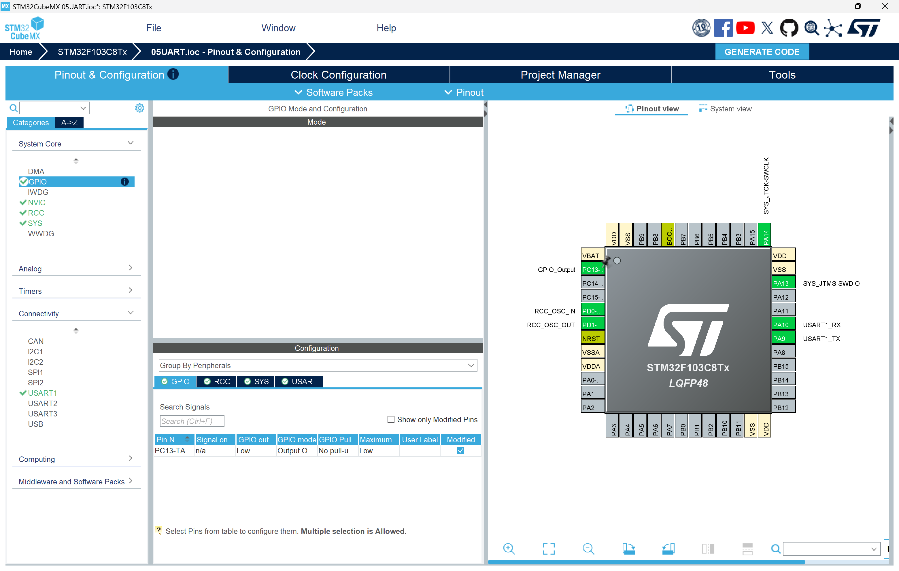
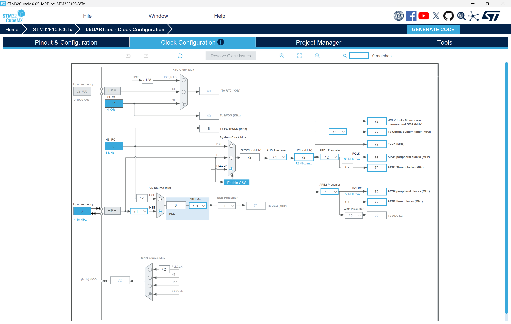
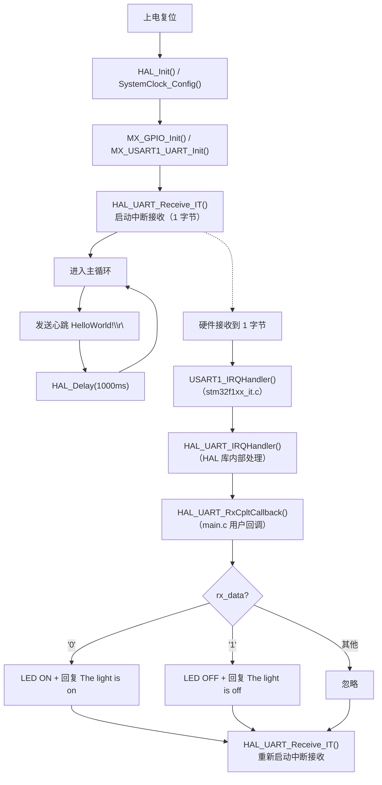

# STM32 UART 中断方式控制 LED

## 实验概述

本实验基于 **STM32F103C8T6** 微控制器，在上一实验（05UART 轮询模式）的基础上，将 USART1 接收方式从**轮询（Polling）** 升级为**中断（Interrupt）** 模式。用户通过串口助手发送命令控制板载 LED（PC13）的亮灭，MCU 无需在接收上阻塞等待，释放出来的 CPU 时间可用于心跳消息的周期性发送。

**核心知识点：**
- STM32 UART 中断模式的配置与使用
- HAL 库中断接收 API：`HAL_UART_Receive_IT` / `HAL_UART_RxCpltCallback`
- NVIC（嵌套向量中断控制器）的配置
- 中断方式相比轮询方式的优势

---

## 中断方式 vs 轮询方式

| 对比维度 | 轮询方式（Polling） | 中断方式（Interrupt） |
|----------|---------------------|------------------------|
| **CPU 利用率** | CPU 在 `HAL_UART_Receive()` 中阻塞等待，无法做其他事 | CPU 启动接收后立即返回，可继续执行其他任务 |
| **响应延迟** | 取决于轮询周期（本实验中约 1 秒） | 微秒级 — 数据到达立即触发中断处理 |
| **程序结构** | 单线程顺序执行，简单直观 | 主循环 + 中断回调，需要理解异步编程模型 |
| **适用场景** | 简单、低速、单任务场景 | 多任务、高实时性、需要 CPU 并行处理其他工作的场景 |
| **功耗** | CPU 持续轮询，功耗较高 | CPU 在无数据时可进入低功耗模式 |

**为什么要从轮询升级到中断？** 在轮询模式（05UART 实验）中，`HAL_UART_Receive()` 的超时等待会阻塞 CPU，命令响应延迟最坏可达 1 秒。中断模式让 CPU 在等待串口数据的同时继续执行心跳发送等任务 — 数据一到立即由硬件触发中断服务程序处理，响应速度大幅提升。

---

## 硬件需求

| 器件 | 说明 |
|------|------|
| STM32F103C8T6 最小系统板（Blue Pill / 核心板） | 主控 MCU |
| USB-TTL 串口模块（如 CH340 / CP2102） | 与 PC 通信 |
| ST-Link / J-Link 调试器 | 烧录程序 |
| 板载 LED（PC13） | 被控指示灯 |

**引脚连接：**

| STM32 引脚 | 功能 | 连接目标 |
|------------|------|---------|
| PA9 | USART1_TX | USB-TTL 模块 RX |
| PA10 | USART1_RX | USB-TTL 模块 TX |
| PC13 | GPIO_Output (LED) | 板载 LED（低电平点亮） |
| PA13 | SWDIO | ST-Link SWDIO |
| PA14 | SWCLK | ST-Link SWCLK |
| GND | 地 | USB-TTL 模块 GND + ST-Link GND |

---

## STM32CubeMX 配置步骤

### 新建工程

1. 打开 **STM32CubeMX**
2. 点击 **File → New Project**
3. 在 **MCU Selector** 中搜索 `STM32F103C8Tx`，选中后点击 **Start Project**

### 配置时钟源（RCC）

1. 在 **System Core → RCC** 中
2. 将 **High Speed Clock (HSE)** 设为 **Crystal/Ceramic Resonator**

> STM32F103C8T6 核心板通常板载 8MHz 晶振，通过 HSE + PLL 倍频到 72MHz。

{ width=72% }

### 配置调试接口（SYS）

1. 在 **System Core → SYS** 中
2. 将 **Debug** 设为 **Serial Wire**（关闭 JTAG，仅保留 SWD）

{ width=72% }

### 配置 USART1

1. 在 **Connectivity → USART1** 中
2. 将 **Mode** 设为 **Asynchronous**（异步模式）
3. 参数保持默认：**Baud Rate: 115200, Word Length: 8, Parity: None, Stop Bits: 1**

{ width=72% }

### 使能 USART1 中断（NVIC）★ 关键步骤

1. 在 **System Core → NVIC** 中
2. 找到 **USART1 global interrupt**，勾选 **Enabled** 列的复选框
3. 保持默认优先级（Preemption Priority: 0, Sub Priority: 0）

> **这是本次实验与轮询模式实验最关键的配置差异：** 必须使能 USART1 的全局中断，HAL 库的中断接收 API 才能正常工作。CubeMX 会自动生成 `USART1_IRQHandler()` 中断服务函数。

{ width=72% }

### 配置 GPIO（PC13 LED）

1. 将 **PC13** 设为 **GPIO_Output**
2. 在 GPIO 配置中设置：
   - **GPIO output level:** Low
   - **GPIO mode:** Output Open Drain
   - **GPIO Pull-up/Pull-down:** No pull-up and no pull-down
   - **Maximum output speed:** Low

> PC13 使用开漏输出：输出低电平时 LED 点亮，高阻态时 LED 熄灭。

{ width=72% }

### 配置时钟树（Clock Configuration）

1. 点击 **Clock Configuration** 标签
2. 配置参数：
   - **HSE:** 8 MHz
   - **PLL Source:** HSE，**PLL Mul:** x9 → 72 MHz
   - **System Clock Mux:** PLLCLK
   - **AHB Prescaler:** /1 → HCLK = 72 MHz
   - **APB1 Prescaler:** /2 → APB1 = 36 MHz
   - **APB2 Prescaler:** /1 → APB2 = 72 MHz（USART1 挂在此总线）

{ width=72% }

### 生成代码

1. 点击 **GENERATE CODE**
2. 确认 **Toolchain / IDE** 为 **STM32CubeIDE**

---

## 程序结构

```
06UART_interrupt/
├── 06UART_interrupt.ioc           # CubeMX 工程配置文件
├── CMakeLists.txt                  # 顶层 CMake 构建文件
├── CMakePresets.json               # CMake 预设
├── STM32F103XX_FLASH.ld            # 链接脚本
├── cmake/                          # CMake 工具链文件
├── Core/
│   ├── Inc/
│   │   ├── main.h                  # 主头文件
│   │   ├── stm32f1xx_hal_conf.h    # HAL 库配置
│   │   └── stm32f1xx_it.h          # 中断服务函数声明
│   └── Src/
│       ├── main.c                  # ★ 主程序（用户代码在此）
│       ├── stm32f1xx_hal_msp.c     # HAL 外设底层初始化
│       ├── stm32f1xx_it.c          # 中断服务函数实现（含 USART1_IRQHandler）
│       ├── system_stm32f1xx.c      # 系统初始化
│       ├── sysmem.c                # 动态内存管理桩
│       └── syscalls.c              # 系统调用桩
├── Drivers/                        # HAL 驱动库
│   ├── CMSIS/
│   └── STM32F1xx_HAL_Driver/
└── startup_stm32f103xb.s           # 启动文件
```

### 关键文件说明

| 文件 | 职责 |
|------|------|
| `main.c` | 主循环发送心跳 + 中断接收回调 `HAL_UART_RxCpltCallback` |
| `stm32f1xx_it.c` | `USART1_IRQHandler()` — CubeMX 自动生成，调用 `HAL_UART_IRQHandler()` |
| `stm32f1xx_hal_msp.c` | MSP 层：使能 USART1 时钟、配置 GPIO 复用、配置 NVIC |

> **注意：** `stm32f1xx_it.c` 中的 `USART1_IRQHandler()` 由 CubeMX 在使能 NVIC 后自动生成，**不要手动修改**其内部调用 `HAL_UART_IRQHandler(&huart1)` 的逻辑。

---

## 核心代码详解

### 程序流程图



> 虚线路径表示**中断触发路径**，与主循环并行执行。主循环只负责心跳发送，命令处理完全由中断驱动。

### 代码逐段解析

#### 全局变量声明

```c
/* USER CODE BEGIN PV */
uint8_t rx_data;
/* USER CODE END PV */
```

`rx_data` 是中断接收的目标缓冲区。因为中断方式单字节接收，只需要 1 字节即可。变量定义为全局变量，以便中断回调函数 `HAL_UART_RxCpltCallback()` 访问。

#### 启动中断接收

```c
/* USER CODE BEGIN 2 */
HAL_UART_Receive_IT(&huart1, &rx_data, 1);
/* USER CODE END 2 */
```

在外设初始化完成后调用 `HAL_UART_Receive_IT()` 启动第一次中断接收。此函数**非阻塞** — 它配置好接收参数后立即返回，之后每当 USART1 收到 1 字节数据时，硬件自动触发中断，由 HAL 库在回调中通知用户。

#### 主循环 — 心跳发送

```c
while (1)
{
    HAL_UART_Transmit(&huart1, (uint8_t *)"HelloWorld!\r\n", 13, 1000);
    HAL_Delay(1000);
}
```

主循环只做两件事：每隔 1 秒发送一条心跳消息，然后延时。与轮询模式不同，主循环中**没有任何接收代码** — 接收工作完全由中断驱动，不占用主循环的 CPU 时间。

#### 中断接收回调 ★ 核心

```c
void HAL_UART_RxCpltCallback(UART_HandleTypeDef *huart)
{
    if (huart->Instance == USART1)
    {
        switch (rx_data)
        {
            case '0':
                HAL_GPIO_WritePin(GPIOC, GPIO_PIN_13, GPIO_PIN_RESET);  // LED ON
                HAL_UART_Transmit(&huart1, (uint8_t *)"The light is on\r\n", 17, 100);
                break;
            case '1':
                HAL_GPIO_WritePin(GPIOC, GPIO_PIN_13, GPIO_PIN_SET);    // LED OFF
                HAL_UART_Transmit(&huart1, (uint8_t *)"The light is off\r\n", 18, 100);
                break;
            default:
                break;
        }
        HAL_UART_Receive_IT(&huart1, &rx_data, 1);  // 重新启动下一次接收
    }
}
```

**关键细节：**

- **`HAL_UART_RxCpltCallback()`** 是 HAL 库定义的弱函数（`__weak`），用户在 main.c 中重写它以处理接收完成事件。当 USART1 成功接收指定字节数后，HAL 库自动调用此回调。
- **`huart->Instance == USART1`** 判断用于区分多个 UART 外设的场景（本实验仅使用 USART1）。
- **`switch (rx_data)`** 根据接收到的字符执行相应操作：`'0'` 点亮 LED，`'1'` 熄灭 LED。
- **重新启动接收：** 回调末尾必须再次调用 `HAL_UART_Receive_IT()`，否则下一次接收不会触发中断。这是中断接收模式的**持续运行机制** — 每次接收完成后手动重启。

#### 中断服务函数（CubeMX 自动生成）

```c
// stm32f1xx_it.c
void USART1_IRQHandler(void)
{
    HAL_UART_IRQHandler(&huart1);
}
```

`USART1_IRQHandler()` 是硬件中断向量的入口。当 USART1 产生中断（如 RXNE — 接收寄存器非空）时，CPU 跳转至此函数，调用 HAL 库的 `HAL_UART_IRQHandler()` 进行中断状态判断和数据搬运。HAL 库内部处理完毕后，自动调用 `HAL_UART_RxCpltCallback()`。

---

## API 函数详解

### HAL_UART_Receive_IT

```c
HAL_StatusTypeDef HAL_UART_Receive_IT(
    UART_HandleTypeDef *huart,  // UART 句柄指针
    uint8_t           *pData,   // 接收数据缓冲区
    uint16_t           Size     // 期望接收的字节数
);
```

- **功能：** 以中断模式启动 UART 接收
- **行为：** 函数**立即返回**（非阻塞），之后由硬件中断自动完成数据接收
- **完成通知：** 接收完成后 HAL 库调用 `HAL_UART_RxCpltCallback()` 回调
- **注意：** 每次接收完成后需重新调用此函数以继续接收

### HAL_UART_RxCpltCallback

```c
void HAL_UART_RxCpltCallback(UART_HandleTypeDef *huart);
```

- **功能：** 中断接收完成的用户回调函数
- **触发时机：** HAL 库内部处理完 `RXNE` 中断并收齐指定字节数后
- **使用方式：** 用户在自己的代码中重写此弱函数（`__weak`）
- **注意：** 此函数在**中断上下文**中执行，应尽量简短，避免耗时操作

### 中断数据流总结

```
硬件 RX 引脚收到数据
  → USART 外设产生 RXNE 中断
    → NVIC 向量表分发到 USART1_IRQHandler()    [stm32f1xx_it.c]
      → HAL_UART_IRQHandler(&huart1)            [HAL 库内部]
        → 数据从 DR 寄存器搬运到 pData 缓冲区
        → 收齐 Size 字节后调用 HAL_UART_RxCpltCallback()  [main.c 用户回调]
          → 处理命令 + HAL_UART_Receive_IT() 重新启动
```

---

## 中断方式的优势总结

### 响应速度

- **轮询模式：** 命令响应延迟 = 0 ~ 轮询周期（本实验中 ~1 秒）
- **中断模式：** 命令响应延迟 = 中断延迟（微秒级）

### CPU 利用率

- **轮询模式：** 即使没有数据，CPU 也在 `HAL_UART_Receive()` 中阻塞等待（忙等）
- **中断模式：** CPU 启动接收后立即返回，可并行处理心跳发送、传感器采集、数据处理等

### 程序扩展性

- **轮询模式：** 添加更多功能（如多个传感器、多路通信）时，主循环越来越复杂，响应变慢
- **中断模式：** 每个外设的中断独立处理，主循环保持简洁，系统易于扩展

### 功耗

- **轮询模式：** CPU 持续运行，无法进入睡眠模式
- **中断模式：** 无数据时 CPU 可进入低功耗睡眠模式（WFI/WFE），外设中断唤醒 CPU 处理数据后继续睡眠 — 特别适合电池供电的嵌入式设备

---

## 使用说明

### 编译与烧录

使用 VS Code + **STM32CubeIDE for VS Code** 插件：

1. 打开工程根目录
2. 点击底部状态栏 **Build**（锤子图标）编译
3. 连接 ST-Link，点击 **Run**（播放图标）烧录

### 串口助手配置

| 参数 | 值 |
|------|-----|
| 端口号 | USB-TTL 对应 COM 口 |
| 波特率 | 115200 |
| 数据位 | 8 |
| 校验位 | None |
| 停止位 | 1 |
| 流控 | None |

### 预期现象

1. 串口助手中每隔约 1 秒收到一条 `HelloWorld!`
2. 发送 `0` → LED 立即点亮，同时收到 `The light is on`
3. 发送 `1` → LED 立即熄灭，同时收到 `The light is off`
4. 输入其他字符 → LED 状态不变
5. **与轮询模式的对比：** 无论心跳发送周期多长，命令响应都**几乎即时**，因为接收由中断驱动，不依赖主循环轮询

### 调试技巧

- **收不到数据？** 检查 TX/RX 交叉连接、NVIC 中 USART1 中断是否勾选
- **只响应一次就不再响应？** 检查 `HAL_UART_RxCpltCallback()` 末尾是否调用了 `HAL_UART_Receive_IT()` 重新启动
- **程序卡死？** 检查 `HAL_UART_RxCpltCallback()` 中是否使用了阻塞发送函数且超时时间过长
- **LED 不亮？** 确认 PC13 配置为开漏输出，`GPIO_PIN_RESET`（低电平）= 点亮

---

## 常见问题

### Q1: 为什么回调函数中还要用轮询发送 `HAL_UART_Transmit`，不也用中断发送吗？

**A:** 为了聚焦核心知识点，本实验仅在接收端引入中断模式。中断发送（`HAL_UART_Transmit_IT`）留作扩展练习。在实际项目中，对实时性要求较高的场景可以两路都用中断。

### Q2: `HAL_UART_Receive_IT` 可以一次接收多个字节吗？

**A:** 可以。第三个参数 `Size` 指定期望接收的字节数，只有收齐后才触发 `HAL_UART_RxCpltCallback`。例如设为 4 可实现 4 字节命令帧的接收。

### Q3: 多个 UART 同时使用中断模式，回调怎么区分？

**A:** 通过 `huart->Instance` 判断是哪个 UART 触发的回调：

```c
if (huart->Instance == USART1) { /* USART1 */ }
else if (huart->Instance == USART2) { /* USART2 */ }
```

### Q4: 中断接收会不会丢失数据？

**A:** 在波特率 115200 及以下，且回调函数执行时间极短的情况下，基本不会丢数据。如果需要在高速通信中保证可靠性，可考虑使用 DMA 模式（后续实验将涉及）。

---

## 扩展练习

1. **中断发送改造：** 将心跳发送改为 `HAL_UART_Transmit_IT()`，观察程序行为变化。

2. **多字节命令：** 修改接收长度为多个字节，实现 `LED ON`、`LED OFF` 等字符串命令的识别。

3. **环形缓冲区：** 实现一个环形接收缓冲区，支持更复杂的协议解析。

4. **空闲中断（IDLE）：** 使用 USART 的 IDLE 中断检测帧结束，实现不定长数据包的接收。

---

## 参考资料

- [STM32F103C8T6 数据手册](https://www.st.com/resource/en/datasheet/stm32f103c8.pdf)
- [STM32F1xx HAL 库用户手册 (UM1850)](https://www.st.com/resource/en/user_manual/um1850-description-of-stm32f1-hal-and-lowlayer-drivers-stmicroelectronics.pdf)
- [RM0008 — STM32F1xx 参考手册](https://www.st.com/resource/en/reference_manual/rm0008-stm32f101xx-stm32f102xx-stm32f103xx-stm32f105xx-and-stm32f107xx-advanced-armbased-32bit-mcus-stmicroelectronics.pdf)
