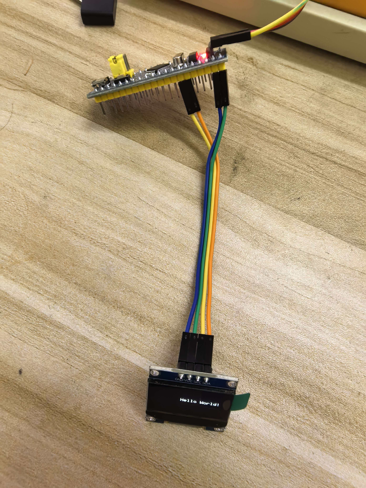
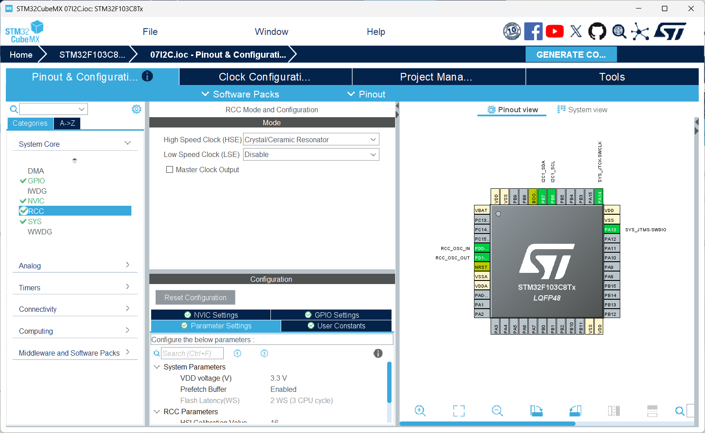
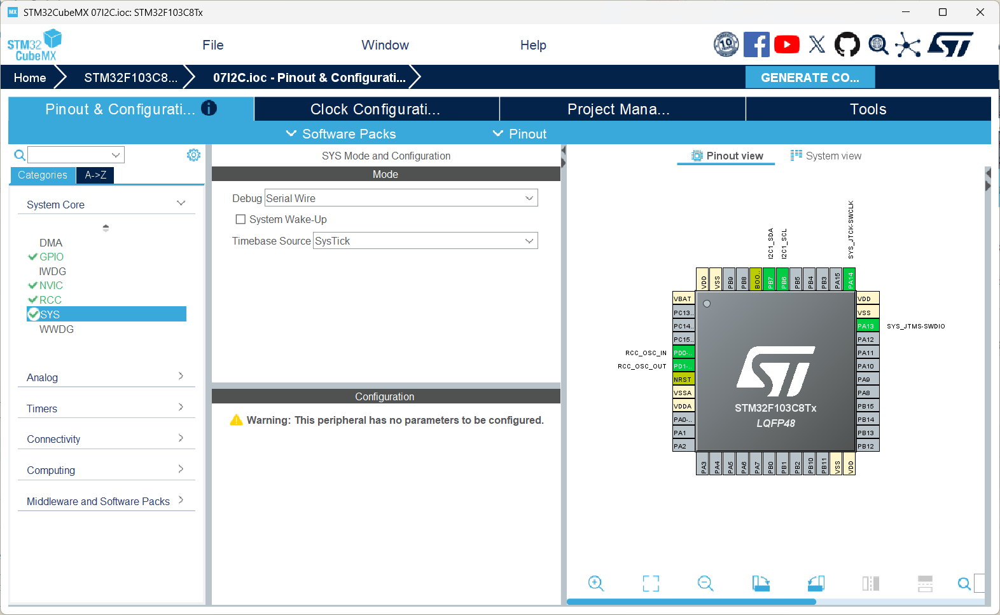
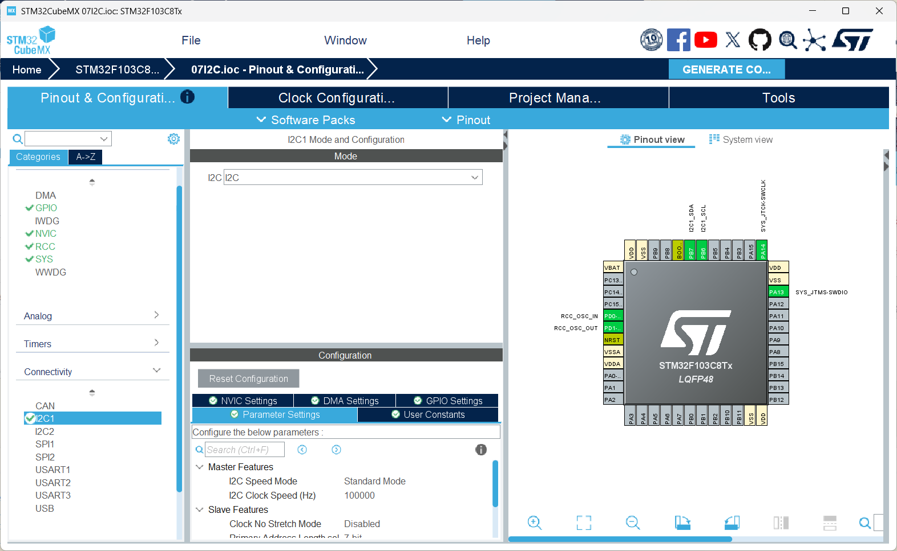
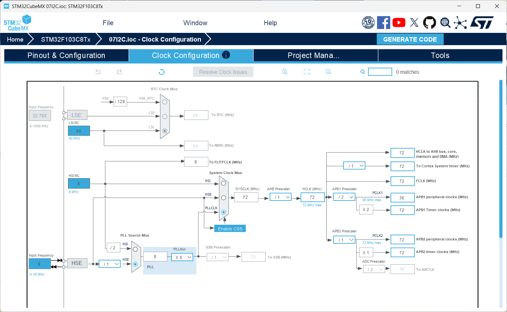
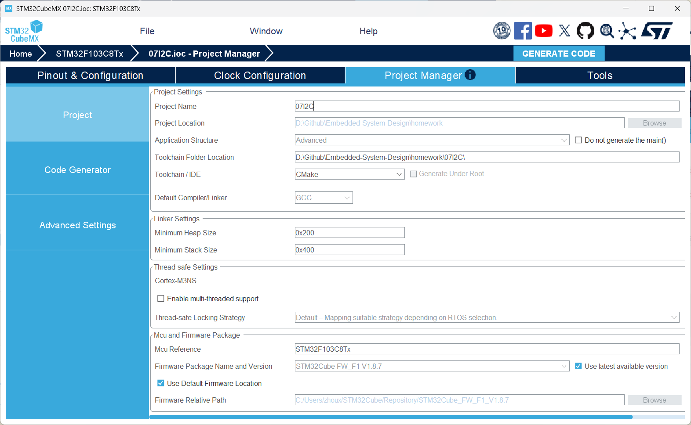
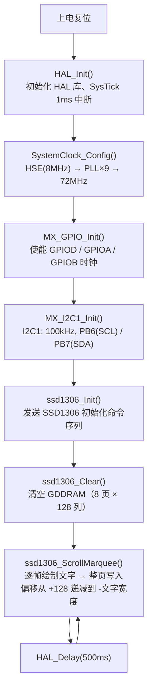

# STM32 I2C OLED 显示实验

## 1. 实验概述

本实验基于 **STM32F103C8T6** 微控制器，通过 **I2C1** 总线驱动 **SSD1306 OLED 显示屏（128×64）**，实现字符串显示与滚动效果。

**核心知识点：**
- I2C 总线协议基础（起始/停止条件、从机地址、ACK 应答）
- STM32 I2C 外设的配置与使用
- HAL 库 I2C 主机发送 API：`HAL_I2C_Master_Transmit` / `HAL_I2C_Mem_Write`
- SSD1306 OLED 控制器的工作原理与命令集
- 5×8 点阵字体的渲染方式
- 滚动显示的实现：硬件滚动 vs 软件逐帧滚动

---

## 2. 硬件需求

| 器件 | 说明 |
|------|------|
| STM32F103C8T6 最小系统板 | 主控 MCU |
| 0.96 寸 SSD1306 OLED 模块（I2C 接口，4 引脚） | 显示设备 |
| ST-Link / J-Link 调试器 | 烧录程序 |
| 面包板 + 杜邦线 | 连接电路 |

**引脚连接：**

| STM32 引脚 | OLED 模块引脚 | 功能 |
|------------|-------------|------|
| PB6 | SCL | I2C1 时钟线 |
| PB7 | SDA | I2C1 数据线 |
| 3.3V | VCC | 电源正极 |
| GND | GND | 电源地 |
| PA13 | — | SWDIO（ST-Link） |
| PA14 | — | SWCLK（ST-Link） |

> **注意：** 大多数 0.96 寸 SSD1306 OLED 模块已板载 I2C 上拉电阻（4.7kΩ），无需额外焊接。如果使用裸屏或通信不稳定，需要在 SCL 和 SDA 上各加 4.7kΩ 上拉电阻至 3.3V。



图示为 OLED 模块与开发板的实物连接参考。

---

## 3. STM32CubeMX 配置步骤

### 3.1 新建工程

1. 打开 **STM32CubeMX**（本工程使用 6.17.0 版本）
2. 点击 **File → New Project**
3. 在 **MCU Selector** 中搜索 `STM32F103C8Tx`，选中后点击 **Start Project**


### 3.2 配置时钟源（RCC）

1. 点击左侧 **Pinout & Configuration** 标签
2. 在 **System Core → RCC** 中
3. 将 **High Speed Clock (HSE)** 设为 **Crystal/Ceramic Resonator**（外部晶振）

> **说明：** STM32F103C8T6 核心板通常板载 8MHz 晶振，通过 HSE + PLL 倍频到 72MHz。

{ width=72% }

### 3.3 配置调试接口（SYS）

1. 在 **System Core → SYS** 中
2. 将 **Debug** 设为 **Serial Wire**（关闭 JTAG，仅保留 SWD）



> **为什么要这样做？** JTAG 默认占用 PA15、PB3、PB4 三个引脚。关闭 JTAG 仅保留 SWD，既可烧录调试，又不浪费 GPIO 资源。

### 3.4 配置 I2C1

1. 在 **Connectivity → I2C1** 中
2. 将 **Mode** 设为 **I2C**
3. **I2C Speed Mode:** Standard Mode（100kHz）
4. 其他参数保持默认：

| 参数 | 值 | 说明 |
|------|-----|------|
| I2C Speed Mode | Standard Mode | 100kHz 标准速率 |
| Clock Speed | 100000 | 100kHz 时钟 |
| Duty Cycle | DutyCycle_2 | 标准模式忽略此参数 |
| Addressing Mode | 7-bit | 7 位地址模式 |
| Own Address1 | 0 | 本机不做从机，设为 0 |

> **关键概念：I2C 速率选择。** SSD1306 支持 100kHz（标准模式）和 400kHz（快速模式）。100kHz 兼容性最好，对布线要求低；400kHz 刷新更快但需要较短走线和更强的上拉。本实验使用 100kHz。

> **为什么 OwnAddress1 设为 0？** STM32 在本次实验中只作为 I2C 主机主动发送数据，不接收来自其他设备的 I2C 请求，因此不需要分配从机地址。

{ width=72% }

### 3.5 配置时钟树（Clock Configuration）

1. 点击顶部 **Clock Configuration** 标签
2. 按如下参数配置：
   - **HSE:** 8 MHz（外部晶振）
   - **PLL Source:** HSE
   - **PLL Mul:** x9 → 8 MHz × 9 = **72 MHz**
   - **System Clock Mux:** PLLCLK
   - **AHB Prescaler:** /1 → **HCLK = 72 MHz**
   - **APB1 Prescaler:** /2 → **APB1 = 36 MHz**
   - **APB2 Prescaler:** /1 → **APB2 = 72 MHz**

> **为什么 APB1 要二分频？** STM32F103 的 APB1 总线最高频率为 36MHz，必须对 72MHz 的 AHB 进行二分频。I2C1 挂在 APB1 上，其输入时钟为 36MHz，HAL 库会自动计算分频系数使 SCL 达到设定的 100kHz。

{ width=72% }

### 3.6 配置工程输出

1. 点击 **Project Manager** 标签
2. **Project Name:** `07I2C`
3. **Project Location:** 选择你的工作目录
4. **Application Structure:** Basic
5. **Toolchain / IDE:** 选择 **CMake**（配合 VS Code + ARM GCC 使用）

{ width=72% }

### 3.7 生成代码

1. 点击右上角 **GENERATE CODE** 按钮
2. 等待代码生成完成
3. 点击 **Open Project** 或直接进入工程目录

---

## 4. 程序结构

```
07I2C/
├── 07I2C.ioc                    # CubeMX 工程配置文件
├── CMakeLists.txt                # 顶层 CMake 构建文件
├── CMakePresets.json             # CMake 预设（Debug）
├── STM32F103XX_FLASH.ld          # 链接脚本（Flash/RAM 布局）
├── cmake/                        # CMake 工具链文件
│   ├── gcc-arm-none-eabi.cmake   #   ARM GCC 工具链配置
│   ├── starm-clang.cmake         #   Clang 工具链配置
│   └── stm32cubemx/
│       └── CMakeLists.txt        #   自动生成的子模块 CMake
├── Core/
│   ├── Inc/                      # 头文件
│   │   ├── main.h                #   主头文件（含 HAL 库引用）
│   │   ├── stm32f1xx_hal_conf.h  #   HAL 库配置文件
│   │   └── stm32f1xx_it.h        #   中断服务函数声明
│   └── Src/                      # 源文件
│       ├── main.c                #   ★ 主程序（用户代码在此）
│       ├── stm32f1xx_hal_msp.c   #   HAL 外设底层初始化（MSP）
│       ├── stm32f1xx_it.c        #   中断服务函数实现
│       ├── system_stm32f1xx.c    #   系统初始化
│       ├── sysmem.c              #   动态内存管理桩
│       └── syscalls.c            #   系统调用桩（_write 等）
├── Drivers/                      # HAL 驱动库
│   ├── CMSIS/                    #   ARM CMSIS 核心头文件
│   └── STM32F1xx_HAL_Driver/     #   STM32F1 HAL 库源码
├── startup_stm32f103xb.s         # 启动文件（汇编）
└── img/                          # 文档截图
```

### 文件职责速览

| 文件 | 职责 |
|------|------|
| `main.c` | 用户程序入口，包含 OLED 驱动和业务逻辑 |
| `stm32f1xx_hal_msp.c` | MSP 层：初始化 I2C1 对应的 GPIO（PB6/PB7 开漏复用）和时钟 |
| `stm32f1xx_it.c` | 中断向量表实现 |
| `stm32f1xx_hal_conf.h` | 裁剪 HAL 库：启用/禁用各外设模块 |
| `system_stm32f1xx.c` | `SystemInit()` 函数：上电后最早的时钟初始化 |

---

## 5. 核心代码详解

### 5.1 程序流程图



### 5.2 I2C 协议基础

在阅读代码之前，先了解 I2C 总线的基本概念：

**物理层：** I2C 仅需两根线——SCL（时钟）和 SDA（数据）。两根线均通过上拉电阻接 VCC，设备通过开漏输出拉低总线来发送数据。

**通信过程（主机发送）：**
1. 主机发送**起始条件**（SCL=H 时 SDA: H→L）
2. 主机发送 **7 位从机地址 + 1 位方向位（0=写）**
3. 从机回应 **ACK**（拉低 SDA 一个时钟周期）
4. 主机发送数据字节，每个字节后从机返回 ACK
5. 主机发送**停止条件**（SCL=H 时 SDA: L→H）

**SSD1306 的 I2C 帧格式：**

SSD1306 的 I2C 通信使用**控制字节**区分命令和数据：
- 控制字节 = `0x00` → 后续字节是**命令**
- 控制字节 = `0x40` → 后续字节是**数据**（写入 GDDRAM）

```
发送命令: START + [SlaveAddr + W] + 0x00 + [Command] + STOP
             └── ACK ──┘    └ACK┘  └── ACK ──┘

发送数据: START + [SlaveAddr + W] + 0x40 + [Data0] + [Data1] + ... + STOP
             └── ACK ──┘    └ACK┘  └─ ACK ─┘  └─ ACK ─┘
```

### 5.3 I2C 地址说明

STM32 HAL 库要求将 **7 位 I2C 地址左移 1 位**后传入 API。常见 SSD1306 模块的 7 位地址为 `0x3C`（SA0 接地），对应 HAL 地址 `0x78`。

| 7 位地址 | HAL 地址 (<< 1) | 适用场景 |
|----------|----------------|---------|
| 0x3C | 0x78 | 大部分 OLED 模块（SA0=0） |
| 0x3D | 0x7A | SA0 接 VCC 的模块 |

> **排查技巧：** 如果显示屏不响应，用 I2C 扫描程序确认实际地址，或直接在这两个值之间切换尝试。

### 5.4 代码逐段解析

#### (1) HAL 库初始化与时钟配置

```c
HAL_Init();              // 初始化 HAL 库，配置 SysTick 为 1ms 中断
SystemClock_Config();    // 配置系统时钟：HSE(8MHz) → PLL×9 → 72MHz
```

`HAL_Init()` 是所有 HAL 库程序的第一步，它会：
- 设置 Flash 等待周期（72MHz 需要 2 个等待周期）
- 配置 SysTick 定时器产生 1ms 中断
- 初始化 NVIC 优先级分组

#### (2) 外设初始化

```c
MX_GPIO_Init();          // 使能 GPIO 端口时钟
MX_I2C1_Init();          // 初始化 I2C1：100kHz 标准模式
```

`MX_I2C1_Init()` 由 CubeMX 自动生成，调用 `HAL_I2C_Init()` 后会触发 `HAL_I2C_MspInit()` 回调（位于 `stm32f1xx_hal_msp.c`），在该回调中完成：
- 使能 GPIOB 时钟
- 将 PB6、PB7 配置为 **复用开漏输出**（`GPIO_MODE_AF_OD`）
- 使能 I2C1 外设时钟

```c
GPIO_InitStruct.Pin = GPIO_PIN_6|GPIO_PIN_7;
GPIO_InitStruct.Mode = GPIO_MODE_AF_OD;   // 开漏复用——I2C 必须用开漏
GPIO_InitStruct.Speed = GPIO_SPEED_FREQ_HIGH;
HAL_GPIO_Init(GPIOB, &GPIO_InitStruct);
```

> **为什么必须是开漏输出？** I2C 总线的"线与"特性要求所有设备只能拉低总线而不能主动拉高。开漏输出完美满足这一要求——输出低电平时拉低总线，输出高电平时引脚变为高阻态，由上拉电阻将总线拉高。如果使用推挽输出，当两个设备同时输出不同电平时会造成短路。

#### (3) SSD1306 命令与数据发送

```c
void ssd1306_WriteCommand(uint8_t cmd)
{
    uint8_t buf[2] = {SSD1306_CMD, cmd};
    HAL_I2C_Master_Transmit(&hi2c1, SSD1306_ADDR, buf, 2, HAL_MAX_DELAY);
}

void ssd1306_WriteData(uint8_t *data, uint16_t len)
{
    HAL_I2C_Mem_Write(&hi2c1, SSD1306_ADDR, SSD1306_DATA,
                      I2C_MEMADD_SIZE_8BIT, data, len, HAL_MAX_DELAY);
}
```

**关键细节：**

- **命令帧：** `[0x00][cmd]` —— 控制字节 0x00 告知 SSD1306 下一个字节是命令
- **数据帧：** `[0x40][data...]` —— 控制字节 0x40 告知 SSD1306 后续字节是显示数据
- **`HAL_I2C_Master_Transmit` vs `HAL_I2C_Mem_Write`：**
  - `Master_Transmit`：发送任意字节序列，适合简单的命令 + 数据场景
  - `Mem_Write`：自动在数据前插入一个"内存地址"字节（即控制字节 0x40），适合批量写 GDDRAM
- **`HAL_MAX_DELAY`：** 无限等待直到传输完成，简单可靠

#### (4) SSD1306 初始化序列

```c
void ssd1306_Init(void)
{
    HAL_Delay(10);  // 等待 OLED 上电稳定

    ssd1306_WriteCommand(SSD1306_DISPLAYOFF);       // 0xAE: 关闭显示

    ssd1306_WriteCommand(SSD1306_SETDISPLAYCLOCKDIV);// 0xD5: 设置显示时钟
    ssd1306_WriteCommand(0x80);                      // 分频比=1, 振荡频率=0

    ssd1306_WriteCommand(SSD1306_SETMULTIPLEX);      // 0xA8: 设置复用比
    ssd1306_WriteCommand(0x3F);                      // 64 行 (0~63)

    ssd1306_WriteCommand(SSD1306_SETDISPLAYOFFSET);  // 0xD3: 显示偏移
    ssd1306_WriteCommand(0x00);                      // 无偏移

    ssd1306_WriteCommand(SSD1306_SETSTARTLINE | 0x00);// 0x40: 起始行 0

    ssd1306_WriteCommand(SSD1306_CHARGEPUMP);        // 0x8D: 电荷泵
    ssd1306_WriteCommand(0x14);                      // 使能电荷泵 (外部 3.3V 供电)

    ssd1306_WriteCommand(SSD1306_MEMORYMODE);        // 0x20: 内存寻址模式
    ssd1306_WriteCommand(0x00);                      // 水平模式

    ssd1306_WriteCommand(SSD1306_SEGREMAP);          // 0xA1: 列重映射（左右镜像）
    ssd1306_WriteCommand(SSD1306_COMSCANDEC);        // 0xC8: COM 扫描方向（上下翻转）

    ssd1306_WriteCommand(SSD1306_SETCOMPINS);        // 0xDA: COM 引脚配置
    ssd1306_WriteCommand(0x12);                      // 128x64 模式

    ssd1306_WriteCommand(SSD1306_SETCONTRAST);       // 0x81: 对比度
    ssd1306_WriteCommand(0x7F);                      // 中等对比度

    ssd1306_WriteCommand(SSD1306_SETPRECHARGE);      // 0xD9: 预充电周期
    ssd1306_WriteCommand(0x22);

    ssd1306_WriteCommand(SSD1306_SETVCOMDETECT);     // 0xDB: VCOMH 电压
    ssd1306_WriteCommand(0x20);

    ssd1306_WriteCommand(SSD1306_DISPLAYALLON_RESUME);// 0xA4: 正常显示模式
    ssd1306_WriteCommand(SSD1306_NORMALDISPLAY);      // 0xA6: 非反色
    ssd1306_WriteCommand(SSD1306_DEACTIVATE_SCROLL);  // 0x2E: 关闭滚动
    ssd1306_WriteCommand(SSD1306_DISPLAYON);          // 0xAF: 开启显示
}
```

> **初始化要点：** `0x8D` 电荷泵命令对 3.3V 供电的模块至关重要——如果跳过此步骤，OLED 完全不会显示任何内容。`0xA1`（SEGREMAP）和 `0xC8`（COMSCANDEC）决定了文字方向，删除或修改会导致显示翻转或镜像。

#### (5) 光标定位

```c
void ssd1306_SetCursor(uint8_t page, uint8_t col)
{
    ssd1306_WriteCommand(SSD1306_PAGEADDR);  // 0x22: 页地址模式
    ssd1306_WriteCommand(page);              // 起始页 (0~7)
    ssd1306_WriteCommand(7);                 // 结束页

    ssd1306_WriteCommand(SSD1306_COLUMNADDR);// 0x21: 列地址模式
    ssd1306_WriteCommand(col);               // 起始列 (0~127)
    ssd1306_WriteCommand(127);               // 结束列
}
```

**SSD1306 的 GDDRAM 组织结构：** 128×64 像素被分为 8 个"页"（Page），每页 8 行 × 128 列。每个字节控制一列的 8 个垂直像素（最低位为顶部像素）。

```
    列 0      列 1    ...    列 127
页0  Byte      Byte           Byte      ← 控制行 0~7
页1  Byte      Byte           Byte      ← 控制行 8~15
...
页7  Byte      Byte           Byte      ← 控制行 56~63
```

"Hello World!" 放在第 3 页（page=3），即显示在屏幕垂直方向的 24~31 行，大约在垂直中心。

#### (6) 字符渲染

```c
void ssd1306_WriteChar(char ch)
{
    if (ch < ' ' || ch > '~') ch = ' ';  // 不可显示字符替换为空格
    uint8_t buf[6];
    buf[0] = 0x00;                         // 列间隔（1 像素空白）
    memcpy(&buf[1], font5x8[ch - ' '], 5); // 拷贝 5 列字模数据
    ssd1306_WriteData(buf, 6);             // 共 6 字节写入 GDDRAM
}
```

**5×8 字体编码：**
- 每个字符占 6 列（5 列字模 + 1 列空白间隔）
- 字模存储在 `font5x8[96][5]` 数组中（ASCII 32~126）
- 字模数据的每个字节代表一列的 8 个像素（LSB=顶，MSB=底）

例如字符 `'A'` 的字模 `{0x7E,0x11,0x11,0x11,0x7E}` 对应像素：

```
列0:  01111110    ■
列1:  00010001    ■   ■
列2:  00010001    ■   ■
列3:  00010001    ■   ■
列4:  01111110    ■
列5:  00000000  (间隔)
```

#### (7) 软件逐帧滚动（跑马灯效果）

```c
void ssd1306_ScrollMarquee(const char *str, uint8_t page, uint8_t delay_ms)
{
    int tw = (int)strlen(str) * 6;  // 文字总像素宽度
    uint8_t buf[128];

    // 文字从右侧（off=128）移入，从左侧（off=-tw）移出
    for (int off = 128; off > -tw; off--) {
        memset(buf, 0, sizeof(buf));           // 清零帧缓冲
        ssd1306_DrawTextBuf(buf, str, off);    // 在偏移处绘制文字
        ssd1306_SetCursor(page, 0);
        ssd1306_WriteData(buf, 128);           // 整页写入
        HAL_Delay(delay_ms);                   // 控制滚动速度
    }
}
```

**滚动原理：** 维护一个 128 字节的页缓冲区，每次循环在其中以不同偏移量绘制文字，然后将整页数据写入 GDDRAM。偏移量从 `+128` 递减到 `-(文字宽度)`，文字便从右向左平滑移过屏幕。`delay_ms` 控制每帧间隔，值越小滚动越快。

#### (8) SSD1306 硬件滚动（备选方案）

SSD1306 内置水平滚动功能，无需 CPU 持续刷新：

```c
void ssd1306_ScrollRight(uint8_t start, uint8_t end, uint8_t speed)
{
    ssd1306_WriteCommand(SSD1306_DEACTIVATE_SCROLL);      // 先关闭已有滚动
    ssd1306_WriteCommand(SSD1306_RIGHT_HORIZONTAL_SCROLL); // 0x26: 右滚
    ssd1306_WriteCommand(0x00);        // dummy
    ssd1306_WriteCommand(start);       // 起始页
    ssd1306_WriteCommand(speed & 0x07);// 滚动速度 (0=最快, 7=最慢)
    ssd1306_WriteCommand(end);         // 结束页
    ssd1306_WriteCommand(0x00);        // dummy
    ssd1306_WriteCommand(0xFF);        // dummy
    ssd1306_WriteCommand(SSD1306_ACTIVATE_SCROLL); // 0x2F: 启动
}
```

**硬件滚动 vs 软件滚动对比：**

| 特性 | 硬件滚动 | 软件滚动 |
|------|---------|---------|
| CPU 占用 | 零（后台自动） | 每帧都需刷新 |
| 滚动范围 | 整页滚动 | 可精确到像素 |
| 内容变化 | 无法动态改变 | 每帧可变 |
| 适用场景 | 静态文字持续滚动 | 动态内容、跑马灯 |

> **坑点：** 硬件滚动在某些 SSD1306 克隆芯片上行为异常（不动、闪烁、范围偏移）。本实验改用软件滚动，兼容性最好，且能精确控制滚动行为。

---

## 6. API 函数详解

### HAL_I2C_Master_Transmit

```c
HAL_StatusTypeDef HAL_I2C_Master_Transmit(
    I2C_HandleTypeDef *hi2c,    // I2C 句柄
    uint16_t           DevAddress, // 从机地址（7 位地址 << 1）
    uint8_t           *pData,     // 发送数据缓冲区
    uint16_t           Size,      // 发送字节数
    uint32_t           Timeout    // 超时时间（ms）
);
```

- **功能：** I2C 主机轮询模式发送。发送 START → 地址 → 数据... → STOP
- **`DevAddress` 格式：** 必须是 `7位地址 << 1`。例如 7 位地址 `0x3C`，传入 `0x78`
- **返回值：** `HAL_OK`（成功）、`HAL_TIMEOUT`（从机无应答超时）、`HAL_ERROR`（总线错误）
- **阻塞行为：** 在传输完成或超时前 CPU 在此等待

### HAL_I2C_Mem_Write

```c
HAL_StatusTypeDef HAL_I2C_Mem_Write(
    I2C_HandleTypeDef *hi2c,    // I2C 句柄
    uint16_t           DevAddress, // 从机地址（7 位地址 << 1）
    uint16_t           MemAddress, // "内存地址"（SSD1306 的控制字节）
    uint16_t           MemAddSize, // 内存地址大小：I2C_MEMADD_SIZE_8BIT
    uint8_t           *pData,     // 数据缓冲区
    uint16_t           Size,      // 数据字节数
    uint32_t           Timeout    // 超时时间（ms）
);
```

- **功能：** I2C 主机向从机"寄存器"写入数据
- **帧格式：** `START + DevAddr + MemAddress + Data[] + STOP`
- **SSD1306 中的妙用：** `MemAddress` 设为 `0x40`（数据模式），`MemAddSize` 设为一字节，这样 HAL 会自动在数据前插入控制字节。比手动拼接字节更清晰
- **对比：** `Mem_Write` 适合"地址 + 数据"格式的设备；`Master_Transmit` 适合自由格式的帧

### HAL_I2C_Init

```c
HAL_StatusTypeDef HAL_I2C_Init(I2C_HandleTypeDef *hi2c);
```

- 根据 `hi2c->Init` 结构体中的参数配置 I2C 外设：速率、地址模式、占空比等
- 内部调用 `HAL_I2C_MspInit()` 完成 GPIO 和时钟的底层初始化

---

## 7. 使用说明

### 7.1 编译与烧录

本工程使用 **CMake + ARM GCC** 工具链，配合 VS Code 插件进行开发。

#### 编译

```bash
cmake --preset Debug
cmake --build build/Debug
```

或在 VS Code 中按 `Ctrl+Shift+B` 选择 CMake 构建任务。

#### 烧录（ST-Link / OpenOCD）

连接 ST-Link 到开发板，执行：

```bash
openocd -f interface/stlink.cfg -f target/stm32f1x.cfg \
        -c "program build/Debug/07I2C.elf verify reset exit"
```

### 7.2 预期现象

1. 上电后 OLED 点亮，屏幕清空
2. "Hello World!" 从屏幕右侧滑入，向左平滑滚动
3. 文字完整移出屏幕左侧后，停顿约 0.5 秒
4. 循环往复

### 7.3 调试技巧

| 问题 | 可能原因 | 排查方法 |
|------|---------|---------|
| OLED 完全不亮 | 地址错误 / 接线错误 | 尝试 `0x78` 和 `0x7A`；检查 VCC/GND 连接 |
| OLED 亮但不显示 | 未配置电荷泵 | 确认 `0x8D, 0x14` 初始化命令存在 |
| 文字翻转/镜像 | 硬件版本不同 | 修改 `SEGREMAP`(0xA0/0xA1) 和 `COMSCANDEC`(0xC0/0xC8) |
| 通信不稳定/花屏 | 上拉电阻缺失 | 在 SCL/SDA 各加 4.7kΩ 上拉至 3.3V |
| 滚动太慢/太快 | delay_ms 参数 | 调整 `ssd1306_ScrollMarquee` 第三个参数 |

---

## 8. 常见问题

### Q1: 为什么我的 OLED 地址是 0x7B 但代码用的是 0x78？

**A:** 0x7B 是 8-bit **读**地址（`0x3D << 1 | 1`）。STM32 HAL 需要的是 7 位地址左移 1 位后的值，即 8-bit **写**地址。对于 7 位地址 0x3C，HAL 地址为 0x78；对于 7 位地址 0x3D，HAL 地址为 0x7A。先用 I2C 扫描程序确认你的 OLED 实际地址。

### Q2: 为什么不能使用硬件滚动？

**A:** SSD1306 克隆芯片（如 SH1106 兼容模式）对硬件滚动命令的支持参差不齐。部分芯片忽略滚动命令，部分芯片滚动范围偏移。软件滚动虽然占用 CPU，但兼容性 100%，且能实现更灵活的效果。

### Q3: 字体如何修改？

**A:** 修改 `font5x8` 数组即可。每个字符由 5 个字节定义，可替换为自己设计的字模。常用工具如 **LCD Assistant**、**PCtoLCD2002** 可以生成任意字符的字模数据。

### Q4: 如何显示中文？

**A:** 英文只需 5×8 点阵，但中文至少需要 16×16 点阵。需要：
1. 准备中文字模库（GB2312/GBK 编码）
2. 修改渲染函数支持 16×16 块
3. 每次写一个汉字使用 2 页（16 行高）

### Q5: I2C 速率能否提高到 400kHz？

**A:** 可以。在 CubeMX 中将 I2C Speed Mode 改为 Fast Mode，同时建议：
- 上拉电阻从 4.7kΩ 降为 2.2kΩ~3.3kΩ
- 缩短杜邦线长度
- 避免在面包板上走长跳线

---

## 9. 扩展练习

1. **反色与闪烁效果：** 调用 `0xA7`（反色显示）命令，实现文字闪烁提示。

2. **多页内容显示：** 在不同页分别绘制不同内容（如第 0 页标题、第 2~5 页正文），实现多行文本显示。

3. **简单动画：** 利用软件逐帧刷新实现进度条、跳动字符、或乒乓球动画。

4. **传感器数据展示：** 结合 ADC 或温湿度传感器，在 OLED 上实时刷新显示传感器数值。

5. **I2C 从机扫描：** 编写程序扫描 I2C 总线上的所有设备，打印出每个从机的 7 位地址。

---

## 10. 作业要求

### 10.1 基础要求（必做）

#### 任务 A：CubeMX 配置与 I2C 通信验证

1. 在 STM32CubeMX 中按本教程完成 **I2C1** 的配置（PB6=SCL, PB7=SDA, 100kHz 标准模式）
2. 生成代码，编译烧录到开发板
3. 使用逻辑分析仪或示波器抓取 I2C 总线波形，验证：
   - SCL 频率 ≈ 100kHz
   - START / STOP 条件时序正确
   - 从机地址为 0x78（7-bit 0x3C << 1）

**验收标准：** 提供 I2C 波形截图，标注 START、地址字节、ACK、数据字节、STOP。

#### 任务 B：OLED 初始化与静态显示

1. 将 SSD1306 初始化代码添加到 `main.c` 的 USER CODE 区域
2. 在 OLED 上显示 **学号 + 姓名拼音**（或自定义英文短句）
3. 验证 SSD1306 的所有关键初始化命令（电荷泵、显示开、寻址模式等）

**验收标准：** OLED 正常点亮，显示内容清晰无乱码，无雪花点。

#### 任务 C：滚动显示

实现以下**任意一种**滚动效果：

- **方案一（硬件滚动）：** 使用 SSD1306 内置命令 `0x26/0x27` + `0x2F` 驱动滚动
- **方案二（软件滚动）：** 编写跑马灯函数，每帧清屏后在新位置绘制文字，循环往复

**验收标准：** 文字持续平滑滚动，无闪烁、无断裂、无残影。

### 10.2 进阶要求（选做，加分）

#### 任务 D：多行显示与页面布局

在不滚动的情况下，将 OLED 分为 3 个区域：
- **第 0~1 页：** 标题行（大号效果，如用 2 页重复写同一文本模拟粗体）
- **第 3~4 页：** 正文内容（多行文本）
- **第 7 页：** 状态栏（如计数器、时间戳）

**验收标准：** 三个区域内容独立，布局清晰。

#### 任务 E：交互动画

实现一个由按键（或定时器）触发的动画效果，例如：
- 按下按键后文字翻转/镜像
- 定时切换显示内容（幻灯片效果）
- 逐帧动画（如弹跳的小球）

**验收标准：** 动画流畅自然，触发逻辑正确。

### 10.3 实验报告要求

提交的实验报告应包含以下内容：

| 章节 | 内容 |
|------|------|
| **1. 实验目的** | 简述本实验的学习目标 |
| **2. 硬件连接** | 画出 STM32 与 OLED 的引脚连接图（含实物照片） |
| **3. CubeMX 配置** | 截图说明 I2C1、RCC、SYS 的配置参数 |
| **4. 核心代码** | 粘贴并解释 OLED 初始化序列、命令/数据发送函数、滚动实现（不要全部粘贴 main.c） |
| **5. I2C 波形分析** | 逻辑分析仪截图，标注各字段含义 |
| **6. 实验结果** | OLED 显示效果照片（含静态和滚动两张） |
| **7. 问题与思考** | 记录实验中遇到的问题及解决方案；回答：I2C 为什么需要开漏输出和上拉电阻？ |
| **8. 附录** | 完整的 `main.c` 代码（可选） |

---

## 11. 参考资料

- [STM32F103C8T6 数据手册](https://www.st.com/resource/en/datasheet/stm32f103c8.pdf)
- [SSD1306 数据手册 (Solomon Systech)](https://cdn-shop.adafruit.com/datasheets/SSD1306.pdf)
- [RM0008 — STM32F1xx 参考手册 (I2C 章节)](https://www.st.com/resource/en/reference_manual/rm0008-stm32f101xx-stm32f102xx-stm32f103xx-stm32f105xx-and-stm32f107xx-advanced-armbased-32bit-mcus-stmicroelectronics.pdf)
- [STM32F1xx HAL 库用户手册 (UM1850)](https://www.st.com/resource/en/user_manual/um1850-description-of-stm32f1-hal-and-lowlayer-drivers-stmicroelectronics.pdf)
- [I2C-bus specification (NXP UM10204)](https://www.nxp.com/docs/en/user-guide/UM10204.pdf)
