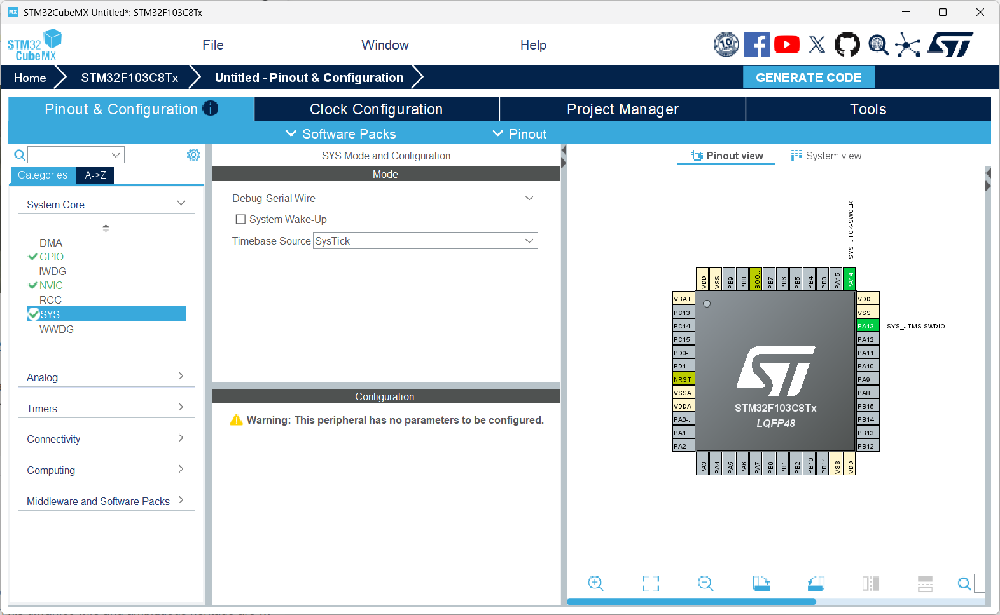
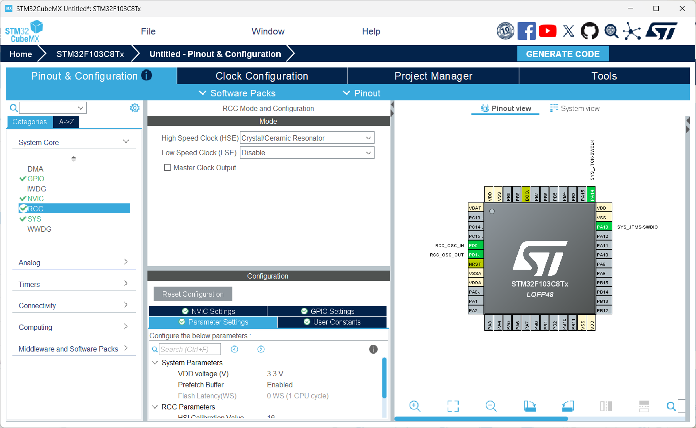
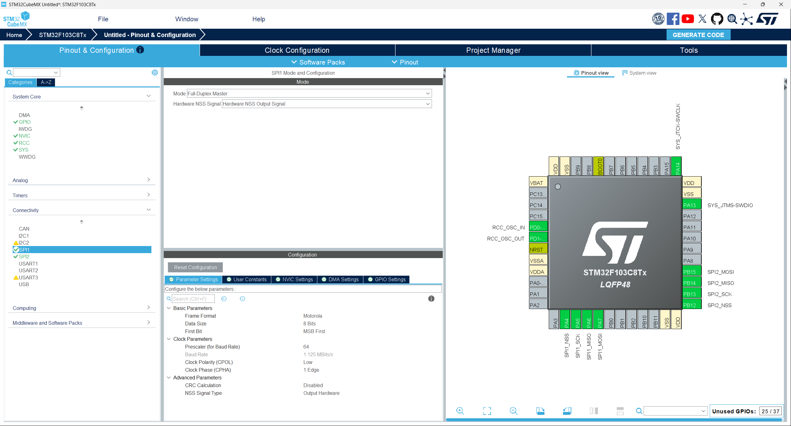
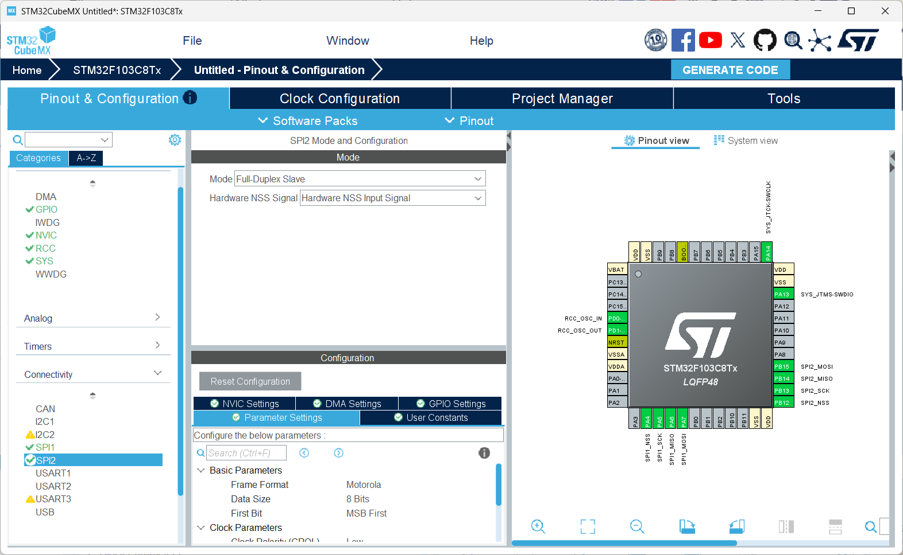
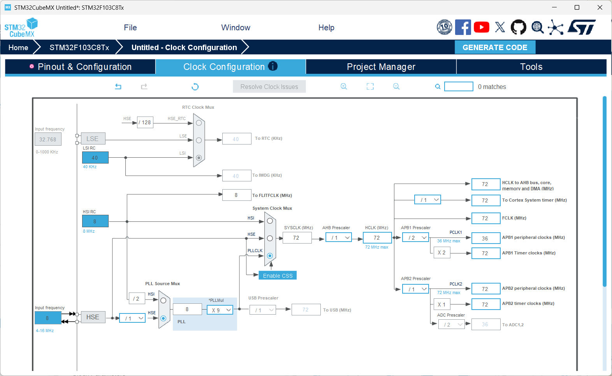
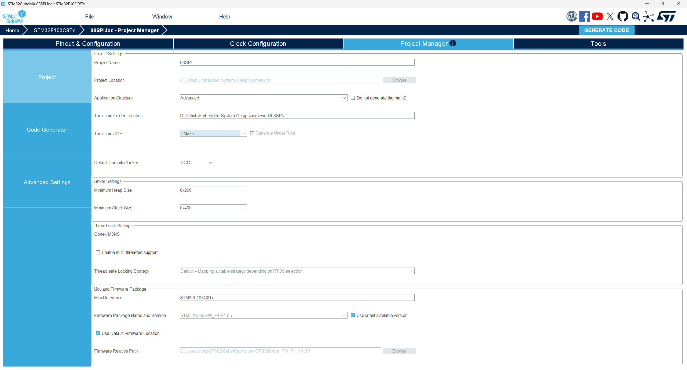
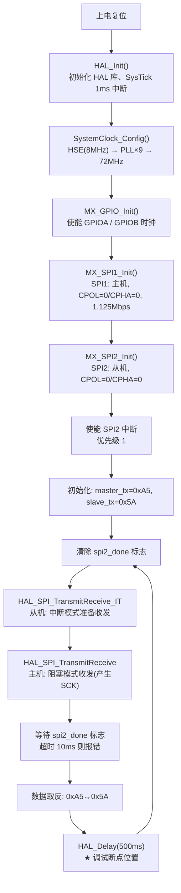
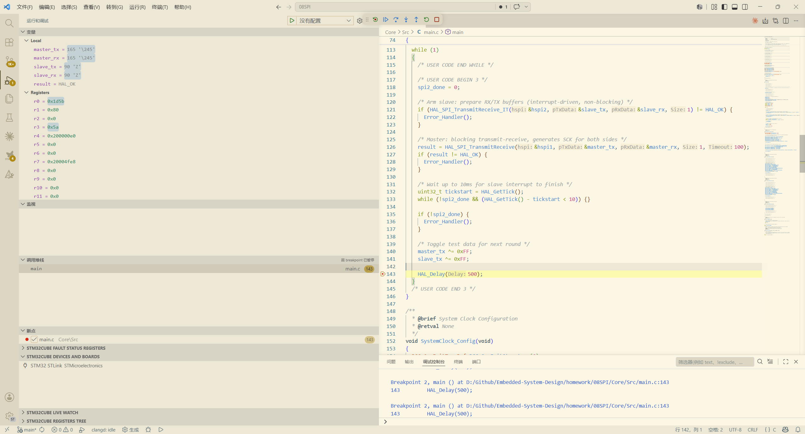
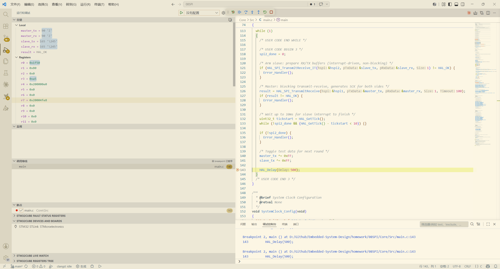

# 08SPI — STM32 SPI 主从回环通信实验

## 1. 实验概述

本实验基于 **STM32F103C8T6** 微控制器，通过 **SPI1（主机）与 SPI2（从机）** 在同一芯片上实现主从回环通信，并通过 VS Code 调试窗口观测收发数据验证通信正确性。

**核心知识点：**
- SPI 总线协议基础（四线制：NSS / SCK / MOSI / MISO）
- STM32 SPI 外设的主机与从机配置
- 时钟极性（CPOL）与时钟相位（CPHA）的匹配原则
- HAL 库 SPI 阻塞式收发 API：`HAL_SPI_TransmitReceive`
- HAL 库 SPI 中断式收发 API：`HAL_SPI_TransmitReceive_IT`
- SPI 回调函数 `HAL_SPI_TxRxCpltCallback` 的使用
- 硬件 NSS 控制（主机输出 / 从机输入）
- 主从同步：主机驱动 SCK，从机被动响应

---

## 2. 硬件需求

| 器件 | 说明 |
|------|------|
| STM32F103C8T6 最小系统板 | 主控 MCU |
| ST-Link / J-Link 调试器 | 烧录与调试 |
| 面包板 + 杜邦线 × 4 | 连接 SPI1 与 SPI2 引脚 |

**引脚连接（SPI1 ↔ SPI2 回环）：**

| SPI1 主机引脚 | SPI2 从机引脚 | 功能 |
|--------------|--------------|------|
| PA4 (NSS) | PB12 (NSS) | 片选信号 |
| PA5 (SCK) | PB13 (SCK) | 串行时钟 |
| PA6 (MISO) | PB14 (MISO) | 主机输入 / 从机输出 |
| PA7 (MOSI) | PB15 (MOSI) | 主机输出 / 从机输入 |

> **注意：MISO 交叉连接。** SPI 的 MISO 含义是 Master In Slave Out。连接时，主机的 MOSI（PA7）对从机的 MOSI（PB15），主机的 MISO（PA6）对从机的 MISO（PB14）——但这里"从机 MISO"是**从机输出**，所以交叉后正好实现主机发送→从机接收，从机发送→主机接收。


> **速度选择。** 本实验 SPI1 波特率预分频器设为 64，即 72MHz / 64 = **1.125 Mbps**。回环测试中信号完整性问题较少，可使用较高速率。实际外部 SPI 设备（如 Flash、传感器）通常支持 1~10 Mbps。

---

## 3. SPI 协议基础

在阅读代码之前，先了解 SPI 总线的基本概念：

### 3.1 四线制信号

| 信号 | 方向（主机视角） | 功能 |
|------|-----------------|------|
| **NSS** (Slave Select) | 输出 | 拉低选中从机，拉高释放 |
| **SCK** (Serial Clock) | 输出 | 主机产生时钟，驱动数据传输 |
| **MOSI** (Master Out Slave In) | 输出 | 主机发送数据到从机 |
| **MISO** (Master In Slave Out) | 输入 | 从机发送数据到主机 |

> STM32 数据手册中有时将 MOSI 标注为"主出从入"，MISO 标注为"主入从出"，但实际引脚标签直接以主机视角命名。本实验中 SPI2 是从机，其 PB15 虽然在 STM32 文档中是"SPI2_MOSI"，但在从机模式下它**接收**数据。

### 3.2 时钟极性与相位（SPI Mode）

SPI 有 4 种工作模式，由 CPOL（时钟极性）和 CPHA（时钟相位）组合决定：

| 模式 | CPOL | CPHA | SCK 空闲电平 | 数据采样沿 |
|------|------|------|-------------|-----------|
| Mode 0 | 0 | 0 | 低电平 | 第 1 个边沿（上升沿） |
| Mode 1 | 0 | 1 | 低电平 | 第 2 个边沿（下降沿） |
| Mode 2 | 1 | 0 | 高电平 | 第 1 个边沿（下降沿） |
| Mode 3 | 1 | 1 | 高电平 | 第 2 个边沿（上升沿） |

本实验使用 **Mode 0**（CPOL=0, CPHA=0），这是最常见的 SPI 模式。

> **关键原则：** 主机和从机的 CPOL/CPHA 必须完全一致，否则数据采样点错位，通信失败。

### 3.3 通信过程（全双工）

SPI 是全双工总线：在 SCK 的驱动下，主机和从机**同时**通过 MOSI 和 MISO 各发送一个 bit。发送完一个字节后，双方各得到一个字节。

```
主机:  发送 0xA5  →  MOSI →  从机收到 0xA5
从机:  发送 0x5A  →  MISO →  主机收到 0x5A
```

一次 `HAL_SPI_TransmitReceive` 调用同时完成发送和接收，这正是本实验 loopback 验证的核心机制。

### 3.4 SPI 与 I2C 的对比

| 特性 | SPI | I2C |
|------|-----|-----|
| 信号线数 | 4 线（NSS+SCK+MOSI+MISO） | 2 线（SCL+SDA） |
| 通信模式 | 全双工 | 半双工 |
| 地址机制 | NSS 硬件片选 | 软件地址字节 + ACK |
| 速率 | 1~50 Mbps | 100kHz~3.4MHz |
| 拓扑 | 点对点为主（一主多从需多 NSS） | 多设备共享总线 |
| 流控 | 无（主机控制节奏） | ACK 应答 |

---

## 4. STM32CubeMX 配置步骤

### 4.1 新建工程

1. 打开 **STM32CubeMX**（本工程使用 6.17.0 版本）
2. 点击 **File → New Project**
3. 在 **MCU Selector** 中搜索 `STM32F103C8Tx`，选中后点击 **Start Project**

### 4.2 配置调试接口（SYS）

1. 点击左侧 **Pinout & Configuration** 标签
2. 在 **System Core → SYS** 中
3. 将 **Debug** 设为 **Serial Wire**（关闭 JTAG，仅保留 SWD）



> **为什么要这样做？** JTAG 默认占用 PA15、PB3、PB4 三个引脚。关闭 JTAG 仅保留 SWD，既可烧录调试，又不浪费 GPIO 资源。本实验中 SPI2 使用 PB12~PB15，虽然不与 JTAG 冲突，但这是 STM32 项目的标准做法。

### 4.3 配置时钟源（RCC）

1. 在 **System Core → RCC** 中
2. 将 **High Speed Clock (HSE)** 设为 **Crystal/Ceramic Resonator**（外部晶振）



> **说明：** STM32F103C8T6 核心板通常板载 8MHz 晶振，通过 HSE + PLL 倍频到 72MHz。

### 4.4 配置 SPI1（主机）

1. 在 **Connectivity → SPI1** 中
2. 将 **Mode** 设为 **Full-Duplex Master**
3. **NSS Signal** 设为 **Hardware NSS Output Signal**
4. 其他参数保持默认：

| 参数 | 值 | 说明 |
|------|-----|------|
| Mode | Full-Duplex Master | 全双工主机模式 |
| NSS Signal | Hardware NSS Output | 硬件自动控制 NSS 输出 |
| Data Size | 8 Bits | 每帧 8 位数据 |
| Clock Polarity (CPOL) | Low | 空闲时 SCK=低电平 |
| Clock Phase (CPHA) | 1 Edge | 第一个边沿采样 |
| Baud Rate Prescaler | 64 | 72MHz/64 = 1.125 Mbps |
| First Bit | MSB | 高位先发 |



> **为什么用硬件 NSS？** SPI1 作为主机，硬件 NSS 输出模式会在传输开始前自动拉低 NSS 引脚，传输结束后自动拉高。这样无需软件手动控制，且时序精准。

### 4.5 配置 SPI2（从机）

1. 在 **Connectivity → SPI2** 中
2. 将 **Mode** 设为 **Full-Duplex Slave**
3. **NSS Signal** 设为 **Hardware NSS Input Signal**
4. **CPOL / CPHA** 必须与 SPI1 主机完全一致

| 参数 | 值 | 说明 |
|------|-----|------|
| Mode | Full-Duplex Slave | 全双工从机模式 |
| NSS Signal | Hardware NSS Input | 硬件检测 NSS 片选 |
| Data Size | 8 Bits | 与主机一致 |
| Clock Polarity (CPOL) | Low | 与主机一致 |
| Clock Phase (CPHA) | 1 Edge | 与主机一致 |
| First Bit | MSB | 与主机一致 |



> **关键配置：** SPI2 除 Mode 和 NSS 外，其余参数（CPOL/CPHA/DataSize/FirstBit）必须与 SPI1 完全一致，否则通信失败。

> **为什么从机不需要设置 BaudRate？** 从机使用主机提供的 SCK 时钟，自己不产生时钟，因此 CubeMX 不会显示波特率配置项。

### 4.6 配置时钟树（Clock Configuration）

1. 点击顶部 **Clock Configuration** 标签
2. 按如下参数配置：
   - **HSE:** 8 MHz（外部晶振）
   - **PLL Source:** HSE
   - **PLL Mul:** x9 → 8 MHz × 9 = **72 MHz**
   - **System Clock Mux:** PLLCLK
   - **AHB Prescaler:** /1 → **HCLK = 72 MHz**
   - **APB1 Prescaler:** /2 → **APB1 = 36 MHz**
   - **APB2 Prescaler:** /1 → **APB2 = 72 MHz**



> **SPI 时钟来源：** SPI1 挂在 APB2 总线（72MHz），SPI2 挂在 APB1 总线（36MHz）。SPI1 的波特率由此计算：72MHz / 64 = 1.125 Mbps。SPI2 作为从机不产生时钟，其 APB1 频率只影响数字逻辑的最小响应延迟。

### 4.7 配置工程输出

1. 点击 **Project Manager** 标签
2. **Project Name:** `08SPI`
3. **Project Location:** 选择你的工作目录
4. **Application Structure:** Basic
5. **Toolchain / IDE:** 选择 **CMake**（配合 VS Code + ARM GCC 使用）



### 4.8 生成代码

1. 点击右上角 **GENERATE CODE** 按钮
2. 等待代码生成完成
3. 点击 **Open Project** 或直接进入工程目录

---

## 5. 程序结构

```
08SPI/
├── 08SPI.ioc                    # CubeMX 工程配置文件
├── CMakeLists.txt                # 顶层 CMake 构建文件
├── CMakePresets.json             # CMake 预设（Debug）
├── STM32F103XX_FLASH.ld          # 链接脚本（Flash/RAM 布局）
├── cmake/                        # CMake 工具链文件
│   ├── gcc-arm-none-eabi.cmake   #   ARM GCC 工具链配置
│   ├── starm-clang.cmake         #   Clang 工具链配置
│   └── stm32cubemx/
│       └── CMakeLists.txt        #   自动生成的子模块 CMake
├── Core/
│   ├── Inc/                      # 头文件
│   │   ├── main.h                #   主头文件（含 HAL 库引用）
│   │   ├── stm32f1xx_hal_conf.h  #   HAL 库配置文件
│   │   └── stm32f1xx_it.h        #   中断服务函数声明
│   └── Src/                      # 源文件
│       ├── main.c                #   ★ 主程序（回环测试逻辑）
│       ├── stm32f1xx_hal_msp.c   #   HAL 外设底层初始化（MSP）
│       ├── stm32f1xx_it.c        #   中断服务函数实现
│       ├── system_stm32f1xx.c    #   系统初始化
│       ├── sysmem.c              #   动态内存管理桩
│       └── syscalls.c            #   系统调用桩（_write 等）
├── Drivers/                      # HAL 驱动库
│   ├── CMSIS/                    #   ARM CMSIS 核心头文件
│   └── STM32F1xx_HAL_Driver/     #   STM32F1 HAL 库源码
├── startup_stm32f103xb.s         # 启动文件（汇编）
└── img/                          # 文档截图
```

### 文件职责速览

| 文件 | 职责 |
|------|------|
| `main.c` | 用户程序入口，包含 SPI 回环测试逻辑和回调函数 |
| `stm32f1xx_hal_msp.c` | MSP 层：初始化 SPI1（PA4~PA7）和 SPI2（PB12~PB15）的 GPIO 及时钟 |
| `stm32f1xx_it.c` | 中断向量表实现，含 `SPI2_IRQHandler` |
| `stm32f1xx_hal_conf.h` | 裁剪 HAL 库：启用/禁用各外设模块 |
| `system_stm32f1xx.c` | `SystemInit()` 函数：上电后最早的时钟初始化 |

---

## 6. 核心代码详解

### 6.1 程序流程图



### 6.2 全局变量与回调函数

```c
/* 用户定义的私有变量 */
volatile uint8_t spi2_done = 0;  // 从机传输完成标志

/* SPI 传输完成回调函数 */
void HAL_SPI_TxRxCpltCallback(SPI_HandleTypeDef *hspi)
{
  if (hspi->Instance == SPI2) {
    spi2_done = 1;  // 从机中断传输完成，置位标志
  }
}
```

**设计要点：**

- `spi2_done` 声明为 `volatile`，确保编译器每次都从内存读取，不会将变量缓存在寄存器中导致死循环
- 回调函数是**弱定义（`__weak`）**的重写：HAL 库默认提供空实现，用户在 `main.c` 中重写后，链接器自动覆盖库中的弱定义
- 回调在**中断上下文**中执行（SPI2 中断服务例程 → `HAL_SPI_IRQHandler` → 回调），因此必须尽量简短

> **什么是弱定义（Weak Symbol）？** HAL 库中所有回调函数都使用 `__weak` 属性声明。链接时，如果用户代码中定义了同名函数，用户的强定义自动覆盖库中的弱定义。这使得 HAL 库可以提供默认空实现，用户只需重写需要的回调即可。

### 6.3 中断配置

```c
/* main() 中，外设初始化之后 */
HAL_NVIC_SetPriority(SPI2_IRQn, 1, 0);   // 抢占优先级 1, 子优先级 0
HAL_NVIC_EnableIRQ(SPI2_IRQn);           // 使能 SPI2 中断
```

中断服务函数位于 `stm32f1xx_it.c`：

```c
void SPI2_IRQHandler(void)
{
  HAL_SPI_IRQHandler(&hspi2);  // 委托 HAL 库处理中断事件
}
```

> **为什么只给 SPI2 使能中断？** 主机 SPI1 使用阻塞模式（轮询等待），无需中断。从机 SPI2 使用中断模式，可以在主机发起传输时由硬件自动触发中断处理，避免 CPU 空等。

### 6.4 主循环回环测试逻辑

```c
uint8_t master_tx = 0xA5;   // 主机发送数据（初始值）
uint8_t master_rx = 0;      // 主机接收缓冲
uint8_t slave_tx  = 0x5A;   // 从机发送数据（初始值）
uint8_t slave_rx  = 0;      // 从机接收缓冲

while (1)
{
    // 步骤 1: 清除完成标志
    spi2_done = 0;

    // 步骤 2: 从机准备（中断模式，非阻塞）
    //         slave_tx → 从机将在传输中发送此数据
    //         slave_rx ← 从机将在传输中接收数据存于此
    if (HAL_SPI_TransmitReceive_IT(&hspi2, &slave_tx, &slave_rx, 1) != HAL_OK) {
        Error_Handler();
    }

    // 步骤 3: 主机发起传输（阻塞模式，驱动 SCK）
    //         master_tx → 主机发送到从机
    //         master_rx ← 主机接收来自从机的数据
    result = HAL_SPI_TransmitReceive(&hspi1, &master_tx, &master_rx, 1, 100);
    if (result != HAL_OK) {
        Error_Handler();
    }

    // 步骤 4: 等待从机中断完成（超时 10ms）
    uint32_t tickstart = HAL_GetTick();
    while (!spi2_done && (HAL_GetTick() - tickstart < 10)) {}

    if (!spi2_done) {
        Error_Handler();  // 超时：从机未响应
    }

    // 步骤 5: 翻转测试数据，实现交替发送
    master_tx ^= 0xFF;   // 0xA5 → 0x5A, 0x5A → 0xA5
    slave_tx  ^= 0xFF;   // 同上

    HAL_Delay(500);  // ★ 在此设置断点，观察变量
}
```

### 6.5 数据传输详解

**第一轮循环（初始值）：**

```
主机 SPI1: 发送 0xA5 ──MOSI──→ 从机 SPI2: 收到 0xA5 → 存入 slave_rx
从机 SPI2: 发送 0x5A ──MISO──→ 主机 SPI1: 收到 0x5A → 存入 master_rx
```

**第一轮结束后变量状态：**

| 变量 | 值 | 说明 |
|------|-----|------|
| `master_tx` | 0xA5 | 主机发出的数据 |
| `master_rx` | **0x5A** | 主机收到来自从机的数据 |
| `slave_tx` | 0x5A | 从机发出的数据 |
| `slave_rx` | **0xA5** | 从机收到来自主机的数据 |

**取反后进入第二轮：**

```
主机 SPI1: 发送 0x5A ──MOSI──→ 从机 SPI2: 收到 0x5A → 存入 slave_rx
从机 SPI2: 发送 0xA5 ──MISO──→ 主机 SPI1: 收到 0xA5 → 存入 master_rx
```

**第二轮结束后变量状态：**

| 变量 | 值 | 说明 |
|------|-----|------|
| `master_tx` | 0x5A | 主机发出的数据（已翻转） |
| `master_rx` | **0xA5** | 主机收到来自从机的数据 |
| `slave_tx` | 0xA5 | 从机发出的数据（已翻转） |
| `slave_rx` | **0x5A** | 从机收到来自主机的数据 |

> **验证方法：** 在 `HAL_Delay(500)` 处设置断点，每运行一次在调试窗口观察四个变量的值。如果 `master_rx == slave_tx` 且 `slave_rx == master_tx`，则 SPI 回环通信完全正确。

**调试截图：**

- 第一次运行到断点：`master_tx=0xA5`, `master_rx=0x5A`, `slave_tx=0x5A`, `slave_rx=0xA5`



- 第二次运行到断点：`master_tx=0x5A`, `master_rx=0xA5`, `slave_tx=0xA5`, `slave_rx=0x5A`



### 6.6 SPI1 初始化（主机）

```c
hspi1.Instance = SPI1;
hspi1.Init.Mode              = SPI_MODE_MASTER;           // 主机模式
hspi1.Init.Direction         = SPI_DIRECTION_2LINES;      // 双线全双工
hspi1.Init.DataSize          = SPI_DATASIZE_8BIT;         // 8 位数据帧
hspi1.Init.CLKPolarity       = SPI_POLARITY_LOW;          // CPOL=0
hspi1.Init.CLKPhase          = SPI_PHASE_1EDGE;           // CPHA=0 (Mode 0)
hspi1.Init.NSS               = SPI_NSS_HARD_OUTPUT;       // 硬件 NSS 输出
hspi1.Init.BaudRatePrescaler = SPI_BAUDRATEPRESCALER_64;  // 72M/64=1.125Mbps
hspi1.Init.FirstBit          = SPI_FIRSTBIT_MSB;          // 高位先发
hspi1.Init.TIMode            = SPI_TIMODE_DISABLE;        // 禁用 TI 模式
hspi1.Init.CRCCalculation    = SPI_CRCCALCULATION_DISABLE; // 禁用 CRC
HAL_SPI_Init(&hspi1);
```

### 6.7 SPI2 初始化（从机）

```c
hspi2.Instance = SPI2;
hspi2.Init.Mode           = SPI_MODE_SLAVE;              // 从机模式
hspi2.Init.Direction      = SPI_DIRECTION_2LINES;        // 双线全双工
hspi2.Init.DataSize       = SPI_DATASIZE_8BIT;           // 与主机一致
hspi2.Init.CLKPolarity    = SPI_POLARITY_LOW;            // 与主机一致
hspi2.Init.CLKPhase       = SPI_PHASE_1EDGE;             // 与主机一致
hspi2.Init.NSS            = SPI_NSS_HARD_INPUT;           // 硬件 NSS 输入
hspi2.Init.FirstBit       = SPI_FIRSTBIT_MSB;             // 与主机一致
hspi2.Init.TIMode         = SPI_TIMODE_DISABLE;
hspi2.Init.CRCCalculation = SPI_CRCCALCULATION_DISABLE;
HAL_SPI_Init(&hspi2);
```

> **从机与主机的关键区别：**
> 1. `Mode` 设为 `SPI_MODE_SLAVE`
> 2. `NSS` 设为 `SPI_NSS_HARD_INPUT`（从机被动接受片选）
> 3. **没有 BaudRatePrescaler**（从机时钟由主机 SCK 引脚提供）
> 4. CPOL/CPHA/DataSize/FirstBit 必须与主机**完全一致**

### 6.8 HAL_SPI_MspInit — GPIO 引脚配置

`HAL_SPI_MspInit()` 由 `HAL_SPI_Init()` 内部自动调用，完成 GPIO 和时钟的底层初始化。

**SPI1 主机引脚（PA4~PA7）：**

```c
/* PA4(NSS), PA5(SCK), PA7(MOSI): 复用推挽输出 */
GPIO_InitStruct.Pin   = GPIO_PIN_4 | GPIO_PIN_5 | GPIO_PIN_7;
GPIO_InitStruct.Mode  = GPIO_MODE_AF_PP;       // 复用推挽
GPIO_InitStruct.Speed = GPIO_SPEED_FREQ_HIGH;
HAL_GPIO_Init(GPIOA, &GPIO_InitStruct);

/* PA6(MISO): 浮空输入（主机接收来自从机的数据） */
GPIO_InitStruct.Pin  = GPIO_PIN_6;
GPIO_InitStruct.Mode = GPIO_MODE_INPUT;
GPIO_InitStruct.Pull = GPIO_NOPULL;
HAL_GPIO_Init(GPIOA, &GPIO_InitStruct);
```

**SPI2 从机引脚（PB12~PB15）：**

```c
/* PB12(NSS), PB13(SCK), PB15(MOSI): 浮空输入（从机被动接收） */
GPIO_InitStruct.Pin   = GPIO_PIN_12 | GPIO_PIN_13 | GPIO_PIN_15;
GPIO_InitStruct.Mode  = GPIO_MODE_INPUT;
GPIO_InitStruct.Pull  = GPIO_NOPULL;
HAL_GPIO_Init(GPIOB, &GPIO_InitStruct);

/* PB14(MISO): 复用推挽输出（从机通过此引脚向主机发送数据） */
GPIO_InitStruct.Pin   = GPIO_PIN_14;
GPIO_InitStruct.Mode  = GPIO_MODE_AF_PP;
GPIO_InitStruct.Speed = GPIO_SPEED_FREQ_HIGH;
HAL_GPIO_Init(GPIOB, &GPIO_InitStruct);
```

**GPIO 方向总结：**

| 引脚 | 功能 | 方向 | 原因 |
|------|------|------|------|
| PA4 (SPI1_NSS) | 主机片选输出 | AF_PP | 主机主动驱动 NSS |
| PA5 (SPI1_SCK) | 主机时钟输出 | AF_PP | 主机产生时钟 |
| PA6 (SPI1_MISO) | 主机数据输入 | Input | 主机从此引脚读数据 |
| PA7 (SPI1_MOSI) | 主机数据输出 | AF_PP | 主机向此引脚写数据 |
| PB12 (SPI2_NSS) | 从机片选输入 | Input | 从机被动检测 NSS |
| PB13 (SPI2_SCK) | 从机时钟输入 | Input | 从机接收主机时钟 |
| PB14 (SPI2_MISO) | 从机数据输出 | AF_PP | 从机向此引脚写数据 |
| PB15 (SPI2_MOSI) | 从机数据输入 | Input | 从机从此引脚读数据 |

> **核心规律：** 谁驱动信号线，谁就配置为输出（AF_PP）；谁接收信号，谁就配置为输入。主机驱动 SCK/MOSI/NSS，从机只驱动 MISO。

---

## 7. API 函数详解

### HAL_SPI_TransmitReceive（阻塞模式）

```c
HAL_StatusTypeDef HAL_SPI_TransmitReceive(
    SPI_HandleTypeDef *hspi,   // SPI 句柄
    uint8_t           *pTxData, // 发送数据缓冲区
    uint8_t           *pRxData, // 接收数据缓冲区
    uint16_t           Size,    // 数据长度（字节数）
    uint32_t           Timeout  // 超时时间（ms）
);
```

- **功能：** SPI 全双工阻塞式收发。发送 `Size` 字节，同时接收 `Size` 字节
- **主机行为：** 拉低 NSS → 产生 SCK 时钟 → 同时收发数据 → 拉高 NSS
- **从机行为：** 等待 NSS 拉低 → 跟随 SCK 同时收发数据
- **阻塞方式：** CPU 在此等待直到传输完成或超时
- **返回值：** `HAL_OK`（成功）、`HAL_TIMEOUT`（超时）、`HAL_ERROR`（总线错误）

### HAL_SPI_TransmitReceive_IT（中断模式）

```c
HAL_StatusTypeDef HAL_SPI_TransmitReceive_IT(
    SPI_HandleTypeDef *hspi,   // SPI 句柄
    uint8_t           *pTxData, // 发送数据缓冲区
    uint8_t           *pRxData, // 接收数据缓冲区
    uint16_t           Size     // 数据长度
);
```

- **功能：** SPI 全双工中断式收发。函数立即返回，传输在后台进行，完成后触发回调
- **非阻塞：** CPU 可以继续执行其他任务
- **完成通知：** 传输完成后 HAL 库调用 `HAL_SPI_TxRxCpltCallback()`
- **重要规则：** 调用此函数前要确保上一次 IT 传输已完成（检查 `hspi->State == HAL_SPI_STATE_READY`）
- **本实验用途：** 从机使用中断模式，在主机发起传输时自动完成收发

### HAL_SPI_TxRxCpltCallback（回调函数）

```c
void HAL_SPI_TxRxCpltCallback(SPI_HandleTypeDef *hspi);
```

- **调用时机：** 中断模式（或 DMA 模式）传输完成时，由 HAL 库在中断上下文中调用
- **参数说明：** `hspi` 指向触发回调的 SPI 句柄（可用来区分是 SPI1 还是 SPI2 完成）
- **用户任务：** 在此设置完成标志、读取数据、启动下一轮传输等
- **注意事项：** 在中断上下文中执行，不宜做耗时操作

### HAL_SPI_Init

```c
HAL_StatusTypeDef HAL_SPI_Init(SPI_HandleTypeDef *hspi);
```

- 根据 `hspi->Init` 结构体中的参数配置 SPI 外设
- 内部自动调用 `HAL_SPI_MspInit()` 完成 GPIO 和时钟的底层初始化

---

## 8. 使用说明

### 8.1 编译与烧录

本工程使用 **CMake + ARM GCC** 工具链，配合 VS Code 插件进行开发。

#### 编译

```bash
cmake --preset Debug
cmake --build build/Debug
```

或在 VS Code 中按 `Ctrl+Shift+B` 选择 CMake 构建任务。

#### 烧录（ST-Link / OpenOCD）

连接 ST-Link 到开发板，执行：

```bash
openocd -f interface/stlink.cfg -f target/stm32f1x.cfg \
        -c "program build/Debug/08SPI.elf verify reset exit"
```

### 8.2 调试与验证

1. 在 `main.c` 中 `HAL_Delay(500)` 行设置断点
2. 按 **F5** 启动调试（Debug 预设已配置好）
3. 程序运行到断点时，在 **监视窗口** 中添加变量：
   - `master_tx`
   - `master_rx`
   - `slave_tx`
   - `slave_rx`
4. 每次按 **F5**（继续运行），四个变量的值会交替变化

**预期结果：**

| 断点次数 | master_tx | master_rx | slave_tx | slave_rx |
|---------|-----------|-----------|----------|----------|
| 第 1 次 | 0xA5 | 0x5A | 0x5A | 0xA5 |
| 第 2 次 | 0x5A | 0xA5 | 0xA5 | 0x5A |
| 第 3 次 | 0xA5 | 0x5A | 0x5A | 0xA5 |
| ... | (交替) | (交替) | (交替) | (交替) |

> **验证通过标准：** `master_rx == slave_tx` 且 `slave_rx == master_tx`，且两轮数据交替翻转，说明 SPI1→SPI2 和 SPI2→SPI1 两条数据通路均正常工作。

### 8.3 调试技巧

| 问题 | 可能原因 | 排查方法 |
|------|---------|---------|
| 从机接收数据为 0x00 或 0xFF | SPI 引脚未连接/接触不良 | 用万用表通断档检查 4 条杜邦线 |
| master_rx 始终为 0x00 | SPI2 MISO 引脚配置错误 | 检查 PB14 是否为 AF_PP |
| slave_rx 始终为 0x00 | SPI2 MOSI 引脚配置错误 | 检查 PB15 是否为输入模式 |
| 从机中断一直不触发 | NSS 信号异常 | 检查 PA4→PB12 连接；确认 NSS 硬件模式 |
| 程序停在 Error_Handler | SPI2 中断超时（10ms） | 检查 SPI2_IRQn 是否使能；优先级配置 |
| 数据偶尔错误 | 杜邦线过长/接触不良 | 缩短走线；更换杜邦线；降低 SPI 速率 |

---

## 9. 常见问题

### Q1: 为什么从机也要准备发送数据？它不是在"接收"吗？

**A:** SPI 是**全双工**总线。每次传输时，主机和从机**同时**发送一个字节。即使从机只关心接收，它的移位寄存器也会随着 SCK 时钟移出数据。如果不事先准备好 `slave_tx`，从机会发出 0x00（或其他随机值），但这不影响它正确接收主机发来的数据。

### Q2: 为什么要用硬件 NSS 而不是软件 NSS？

**A:** 硬件 NSS 有以下优势：
- **时序精准：** 硬件在传输开始前自动拉低，传输结束后自动拉高，无需软件干预
- **无延迟：** 没有 GPIO 翻转的软件指令延迟
- **从机必需：** 从机使用硬件 NSS 输入时，NSS 的上升沿会触发内部状态机复位，确保每次传输从干净状态开始

软件 NSS 适合一主多从的场景（需要多个独立的 NSS GPIO 引脚）。

### Q3: 为什么 SPI1 用阻塞模式，SPI2 用中断模式？

**A:** 这是回环测试的一种经典设计：
- **主机 SPI1（阻塞）：** 主机主动发起传输，需要确保传输完成后才继续执行，阻塞等待是最简单的实现
- **从机 SPI2（中断）：** 从机被动等待主机发起传输，使用中断可以在传输完成后自动得到通知

也可以用两种中断模式或 DMA 模式，但阻塞 + 中断的组合最便于教学演示。

### Q4: 如果我把 CPOL/CPHA 设反了会怎样？

**A:** 数据采样点偏移半拍。例如主机在上升沿采样，从机在下降沿采样，则从机读到的数据会产生 1 bit 的位移或完全错误。症状通常是数据能收到但值是错的（不是 0x00 或 0xFF）。

### Q5: SPI1 和 SPI2 可以放在不同芯片上吗？

**A:** 当然可以。本实验将 SPI1 和 SPI2 放在同一芯片上是为了简化硬件连接（仅需 4 条杜邦线跳接）。如果使用两块开发板，连接方式完全相同，且各自独立供电——只需确保共地（GND 相连）。

---

## 10. 扩展练习

1. **多字节传输：** 将单字节测试扩展为多字节数组传输（如 `uint8_t test_data[16]`），验证批量数据的收发正确性。

2. **不同 SPI 模式测试：** 修改 CPOL/CPHA 配置为 Mode 1/2/3，观察不匹配时数据如何出错，验证 SPI 模式匹配的必要性。

3. **速度极限测试：** 将 SPI1 的 BaudRatePrescaler 从 64 改为 4/8/16 等更小值，测试最高可稳定通信的速率。

4. **DMA 模式回环：** 将 SPI1 和 SPI2 都改为 DMA 模式收发，实现完全不占用 CPU 的后台传输。

5. **外接真实 SPI 设备：** 将 SPI1 连接到外部 SPI 设备（如 W25Q64 Flash、NRF24L01 无线模块），在回环测试基础上学习对外通信。

---

## 11. 作业要求

### 11.1 基础要求（必做）

#### 任务 A：CubeMX 配置与工程搭建

1. 在 STM32CubeMX 中按本教程完成 **SPI1（主机）和 SPI2（从机）** 的配置
2. 确保两个 SPI 外设的 CPOL/CPHA 参数完全一致
3. 生成 CMake 工程，编译成功（0 错误 0 警告）

**验收标准：** 提供 SPI1 和 SPI2 的 CubeMX 配置截图各一张。

#### 任务 B：SPI 回环通信验证

1. 将本实验提供的 `main.c` 代码烧录到开发板（或自行编写等价的回环测试代码）
2. 用 4 条杜邦线连接 SPI1 和 SPI2 对应引脚
3. 在 `HAL_Delay(500)` 处设置断点，使用 VS Code 调试窗口观察变量

**验收标准：** 提供两张调试截图（第一次和第二次运行到断点的变量窗口），证明 `master_rx == slave_tx` 且 `slave_rx == master_tx`，且数据交替翻转。

#### 任务 C：SPI 波形分析

使用逻辑分析仪或示波器同时抓取 **SCK（PA5）、MOSI（PA7）、MISO（PA6）、NSS（PA4）** 四路信号，完成以下分析：

**验收标准：**
- 标注 SCK 频率，验证 ≈ 1.125 MHz
- 在 MOSI 波形上标注出一个完整字节的 8 个 bit（高位→低位），验证其值与 `master_tx` 一致
- 在 MISO 波形上标注出对应字节，验证其值与 `slave_tx` 一致
- 标注 NSS 的使能区间（低电平有效），说明一次完整 SPI 传输的时序

### 11.2 进阶要求（选做，加分）

#### 任务 D：多字节数组传输

将单字节回环改为 16 字节数组回环测试。准备两组测试数据：
- 主机发送递增序列：`0x00, 0x01, 0x02, ..., 0x0F`
- 从机发送递减序列：`0xFF, 0xFE, 0xFD, ..., 0xF0`

用逻辑分析仪抓取完整时序，或在调试器中逐字节验证收发正确性。

**验收标准：** 16 字节全部收发正确，提供调试窗口截图或逻辑分析仪截图。

#### 任务 E：SPI 模式切换验证

将 SPI1 和 SPI2 的 CPOL/CPHA 分别配置为以下组合，用 LED 闪烁次数指示结果：
- **组合 1：** 主机 Mode 0, 从机 Mode 0（正常通信 → LED 快闪）
- **组合 2：** 主机 Mode 0, 从机 Mode 3（通信失败 → LED 慢闪）
- **组合 3：** 主机 Mode 0, 从机 Mode 1（通信失败 → LED 熄灭）

**验收标准：** 证明 SPI 的模式匹配是通信成功的前提，分析为何不匹配时数据出错。

### 11.3 实验报告要求

提交的实验报告应包含以下内容：

| 章节 | 内容 |
|------|------|
| **1. 实验目的** | 简述本实验的学习目标 |
| **2. 硬件连接** | 画出 STM32 SPI1 与 SPI2 的引脚连接图（实物照片 + 示意连线） |
| **3. CubeMX 配置** | 截图说明 SYS、RCC、SPI1、SPI2、Clock 的配置参数 |
| **4. 核心代码** | 粘贴并解释回环测试主循环逻辑、回调函数、中断配置（不要全部粘贴 main.c） |
| **5. SPI 波形分析** | 逻辑分析仪截图，标注 SCK/MOSI/MISO/NSS 各字段含义 |
| **6. 实验结果** | VS Code 调试窗口截图（两次断点的变量对比） |
| **7. 问题与思考** | 记录实验中遇到的问题及解决方案；<br>**思考题 1：** SPI 的从机能否主动发起通信？为什么？<br>**思考题 2：** 如果主机和从机的 CPOL 不一致，具体会发生什么？<br>**思考题 3：** 为什么本实验中 SPI2 的 MOSI 引脚配置为输入模式？ |
| **8. 附录** | 完整的 `main.c` 代码（可选） |

---

## 12. 参考资料

- [STM32F103C8T6 数据手册](https://www.st.com/resource/en/datasheet/stm32f103c8.pdf)
- [RM0008 — STM32F1xx 参考手册 (SPI 章节)](https://www.st.com/resource/en/reference_manual/rm0008-stm32f101xx-stm32f102xx-stm32f103xx-stm32f105xx-and-stm32f107xx-advanced-armbased-32bit-mcus-stmicroelectronics.pdf)
- [STM32F1xx HAL 库用户手册 (UM1850)](https://www.st.com/resource/en/user_manual/um1850-description-of-stm32f1-hal-and-lowlayer-drivers-stmicroelectronics.pdf)
- [SPI Block Guide (Motorola/Freescale)](https://www.nxp.com/files-static/training_pdf/SPI.pdf)
- [STM32CubeMX 用户手册 (UM1718)](https://www.st.com/resource/en/user_manual/um1718-stm32cubemx-for-stm32-configuration-and-initialization-c-code-generation-stmicroelectronics.pdf)
