# 作业9：STM32 ADC 内置温度传感器采集与虚拟串口传输实验

## 统一作业说明

### 学生需要完成的核心任务

1. 使用 STM32CubeMX 完成 ADC1（内置温度传感器通道 + VREFINT 内部参考电压通道）、USB CDC、时钟树、调试接口等配置，并保留 `.ioc` 文件。
2. 基于 HAL 库实现 ADC 轮询采集，先后读取温度传感器和 VREFINT 两个通道的数据。
3. 利用 VREFINT（内部参考电压 1.20V）反推实际 VDDA，对温度传感器数据进行校正，同时输出校正与未校正两组温度值。
4. 将 ADC 原始值、VDDA、校正/未校正温度通过 USB CDC 虚拟串口每 1 秒发送一次到电脑端串口调试助手。
5. 成功编译、下载并在电脑端串口调试助手中验证温度数据的正确输出。
6. 在实验报告中说明 ADC 时钟配置、VREFINT 校正原理、温度计算原理、代码结构、实验现象、问题排查和课后思考。
7. 按 [00Template/README.md](../00Template/README.md) 中提供的 LaTeX 模板撰写中文实验报告并提交 PDF。

### 本次作业验收目标

| 项目 | 要求 |
|------|------|
| 处理器平台 | STM32F103C8T6 或课程指定的带 USB 开发板 |
| 采集方式 | ADC1 轮询采集温度传感器（通道 16）+ VREFINT（通道 17）双通道 |
| 通信方式 | USB CDC 虚拟串口（VCP） |
| 必做功能 | 每 1 秒采集双通道数据，用 VREFINT 校正温度并通过 VCP 发送 |
| 理论要求 | 能解释 ADC 采样时间、VREFINT 校正原理、温度传感器转换公式、12 位 ADC 量化原理 |
| 验收方式 | 现场演示或结果截图，能展示串口助手中每秒输出的校正/未校正温度数据 |

### 本次必须提交的内容

1. 一份 PDF 格式实验报告。
2. STM32CubeMX 配置截图（ADC1、时钟树、USB CDC 等）各至少 1 张。
3. 设备管理器识别截图、串口调试助手输出截图各至少 1 张。
4. 课后思考题的书面回答。

### 报告必须回答的问题

1. 说明 VREFINT（内部参考电压）通道的作用，以及它如何用于校正 ADC 测量结果。
2. 为什么 ADC 采样时间设置较长（如 239.5 Cycles）对温度传感器和 VREFINT 采集很重要。
3. STM32 内置温度传感器的 V25 和 Avg_Slope 参数有什么意义？为什么即使经过 VREFINT 校正，温度测量值仍可能与真实结温有偏差？
4. 本实验使用 `HAL_ADC_ConfigChannel` 动态切换通道来分时采集两个 ADC 通道，与在 CubeMX 中配置扫描模式一次性采集两个通道相比，各有什么优缺点？

---

## 1. 实验目的

本实验基于 STM32 的 ADC1 采集芯片内置温度传感器和 VREFINT 内部参考电压数据，利用 VREFINT 对 ADC 结果进行校正，并通过 USB CDC 虚拟串口实时传输到电脑端显示。通过本实验，你应掌握以下内容：

1. 理解 STM32 ADC 的基本工作原理，包括采样时间、转换精度和量化方法。
2. 理解 STM32 内置温度传感器的电气特性和温度计算原理。
3. 理解 VREFINT（内部参考电压）的作用及其对 ADC 测量的校正原理。
4. 掌握 STM32CubeMX 中多个 ADC 内部通道（温度传感器 + VREFINT）的配置方法。
5. 学会使用 HAL 库进行多通道动态切换采集，以及 `HAL_ADC_ConfigChannel` 的运行时重配置。
6. 学会将 ADC 原始值转换为物理量（电压、温度），并理解整型运算在嵌入式系统中的优势。
7. 能够结合 USB CDC 虚拟串口与 ADC 采集，完成一个带有校正功能的完整数据采集与传输系统。

## 2. 实验原理

### 2.1 STM32F103 内置温度传感器

STM32F103C8T6 芯片内部集成了一个温度传感器，连接到 **ADC1 的通道 16**。该温度传感器的电气特性如下（来自数据手册）：

| 参数 | 符号 | 典型值 | 范围 | 单位 |
|------|------|--------|------|------|
| 25°C 时的输出电压 | V25 | 1.43 | 1.34 ~ 1.52 | V |
| 温度变化斜率 | Avg_Slope | 4.3 | 4.0 ~ 4.6 | mV/°C |
| ADC 采样时间 | — | — | ≥ 17.1 μs | — |

温度计算公式：

$$\text{Temp}(°C) = \frac{V_{25} - V_{sense}}{Avg\_Slope} + 25$$

其中：
- $V_{25}$：25°C 时传感器的输出电压（典型值 1.43V）
- $V_{sense}$：ADC 实测的传感器输出电压
- $Avg\_Slope$：温度每变化 1°C 输出电压的变化量（典型值 4.3 mV/°C）

**温度传感器不能直接测量芯片外部环境温度**，它测量的是芯片的**结温（Junction Temperature）**。由于芯片在运行时自身会发热，因此 ADC 采集到的温度通常高于环境温度。

### 2.2 VREFINT 内部参考电压与 ADC 校正原理

STM32F103 芯片内部集成了一个**内部参考电压源（VREFINT）**，连接到 **ADC1 的通道 17**。其电气特性如下（来自数据手册）：

| 参数 | 典型值 | 说明 |
|------|--------|------|
| 输出电压 | **1.20 V** | 内部基准电压，与 VDDA 无关 |
| ADC 采样时间 | ≥ 5.1 μs | 推荐较长的采样时间保证稳定 |

**VREFINT 的核心用途——校正 VDDA 波动：**

ADC 的转换结果依赖于参考电压 VDDA（通常设计为 3.3V）。但实际电路中 VDDA 可能偏离 3.3V（例如 USB 供电时 VDDA 可能为 3.1V~3.5V），导致 ADC 读数产生比例误差。

VREFINT 的输出电压固定为 1.20V，不随 VDDA 变化。因此可以通过读取 VREFINT 通道的 ADC 值**反推出实际 VDDA**：

$$V_{DDA\_actual} = \frac{1.20\text{V} \times 4096}{ADC_{VREFINT}}$$

然后使用实际的 VDDA 对其它通道的 ADC 读数进行校正：

$$V_{sensor\_calibrated} = \frac{ADC_{sensor} \times V_{DDA\_actual}}{4096}$$

**示例：**

- 读得 `ADC_VREFINT = 1429` → VDDA_actual = 1.20 × 4096 / 1429 = **3.439 V**（非标称的 3.3V）
- 读得 `ADC_TS = 1634` → V_ts_cal = 1634 × 3.439 / 4096 = **1.372 V** → 温度 38.5°C
- 而假设 VDDA = 3.3V 时 V_ts = 1634 × 3.3 / 4096 = **1.316 V** → 温度 51.5°C

两者相差 **13°C**，可见 VREFINT 校正对测温精度有显著影响。

### 2.3 ADC 量化原理

STM32F103 的 ADC 分辨率为 12 位，参考电压为 VDDA（通常 3.3V），量化关系如下：

$$V_{sense} = \frac{ADC\_Value}{4096} \times V_{DDA}$$

其中：
- $ADC\_Value$ 为读取到的 12 位原始值（0 ~ 4095）
- $V_{DDA}$ 为 ADC 参考电压（通常为 3.3V，但实际可能有偏差）
- 4096 为 12 位 ADC 的量化级数（$2^{12}$）

### 2.4 USB CDC 虚拟串口原理

USB CDC（Communication Device Class）是 USB 协议中定义的一种设备类，它可以在 USB 总线上模拟传统的串行通信接口。当 STM32 通过 USB 连接电脑后，操作系统会将其识别为一个标准 COM 端口，应用程序（如串口调试助手）可以像操作普通串口一样进行读写。

与物理 UART 串口不同，USB CDC 的波特率、数据位、停止位等参数不影响实际传输速率——数据始终以 USB 全速（12 Mbps）在底层传输。

## 3. 实验环境

### 3.1 硬件环境

1. 一块带 USB 接口的 STM32F103C8T6 开发板。
2. 一根可正常传输数据的 USB 数据线。
3. ST-Link 下载器或板载调试器。

### 3.2 软件环境

1. STM32CubeMX（v6.17.0 或更高版本）。
2. VS Code / STM32CubeIDE 或其他支持该工程的 STM32 开发环境。
3. ARM GCC / CMake 工具链或等效编译环境。
4. 串口调试助手。
5. ST-Link 驱动。

## 4. STM32CubeMX 配置步骤

### 4.1 新建工程并选择芯片

打开 STM32CubeMX，点击 ACCESS TO MCU SELECTOR，根据你使用的开发板或芯片型号选择 **STM32F103C8Tx**（LQFP48 封装）。

### 4.2 配置调试接口（SYS）

在 Pinout & Configuration 页面中，找到 **SYS**，将 **Debug** 设置为 **Serial Wire**。

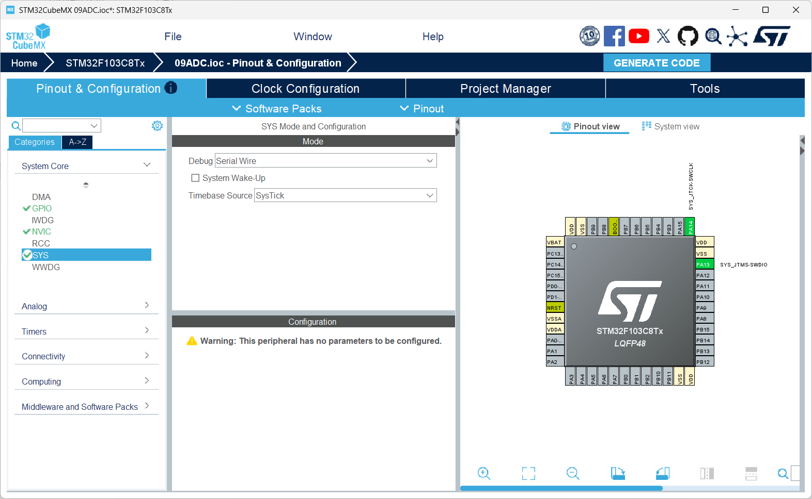

这样做的原因是：

1. 便于后续通过 ST-Link / DAP-Link 下载和调试程序。
2. 仅使用 SWD（SWDIO + SWCLK），不占用 JTAG 的其他引脚，释放 PA15、PB3、PB4。
3. 如果未正确配置调试接口，芯片可能被锁死无法调试。

### 4.3 配置高速外部时钟（RCC）

在 **RCC** 配置项中，将 **High Speed Clock (HSE)** 设置为 **Crystal/Ceramic Resonator**，即外部 8 MHz 晶振。

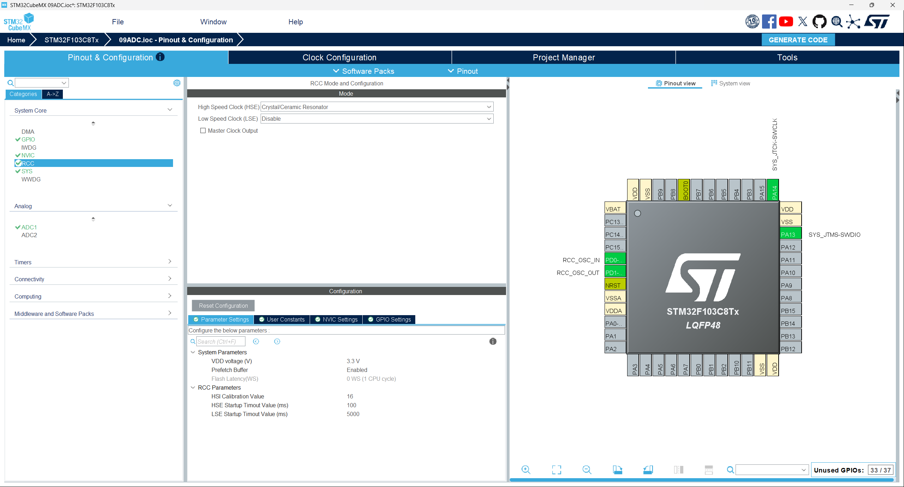

这样做的目的是为 PLL 和 USB 提供稳定、精确的时钟来源。内部 HSI 的精度（±1%）不足以满足 USB 通信对时钟精度的要求。

### 4.4 配置 ADC1（温度传感器 + VREFINT 双通道）

在 **Analog** → **ADC1** 中：

1. 勾选 **IN0** 区域的 **Temperature Sensor Channel**，使能内部温度传感器通道（ADC 通道 16）。
2. 勾选 **IN0** 区域的 **Vrefint Channel**，使能内部参考电压通道（ADC 通道 17）。
3. **Mode** 保持为 **Independent mode**（独立模式）。

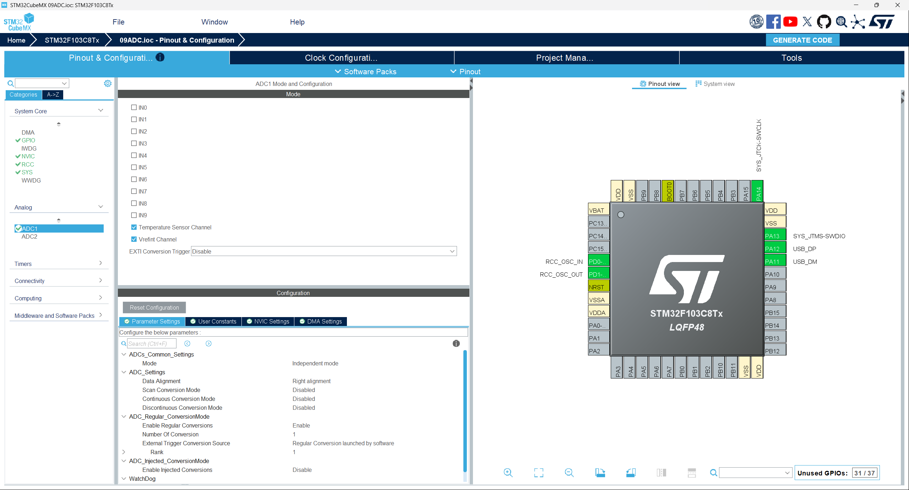

ADC 参数配置说明：

| 参数 | 设置值 | 说明 |
|------|--------|------|
| ScanConvMode | DISABLE | 代码中通过动态切换通道来分时采集两个通道 |
| ContinuousConvMode | DISABLE | 单次转换，由软件触发每次采集 |
| ExternalTrigConv | ADC_SOFTWARE_START | 软件触发，在代码中调用启动函数 |
| DataAlign | ADC_DATAALIGN_RIGHT | 数据右对齐，12 位结果在低 12 位 |
| NbrOfConversion | 1 | CubeMX 初始化只配温度传感器通道，VREFINT 在代码中动态切换 |

#### 4.4.1 配置 ADC 采样时间

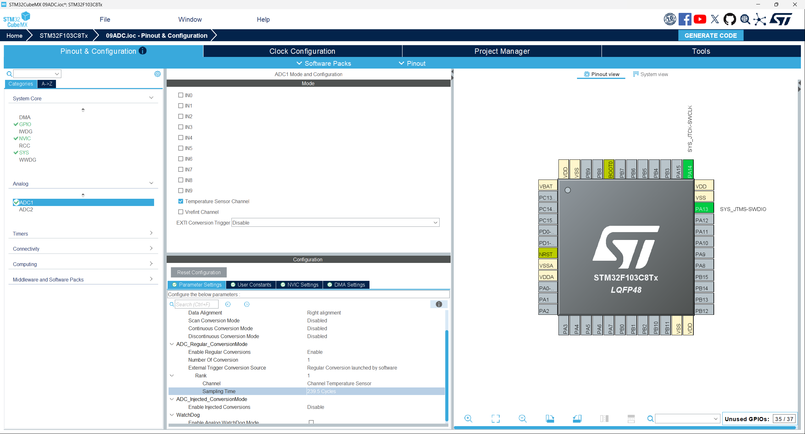

采样时间选择 **239.5 Cycles**（`ADC_SAMPLETIME_239CYCLES_5`）。

**为什么需要较长的采样时间：**

ADC 内部有一个采样保持电容，在采样阶段需要对该电容充电。温度传感器是内部模拟信号源，其输出阻抗较高。如果采样时间太短，采样电容上的电压不足以达到与信号源相同的电平，导致 ADC 读数偏低且不稳定。数据手册要求温度传感器的采样时间至少为 17.1 μs。

在 12 MHz ADC 时钟下：
- 采样时间 = (239.5 + 12.5) / 12 MHz ≈ 21 μs（其中 12.5 为固定的逐次逼近转换周期）
- 20.0 μs > 17.1 μs，满足数据手册要求

### 4.5 启用 USB 外设

在左侧 **Connectivity** 菜单下找到 **USB**，将其配置为 **Device (FS)**。

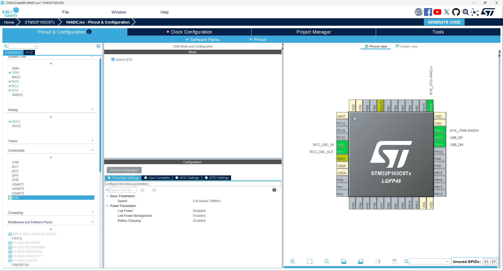

此步骤启用芯片的 USB 全速设备功能，PA11（USB_DM）和 PA12（USB_DP）引脚将自动配置为 USB 差分数据线。

### 4.6 配置 USB CDC 中间件

在 **Middleware and Software Packs** 中打开 **USB_DEVICE**，将 **Class for FS IP** 设置为 **Communication Device Class (Virtual Port Com)**。

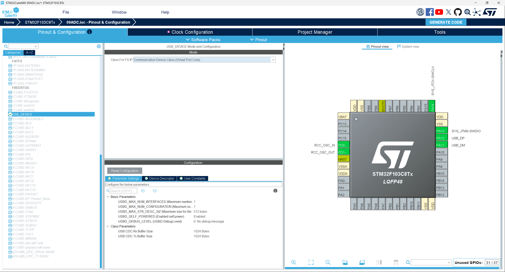

这一步的意义在于：

1. 告诉 CubeMX 当前 USB 设备工作在 CDC 类（通信设备类）。
2. 自动生成 USB 虚拟串口所需的设备描述符、接口文件和 CDC 中间件代码。
3. 电脑端将识别此设备为标准 COM 端口。

### 4.7 配置时钟树

这是实验最关键的一步。进入 **Clock Configuration** 页面：

1. **HSE**：8 MHz（外部晶振）。
2. **PLL Source**：选择 HSE。
3. **PLL Mul**：设置为 ×6，PLL 输出 = 8 MHz × 6 = 48 MHz。
4. **SYSCLK**：选择 PLLCLK = 48 MHz。
5. **AHB Prescaler**：÷1，HCLK = 48 MHz。
6. **APB1 Prescaler**：÷2，APB1 = 24 MHz（USB 挂载在 APB1 上）。
7. **APB2 Prescaler**：÷1，APB2 = 48 MHz（ADC1 挂载在 APB2 上）。
8. **ADC Prescaler**：÷4，ADC 时钟 = 48 MHz / 4 = 12 MHz。
9. **USB Prescaler**：选择 PLLCLK，USB 时钟 = 48 MHz。

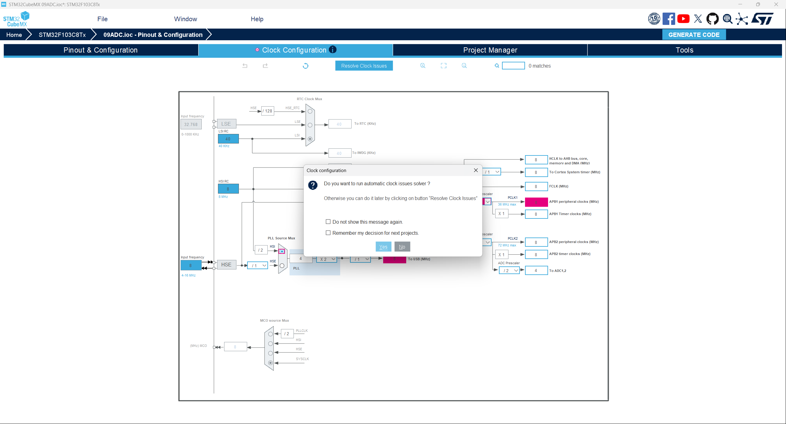

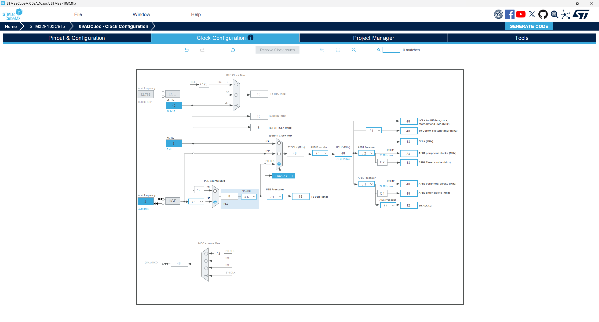

**为什么必须精确配置：**

- USB 全速设备要求**精确的 48 MHz** 时钟。误差超过 ±0.25%（±120 kHz）可能导致设备无法枚举或通信出错。
- ADC 时钟最大允许 14 MHz，12 MHz 在安全范围内，保证了逐次逼近转换的正确性。
- APB2 为 48 MHz，保证了 GPIO 和其他高速外设的运行效率。

### 4.8 配置工程并生成代码

在 **Project Manager** 页面中：

1. **Project Name**：设置为 `09ADC`。
2. **Project Location**：选择合适的保存路径。
3. **Toolchain / IDE**：选择 **CMake**（与课程仓库结构保持一致）。
4. **Stack Size**：0x400；**Heap Size**：0x200。
5. 点击 **GENERATE CODE** 生成工程。

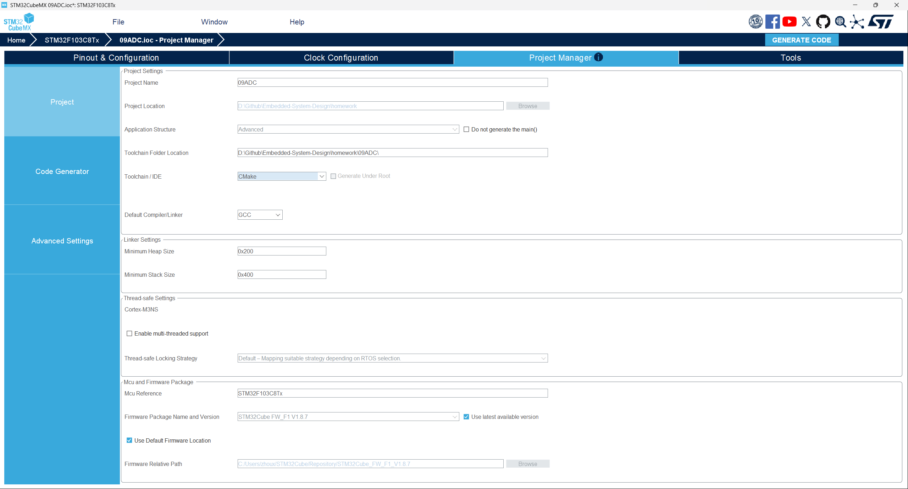

---

## 5. 硬件连接要点

1. USB_DP（PA12）与 USB_DM（PA11）分别连接 USB 连接器的 D+ 与 D-。
2. 对于 STM32F1 系列，确保开发板的 USB D+ 线路上有 1.5kΩ 上拉电阻到 3.3V（这是 USB 全速设备枚举的硬件要求）。
3. USB 线必须是数据线（内部有四根线：VCC、GND、D+、D-），不能只用供电线，否则电脑无法识别。
4. 温度传感器在芯片内部，**无需任何外部接线**。

---

## 6. 核心代码说明

这一部分把本次实验中真正修改过的源码放到文档中，并逐段解释其含义。

### 6.1 main.c 中新增的头文件

```c
/* Private includes ----------------------------------------------------------*/
/* USER CODE BEGIN Includes */
#include <stdio.h>
#include "usbd_cdc_if.h"
/* USER CODE END Includes */
```

代码解析：

1. `stdio.h`：提供 `snprintf` 函数，用于将温度数值格式化到字符串缓冲区。
2. `usbd_cdc_if.h`：声明 `CDC_Transmit_FS()` 函数，用于通过 USB 虚拟串口向电脑发送数据。

### 6.2 main.c 中的初始化阶段代码

```c
/* USER CODE BEGIN 2 */
/* USB 枚举需要时间，上电后等待片刻 */
HAL_Delay(800);

CDC_Transmit_FS((uint8_t *)"\r\n--- ADC Temp Demo ---\r\n\r\n", 27);
/* USER CODE END 2 */
```

代码解析：

1. USB 初始化完成后延时 800ms，等待电脑端完成 USB 枚举和驱动加载。
2. 发送一条启动信息，方便确认系统已正常启动且 VCP 通信正常。
3. 如果设备刚初始化完成就立即发送数据，电脑端可能尚未完成枚举，导致首条信息发送失败。

### 6.3 main.c 中的主循环核心代码

```c
while (1)
{
    /* USER CODE BEGIN 3 */
    uint32_t adc_ts = 0, adc_vref = 0;

    /* ---- ① 采集温度传感器通道 ---- */
    HAL_ADC_Start(&hadc1);
    if (HAL_ADC_PollForConversion(&hadc1, 100) == HAL_OK)
    {
        adc_ts = HAL_ADC_GetValue(&hadc1);
    }
    HAL_ADC_Stop(&hadc1);

    /* ---- ② 切换到 VREFINT 通道再采集 ---- */
    ADC_ChannelConfTypeDef sConfig = {0};
    sConfig.Channel = ADC_CHANNEL_VREFINT;
    sConfig.Rank = ADC_REGULAR_RANK_1;
    sConfig.SamplingTime = ADC_SAMPLETIME_239CYCLES_5;
    HAL_ADC_ConfigChannel(&hadc1, &sConfig);

    HAL_ADC_Start(&hadc1);
    if (HAL_ADC_PollForConversion(&hadc1, 100) == HAL_OK)
    {
        adc_vref = HAL_ADC_GetValue(&hadc1);
    }
    HAL_ADC_Stop(&hadc1);

    /* ---- ③ 切回温度传感器通道，为下一次采集做准备 ---- */
    sConfig.Channel = ADC_CHANNEL_TEMPSENSOR;
    HAL_ADC_ConfigChannel(&hadc1, &sConfig);

    if (adc_ts == 0 || adc_vref == 0)
    {
        HAL_Delay(1000);
        continue;
    }

    /* ---- ④ 未校正：直接假设 VDDA = 3.3V ---- */
    int v_ts_raw_mv = (int)(adc_ts * 3300 / 4096);
    int temp_raw_x10 = ((1430 - v_ts_raw_mv) * 100) / 43 + 250;

    /* ---- ⑤ VREFINT 校正：VREFINT 固定为 1.20V（数据手册典型值）---- */
    /* 反推实际 VDDA = 1.20V × 4096 / adc_vref（单位：mV） */
    int vdda_mv = 1200 * 4096 / (int)adc_vref;

    /* 校正后的温度传感器电压（mV） */
    int v_ts_cal_mv = (int)((uint32_t)adc_ts * vdda_mv / 4096);

    /* 校正后的温度 */
    int temp_cal_x10 = ((1430 - v_ts_cal_mv) * 100) / 43 + 250;

    /* ---- ⑥ 格式化并发送 ---- */
    char msg[128];
    int len = snprintf(msg, sizeof(msg),
                       "TS=%lu VREF=%lu VDDA=%d.%03dV | "
                       "Uncal: V=%d.%03dV T=%d.%dC | "
                       "Cal:   V=%d.%03dV T=%d.%dC\r\n",
                       adc_ts, adc_vref,
                       vdda_mv / 1000, vdda_mv % 1000,
                       v_ts_raw_mv / 1000, v_ts_raw_mv % 1000,
                       temp_raw_x10 / 10, (temp_raw_x10 < 0 ? -temp_raw_x10 : temp_raw_x10) % 10,
                       v_ts_cal_mv / 1000, v_ts_cal_mv % 1000,
                       temp_cal_x10 / 10, (temp_cal_x10 < 0 ? -temp_cal_x10 : temp_cal_x10) % 10);
    CDC_Transmit_FS((uint8_t *)msg, len);

    HAL_Delay(1000);
    /* USER CODE END 3 */
}
```

**流程说明：**

| 步骤 | 函数/操作 | 说明 |
|------|-----------|------|
| ① | 采集温度传感器 | CubeMX 初始化为 TEMPSENSOR 通道，直接 Start → Poll → Get → Stop |
| ② | 切换采集 VREFINT | 运行时调用 `HAL_ADC_ConfigChannel` 动态切换到 VREFINT 通道，再重复采集流程 |
| ③ | 切回温度传感器 | 为下一轮循环恢复温度传感器通道配置 |
| ④ | 未校正计算 | 假设 VDDA = 3.3V，直接用 V = ADC × 3300 / 4096 计算电压和温度 |
| ⑤ | VREFINT 校正计算 | 用 VREFINT = 1.20V 反推实际 VDDA，重新计算校正后的电压和温度 |
| ⑥ | `CDC_Transmit_FS()` | 将所有数据格式化后通过 USB CDC 发送到 PC |

### 6.4 温度计算原理详解

#### 6.4.1 浮点公式

STM32F103 数据手册中给出温度传感器公式：

$$Temp(°C) = \frac{V_{25} - V_{sense}}{Avg\_Slope} + 25$$

代入典型值 V25 = 1.43V, Avg_Slope = 4.3 mV/°C：

$$Temp = \frac{1.43 - V_{sense}}{0.0043} + 25$$

#### 6.4.2 整型优化

直接使用浮点运算有两个问题：
1. STM32F103 没有硬件 FPU，浮点运算由软件模拟，速度较慢。
2. 本工程使用 `--specs=nano.specs`（newlib-nano），默认**不支持 `%f` 浮点格式化**。如需支持需添加 `-u _printf_float` 链接选项，会显著增加代码体积。

因此本实验采用**整型运算**，所有计算在 mV 量纲下完成：

```
voltage_mv = ADC值 × 3300 / 4096                    （电压，mV）
temp_times_10 = ((1430 - voltage_mv) × 100) / 43 + 250   （温度 × 10）
```

推导过程：

$$Temp \times 10 = \frac{(1430 - V_{sense\_mV}) \times 10}{4.3} + 250 = \frac{(1430 - V_{sense\_mV}) \times 100}{43} + 250$$

最终温度输出时：
- 整数部分 = `temp_times_10 / 10`
- 小数部分 = `|temp_times_10| % 10`

#### 6.4.3 计算示例

假设 ADC 原始值 = 1631：

1. 电压：1631 × 3300 / 4096 = 1314 mV = 1.314 V
2. 温度 × 10：((1430 - 1314) × 100) / 43 + 250 = 11600 / 43 + 250 = 269 + 250 = 519
3. 显示温度：51.9°C

### 6.5 CDC_Transmit_FS 发送函数

`CDC_Transmit_FS()` 定义在 `usbd_cdc_if.c` 中，由 STM32CubeMX 自动生成：

```c
uint8_t CDC_Transmit_FS(uint8_t* Buf, uint16_t Len)
{
    uint8_t result = USBD_OK;
    USBD_CDC_HandleTypeDef *hcdc = (USBD_CDC_HandleTypeDef*)hUsbDeviceFS.pClassData;
    if (hcdc->TxState != 0){
        return USBD_BUSY;  // 上次发送未完成，返回忙
    }
    USBD_CDC_SetTxBuffer(&hUsbDeviceFS, Buf, Len);
    result = USBD_CDC_TransmitPacket(&hUsbDeviceFS);
    return result;
}
```

注意要点：
- 函数会先检查发送状态，若上次发送未完成则返回 `USBD_BUSY`。
- 本实验每秒只发送一次短数据（约 40 字节），基本不会遇到忙状态。
- 如果需要连续高频发送，应像作业 4（USB CDC 实验）那样进行忙状态重试处理。

### 6.6 ADC1 初始化代码（由 STM32CubeMX 生成）

```c
static void MX_ADC1_Init(void)
{
    ADC_ChannelConfTypeDef sConfig = {0};

    hadc1.Instance = ADC1;
    hadc1.Init.ScanConvMode = ADC_SCAN_DISABLE;        // 单通道，不扫描
    hadc1.Init.ContinuousConvMode = DISABLE;           // 单次转换模式
    hadc1.Init.DiscontinuousConvMode = DISABLE;
    hadc1.Init.ExternalTrigConv = ADC_SOFTWARE_START;  // 软件触发
    hadc1.Init.DataAlign = ADC_DATAALIGN_RIGHT;        // 数据右对齐
    hadc1.Init.NbrOfConversion = 1;                    // 每次转换 1 个通道
    HAL_ADC_Init(&hadc1);

    sConfig.Channel = ADC_CHANNEL_TEMPSENSOR;          // 内部温度传感器通道
    sConfig.Rank = ADC_REGULAR_RANK_1;                 // 规则组排名第 1
    sConfig.SamplingTime = ADC_SAMPLETIME_239CYCLES_5; // 采样时间 239.5 周期
    HAL_ADC_ConfigChannel(&hadc1, &sConfig);
}
```

关键参数说明：

- `ADC_CHANNEL_TEMPSENSOR`：STM32 内部温度传感器通道（通道 16），**无需外部引脚**。
- `ADC_SOFTWARE_START`：由软件调用 `HAL_ADC_Start()` 触发转换，无需外部触发源。
- `ADC_DATAALIGN_RIGHT`：数据右对齐，12 位转换结果放在数据寄存器的低 12 位（bit 0-11）。
- `ADC_SAMPLETIME_239CYCLES_5`：采样周期 239.5 个 ADC 时钟周期，保证温度传感器信号充分建立。
- CubeMX 初始化时只配置了温度传感器通道，**VREFINT 通道（ADC_CHANNEL_VREFINT，通道 17）在代码运行时通过 `HAL_ADC_ConfigChannel` 动态切换**，无需修改 CubeMX 生成的初始化代码。

### 6.7 系统时钟配置代码（由 STM32CubeMX 生成）

```c
static void SystemClock_Config(void)
{
    // HSE 8MHz → PLL ×6 → SYSCLK 48MHz
    RCC_OscInitStruct.PLL.PLLMUL = RCC_PLL_MUL6;

    // APB1 ÷2 = 24MHz, APB2 ÷1 = 48MHz
    RCC_ClkInitStruct.APB1CLKDivider = RCC_HCLK_DIV2;
    RCC_ClkInitStruct.APB2CLKDivider = RCC_HCLK_DIV1;

    // ADC 时钟 = APB2 / 4 = 12 MHz
    // USB 时钟来源 = PLL = 48 MHz
    PeriphClkInit.PeriphClockSelection = RCC_PERIPHCLK_ADC | RCC_PERIPHCLK_USB;
    PeriphClkInit.AdcClockSelection = RCC_ADCPCLK2_DIV4;
    PeriphClkInit.UsbClockSelection = RCC_USBCLKSOURCE_PLL;
}
```

### 6.8 代码结构的整体工作流程

本实验代码可以概括为以下步骤：

1. 系统启动后初始化 HAL 库、系统时钟（48 MHz）。
2. 初始化 GPIO、ADC1（温度传感器通道）、USB CDC 虚拟串口。
3. 等待 800ms 让 USB 完成枚举，发送启动提示信息。
4. 进入主循环，每轮执行：
   - 采集温度传感器通道 → Start → Poll → Get → Stop
   - 动态切换到 VREFINT 通道 → ConfigChannel → Start → Poll → Get → Stop
   - 切回温度传感器通道，为下一轮做准备
   - 计算未校正温度（VDDA = 3.3V 假设）
   - 用 VREFINT = 1.20V 反推实际 VDDA，计算校正后温度
   - 格式化所有数据并发送
   - 延时 1000 ms

这就是一个典型的"双通道分时采集 → 校正计算 → 数据上传"的嵌入式数据采集与校正系统结构。

**为什么要动态切换通道而非使用扫描模式：**

本实验选择在代码中用 `HAL_ADC_ConfigChannel` 运行时重配置通道，而不是在 CubeMX 中配置扫描模式（ScanConvMode = ENABLE, NbrOfConversion = 2），原因是：

1. CubeMX 重新生成代码不会覆盖主循环中动态切换通道的逻辑。
2. 分时采集两个通道避免了扫描模式下连续转换两次后需要区分哪个值对应哪个通道的问题。
3. 对于 1 Hz 的低频采集，两次分时采集之间的微小时间差完全可以忽略。

---

## 7. 编程技巧总结

1. **使用整型运算替代浮点运算**：在无 FPU 的 Cortex-M3 上避免浮点计算，同时规避 newlib-nano 下浮点 printf 不支持的问题。
2. **ADC 单次转换 + 软件触发**：对于每秒一次的低频采集，比连续转换模式更节能，且代码逻辑更清晰。
3. **先 Start → 等待完成 → 读取 → Stop**：这是 HAL 轮询方式的标准 ADC 操作流程，顺序不能颠倒。
4. **运行时动态切换 ADC 通道**：使用 `HAL_ADC_ConfigChannel` 在运行中切换 ADC 通道，比 CubeMX 中配置扫描模式更灵活，且不依赖 CubeMX 代码生成。
5. **VREFINT 校正无需读取 Flash 校准值**：直接使用数据手册中 VREFINT = 1.20V 的典型值即可完成校正，不依赖芯片是否烧录了出厂校准数据。
6. **所有用户代码放在 `USER CODE` 块内**：确保 STM32CubeMX 重新生成代码时不会覆盖自定义逻辑。
7. **USB 上电后需要等待枚举**：如果代码中需要在启动阶段发送数据，应在 USB 初始化后加数百毫秒延时。
8. **温度传感器测量的是结温而非环境温度**：实验报告中不应将测量值等同于室温，应说明芯片自发热的影响。

---

## 8. 实验操作步骤

### 8.1 编译工程

使用你当前的开发环境（STM32CubeIDE / VS Code / CLion）编译工程，确认无编译错误。

### 8.2 烧录程序

通过 ST-Link 将编译生成的 `.elf` 或 `.bin` 文件下载到 STM32 开发板。

### 8.3 连接电脑

使用 USB 数据线将开发板的 **USB 口**（PA11/PA12 对应的接口）连接到电脑，等待系统识别虚拟串口。

### 8.4 查看 COM 口

1. 打开**设备管理器**。
2. 展开**端口（COM 和 LPT）**。
3. 确认出现新设备（如 `STMicroelectronics Virtual COM Port (COMx)`），并记录 COM 口编号。

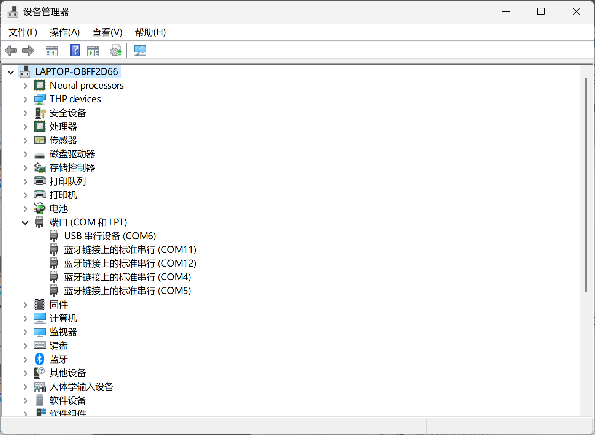

### 8.5 打开串口调试助手

在串口调试助手中：

1. 选择对应 COM 口。
2. 波特率、数据位等参数可保持默认（USB CDC 无视这些设置，但建议统一使用 115200 8N1）。
3. 打开串口。

### 8.6 观察温度输出

打开串口后，每 1 秒应收到一条温度数据，格式如下：

```text
TS=1634 VREF=1429 VDDA=3.439V | Uncal: V=1.316V T=51.5C | Cal: V=1.372V T=38.5C
```

其中：
- `TS` / `VREF`：温度传感器和 VREFINT 的 ADC 原始值
- `VDDA`：根据 VREFINT = 1.20V 反推的实际 VDDA
- `Uncal`：未校正（假设 VDDA = 3.3V）的电压和温度
- `Cal`：用实际 VDDA 校正后的电压和温度

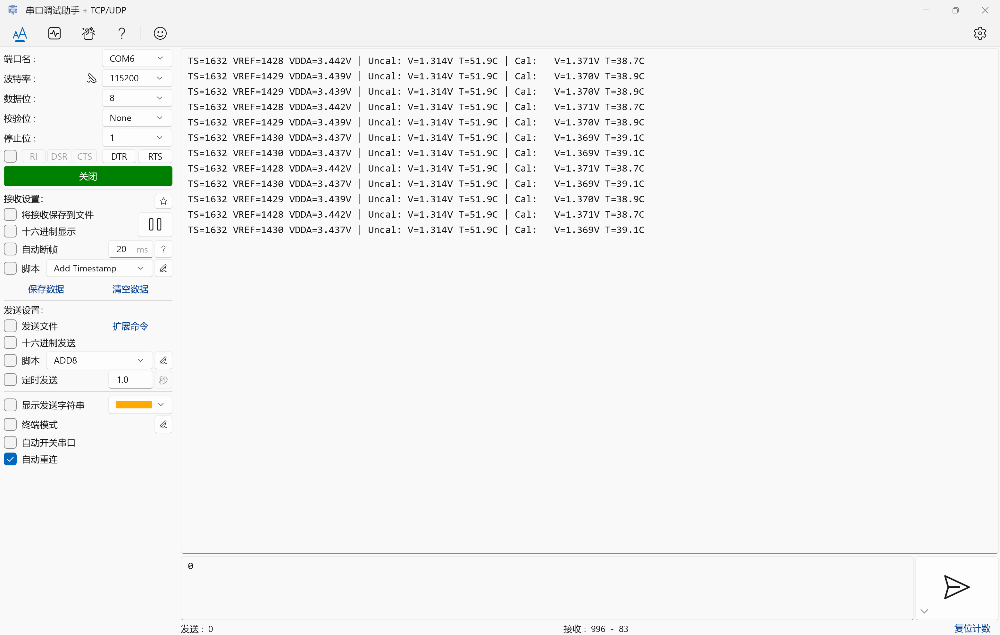

### 8.7 记录实验结果

建议在实验报告中保留以下截图：

1. CubeMX 配置截图（ADC1 双通道、时钟树、USB CDC 各至少 1 张）。
2. 设备管理器中虚拟串口截图 1 张。
3. 串口调试助手中连续多行的完整温度输出截图 1 张（含 TS、VREF、VDDA、校正/未校正温度）。

---

## 9. 实验现象与结果分析

如果实验成功，你应看到如下现象：

1. 电脑成功识别到 STM32 虚拟串口设备。
2. 打开串口调试助手后，显示启动提示 `--- ADC Temp Demo ---`。
3. 每秒收到一条包含 TS、VREF、VDDA、校正/未校正温度的完整数据。
4. TS 值在 1630~1650 左右，VREF 值在 1420~1440 左右（以实际为准）。
5. 未校正温度约 45°C~55°C，校正后温度约 35°C~45°C（校正后约低 8~13°C）。

**校正前后的数据对比分析（实测数据示例）：**

| 参数 | 未校正 (VDDA=3.3V) | 校正后 (VDDA≈3.44V) |
|------|---------------------|----------------------|
| VDDA | 3.300 V（固定假设） | 3.439 V（VREFINT 反推） |
| 温度传感器电压 | 1634 × 3.3 / 4096 = 1.316 V | 1634 × 3.439 / 4096 = 1.372 V |
| 计算温度 | (1.43-1.316)/0.0043+25 = **51.5°C** | (1.43-1.372)/0.0043+25 = **38.5°C** |

**结论分析：**

1. **VREFINT 校正有效**：实际 VDDA（3.44V）明显高于标称值 3.3V，说明开发板的 3.3V 供电偏高。修正后温度下降约 13°C，说明了 VREFINT 校正的重要性。
2. **USB 枚举成功**：CDC 虚拟串口驱动正常，48 MHz 时钟配置正确。
3. **双通道 ADC 采集正常**：温度传感器和 VREFINT 通道读数均稳定，采样时间充足。
4. **温度计算正确**：整型运算公式无误，数值在合理范围内。
5. **芯片自发热现象**：即使校正后温度（38.5°C）仍可能高于室温，因为 STM32F103 在 48 MHz 全速运行且 USB 外设工作时有约 10~20°C 的自发热。

**关于精度的讨论：**

STM32F103 内置温度传感器主要用于芯片过热保护（如检测芯片是否超过 125°C 阈值），而非精确的环境温度测量。其典型绝对精度约为 ±10°C，主要原因有：

1. V25 参数存在 ±90 mV 的制造偏差（对应约 ±21°C 的初始测量误差）。
2. Avg_Slope 参数存在 ±0.3 mV/°C 的偏差。
3. 芯片自发热与工作频率、外设使用情况、PCB 散热设计密切相关。
4. VREFINT 本身的误差（典型值 1.20V，范围 1.16V~1.24V）也会影响校正精度。

VREFINT 校正能消除 VDDA 偏差引入的误差，但无法消除温度传感器 V25 和 Avg_Slope 本身的制造偏差。如需更高精度的测温，应结合出厂校准值（TS_CAL1）或使用外部温度传感器。

---

## 10. 常见问题排查

| 问题 | 可能原因与解决方案 |
| :--- | :--- |
| 串口助手中没有输出 | 检查 USB 时钟是否为 48MHz；确认 ADC 转换是否成功（可在调试器中打断点查看）；检查 `CDC_Transmit_FS` 返回值。 |
| 温度显示为乱码或空值 | 确认 `snprintf` 格式化字符串正确；检查栈大小是否足够（建议 0x400 以上）。 |
| 温度值明显异常（如 >100°C 或 <0°C） | 检查 ADC 参考电压是否正确（应为 3.3V）；确认 V25 和 Avg_Slope 参数在代码中是否正确使用；检查整型计算公式有无溢出。 |
| VREFINT 校正后温度反而不合理 | 检查 `VDDA = 1200 × 4096 / VREF` 的计算是否正确；确认 VREFINT ADC 值是否正常（通常 1400~1500 左右）；检查 `HAL_ADC_ConfigChannel` 是否成功切换通道。 |
| ADC 值读数不稳定、跳动大 | 增加采样时间（如从 239.5 改为 71.5 试下看是否更差）；检查电源是否干净；可采用多次采样取平均值的滤波方法。 |
| 电脑无法识别设备 | 检查 USB 时钟是否为 48MHz；检查 USB 线是否为数据线；确认开发板 D+ 上拉电阻正常。 |
| 串口助手打开后无数据显示 | 确认电脑已识别 COM 口；检查串口助手 COM 号是否正确；尝试按一下开发板复位按钮。 |

---

## 11. 课后思考题

请结合本次实验，在报告中认真回答以下问题：

1. **说明 VREFINT（内部参考电压）通道的作用，以及它如何用于校正 ADC 测量结果。**（提示：从 VDDA 波动和 ADC 量化的角度分析。）
2. **为什么 ADC 采样时间设置较长（如 239.5 Cycles）对温度传感器和 VREFINT 采集很重要？**（提示：从内部模拟信号源的输出阻抗和 ADC 采样保持电容的角度分析。）
3. **STM32 内置温度传感器的 V25 和 Avg_Slope 参数有什么意义？为什么即使经过 VREFINT 校正，温度测量值仍可能与真实结温有偏差？**（提示：从制造工艺偏差和芯片自发热两个角度分析。）
4. **本实验使用 `HAL_ADC_ConfigChannel` 动态切换通道来分时采集两个 ADC 通道，与在 CubeMX 中配置扫描模式（ScanConvMode = ENABLE）一次性采集两个通道相比，各有什么优缺点？**

---

## 12. 实验报告提交要求

### 12.1 报告建议结构

1. **封面**：课程名称、作业名称、姓名、学号、班级、日期。
2. **作业目标**：简述本实验需要实现的 ADC 采集与 VCP 传输功能。
3. **实验原理**：简述内置温度传感器原理、ADC 量化公式、温度计算公式。
4. **实验环境**：开发板型号、USB 连接方式、调试器、软件版本、上位机工具。
5. **CubeMX 配置**：必须说明 SYS、RCC、ADC1、USB、USB_DEVICE、Clock Configuration 的关键设置及其原因。
6. **程序设计**：至少分析 `main.c` 中的主循环逻辑（含每个步骤的说明）、ADC 初始化代码和温度计算原理。
7. **程序流程图**：必须展示"ADC 启动 → 等待转换 → 读取数据 → 电压转换 → 温度计算 → 格式化 → VCP 发送 → 延时 1s"的完整流程。
8. **实验步骤**：包括编译、下载、连接电脑、识别 COM 口、串口助手观察数据等过程。
9. **实验结果**：必须展示设备管理器识别结果和串口调试助手温度输出结果。对温度数据进行分析（是否合理、误差来源等）。
10. **问题分析与调试记录**：说明遇到的任何问题及排查方法。
11. **课后思考题答案**：必须完整回答本 README 中 4 个思考题。
12. **总结**：概括你对 STM32 ADC、内置温度传感器和 USB CDC 数据采集系统的理解。

### 12.2 图片与流程图要求

1. 报告中至少包含 4 类图片：CubeMX 配置截图、时钟树截图、设备管理器截图、串口调试助手输出截图。
2. 每张图片必须标注图号和图题（如"图 1 ADC1 温度传感器通道配置"），并在正文中引用说明。
3. 程序流程图必须单独成图，不能只用文字描述替代。

### 12.3 提交规范

1. 报告文件建议命名为：`学号-姓名-作业9-ADC温度传感器实验.pdf`。
2. 若实验未完全成功，也必须提交完整报告，重点说明失败现象、原因分析和改进方向。
3. 报告中不能只贴代码或截图，必须结合实验现象进行解释和分析。

### 12.4 最低验收标准

1. 电脑能够识别出虚拟串口设备。
2. 串口调试助手能每 1 秒收到一条完整数据，包含 TS、VREF、VDDA、校正温度、未校正温度。
3. 输出格式为 `TS=<值> VREF=<值> VDDA=<电压>V | Uncal: V=... Cal: V=...`。
4. 温度计算值在合理范围内（校正后约 35°C ~ 50°C），且校正后温度与未校正温度有明显差异。
5. 报告能够解释 VREFINT 校正原理和 ADC 采集流程。

---

## 13. 可进一步扩展的方向

1. **多点校准**：用外部精确温度计在两点（如 0°C 冰水混合物和 25°C 室温）标定实际 V25 和 Avg_Slope，结合 VREFINT 校正后精度可显著提高。
2. **多次采样取平均**：连续采集 8~16 次 VREFINT 和 TS 取平均值，降低随机噪声影响。
3. **添加中断/DMA 模式**：将 ADC 改为定时器触发 + DMA 传输配合扫描模式，实现后台自动采集双通道。
4. **结合作业 4 的命令交互**：添加 `temp`、`vdda`、`vref` 等命令，在收到命令时才返回数据，而非定时发送。
5. **添加 OLED/LCD 显示**：将校正后的温度数据同时显示在本地屏幕上。
6. **过温报警**：当校正后温度超过阈值时，点亮 LED 或发出蜂鸣器告警（模拟芯片过热保护功能）。

---

## 14. 总结

本实验不是简单的"读一个 ADC 值、发一个字符串"，而是要你掌握从 CubeMX 配置（ADC 双通道 + 采样时间 + 时钟树）、到 HAL 库编程（运行时通道切换 + 轮询采集流程）、到数据处理（物理量转换、VREFINT 校正、整型运算优化）和上位机验证的完整嵌入式开发流程。

实验的核心价值在于让你理解 VREFINT 校正的实际意义——电源电压的微小偏差会导致 ADC 测量结果出现显著误差，而利用芯片内置的 1.20V 参考电压可以低成本地提升测量精度。这种"利用已知基准反推实际工作条件"的思想，不仅适用于 ADC，也是嵌入式系统中传感器校准的通用方法之一。同时，通过对温度传感器精度和自发热的分析，加深对"数据手册参数 vs 实际测量值"之间差异的理解——这是嵌入式工程师在实际项目中最重要的工程判断力之一。

---

## 参考

- STM32F103x8/xB Datasheet（第 5.3.22 节：Temperature sensor characteristics）
- RM0008 Reference Manual（第 11 章：Analog-to-digital converter）
- STM32CubeMX User Manual (UM1718)
- 本课程作业 4（USB CDC 虚拟串口实验）相关代码和说明
