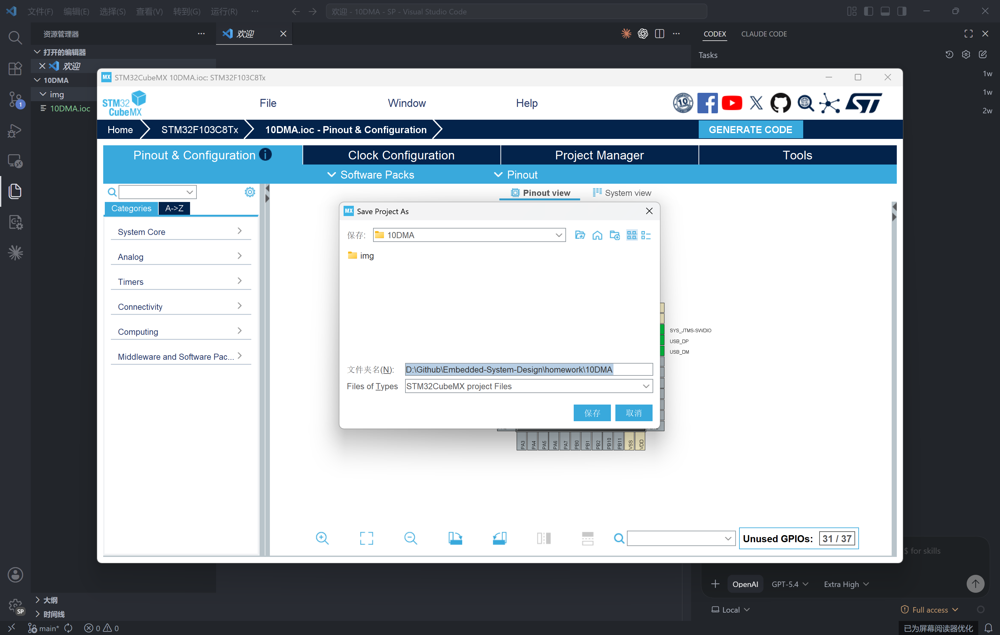
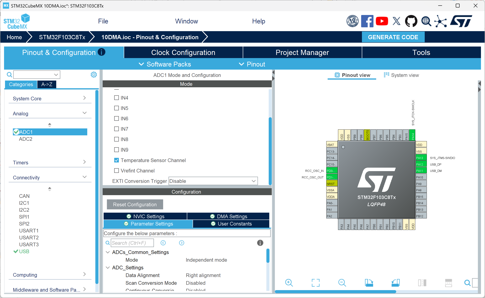
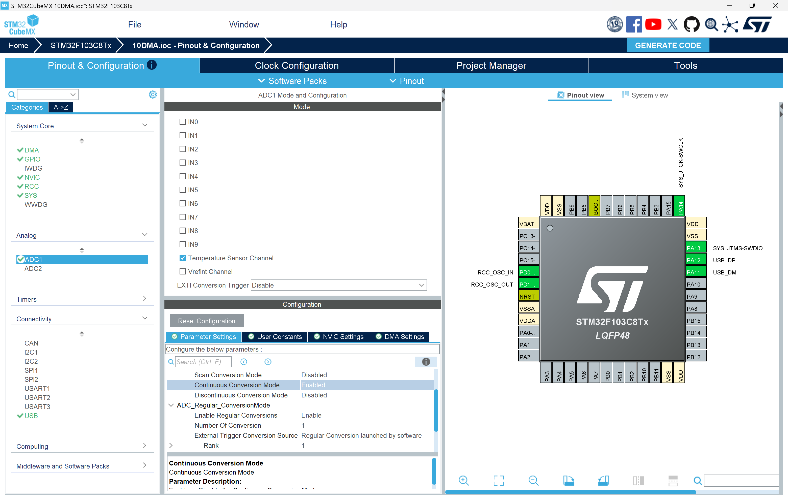
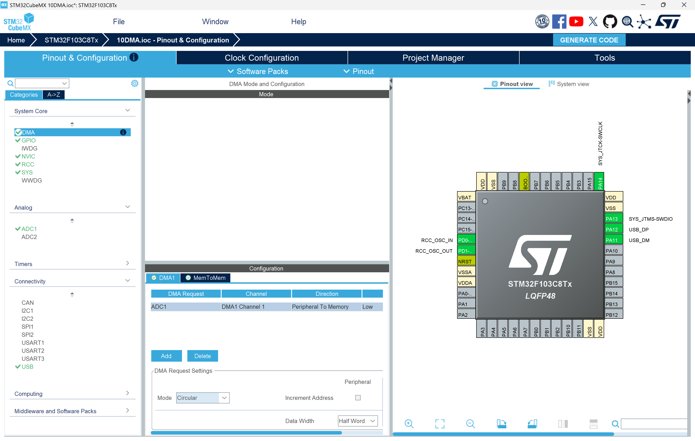
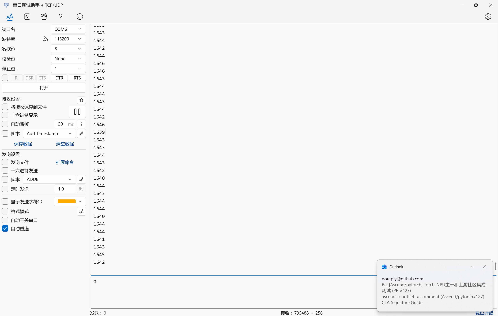
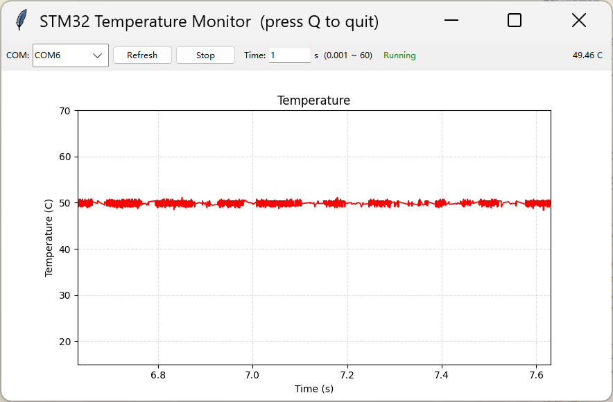

# STM32 ADC 温度传感器 DMA 采集与虚拟串口高速传输实验

## 统一作业说明

### 学生需要完成的核心任务

1. 使用 STM32CubeMX 完成 ADC1（内置温度传感器通道）、DMA（循环模式）、USB CDC、时钟树、调试接口等配置，并保留 `.ioc` 文件。
2. 基于 HAL 库实现 ADC + DMA 连续采集温度传感器数据，通过 DMA 传输完成回调自动获取每次转换结果。
3. 通过 USB CDC 虚拟串口将 ADC 原始值发送到电脑端。
4. 用 Python 编写客户端程序，实时解析 ADC 数据、计算温度并绘制温度曲线。
5. 成功编译、下载并在 Python 客户端中验证温度波形和实时更新。
6. 在实验报告中说明 ADC 连续转换模式、DMA 循环模式、`HAL_ADC_ConvCpltCallback` 回调机制、newlib-nano 浮点格式化限制、Python 客户端设计。
7. 按 [00Template/README.md](../00Template/README.md) 中提供的 LaTeX 模板撰写中文实验报告并提交 PDF。

### 本次作业验收目标

| 项目 | 要求 |
|------|------|
| 处理器平台 | STM32F103C8T6 或课程指定的带 USB 开发板 |
| 采集方式 | ADC1 连续转换 + DMA1 循环传输，后台自动采集温度传感器（通道 16） |
| 通信方式 | USB CDC 虚拟串口（VCP） |
| 必做功能 | ADC 连续转换 → DMA 搬运 → 回调中通过 VCP 发送原始 ADC 值 |
| 理论要求 | 能解释 DMA 循环模式、ADC 连续转换模式、HAL 回调机制、newlib-nano 浮点限制 |
| 验收方式 | Python 客户端实时显示温度曲线，波形连续无断点 |

### 本次必须提交的内容

1. 一份 PDF 格式实验报告。
2. STM32CubeMX 配置截图（ADC1、DMA、时钟树、USB CDC 等）各至少 1 张。
3. Python 客户端运行截图至少 1 张。
4. 课后思考题的书面回答。

### 报告必须回答的问题

1. 说明 DMA 循环模式（Circular Mode）与普通模式（Normal Mode）的区别，以及为什么本实验需要循环模式。
2. 为什么本实验中 ADC 必须配置为连续转换模式（ContinuousConvMode = ENABLE），若配置为单次转换模式结合 DMA 循环模式会出现什么问题？
3. STM32F103 内置温度传感器在 HAL 初始化后需要手动置位 TSVREFE 位才能工作。为什么 CubeMX 生成的 `MX_ADC1_Init()` 中不自动使能该位？
4. 本实验中 `HAL_ADC_ConvCpltCallback` 回调函数在什么上下文中被调用（中断 or 主循环）？在高频数据采集（约 1000~2000 sps）场景下，回调中直接调用 `CDC_Transmit_FS` 可能存在什么问题？如何优化？

---

## 实验目的

本实验基于 STM32 的 ADC1 配合 DMA 循环模式连续采集芯片内置温度传感器数据，并通过 USB CDC 虚拟串口高速发送到电脑端，使用 Python 客户端实时解析并绘制温度曲线。通过本实验，你应掌握以下内容：

1. 理解 STM32 DMA（直接存储器访问）的工作原理，特别是循环模式与 ADC 配合时的数据传输流程。
2. 理解 ADC 连续转换模式与单次转换模式的区别，以及如何与 DMA 协同工作。
3. 掌握 STM32CubeMX 中 ADC + DMA 的联合配置方法。
4. 学会使用 HAL 库的 DMA 传输完成回调 `HAL_ADC_ConvCpltCallback` 进行数据处理。
5. 理解 newlib-nano 库对浮点格式化的限制及其对嵌入式串口输出的影响。
6. 学会编写 Python 上位机程序，通过 pyserial + matplotlib 实现实时数据采集与可视化。
7. 能够评估 ADC + DMA + USB CDC 系统的数据吞吐能力。

## 实验原理

### STM32F103 内置温度传感器

STM32F103C8T6 芯片内部集成了一个温度传感器，连接到 **ADC1 的通道 16**。该温度传感器的电气特性如下（来自数据手册）：

| 参数 | 符号 | 典型值 | 范围 | 单位 |
|------|------|--------|------|------|
| 25°C 时的输出电压 | V25 | 1.43 | 1.34 ~ 1.52 | V |
| 温度变化斜率 | Avg_Slope | 4.3 | 4.0 ~ 4.6 | mV/°C |
| ADC 采样时间 | — | — | ≥ 17.1 μs | — |

温度计算公式：

$$\text{Temp}(°C) = \frac{V_{25} - V_{sense}}{Avg\_Slope} + 25$$

其中：
- $V_{25}$：25°C 时传感器的输出电压（典型值 1.43V）
- $V_{sense}$：ADC 实测的传感器输出电压
- $Avg\_Slope$：温度每变化 1°C 输出电压的变化量（典型值 4.3 mV/°C）

**注意：** 内部温度传感器测量的是芯片的**结温（Junction Temperature）**。芯片运行时自身会发热（约 10~20°C 的温升），而且 V25 和 Avg_Slope 存在制造偏差，因此测量值可能与室温有显著差异。

### ADC 连续转换模式

STM32F103 的 ADC1 支持两种工作模式：

| 模式 | ContinuousConvMode | 行为 |
|------|---------------------|------|
| 单次转换 | DISABLE | 每次软件触发只进行一次转换，转换完成后 ADC 停止 |
| 连续转换 | ENABLE | 一次转换完成后自动启动下一次转换，无需重新触发 |

本实验选择**连续转换模式**，原因是：DMA 配置为循环模式后会持续等待 ADC 数据，但 ADC 本身如果是单次转换模式，每次软件触发只产生一个数据后就停止，DMA 之后拿不到新数据。只有 ADC 连续转换模式才能不断产生数据流，使 DMA 循环传输形成闭环。

### DMA 循环模式原理

DMA（Direct Memory Access）可以在不占用 CPU 的情况下，将数据从外设（如 ADC 数据寄存器）搬运到内存。STM32F103 的 DMA1 通道 1 专用于 ADC1。

DMA 有两种主要工作模式：

| 模式 | Mode | 行为 |
|------|------|------|
| 普通模式 | DMA_NORMAL | 传输指定数量后停止，需重新配置才能再次启动 |
| 循环模式 | DMA_CIRCULAR | 传输完成后自动重载计数器，从缓冲区首地址重新开始 |

本实验选择**循环模式**，因为：
1. ADC 在连续转换模式下不断产生新数据。
2. DMA 循环模式保证每个 ADC 转换结果都被自动搬运到内存，无需 CPU 干预。
3. 每次 DMA 传输完成都会触发中断，进入 `HAL_ADC_ConvCpltCallback` 回调。

**DMA 通道映射关系（STM32F103）：**

| 外设 | DMA 通道 |
|------|----------|
| ADC1 | DMA1 Channel 1 |
| SPI1_RX | DMA1 Channel 2 |
| USART1_TX | DMA1 Channel 4 |
| ... | ... |

### HAL ADC DMA 回调机制

当使用 `HAL_ADC_Start_DMA()` 启动 ADC 后，HAL 库会自动注册 DMA 传输完成回调。DMA 每搬运完成一次 ADC 数据，中断处理流程如下：

```
DMA1_Channel1_IRQHandler()
  → HAL_DMA_IRQHandler(&hdma_adc1)
    → ADC_DMAConvCplt()      [HAL 内部]
      → HAL_ADC_ConvCpltCallback()   [用户可重写的弱回调]
```

用户只需在 `main.c` 中实现 `void HAL_ADC_ConvCpltCallback(ADC_HandleTypeDef* hadc)`，每次 ADC 转换完成时该函数会自动被调用，且**在中断上下文中执行**。

### USB CDC 虚拟串口原理

USB CDC（Communication Device Class）是 USB 协议中定义的一种设备类，它可以在 USB 总线上模拟传统的串行通信接口。当 STM32 通过 USB 连接电脑后，操作系统会将其识别为一个标准 COM 端口。

与物理 UART 串口不同，USB CDC 的波特率、数据位、停止位等参数不影响实际传输速率——数据始终以 USB 全速（12 Mbps）在底层传输。但对于 pyserial 等库，仍需要指定一个波特率值来打开端口（该值会被忽略）。

### newlib-nano 与浮点格式化限制

嵌入式 GCC 工具链默认使用 `--specs=nano.specs`，即 newlib-nano 标准库。newlib-nano 为了减小代码体积，**默认不支持 `printf`/`sprintf` 系列函数的浮点格式化**（`%f`、`%e`、`%g` 等）。

当代码中执行 `sprintf(buf, "%.1f", temp)` 时，浮点值不会被正确格式化，输出为空或乱码。

解决方案有两种：

| 方案 | 操作 | 代价 |
|------|------|------|
| 添加链接器标志 | `-u _printf_float` | 增大约 12 KB 代码 |
| 使用整型运算 | 在整数域完成所有计算，用 `%d.%d` 拼小数 | 零开销 |

本实验采用**整型运算 + 发送原始 ADC 值**的方案——STM32 端只发送整型原始 ADC 值，温度换算与浮点显示完全放到 Python 客户端进行。这样同时避免了代码体积膨胀和格式化问题。

### 数据吞吐能力估算

ADC 转换一次的时间：

$$T_{conv} = (239.5 + 12.5) / 12\text{MHz} \approx 21 \mu s$$

ADC 理论最大采样率约 **47,000 sps**。

但实际瓶颈在 USB CDC 传输端：
- USB 全速设备每 1ms 一帧，每帧最大 64 字节（CDC bulk 端点）。
- 每个样本约 6 字节（如 `1732\r\n`），每帧约可传 10 个样本。
- USB CDC 理论上限约 **10,000 sps**。

实测稳定速率约 **1,000 ~ 2,000 sps**，受 HAL 回调开销、USB 主机调度等因素影响。

---

## 实验环境

### 硬件环境

1. 一块带 USB 接口的 STM32F103C8T6 开发板。
2. 一根可正常传输数据的 USB 数据线。
3. ST-Link 下载器或板载调试器。

### 软件环境

1. STM32CubeMX（v6.17.0 或更高版本）。
2. VS Code / STM32CubeIDE 或其他支持 CMake 的 STM32 开发环境。
3. ARM GCC / CMake 工具链。
4. Python 3.x + pyserial + matplotlib（用于客户端可视化）。
5. ST-Link 驱动。

### Python 环境配置

```bash
pip install pyserial matplotlib
```

---

## STM32CubeMX 配置步骤

### 从作业 9 工程另存为新工程

本实验在作业 9 的基础上修改，无需从头新建。

1. 打开 STM32CubeMX，点击 **File → Load Project**，选择作业 9 的 `09ADC.ioc` 工程文件。
2. 点击 **File → Save As**，将工程另存为 `10DMA.ioc`（存放在 `10DMA` 文件夹中）。
3. 后续配置步骤在此基础上进行修改。

{ width=72% }

### 检查调试接口（SYS）

在 Pinout & Configuration 页面中，打开 **SYS**，确认 **Debug** 已设置为 **Serial Wire**（从 09ADC 继承，无需重新配置）。

### 检查高速外部时钟（RCC）

打开 **RCC** 配置项，确认 **High Speed Clock (HSE)** 已设置为 **Crystal/Ceramic Resonator**（外部 8 MHz 晶振），从 09ADC 继承。

### 配置 ADC1（温度传感器通道）

在 **Analog** → **ADC1** 中：

1. 勾选 **IN0** 区域的 **Temperature Sensor Channel**，使能内部温度传感器通道（ADC 通道 16）。
2. **Mode** 保持为 **Independent mode**（独立模式）。



ADC 参数配置说明：

| 参数 | 设置值 | 说明 |
|------|--------|------|
| ScanConvMode | DISABLE | 仅采集 1 个通道，无需扫描 |
| **ContinuousConvMode** | **ENABLE** | **关键配置：连续转换，持续输出数据流给 DMA** |
| DiscontinuousConvMode | DISABLE | — |
| ExternalTrigConv | ADC_SOFTWARE_START | 由 `HAL_ADC_Start_DMA()` 软件触发 |
| DataAlign | ADC_DATAALIGN_RIGHT | 数据右对齐，12 位结果在低 12 位 |
| NbrOfConversion | 1 | 每次转换 1 个通道 |

{ width=72% }

#### 配置 ADC 采样时间

采样时间选择 **239.5 Cycles**（`ADC_SAMPLETIME_239CYCLES_5`）。

**为什么需要较长的采样时间：**

ADC 内部有一个采样保持电容，在采样阶段需要对该电容充电。温度传感器是内部模拟信号源，其输出阻抗较高。如果采样时间太短，采样电容上的电压不足以达到与信号源相同的电平，导致 ADC 读数偏低且不稳定。数据手册要求温度传感器的采样时间至少为 17.1 μs。

在 12 MHz ADC 时钟下：
- 总转换时间 = (239.5 + 12.5) / 12 MHz ≈ 21 μs
- 21 μs > 17.1 μs，满足数据手册要求

### 配置 DMA（ADC1 数据传输）

这是本实验区别于作业 9 的核心配置。在 **System Core** → **DMA** 中：

1. 点击 **Add**，选择 **ADC1**。
2. DMA Request 选项卡中配置：

| 参数 | 设置值 | 说明 |
|------|--------|------|
| Channel | DMA1 Channel 1 | ADC1 专用 DMA 通道 |
| Direction | Peripheral To Memory | 从 ADC 数据寄存器搬运到内存 |
| Mode | **Circular** | **循环模式，持续搬运，本实验核心** |
| Priority | Low | ADC 采集优先级无需最高 |
| Peripheral (Data Width) | Half Word (16-bit) | ADC 为 12 位，16-bit 对齐 |
| Memory (Data Width) | Half Word (16-bit) | 与 ADC 数据宽度一致 |
| Peripheral (Increment) | Disable | 外设地址固定（ADC_DR 寄存器） |
| Memory (Increment) | Enable | 内存地址自增（写满缓冲区） |

3. NVIC Settings 选项卡中，确认 **DMA1 Channel 1 global interrupt** 已使能（勾选 Enabled）。



**DMA 配置原理说明：**

- **Direction = Peripheral To Memory**：DMA 从 ADC 的数据寄存器（ADC_DR）读取数据，写入内存变量。
- **Mode = Circular**：每次传输完成后，DMA 的存储器地址指针自动重置到缓冲区首地址。由于本实验只传 1 个半字（缓冲区大小 = 1），每次 ADC 转换完成后 DMA 都将新数据覆盖写入同一个变量 `adc_value`。
- **Peripheral Increment = Disable**：外设地址是 ADC_DR 寄存器，固定不变。
- **Memory Increment = Enable**：当缓冲区大小 > 1 时，DMA 会依次填充数组元素。
- **Data Width = Half Word**：ADC 转换结果为 12 位，用 16 位存储刚好。

### 启用 USB 外设并配置 CDC 中间件

在左侧 **Connectivity** 菜单下找到 **USB**，将其配置为 **Device (FS)**。

在 **Middleware and Software Packs** 中打开 **USB_DEVICE**，将 **Class for FS IP** 设置为 **Communication Device Class (Virtual Port Com)**。

这一步的意义在于：
1. 告诉 CubeMX 当前 USB 设备工作在 CDC 类（通信设备类）。
2. 自动生成 USB 虚拟串口所需的设备描述符、接口文件和 CDC 中间件代码。
3. 电脑端将识别此设备为标准 COM 端口。

### 配置时钟树

进入 **Clock Configuration** 页面：

1. **HSE**：8 MHz（外部晶振）。
2. **PLL Source**：选择 HSE。
3. **PLL Mul**：设置为 ×6，PLL 输出 = 8 MHz × 6 = 48 MHz。
4. **SYSCLK**：选择 PLLCLK = 48 MHz。
5. **AHB Prescaler**：÷1，HCLK = 48 MHz。
6. **APB1 Prescaler**：÷2，APB1 = 24 MHz（USB 挂载在 APB1 上）。
7. **APB2 Prescaler**：÷1，APB2 = 48 MHz（ADC1 挂载在 APB2 上）。
8. **ADC Prescaler**：÷4，ADC 时钟 = 48 MHz / 4 = 12 MHz。
9. **USB Prescaler**：选择 PLLCLK，USB 时钟 = 48 MHz。

**为什么必须精确配置：**

- USB 全速设备要求**精确的 48 MHz** 时钟。误差超过 ±0.25%（±120 kHz）可能导致设备无法枚举或通信出错。
- ADC 时钟最大允许 14 MHz，12 MHz 在安全范围内。
- APB2 为 48 MHz，保证了 GPIO 和 ADC 外设的运行效率。
- DMA 属于 AHB 总线设备，HCLK = 48 MHz，确保 DMA 传输不成为瓶颈。

### 配置工程并生成代码

在 **Project Manager** 页面中：

1. **Project Name**：设置为 `10DMA`。
2. **Project Location**：选择合适的保存路径。
3. **Toolchain / IDE**：选择 **CMake**。
4. **Stack Size**：0x400；**Heap Size**：0x200。
5. 点击 **GENERATE CODE** 生成工程。

---

## 硬件连接要点

1. USB_DP（PA12）与 USB_DM（PA11）分别连接 USB 连接器的 D+ 与 D-。
2. 确保开发板的 USB D+ 线路上有 1.5kΩ 上拉电阻到 3.3V（USB 全速设备枚举的硬件要求）。
3. USB 线必须是数据线（内部有四根线：VCC、GND、D+、D-），不能只用供电线。
4. 温度传感器在芯片内部，**无需任何外部接线**。
5. SWD 接口（PA13/PA14）保持连接用于下载和调试。

---

## 核心代码说明

### 代码整体结构

```c
// Private variables
uint16_t adc_value;   // DMA 目标缓冲区

// Private user code (回调实现)
void HAL_ADC_ConvCpltCallback(ADC_HandleTypeDef* hadc) {
    if (hadc->Instance == ADC1) {
        char buf[50];
        int len = sprintf(buf, "%u\r\n", adc_value);
        CDC_Transmit_FS((uint8_t*)buf, len);
    }
}

// main() 初始化后
SET_BIT(ADC1->CR2, ADC_CR2_TSVREFE);            // ① 手动使能温度传感器
HAL_ADC_Start_DMA(&hadc1, (uint32_t*)&adc_value, 1);  // ② 启动 ADC + DMA

// while(1) 为空，数据采集和发送全在回调中完成
```

**核心流程：**

```
ADC 连续转换 → DMA 搬运到 adc_value → DMA TC 中断
  → HAL_DMA_IRQHandler → ADC_DMAConvCplt
    → HAL_ADC_ConvCpltCallback → sprintf → CDC_Transmit_FS
```

### main.c 中新增的头文件和变量声明

```c
/* Private includes ----------------------------------------------------------*/
/* USER CODE BEGIN Includes */
#include <stdio.h>
/* USER CODE END Includes */

/* Private variables ---------------------------------------------------------*/
/* USER CODE BEGIN PV */
uint16_t adc_value;
/* USER CODE END PV */

/* Private function prototypes -----------------------------------------------*/
/* USER CODE BEGIN PFP */
void CDC_Transmit_FS(uint8_t* Buf, uint16_t Len);
/* USER CODE END PFP */
```

代码解析：
1. `stdio.h`：提供 `sprintf` 函数，用于将 ADC 值格式化为字符串。
2. `uint16_t adc_value`：DMA 的目标缓冲区。由于 BufferSize = 1 且 DMA 为循环模式，每次 ADC 转换完成后 DMA 都会将新值写入此变量。
3. `CDC_Transmit_FS` 的前向声明：该函数定义在 `usbd_cdc_if.c` 中，需要在 main.c 中引用。

### DMA 传输完成回调函数

```c
/* Private user code ---------------------------------------------------------*/
/* USER CODE BEGIN 0 */
void HAL_ADC_ConvCpltCallback(ADC_HandleTypeDef* hadc)
{
    if (hadc->Instance == ADC1)
    {
        char buf[50];
        int len = sprintf(buf, "%u\r\n", adc_value);
        CDC_Transmit_FS((uint8_t*)buf, len);
    }
}
/* USER CODE END 0 */
```

代码解析：
1. `HAL_ADC_ConvCpltCallback` 是 HAL 库定义的弱回调函数（`__weak`），用户重写后会自动覆盖默认空实现。
2. 该回调在 **DMA 中断上下文**中执行。每次 ADC 转换完成 → DMA 搬运完成 → DMA TC 中断 → HAL 处理 → 回调被调用。
3. `if (hadc->Instance == ADC1)`：在多个 ADC 实例时区分来源，确保只处理 ADC1 的事件。
4. `sprintf(buf, "%u\r\n", adc_value)`：将 ADC 原始值格式化为十进制字符串。使用 `\r\n` 换行，兼容大多数串口工具。
5. `CDC_Transmit_FS((uint8_t*)buf, len)`：通过 USB CDC 发送数据到电脑。

**为什么发送原始 ADC 值而非温度：**
- 单片机端避免浮点运算（Cortex-M3 无 FPU）。
- 避免 newlib-nano 的 `%f` 格式化问题（需 `-u _printf_float` 增大 12KB 代码）。
- 温度换算放在 Python 客户端完成，更灵活（可更换校正算法、做数据平滑等）。
- 原始值只有 0~4095，占用串口带宽更小。

### main() 中的初始化与启动代码

```c
int main(void)
{
    HAL_Init();
    SystemClock_Config();
    /* USER CODE BEGIN SysInit */
    SET_BIT(ADC1->CR2, ADC_CR2_TSVREFE);   // ①
    /* USER CODE END SysInit */

    MX_GPIO_Init();
    MX_DMA_Init();       // ②
    MX_ADC1_Init();      // ③
    MX_USB_DEVICE_Init();

    /* USER CODE BEGIN 2 */
    HAL_ADC_Start_DMA(&hadc1, (uint32_t*)&adc_value, 1);  // ④
    /* USER CODE END 2 */

    while (1) { }  // ⑤ 主循环为空，一切由中断驱动
}
```

**流程说明：**

| 步骤 | 代码 | 说明 |
|------|------|------|
| ① | `SET_BIT(ADC1->CR2, ADC_CR2_TSVREFE)` | **手动使能温度传感器**。CubeMX 不会自动生成此代码，需在初始化 ADC1 之前设置 TSVREFE 位，否则温度传感器不工作。 |
| ② | `MX_DMA_Init()` | 使能 DMA1 时钟，配置 DMA1_Channel1 中断优先级并使能。 |
| ③ | `MX_ADC1_Init()` | 配置 ADC1 为连续转换模式，校准并初始化温度传感器通道。 |
| ④ | `HAL_ADC_Start_DMA()` | **一次性启动** ADC + DMA。参数 `(uint32_t*)&adc_value` 指定 DMA 目标地址，`1` 指定缓冲区大小（1 个半字）。启动后 ADC 和 DMA 自动持续运行，无需再次调用。 |
| ⑤ | `while (1) { }` | 主循环为空——ADC 采集、DMA 传输、数据发送全部在中断回调中完成，CPU 负载极低。 |

**为什么 TSVREFE 需要手动设置：**

STM32F103 参考手册规定，使用内部温度传感器或 VREFINT 前必须置位 ADC_CR2 寄存器的 TSVREFE 位。CubeMX 在代码生成过程中并不会自动添加此位操作——这是 STM32F1 系列 HAL 库的历史遗留设计，ST 没有在 `HAL_ADC_Init()` 中集成此功能。因此必须在代码中手动 `SET_BIT(ADC1->CR2, ADC_CR2_TSVREFE)`，且在 `MX_ADC1_Init()` 之前执行以确保 ADC 校准时传感器已上电稳定。

### ADC1 初始化代码（由 STM32CubeMX 生成）

```c
static void MX_ADC1_Init(void)
{
    ADC_ChannelConfTypeDef sConfig = {0};

    hadc1.Instance = ADC1;
    hadc1.Init.ScanConvMode = ADC_SCAN_DISABLE;        // 单通道，不扫描
    hadc1.Init.ContinuousConvMode = ENABLE;             // ★ 连续转换模式
    hadc1.Init.DiscontinuousConvMode = DISABLE;
    hadc1.Init.ExternalTrigConv = ADC_SOFTWARE_START;   // 软件触发
    hadc1.Init.DataAlign = ADC_DATAALIGN_RIGHT;         // 数据右对齐
    hadc1.Init.NbrOfConversion = 1;                     // 每次转换 1 个通道
    HAL_ADC_Init(&hadc1);

    sConfig.Channel = ADC_CHANNEL_TEMPSENSOR;           // 内部温度传感器通道
    sConfig.Rank = ADC_REGULAR_RANK_1;                  // 规则组排名第 1
    sConfig.SamplingTime = ADC_SAMPLETIME_239CYCLES_5;  // 采样时间 239.5 周期
    HAL_ADC_ConfigChannel(&hadc1, &sConfig);
}
```

关键参数说明：
- `ContinuousConvMode = ENABLE`：**本实验最关键配置**。ADC 在完成一次转换后自动开始下一次转换，持续产生数据流。这是 DMA 循环模式能够持续工作的前提。
- `ADC_SOFTWARE_START`：由 `HAL_ADC_Start_DMA()` 中的软件触发启动首次转换。
- `ADC_SAMPLETIME_239CYCLES_5`：采样周期 239.5 个 ADC 时钟周期（约 20 μs），满足温度传感器 ≥ 17.1 μs 的建立时间要求。

### DMA 初始化代码（由 STM32CubeMX 生成）

```c
static void MX_DMA_Init(void)
{
    __HAL_RCC_DMA1_CLK_ENABLE();

    HAL_NVIC_SetPriority(DMA1_Channel1_IRQn, 0, 0);
    HAL_NVIC_EnableIRQ(DMA1_Channel1_IRQn);
}
```

DMA 的具体传输参数（方向、数据宽度、循环模式等）在 `stm32f1xx_hal_msp.c` 的 `HAL_ADC_MspInit()` 中配置：

```c
void HAL_ADC_MspInit(ADC_HandleTypeDef* hadc)
{
    if(hadc->Instance==ADC1)
    {
        __HAL_RCC_ADC1_CLK_ENABLE();

        hdma_adc1.Instance = DMA1_Channel1;
        hdma_adc1.Init.Direction = DMA_PERIPH_TO_MEMORY;
        hdma_adc1.Init.PeriphInc = DMA_PINC_DISABLE;
        hdma_adc1.Init.MemInc = DMA_MINC_ENABLE;
        hdma_adc1.Init.PeriphDataAlignment = DMA_PDATAALIGN_HALFWORD;
        hdma_adc1.Init.MemDataAlignment = DMA_MDATAALIGN_HALFWORD;
        hdma_adc1.Init.Mode = DMA_CIRCULAR;     // ★ 循环模式
        hdma_adc1.Init.Priority = DMA_PRIORITY_LOW;
        HAL_DMA_Init(&hdma_adc1);

        __HAL_LINKDMA(hadc, DMA_Handle, hdma_adc1);  // 关联 DMA 句柄到 ADC 句柄
    }
}
```

### DMA 中断处理函数

```c
void DMA1_Channel1_IRQHandler(void)
{
    HAL_DMA_IRQHandler(&hdma_adc1);
}
```

该函数在 `stm32f1xx_it.c` 中，由 CubeMX 自动生成。DMA 的传输完成（TC）、半传输（HT）、传输错误（TE）等中断事件均由 `HAL_DMA_IRQHandler` 统一处理。TC 事件最终触发 `HAL_ADC_ConvCpltCallback`。

### Python 客户端代码

客户端使用 tkinter + matplotlib 构建实时温度曲线界面。

**核心架构：**

```
主线程 (GUI)                          后台线程 (串口读取)
─────────────────                    ─────────────────
tkinter event loop                   serial.readline() 循环
   │                                       │
   │  root.after(100ms)                    │
   └→ _anim():                            │  adc → mv → temp
      读取共享数据队列                      │  写入 self.times / self.temps
      二分查找时间窗口                       │
      更新 matplotlib 曲线                  │
      更新温度数值显示                       │
```

**ADC 原值到温度的转换（Python 端）：**

```python
mv = adc * 3300 / 4095           # ADC 值 → 电压 (mV)
temp = (1430 - mv) / 4.3 + 25    # 电压 → 温度 (°C)
```

**时间窗口控制：**

横坐标显示已运行时间（秒），可通过输入框自由调整时间量程，支持 0.001s（1ms）到 60s。数据存储使用 `collections.deque`（最大 200,000 点），时间窗口边界通过 `bisect.bisect_left` 二分查找定位。

**关键设计决策：**

| 决策 | 原因 |
|------|------|
| 串口读取使用独立线程 | 避免 `readline()` 阻塞 GUI |
| 数据共享使用带锁的 deque | 读写线程安全，无需额外加锁 |
| `bisect` 二分查找时间窗口 | O(log n) vs 线性扫描 O(n) |
| `canvas.draw_idle()` 而非 `draw()` | 降低 GUI 刷新对 CPU 的占用 |
| 读线程失败时自动关闭串口 | 避免 `Stop` 按钮与 `readline()` 之间的竞态条件 |

### 代码结构的整体工作流程

本实验代码可以概括为以下步骤：

1. 系统启动后初始化 HAL 库、系统时钟（48 MHz）。
2. 手动使能温度传感器（TSVREFE 位）。
3. 初始化 GPIO、DMA1（中断使能 + 优先级配置）、ADC1（连续转换模式）、USB CDC。
4. 调用 `HAL_ADC_Start_DMA()` 一次性启动 ADC 连续转换 + DMA 循环传输。
5. 此后主循环空闲——每约 21 μs，ADC 完成一次转换，DMA 自动搬运到 `adc_value`，触发 TC 中断，回调中 `sprintf` + `CDC_Transmit_FS` 发送数据。
6. 电脑端 Python 客户端打开 COM 口，后台线程持续读取原始 ADC 值，主线程每 100ms 更新一次温度曲线。

---

## 编程技巧总结

1. **ADC 连续转换 + DMA 循环模式是黄金搭档**：单次转换 + 循环 DMA 无法形成连续数据流，两者必须同时使能。
2. **TSVREFE 必须手动使能**：`SET_BIT(ADC1->CR2, ADC_CR2_TSVREFE)` 需要在 `MX_ADC1_Init()` 之前执行，确保 ADC 校准时传感器已稳定。
3. **发送原始 ADC 值而非温度**：避免嵌入式端浮点运算和 newlib-nano 浮点格式化问题，将数据解释交给更灵活的上位机。
4. **中断回调中操作要轻量**：`HAL_ADC_ConvCpltCallback` 在中断上下文执行。发送原始值（`sprintf` + `CDC_Transmit_FS`）已经有一定开销，不宜在其中做浮点计算或复杂逻辑。
5. **主循环可为空**：ADC + DMA 初始化后即可全自动运行，充分体现 DMA 解放 CPU 的核心优势。
6. **所有用户代码放在 `USER CODE` 块内**：确保 STM32CubeMX 重新生成代码时不会覆盖自定义逻辑。
7. **Python 端做数据转换和可视化**：利用 Python 丰富的科学计算和绘图生态，避免嵌入式端的诸多限制。

---

## 实验操作步骤

### 编译工程

使用当前开发环境编译工程，确认无编译错误。

### 烧录程序

通过 ST-Link 将编译生成的 `.elf` 或 `.bin` 文件下载到 STM32 开发板。

### 连接电脑

使用 USB 数据线将开发板的 USB 口（PA11/PA12 对应的接口）连接到电脑。

### 查看 COM 口

打开设备管理器，展开"端口（COM 和 LPT）"，确认出现 `STMicroelectronics Virtual COM Port (COMx)`，记录 COM 口编号。

### 用串口调试助手验证单片机输出

打开串口调试助手（如 SSCOM、PuTTY 等），选择对应 COM 口，打开串口。如果一切正常，应看到单片机持续发送的 ADC 原始值：

```
1732
1734
1730
1735
...
```



这一步的目的是**先验证单片机端软硬件工作正常**（TSVREFE 使能、ADC 连续转换、DMA 循环传输、USB CDC 发送均正确），再进入 Python 客户端环节。

### 安装 Python 依赖

```bash
pip install pyserial matplotlib
```

### 运行 Python 客户端

```bash
python client/temperature_monitor.py
```

1. 在 COM 下拉框中选择对应的串口。
2. 点 **Start** 开始采集。
3. 调整时间量程（输入秒数，如 `10`、`0.1`、`60` 等）观察不同时间尺度下的温度波形。
4. 点 **Stop** 或按 **Q** / **Esc** 停止。

客户端应实时显示温度曲线，当前温度值显示在右上角。波形应连续无断点，温度值在合理范围内波动。

{ width=72% }

### 记录实验结果

建议在实验报告中保留以下截图：
1. CubeMX 配置截图（ADC1、DMA、时钟树、USB CDC 各至少 1 张）。
2. 设备管理器中虚拟串口截图 1 张。
3. 串口调试助手验证输出截图 1 张。
4. Python 客户端运行截图 1 张（显示温度曲线和实时数值）。

---

## 实验现象与结果分析

### 预期现象

1. 电脑成功识别到 STM32 虚拟串口设备。
2. Python 客户端启动后，点击 Start，温度曲线立即开始滚动。
3. 曲线平滑连续，温度值约 40~60°C（内部温度传感器 + 芯片自发热）。
4. 调整时间量程，可观察到不同时间尺度下的温度波动情况。
5. 长时间运行（数分钟）可观察到芯片从冷启动到热平衡的温升过程。

### 结果分析

1. **DMA 循环传输正常**：曲线连续无断点，说明 ADC → DMA → 回调 → VCP 的数据管道工作正常。
2. **时钟配置正确**：USB 设备能在设备管理器中正确枚举，说明 48 MHz USB 时钟精度满足要求。
3. **采样时间充足**：ADC 读数稳定，无显著离散跳动，说明 239.5 Cycles 的采样时间满足了温度传感器的建立时间要求。
4. **温度值偏高**：测量值约 40~60°C（远高于室温），原因有二：
   - 芯片在 48 MHz 全速运行且 USB 外设工作时有约 10~20°C 的自发热。
   - V25 和 Avg_Slope 的制造偏差（没有使用 VREFINT 校正和出厂校准值）。
5. **数据吞吐**：Python 端每秒收到约 1000~2000 个数据点，连续无丢帧。

---

## 常见问题排查

| 问题 | 可能原因与解决方案 |
| :--- | :--- |
| Python 客户端无数据显示 | 检查 COM 口选择是否正确；确认 STM32 程序已下载并运行；尝试按复位按钮后重新 Start。 |
| 温度曲线不连续、有断点 | 检查 USB 数据线质量；确认 DMA 中断优先级未被 USB 中断长时间阻塞；检查回调中代码是否耗时过长。 |
| 温度值明显异常（如 -100°C 或 >150°C） | 检查 TSVREFE 位是否使能（未使能时 ADC 读数为随机值）；确认 V25 和 Avg_Slope 参数正确。 |
| ADC 读数恒为 0 | 检查 `HAL_ADC_Start_DMA` 是否被调用；确认 DMA 目标地址参数是否正确。 |
| 电脑无法识别设备 | 检查 USB 时钟是否为 48MHz；检查 USB 线是否为数据线；确认开发板 D+ 上拉电阻正常。 |
| 程序编译时 Flash/Heap 溢出 | 检查栈大小（建议 0x400）；如使用 `-u _printf_float` 注意代码体积增加约 12KB。 |
| Python 端 `shape mismatch` 错误 | 读线程和动画线程同时读写 deque 导致的竞态，客户端已通过 `min(len(xs), len(ys))` 对齐处理。 |
| Python 端 `TypeError: byref()` 错误 | 点 Stop 时主线程关闭串口与读线程 `readline()` 的竞态，客户端已通过读线程自行关闭串口解决。 |

---

## 课后思考题

请结合本次实验，在报告中认真回答以下问题：

1. **说明 DMA 循环模式（Circular Mode）与普通模式（Normal Mode）的区别，以及为什么本实验需要循环模式。**（提示：从 ADC 连续产生数据流的角度分析，普通模式下 DMA 传输完成后会停止。）
2. **为什么本实验中 ADC 必须配置为连续转换模式（ContinuousConvMode = ENABLE），若配置为单次转换模式结合 DMA 循环模式会出现什么问题？**（提示：分析 ADC 数据产生的时机与 DMA 数据搬运的时机之间的依赖关系。）
3. **STM32F103 内置温度传感器在 HAL 初始化后需要手动置位 TSVREFE 位才能工作。为什么 CubeMX 生成的 `MX_ADC1_Init()` 中不自动使能该位？**（提示：从 HAL 库的设计原则和不同 STM32 系列的差异角度分析。）
4. **本实验中 `HAL_ADC_ConvCpltCallback` 回调函数在什么上下文中被调用（中断 or 主循环）？在高频数据采集（约 1000~2000 sps）场景下，回调中直接调用 `CDC_Transmit_FS` 可能存在什么问题？如何优化？**（提示：从 ISR 执行时间、USB 发送缓冲、批量发送策略等角度分析。）

---

## 实验报告提交要求

### 报告建议结构

1. **封面**：课程名称、作业名称、姓名、学号、班级、日期。
2. **作业目标**：简述本实验需要实现的 ADC + DMA + VCP 连续数据采集功能。
3. **实验原理**：简述 ADC 连续转换模式、DMA 循环模式、HAL 回调机制、温度传感器原理。
4. **实验环境**：开发板型号、USB 连接方式、调试器、软件版本、Python 环境。
5. **CubeMX 配置**：必须说明 SYS、RCC、ADC1（含连续转换模式）、DMA（含循环模式）、USB、USB_DEVICE、Clock Configuration 的关键设置及其原因。
6. **程序设计**：至少分析 `main.c` 中 TSVREFE 使能、DMA 启动、`HAL_ADC_ConvCpltCallback` 回调的完整逻辑。
7. **程序流程图**：必须展示"TSVREFE 使能 → ADC Init → DMA Init → ADC_Start_DMA → ADC 连续转换 → DMA 搬运 → TC 中断 → ConvCpltCallback → sprintf → CDC_Transmit → 下一轮"的完整数据流。
8. **Python 客户端设计**：说明串口读取线程、动画更新、时间窗口控制、温度计算公式。
9. **实验步骤**：包括编译、下载、连接电脑、运行 Python 客户端等过程。
10. **实验结果**：必须展示 Python 客户端运行截图。对温度数据进行分析（是否合理、数据速率、稳定性等）。
11. **问题分析与调试记录**：说明遇到的任何问题及排查方法（如 TSVREFE 未使能、newlib-nano 浮点格式化、连续转换模式未使能等）。
12. **课后思考题答案**：必须完整回答本 README 中 4 个思考题。
13. **总结**：概括你对 STM32 ADC + DMA + USB CDC 数据采集系统的理解。

### 图片与流程图要求

1. 报告中至少包含 3 类图片：CubeMX 配置截图（含 DMA 配置）、时钟树截图、Python 客户端运行截图。
2. 每张图片必须标注图号和图题，并在正文中引用说明。
3. 程序流程图必须单独成图，不能只用文字描述替代。

### 提交规范

1. 报告文件建议命名为：`学号-姓名-作业10-DMA温度传感器实验.pdf`。
2. 若实验未完全成功，也必须提交完整报告，重点说明失败现象、原因分析和改进方向。
3. 报告中不能只贴代码或截图，必须结合实验现象进行解释和分析。

### 最低验收标准

1. 电脑能够识别出虚拟串口设备。
2. Python 客户端能够接收到连续的数据流。
3. 温度曲线连续平滑无断点。
4. 温度计算值在合理范围内（约 40°C ~ 60°C）。
5. 报告能够解释 DMA 循环模式和 ADC 连续转换模式的协同工作原理。

---

## 可进一步扩展的方向

1. **VREFINT 校正**：参考作业 9，增加 VREFINT 通道的动态切换采集，用内部参考电压校正 VDDA 偏差，提高温度测量精度。
2. **出厂校准值校正**：STM32F103 在 Flash 中存储了 TS_CAL1（30°C 时的 ADC 值），可利用此值结合 VREFINT 进行更高精度的温度校准。
3. **批量缓冲发送**：在回调中将数据放入环形缓冲区，主循环中攒够 64 字节（填满一个 USB 包）再发送，可突破 10,000 sps 的 USB 吞吐上限。
4. **双缓冲 DMA**：使用 DMA 半传输完成中断（Half Transfer Complete），实现乒乓缓冲，在采集的同时处理上一半数据。
5. **多个传感器通道**：在 CubeMX 中配置 ScanConvMode = ENABLE，配合 DMA 缓冲区（BufferSize = 通道数），一次采集多个通道的数据。
6. **添加数据导出功能**：在 Python 客户端中添加"保存为 CSV"按钮，方便后续用 Excel 或其他工具做离线分析。
7. **添加统计显示**：在 Python 客户端界面显示平均值、最小值、最大值、标准差等统计量。

---

## 总结

本实验不同于作业 9 的"轮询 + 每秒一次"模式，而是使用 **ADC 连续转换 + DMA 循环传输**实现了**全自动高频数据采集**。这个架构的关键理解点在于：

1. **ADC 连续转换模式和 DMA 循环模式必须配对使用**——少了任何一个，都无法形成自动化的连续数据流。
2. **DMA 解放 CPU**——主循环 `while(1)` 完全空闲，所有数据搬运由 DMA 硬件完成，CPU 仅需在中断回调中做轻量的格式化和发送操作。
3. **嵌入式端只发原始值**——将数据解释和可视化交给上位机，突破了 MCU 的算力和库限制，获得了更好的灵活性。
4. **Python 客户端是完整的上位机方案**——从串口读取 → 数据解析 → 物理量转换 → 实时可视化 → 交互控制，构成一个完整的嵌入式 + 上位机协同系统。

这种"DMA 后台采集 + 中断回调处理 + 上位机可视化"的架构，是嵌入式数据采集系统中最常用、最高效的模式之一。

---

## 参考

- STM32F103x8/xB Datasheet（第 5.3.22 节：Temperature sensor characteristics）
- RM0008 Reference Manual（第 11 章：ADC，第 10 章：DMA）
- STM32CubeMX User Manual (UM1718)
- RM0008：ADC 外部触发转换与 DMA 请求的交互时序
- 本课程作业 4（USB CDC 虚拟串口实验）相关代码和说明
- 本课程作业 9（ADC 轮询采集实验）相关代码和说明
