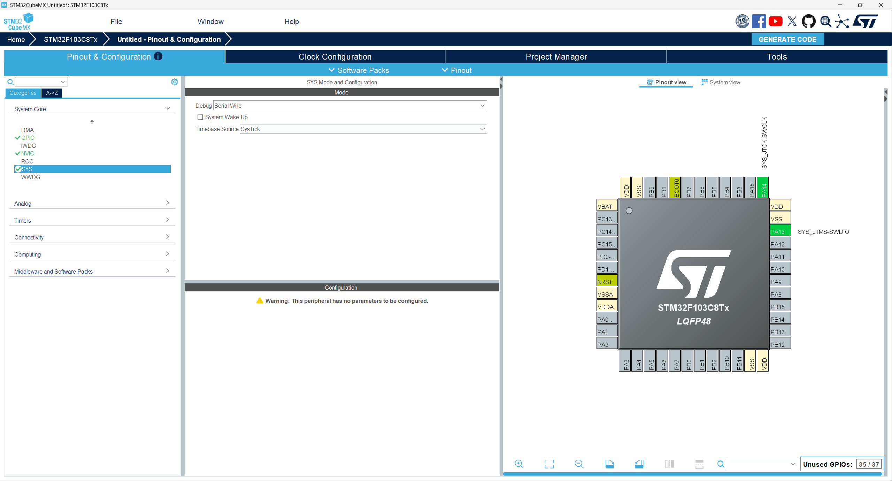
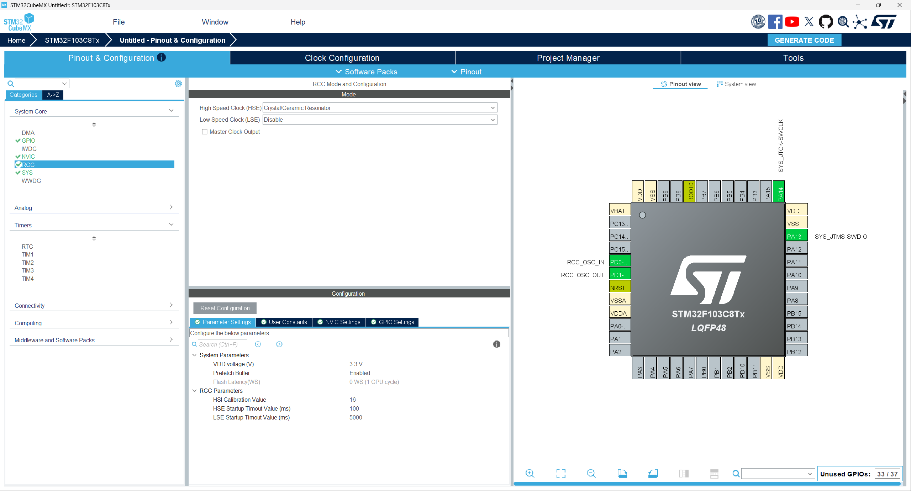
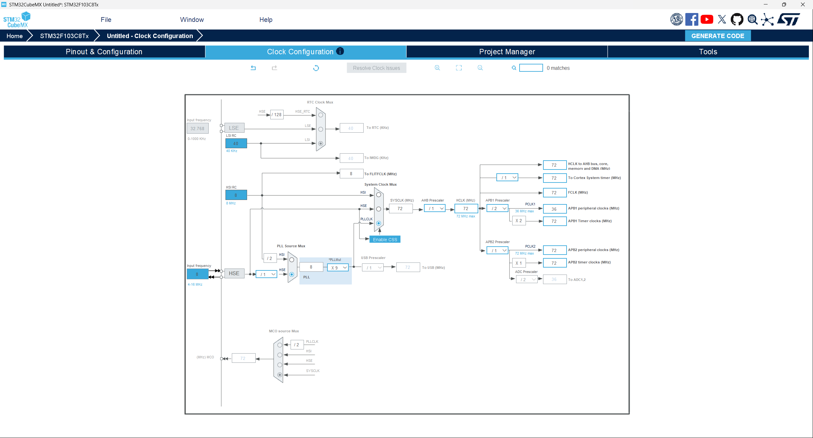
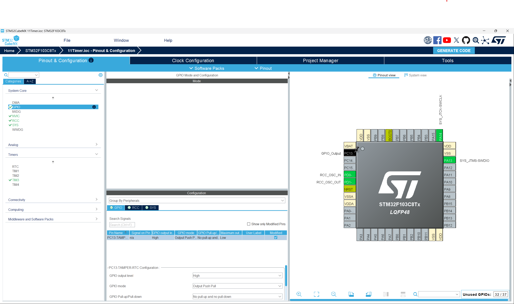
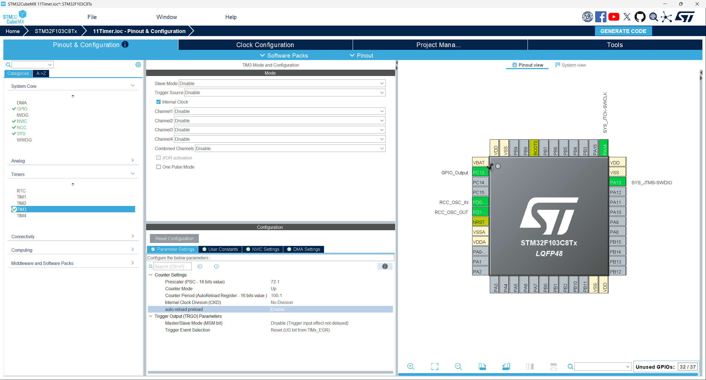
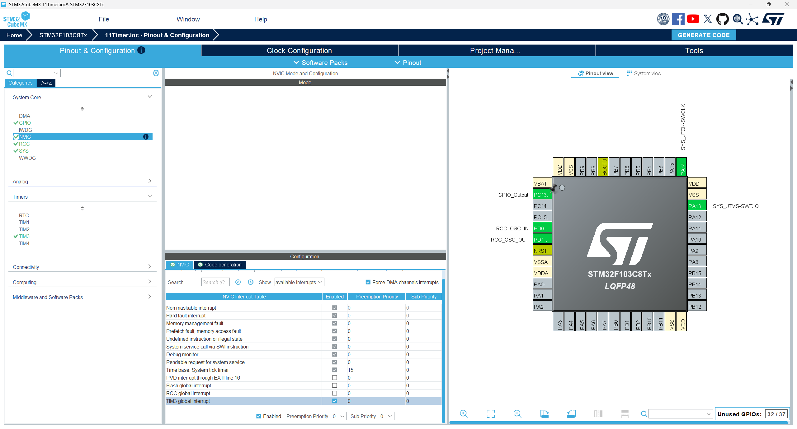
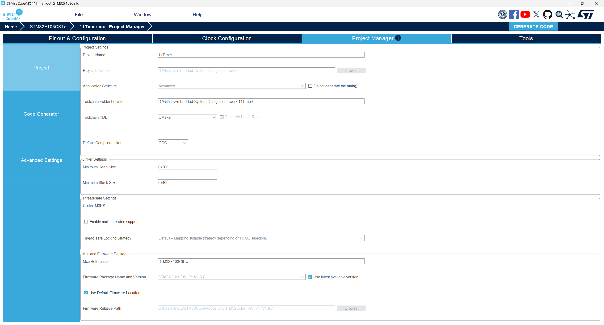
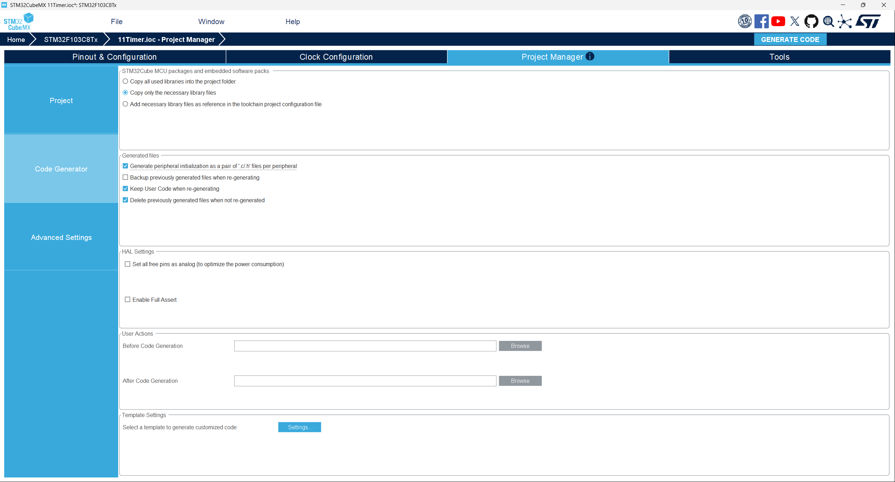

# STM32 通用定时器 — LED 呼吸灯实验

## 统一作业说明

### 学生需要完成的核心任务

1. 使用 STM32CubeMX 完成 TIM3 定时器、时钟树、调试接口等配置，并保留 `.ioc` 文件。
2. 基于 HAL 库与通用定时器中断实现软件 PWM，驱动 PC13 共阳极 LED 产生呼吸灯效果。
3. 成功编译、下载并在硬件上观察到 LED 渐亮渐灭的呼吸效果。
4. 在实验报告中说明定时器配置参数、代码结构、实验现象、问题排查和课后思考。
5. 按 [00Template/README.md](../00Template/README.md) 中提供的 LaTeX 模板撰写中文实验报告并提交 PDF。

### 本次作业验收目标

| 项目 | 要求 |
|------|------|
| 处理器平台 | STM32F103C8T6 |
| 外设 | TIM3 通用定时器 + PC13 GPIO 输出 |
| 必做功能 | LED 呼吸灯效果（渐亮渐灭循环） |
| 理论要求 | 能解释定时器中断周期计算、软件 PWM 原理、中断与主循环协同 |
| 验收方式 | 提交 PDF 格式实验报告，包含配置截图、代码分析、现象描述和课后思考题书面回答 |

### 本次必须提交的内容

1. 一份 PDF 格式实验报告（含 CubeMX 各步骤配置截图、关键代码截图、实验现象描述）。
2. 课后思考题的书面回答（写在报告中）。

### 报告必须回答的问题

1. 为什么 PC13 不能直接使用定时器硬件 PWM 输出通道？软件 PWM 与硬件 PWM 各自的优缺点是什么？
2. 修改 `PWM_PERIOD` 或主循环中占空比更新频率会对呼吸速度产生什么影响？
3. 定时器中断周期配置为 100 us，如果改为 50 us 或 200 us 分别会对呼吸效果产生什么影响？
4. 为什么 `s_pwmCounter` 和 `s_pwmDuty` 要使用 `volatile` 修饰？
5. 如果要在不改变硬件的前提下让 LED 在最亮状态停留 1 秒再开始变暗，应该如何修改代码？

---

## 关键说明

PC13 在 STM32F103C8T6 上没有定时器 PWM 输出复用功能，不能直接使用硬件 PWM 输出通道。本实验采用**定时器中断 + 软件 PWM** 方案，利用定时器中断周期性更新 GPIO 输出，实现呼吸灯效果。

---

## 实验目的

本实验基于 STM32 的通用定时器 TIM3 实现软件 PWM 呼吸灯，要求学生完成从 CubeMX 配置、代码生成、程序编写到硬件验证的完整实验流程。通过本实验，你应掌握以下内容：

1. 理解通用定时器的工作原理与中断机制。
2. 掌握 STM32CubeMX 中通用定时器的配置方法。
3. 理解软件 PWM 的实现原理，以及与硬件 PWM 的区别。
4. 学会在定时器中断回调中编写 GPIO 控制逻辑。
5. 学会在主循环与中断回调之间协调共享变量的读写。

---

## 实验环境

### 硬件环境

1. STM32F103C8T6 核心板一块。
2. 板载 PC13 共阳极 LED。
3. ST-Link 下载器。

### 软件环境

1. STM32CubeMX。
2. VS Code 或其他支持该工程的 STM32 开发环境。
3. ARM GCC / CMake 工具链或等效编译环境。
4. ST-Link 驱动。

---

## STM32CubeMX 配置步骤

下面每一步的截图必须保留在实验报告中，因为这些配置是实验成功的前提。你不仅要会"照着做"，还要理解每一步为什么这样设置。

### 新建工程并选择芯片

打开 STM32CubeMX，点击 **ACCESS TO MCU SELECTOR**，选择 **STM32F103C8T6**。

### 配置调试接口（SYS）

在 **Pinout & Configuration** → **System Core** → **SYS** 中，将 **Debug** 设置为 **Serial Wire**。

这样做的原因是：

1. 便于后续通过 ST-Link 下载和调试程序。
2. 如果未正确配置调试接口，可能出现芯片无法正常调试或下载的问题。

{ width=72% }

### 配置高速外部时钟（RCC）

在 **Pinout & Configuration** → **System Core** → **RCC** 中，将 **High Speed Clock (HSE)** 设置为 **Crystal/Ceramic Resonator**。

这样做的目的是为 PLL 和系统时钟提供稳定的外部时钟来源（8 MHz 晶振）。

{ width=72% }

### 配置时钟树（Clock Configuration）

进入 **Clock Configuration** 页面：

1. 将系统时钟源选择为 **PLLCLK**。
2. 设置 **HSE** 为 8 MHz。
3. 设置 **PLLMul** 为 x9，使 **PLLCLK** = 72 MHz。
4. 确保 **HCLK** = 72 MHz，**APB1 Timer Clocks** = 72 MHz，**APB2 Timer Clocks** = 72 MHz。
5. 确认 **APB1 Prescaler** = /2，这样 APB1 外设时钟为 36 MHz，而 APB1 定时器时钟为 72 MHz（自动 ×2）。

{ width=72% }

### 配置 PC13 为 GPIO 输出

在右侧 **Pinout view** 中，点击 **PC13** 引脚，选择 **GPIO_Output**。

在 **System Core** → **GPIO** 中找到 PC13，进行以下设置：

1. **GPIO output level**：**High**（共阳极 LED，高电平 = 熄灭，初始状态为熄灭）
2. 可修改 **User Label**，但不修改也不影响功能。

这样做的原因是：

1. PC13 连接板上共阳极 LED 的阴极，LED 阳极接 VCC。
2. PC13 输出低电平时 LED 点亮，输出高电平时 LED 熄灭。
3. 初始设为高电平，上电后 LED 默认熄灭。

{ width=72% }

### 配置通用定时器参数

在 **Pinout & Configuration** → **Timers** 中，选择 **TIM3**：

1. **Clock Source**：**Internal Clock**（使用内部时钟源）
2. 在下方参数设置区域：
   - **Prescaler**：72 - 1（即 71），定时器计数时钟 = 72 MHz / 72 = 1 MHz，即每 1 us 计数一次
   - **Counter Mode**：**Up**（向上计数模式）
   - **Counter Period (AutoReload - 16 bits value)**：100 - 1（即 99），即每 100 us 溢出一次并触发中断
   - **auto-reload preload**：**Enable**

> **参数说明**：定时器溢出时间计算公式为——
>
> ```
> T_overflow = (Prescaler + 1) × (Counter Period + 1) / Tclk
>            = 72 × 100 / 72 MHz
>            = 100 us
> ```
>
> 100 us 的中断周期配合软件 PWM，可提供 100 级的占空比精度（PWM 频率 = 100 Hz），呼吸效果足够平滑。

{ width=72% }

### 使能定时器中断

切换到 **NVIC Settings** 选项卡，勾选 **TIM3 global interrupt**，使能定时器全局中断。这样当 TIM3 计数值溢出时，硬件会自动触发中断，HAL 库会调用 `HAL_TIM_PeriodElapsedCallback` 回调函数。

{ width=72% }

### 工程设置与生成代码

在 **Project Manager** 页面：

1. **Project Name**：`11Timer`
2. **Project Location**：选择当前 `11Timer` 目录
3. **Toolchain / IDE**：选择 **CMake**



切换到 **Code Generator** 选项卡：

1. 勾选 **Generate peripheral initialization as a pair of '.c/.h' files per peripheral**，这样 TIM3 初始化代码会生成到独立的 `tim.c` / `tim.h` 文件中，便于代码管理。



最后点击 **GENERATE CODE** 生成工程。

---

## 硬件连接要点

1. PC13 通过限流电阻连接共阳极 LED 的阴极，LED 阳极接 VCC。
2. PC13 输出低电平时 LED 点亮（电流从 VCC 经 LED 流向 PC13），输出高电平时 LED 熄灭。
3. 本实验使用板载 LED，无需额外外部接线。

---

## 本工程实现的实验内容

当前工程在代码中实现了基于定时器中断的软件 PWM 呼吸灯，功能如下：

1. 系统启动后自动开始呼吸灯效果。
2. 利用 TIM3 每 100 us 触发一次中断，在中断中完成软件 PWM 输出。
3. 主循环中按固定步进更新占空比，实现 LED 渐亮渐灭。

---

## 核心代码说明

这一部分把本次实验中需要手动添加的代码放到文档中，并逐段解释其含义。

### 软件 PWM 呼吸灯原理

软件 PWM 通过定时器中断实现：

1. 定时器以固定周期（100 us）进入中断。
2. 在中断服务函数中维护一个计数器 `s_pwmCounter`，从 0 累加到 PWM 周期值 `PWM_PERIOD`。
3. 同时维护一个 `s_pwmDuty` 变量表示当前占空比。
4. 每次中断比较 `s_pwmCounter` 与 `s_pwmDuty`：
   - `s_pwmCounter < s_pwmDuty` 时 PC13 输出低电平（LED 亮）
   - `s_pwmCounter >= s_pwmDuty` 时 PC13 输出高电平（LED 灭）
5. 在主循环中按呼吸规律逐步改变 `s_pwmDuty`，实现渐亮渐灭。

下图展示了软件 PWM 的工作流程：

```
定时器中断（每100us）
    │
    ▼
s_pwmCounter++
    │
    ▼
s_pwmCounter >= PWM_PERIOD? ──Yes──▶ s_pwmCounter = 0
    │
    ▼
s_pwmCounter < s_pwmDuty? ──Yes──▶ PC13 = LOW (LED亮)
    │ No
    ▼
PC13 = HIGH (LED灭)

主循环（每1ms）
    │
    ▼
s_pwmDuty 递增/递减
    │
    ▼
到达 0 或 PWM_PERIOD? ──Yes──▶ 翻转方向
```

### main.c 中新增的变量定义

> CubeMX 生成的 `main.c` 已自动包含 `#include "tim.h"`（提供 `MX_TIM3_Init()` 和 `htim3` 声明），无需额外添加头文件。

在 `Core/Src/main.c` 中找到 `/* USER CODE BEGIN PV */`，添加以下代码：

```c
/* USER CODE BEGIN PV */
#define PWM_PERIOD  100U    // PWM 周期 = 100 级（100us × 100 = 10ms，即 100Hz）

static volatile uint32_t s_pwmCounter = 0;  // 当前 PWM 计数值（0 ~ PWM_PERIOD-1）
static volatile uint32_t s_pwmDuty    = 0;  // 当前占空比（0 ~ PWM_PERIOD）
static          uint32_t s_breathStep = 0;  // 主循环呼吸步进计数
static          int8_t   s_breathDir  = 1;  // 呼吸方向：1 = 变亮，-1 = 变暗
/* USER CODE END PV */
```

代码解析：

1. `PWM_PERIOD` 定义为 100，与定时器 AutoReload 值（99 + 1）一致，表示 PWM 有 100 个时隙。
2. `s_pwmCounter` 在中断中累加，每 100 us +1，在 0~99 之间循环，对应 PWM 的 100 个时隙。
3. `s_pwmDuty` 表示当前占空比，取值范围 0 ~ PWM_PERIOD。0 表示全暗（LED 始终灭），PWM_PERIOD 表示全亮（LED 始终亮）。
4. `s_breathStep` 和 `s_breathDir` 在主循环中控制占空比的变化速率和方向。

编程技巧：

1. `s_pwmCounter` 和 `s_pwmDuty` 使用 `volatile` 修饰，因为它们同时在中断和主循环中被访问。
2. `s_breathStep` 和 `s_breathDir` 只在主循环中使用，不需要 `volatile`。
3. 所有变量使用 `static` 限制作用域在当前文件内，减少命名冲突。

### main.c 中的定时器中断回调函数

```c
/* USER CODE BEGIN 0 */
void HAL_TIM_PeriodElapsedCallback(TIM_HandleTypeDef *htim)
{
    if (htim->Instance == TIM3)
    {
        s_pwmCounter++;
        if (s_pwmCounter >= PWM_PERIOD)
        {
            s_pwmCounter = 0;
        }

        if (s_pwmCounter < s_pwmDuty)
        {
            HAL_GPIO_WritePin(GPIOC, GPIO_PIN_13, GPIO_PIN_RESET);
        }
        else
        {
            HAL_GPIO_WritePin(GPIOC, GPIO_PIN_13, GPIO_PIN_SET);
        }
    }
}
/* USER CODE END 0 */
```

代码解析：

1. `HAL_TIM_PeriodElapsedCallback` 是 HAL 库定义的弱函数（`__weak`），当定时器溢出（计数值到达 AutoReload 值）时由 HAL 库的中断处理函数调用。
2. 回调函数的参数 `htim` 指向触发中断的定时器句柄。由于系统中可能有多个定时器，通过 `htim->Instance == TIM3` 判断是否是 TIM3 触发的中断。
3. `s_pwmCounter` 每次中断加 1，到达 `PWM_PERIOD` 时归零，形成一个循环计数器。
4. 比较 `s_pwmCounter` 与 `s_pwmDuty` 决定 GPIO 输出电平。这就是软件 PWM 的核心——用一个计数器和一个比较值模拟硬件 PWM 的输出比较功能。
5. `GPIO_PIN_RESET` 即低电平，使共阳极 LED 点亮。

为什么不在中断中做复杂业务：

1. 这个回调每 100 us 调用一次，频率较高（10 kHz）。
2. 回调执行时间过长会影响下一次中断的响应。
3. 当前回调只做了计数、比较和 GPIO 翻转，执行时间极短（几个时钟周期），是合理的中断设计。

### main.c 中的主函数

```c
int main(void)
{
    HAL_Init();
    SystemClock_Config();
    MX_GPIO_Init();
    MX_TIM3_Init();

    /* USER CODE BEGIN 2 */
    HAL_TIM_Base_Start_IT(&htim3);
    /* USER CODE END 2 */

    while (1)
    {
        /* USER CODE BEGIN 3 */
        s_breathStep++;
        if (s_breathStep >= 10)  // 每 10ms 更新一次占空比，控制呼吸速度
        {
            s_breathStep = 0;
            s_pwmDuty += s_breathDir;

            if (s_pwmDuty >= PWM_PERIOD)
            {
                s_pwmDuty = PWM_PERIOD;
                s_breathDir = -1;  // 到达最亮，开始变暗
            }
            else if (s_pwmDuty == 0)
            {
                s_breathDir = 1;   // 到达最暗，开始变亮
            }
        }
        HAL_Delay(1);
        /* USER CODE END 3 */
    }
}
```

代码解析：

1. `MX_TIM3_Init()` 是由 CubeMX 生成在 `tim.c` 中的定时器初始化函数，配置了预分频器、自动重载值等寄存器。
2. **`HAL_TIM_Base_Start_IT(&htim3)`** 是关键的启动函数。CubeMX 生成的初始化函数只配置寄存器，不会启动定时器。必须手动调用此函数来启动 TIM3 并使能定时器中断。
3. 主循环中 `HAL_Delay(1)` 每次延时 1 ms，因此主循环每 1 ms 执行一次。
4. `s_breathStep` 每 1 ms 加 1，当累积到 10 时才更新一次占空比，即每 10 ms 更新一次。
5. `s_pwmDuty` 每次增加或减少 1（由 `s_breathDir` 控制方向），在 0 ~ PWM_PERIOD（100）之间变化。
6. 当 `s_pwmDuty` 到达 PWM_PERIOD（最亮）时，方向翻转为 -1（变暗）；当到达 0（最暗）时，方向翻转为 +1（变亮）。

呼吸周期计算：

```
单向变化：100 级 × 10 ms/级 = 1000 ms = 1 s
一个完整呼吸周期（暗→亮→暗）：1 s × 2 = 2 s
```

### 代码结构整体工作流程

1. 系统启动后初始化时钟、GPIO、TIM3。
2. `HAL_TIM_Base_Start_IT` 启动 TIM3，定时器开始计数。
3. TIM3 每 100 us 溢出一次，触发中断，HAL 库调用 `HAL_TIM_PeriodElapsedCallback`。
4. 中断回调中执行软件 PWM 逻辑：更新计数值并比较占空比，控制 LED 亮灭。
5. 主循环每 1 ms 运行一次，每 2 ms 更新一次占空比。
6. 占空比在 0~100 之间往复变化，LED 呈现渐亮渐灭的呼吸效果。

---

## 编程技巧总结

1. 定时器中断回调中尽量少做事，只做必要的计数和 GPIO 翻转。
2. 与中断共享的变量应使用 `volatile` 修饰，防止编译器优化导致数据不一致。
3. CubeMX 生成的 `MX_TIMx_Init()` 只初始化配置，启动定时器需要额外调用 `HAL_TIM_Base_Start_IT`。
4. 软件 PWM 的核心思想是用定时器 + 计数器 + 比较值模拟硬件 PWM 的输出比较。
5. 使用 `HAL_Delay` 控制呼吸速度简单可靠，适合实验场景；更复杂的需求可改用非阻塞定时。

---

## 实验操作步骤

### 配置 CubeMX 并生成代码

按第 3 节步骤完成配置，点击 GENERATE CODE。

### 添加应用代码

在 `Core/Src/main.c` 中按第 6 节代码说明，在对应 `USER CODE BEGIN/END` 区域添加代码。

### 编译工程

使用当前开发环境编译工程，确认无编译错误。

### 烧录程序

通过 ST-Link 将程序下载到 STM32 开发板。

### 观察现象

程序下载完成后，PC13 LED 应自动开始呼吸效果——从暗到亮、从亮到暗循环往复。

---

## 实验现象与结果分析

如果实验成功，你应看到如下现象：

1. 上电或下载完成后，PC13 LED 自动开始呼吸效果。
2. LED 从完全熄灭逐渐变亮，到达最亮后逐渐变暗，到达最暗后再变亮，循环往复。
3. 呼吸周期约 2 s（暗→亮约 1 s + 亮→暗约 1 s），肉眼观察为流畅的呼吸效果。
4. LED 亮度变化平滑，无明显阶梯感。

这些现象说明：

1. TIM3 定时器及其中断配置正确，定时器正常计数并在 100 us 周期触发中断。
2. 软件 PWM 逻辑正确，`s_pwmCounter` 和 `s_pwmDuty` 协作完成了 GPIO 的 PWM 波形输出。
3. 主循环中占空比更新逻辑正确，`s_pwmDuty` 在 0~100 之间往复变化。
4. 中断回调与主循环之间的共享变量访问正常，未出现数据不一致。

---

## 常见问题排查

| 问题 | 可能原因与解决方案 |
| :--- | :--- |
| LED 不亮也不闪 | 检查是否调用了 `HAL_TIM_Base_Start_IT` 启动定时器；检查定时器中断是否在 NVIC 中使能。 |
| LED 常亮不灭 | 检查 GPIO 初始输出电平是否设为 High；检查 `s_pwmDuty` 是否正确更新。 |
| LED 闪烁而非呼吸 | 可能是占空比更新过快或 PWM 周期太小；检查 `s_breathStep` 判断阈值和 `PWM_PERIOD` 值。 |
| LED 亮度变化不平滑 | 可减小定时器周期（如改为 50 us）或增大 PWM 周期值以获得更多灰度等级。 |
| 程序下载后无反应 | 检查 SYS Debug 是否配置为 Serial Wire；检查 HSE 和时钟树配置。 |

---

## 课后思考题

请结合本次实验，在报告中认真回答以下问题：

1. 为什么 PC13 不能直接使用定时器硬件 PWM 输出通道？软件 PWM 与硬件 PWM 各自的优缺点是什么？
2. 修改 `PWM_PERIOD` 或主循环中 `s_breathStep >= 2` 的判断阈值会对呼吸速度和效果产生什么影响？
3. 定时器中断周期配置为 100 us，如果改为 50 us 或 200 us 分别会对呼吸效果产生什么影响？
4. 为什么 `s_pwmCounter` 和 `s_pwmDuty` 要使用 `volatile` 修饰？如果不加 `volatile` 可能出现什么问题？
5. 如果要在不改变硬件的前提下让 LED 在最亮状态停留 1 秒再开始变暗，应该如何修改代码？

---

## 实验报告提交要求

### 报告建议结构

1. 封面：课程名称、作业名称、姓名、学号、班级、日期。
2. 作业目标：简述本实验需要实现的功能与验收指标。
3. 实验环境：开发板型号、调试器、软件版本。
4. CubeMX 配置：必须说明 SYS、RCC、Clock Configuration、GPIO、TIM3 参数、NVIC 的关键设置及其原因，并附上每一步的配置截图。
5. 程序设计：分析 `main.c` 中的定时器中断回调和主循环逻辑。
6. 程序流程图：必须展示"定时器中断 → 软件 PWM 计数比较 → GPIO 输出 → 主循环更新占空比"的流程。
7. 实验步骤：包括编译、下载、观察现象等过程。
8. 实验结果：必须展示呼吸灯的亮灭效果（视频或动图截图）。
9. 问题分析与调试记录：说明遇到的任何问题及排查方法。
10. 课后思考题答案：必须完整回答本 README 中 5 个思考题。
11. 总结：概括你对通用定时器、软件 PWM 和中断编程的理解。
12. 附录：可附核心代码、更多截图、参考资料。

### 图片与流程图要求

1. 报告中至少包含 8 张 CubeMX 配置截图（SYS、RCC、时钟树、GPIO、TIM3 参数、NVIC、工程设置、代码生成选项）。
2. 每张图片必须标注图号和图题，并在正文中说明该图用于证明什么。
3. 程序流程图必须单独成图，不能只用文字描述替代。

### 提交规范

1. 报告文件建议命名为：`学号-姓名-作业11-定时器呼吸灯实验.pdf`。
2. 若实验未完全成功，也必须提交完整报告，重点说明失败现象、原因分析和改进方向。
3. 报告中不能只贴代码或截图，必须结合现象进行解释。

### 最低验收标准

1. LED 能够实现渐亮渐灭的呼吸效果。
2. 能够说明定时器中断周期的计算方法。
3. 报告能够解释软件 PWM 的原理和中断回调与主循环的协作关系。

---

## 可进一步扩展的方向

1. 改用正弦波查表法更新占空比，使呼吸效果更自然。
2. 使用多个定时器通道驱动多个 LED 实现不同节奏的呼吸效果。
3. 增加按键切换呼吸速度的功能。
4. 将软件 PWM 抽象为一个独立模块，方便其他项目复用。

---

## 总结

本实验通过通用定时器中断实现软件 PWM，驱动 PC13 共阳极 LED 产生呼吸灯效果。实验涵盖定时器配置、中断回调、GPIO 控制和主循环协同工作等核心内容。相比于直接使用硬件 PWM，软件 PWM 方案更考验对定时器中断和主循环协同的理解，是嵌入式定时器应用的典型入门实验。
