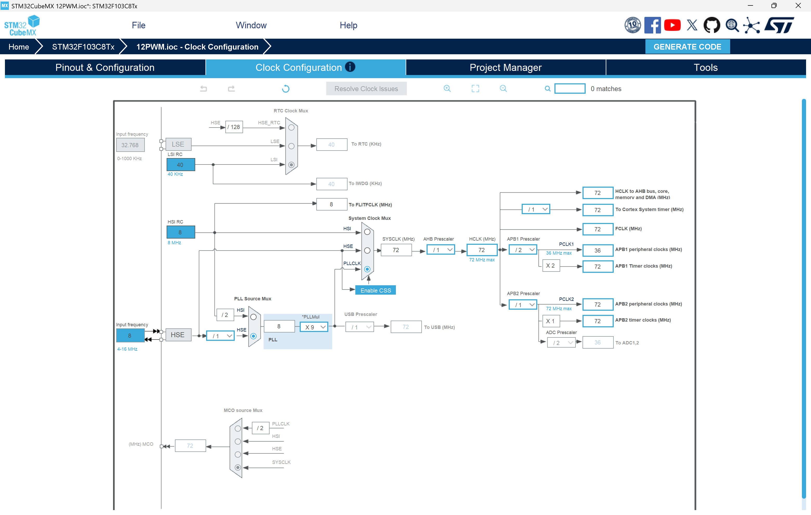
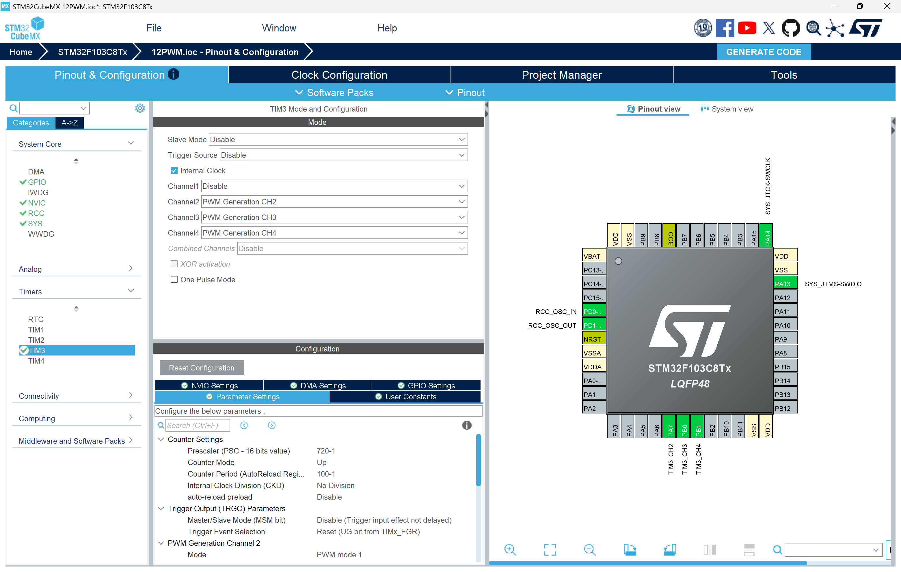
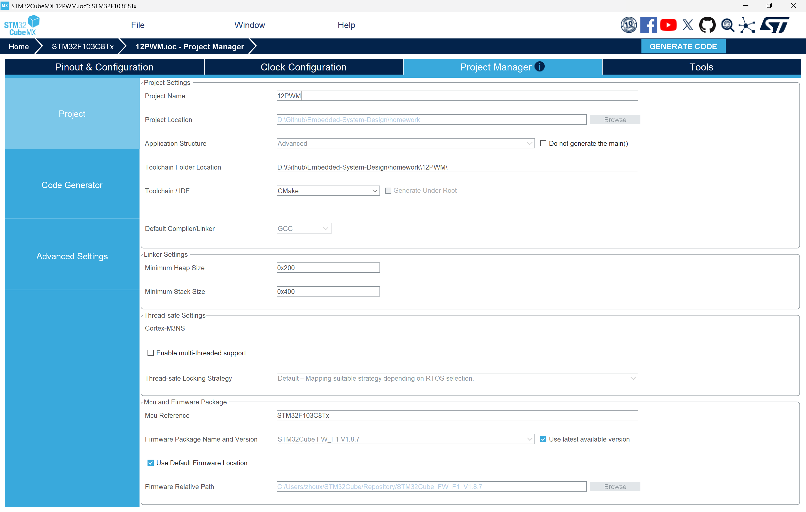
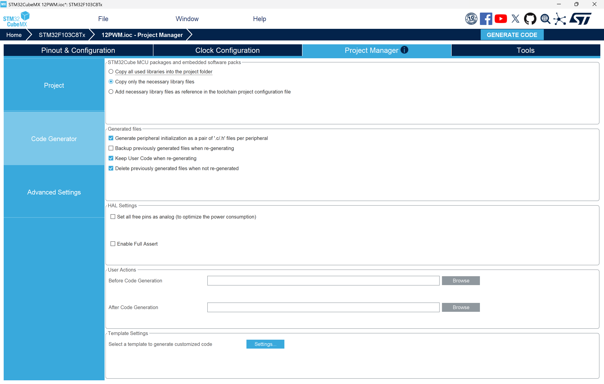
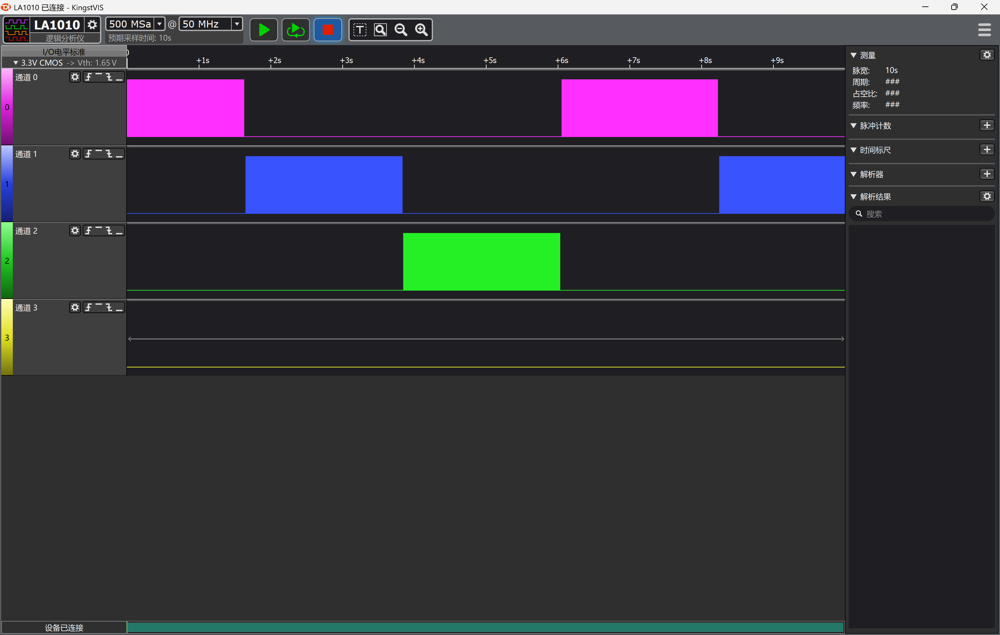

# STM32 通用定时器 — 三通道硬件 PWM 交替呼吸灯实验

## 统一作业说明

### 学生需要完成的核心任务

1. 使用 STM32CubeMX 完成 TIM3 定时器、时钟树、调试接口等配置，并保留 `.ioc` 文件。
2. 基于 HAL 库与硬件 PWM 实现三路 LED 交替呼吸灯效果。
3. 成功编译、下载并在硬件上观察到三路 LED 轮流渐亮渐灭的交替呼吸效果。
4. 在实验报告中说明定时器配置参数、代码结构、实验现象、问题排查和课后思考。
5. 按 [00Template/README.md](../00Template/README.md) 中提供的 LaTeX 模板撰写中文实验报告并提交 PDF。

### 本次作业验收目标

| 项目 | 要求 |
|------|------|
| 处理器平台 | STM32F103C8T6 |
| 外设 | TIM3 通用定时器 PWM 输出 |
| 引脚 | PA7 (TIM3_CH2)、PB0 (TIM3_CH3)、PB1 (TIM3_CH4) |
| 必做功能 | 三路 LED 交替呼吸灯效果（轮流渐亮渐灭） |
| 理论要求 | 能解释定时器 PWM 周期计算、硬件 PWM 原理、主循环与 PWM 占空比更新的协同 |
| 验收方式 | 提交 PDF 格式实验报告，包含配置截图、代码分析、现象描述和课后思考题书面回答 |

### 本次必须提交的内容

1. 一份 PDF 格式实验报告（含 CubeMX 各步骤配置截图、关键代码截图、实验现象描述）。
2. 课后思考题的书面回答（写在报告中）。

### 报告必须回答的问题

1. 本实验使用硬件 PWM 输出通道，与软件 PWM 方案相比各自的优缺点是什么？
2. 修改 `HAL_Delay(10)` 中的延时值或定时器的 Prescaler/Period 会对呼吸速度和效果产生什么影响？
3. 将 PWM 周期从 100 改为 200（Period = 200-1），占空比分辨率提高但 PWM 频率降低，这对 LED 视觉效果有何影响？
4. 全局变量 `Led` 在主循环中递增并控制通道切换，如果改用定时器中断来控制通道切换，需要如何修改代码？
5. 如果要在不改变硬件的前提下让三路 LED 同时以不同亮度呼吸（而非交替），应该如何修改代码？

---

## 关键说明

本实验使用 **TIM3 的硬件 PWM 输出通道**（CH2: PA7, CH3: PB0, CH4: PB1），通过主循环动态修改 CCR 寄存器（`__HAL_TIM_SET_COMPARE`）来改变各通道占空比，实现三路 LED 交替呼吸灯效果。与软件 PWM 不同，硬件 PWM 的波形由定时器硬件自动生成，主循环仅需更新占空比值即可。

---

## 1. 实验目的

本实验基于 STM32 的通用定时器 TIM3 实现三通道硬件 PWM 交替呼吸灯，要求学生完成从 CubeMX 配置、代码生成、程序编写到硬件验证的完整实验流程。通过本实验，你应掌握以下内容：

1. 理解通用定时器的硬件 PWM 输出原理。
2. 掌握 STM32CubeMX 中多通道 PWM 输出的配置方法。
3. 理解硬件 PWM 与软件 PWM 的区别及各自适用场景。
4. 学会通过动态修改 CCR 寄存器控制 PWM 占空比。
5. 学会在主循环中协调多通道 PWM 的交替工作。

---

## 2. 实验环境

### 2.1 硬件环境

1. STM32F103C8T6 核心板一块。
2. 三路 LED（分别连接 PA7、PB0、PB1 引脚，需外接或使用板载 LED 扩展）。
3. ST-Link 下载器。
4. 逻辑分析仪（可选，用于抓取 PWM 波形）。

### 2.2 软件环境

1. STM32CubeMX。
2. VS Code 或其他支持该工程的 STM32 开发环境。
3. ARM GCC / CMake 工具链或等效编译环境。
4. ST-Link 驱动。

---

## 3. STM32CubeMX 配置步骤

下面每一步的截图必须保留在实验报告中，因为这些配置是实验成功的前提。

### 3.1 新建工程并选择芯片

打开 STM32CubeMX，点击 **ACCESS TO MCU SELECTOR**，选择 **STM32F103C8T6**。

### 3.2 配置调试接口（SYS）

在 **Pinout & Configuration** → **System Core** → **SYS** 中，将 **Debug** 设置为 **Serial Wire**。

这样便于后续通过 ST-Link 下载和调试程序。如果未正确配置调试接口，可能出现芯片无法正常调试或下载的问题。

{ width=72% }

### 3.3 配置高速外部时钟（RCC）

在 **Pinout & Configuration** → **System Core** → **RCC** 中，将 **High Speed Clock (HSE)** 设置为 **Crystal/Ceramic Resonator**。

这样做的目的是为 PLL 和系统时钟提供稳定的外部时钟来源（8 MHz 晶振）。

{ width=72% }

### 3.4 配置时钟树（Clock Configuration）

进入 **Clock Configuration** 页面：

1. 将系统时钟源选择为 **PLLCLK**。
2. 设置 **HSE** 为 8 MHz。
3. 设置 **PLLMul** 为 x9，使 **PLLCLK** = 72 MHz。
4. 确保 **HCLK** = 72 MHz，**APB1 Timer Clocks** = 72 MHz，**APB2 Timer Clocks** = 72 MHz。
5. 确认 **APB1 Prescaler** = /2，这样 APB1 外设时钟为 36 MHz，而 APB1 定时器时钟为 72 MHz（自动 ×2）。

{ width=72% }

### 3.5 配置 TIM3 PWM 输出通道

在 **Pinout & Configuration** → **Timers** 中，选择 **TIM3**：

1. **Clock Source**：**Internal Clock**（使用内部时钟源）
2. **Channel 2/3/4**：均设置为 **PWM Generation CHx**
3. 在下方参数设置区域：
   - **Prescaler**：720 - 1（即 719），定时器计数时钟 = 72 MHz / 720 = 100 kHz，即每 10 us 计数一次
   - **Counter Mode**：**Up**（向上计数模式）
   - **Counter Period (AutoReload - 16 bits value)**：100 - 1（即 99），PWM 周期 = 100 × 10 us = 1 ms，PWM 频率 = 1 kHz
   - **Auto-reload preload**：**Disable**
   - **Pulse**（各通道）：均设为 50（初始占空比 50%）

> **参数说明**：PWM 频率计算公式为——
>
> ```
> F_pwm = Tclk / ((Prescaler + 1) × (Counter Period + 1))
>       = 72 MHz / (720 × 100)
>       = 1 kHz
> ```
>
> PWM 周期 = 1 ms。Period = 100-1 提供 100 级（0~99）的占空比精度，呼吸效果足够平滑。1 kHz 的 PWM 频率远超人眼闪烁感知阈值（约 50 Hz），视觉上完全平滑。

4. 确认 PA7、PB0、PB1 引脚分别被分配为 **TIM3_CH2**、**TIM3_CH3**、**TIM3_CH4**。



> **注意**：本实验无需在 NVIC Settings 中使能 TIM3 全局中断。硬件 PWM 的波形由定时器硬件自动生成，占空比通过主循环直接修改 CCR 寄存器更新，不需要中断参与。

### 3.6 工程设置与生成代码

在 **Project Manager** 页面：

1. **Project Name**：`12PWM`
2. **Project Location**：选择当前 `12PWM` 目录
3. **Toolchain / IDE**：选择 **CMake**



切换到 **Code Generator** 选项卡：

1. 勾选 **Generate peripheral initialization as a pair of '.c/.h' files per peripheral**，这样 TIM3 初始化代码会生成到独立的 `tim.c` / `tim.h` 文件中，便于代码管理。



最后点击 **GENERATE CODE** 生成工程。

---

## 4. 硬件连接要点

1. **PA7 (TIM3_CH2)**：连接 LED1 的阴极，LED 阳极通过限流电阻接 VCC。
2. **PB0 (TIM3_CH3)**：连接 LED2 的阴极，LED 阳极通过限流电阻接 VCC。
3. **PB1 (TIM3_CH4)**：连接 LED3 的阴极，LED 阳极通过限流电阻接 VCC。
4. 各 GPIO 配置为复用推挽输出（AF_PP），由 TIM3 硬件 PWM 直接驱动。
5. PWM 极性为高电平有效（OCPolarity = High），占空比越高 LED 越亮（需要根据实际 LED 接法确认）。

---

## 5. 本工程实现的实验内容

当前工程实现了基于硬件 PWM 的三通道交替呼吸灯，功能如下：

1. 系统启动后自动开始交替呼吸灯效果。
2. TIM3 以 1 kHz 频率自动输出 PWM 波形，无需软件干预。
3. 主循环中按固定步进更新当前活跃通道的 CCR 值（0~99 渐变），不活跃通道 CCR 置 0。
4. 三路 LED 轮流呼吸：CH3（PB0）→ CH4（PB1）→ CH2（PA7）→ CH3（PB0）……循环往复。
5. 每路 LED 完成一次完整呼吸（暗→亮→暗）约 2 秒。

---

## 6. 核心代码说明

### 6.1 硬件 PWM 交替呼吸灯原理

硬件 PWM 交替呼吸灯通过以下方式实现：

1. TIM3 被配置为三通道 PWM 输出模式，定时器自动产生 PWM 波形。
2. 每个通道的占空比由其 CCR（Capture/Compare Register）寄存器值决定：CCR / Period = 占空比。
3. 主循环中动态修改 CCR 值（`__HAL_TIM_SET_COMPARE`）来改变占空比。
4. 全局变量 `Led` 记录当前呼吸轮次，`Led % 3` 决定本轮哪个通道呼吸。
5. 活跃通道的 CCR 按呼吸曲线变化（0→99→0），不活跃通道的 CCR 置 0（LED 熄灭）。
6. `HAL_Delay(10)` 每步延时 10 ms，控制呼吸速度。

下图展示了交替呼吸的工作流程：

```
主循环
    │
    ▼
淡入循环 (i: 0→99, 步进10ms)
    ├── 活跃通道 CCR = i（渐亮）
    └── 不活跃通道 CCR = 0（熄灭）
    │
    ▼
淡出循环 (i: 99→0, 步进10ms)
    ├── 活跃通道 CCR = i（渐暗）
    └── 不活跃通道 CCR = 0（熄灭）
    │
    ▼
Led++ (切换通道: 0→CH3, 1→CH4, 2→CH2)
    │
    ▼
循环往复
```

### 6.2 main.c 中新增的变量定义

在 `Core/Src/main.c` 中找到 `/* USER CODE BEGIN PV */`，添加以下代码：

```c
/* USER CODE BEGIN PV */
uint32_t Led = 0;   // 呼吸轮次计数器，Led % 3 决定当前活跃通道
/* USER CODE END PV */
```

代码解析：

1. `Led` 是一个全局变量，每完成一轮呼吸（一次淡入 + 一次淡出）自增 1。
2. `Led % 3` 的值为 0 时活跃通道为 CH3（PB0），1 时活跃 CH4（PB1），2 时活跃 CH2（PA7）。
3. 使用 `uint32_t` 类型，取值范围足够覆盖整个运行周期。

### 6.3 main.c 中的 PWM 启动代码

在 `Core/Src/main.c` 中找到 `/* USER CODE BEGIN 2 */`，添加以下代码：

```c
/* USER CODE BEGIN 2 */
HAL_TIM_PWM_Start(&htim3, TIM_CHANNEL_2);
HAL_TIM_PWM_Start(&htim3, TIM_CHANNEL_3);
HAL_TIM_PWM_Start(&htim3, TIM_CHANNEL_4);
/* USER CODE END 2 */
```

代码解析：

1. CubeMX 生成的 `MX_TIM3_Init()` 只配置寄存器，不启动 PWM 输出。
2. 必须手动调用 `HAL_TIM_PWM_Start()` 来使能每个通道的 PWM 输出并启动定时器计数器。
3. 三个通道全部启动后，TIM3 开始计数并自动输出 PWM 波形。
4. 不需要使用 `HAL_TIM_PWM_Start_IT`，因为本实验不使用定时器中断。

### 6.4 main.c 中的主循环

在 `Core/Src/main.c` 的主循环中添加以下代码：

```c
while (1)
{
    /* USER CODE END WHILE */
    for (int i = 0; i < 100; i++)
    {
        __HAL_TIM_SET_COMPARE(&htim3, TIM_CHANNEL_2, (Led % 3 == 2) ? i : 0);
        __HAL_TIM_SET_COMPARE(&htim3, TIM_CHANNEL_3, (Led % 3 == 0) ? i : 0);
        __HAL_TIM_SET_COMPARE(&htim3, TIM_CHANNEL_4, (Led % 3 == 1) ? i : 0);
        HAL_Delay(10);
    }
    for (int i = 99; i >= 0; i--)
    {
        __HAL_TIM_SET_COMPARE(&htim3, TIM_CHANNEL_2, (Led % 3 == 2) ? i : 0);
        __HAL_TIM_SET_COMPARE(&htim3, TIM_CHANNEL_3, (Led % 3 == 0) ? i : 0);
        __HAL_TIM_SET_COMPARE(&htim3, TIM_CHANNEL_4, (Led % 3 == 1) ? i : 0);
        HAL_Delay(10);
    }
    Led++;
    /* USER CODE BEGIN 3 */
}
```

代码解析：

1. **`__HAL_TIM_SET_COMPARE(&htim3, TIM_CHANNEL_x, value)`**：这是 HAL 库提供的宏，用于直接向指定通道的 CCR 寄存器写入比较值。CCR 值决定 PWM 占空比（CCR / Period）。
2. **三个通道同一时刻只有一个通道的 CCR 为非零值**：活跃通道的 CCR 随 `i` 变化实现呼吸效果，其余两个通道 CCR = 0（LED 熄灭）。
3. **通道分配逻辑**：
   - `Led % 3 == 0`：CH3 活跃，CH2/CH4 的 CCR 置 0
   - `Led % 3 == 1`：CH4 活跃，CH2/CH3 的 CCR 置 0
   - `Led % 3 == 2`：CH2 活跃，CH3/CH4 的 CCR 置 0
4. **淡入阶段**：`i` 从 0 递增到 99，每步延时 10 ms，活跃通道 CCR 从 0→99（LED 渐亮）。
5. **淡出阶段**：`i` 从 99 递减到 0，每步延时 10 ms，活跃通道 CCR 从 99→0（LED 渐暗）。
6. **`HAL_Delay(10)`**：每步延时 10 ms，一个完整呼吸周期 = 100 × 10 ms × 2 = 2000 ms = 2 秒。
7. **`Led++`**：一轮呼吸完成后递增，切换到下一个通道。

**呼吸周期计算**：

```
单向变化时间：100 级 × 10 ms/级 = 1000 ms = 1 s
单通道完整呼吸周期：1 s（亮）+ 1 s（暗）= 2 s
三通道完整循环：2 s × 3 = 6 s
```

### 6.5 为什么不需要中断

本实验与 11Timer（软件 PWM 呼吸灯）不同，不需要使用定时器中断。原因如下：

1. **硬件 PWM 自动产生波形**：TIM3 被配置为 PWM 输出模式后，定时器硬件根据 CCR 寄存器的值自动控制 GPIO 输出电平。当计数器 CNT < CCR 时输出有效电平，CNT >= CCR 时输出无效电平，全程由硬件完成。
2. **主循环只修改占空比**：呼吸灯只需要定期更新 CCR 值来改变占空比。这个更新频率很低（每 10 ms 一次），完全可以在主循环中通过 `HAL_Delay` 控制节奏。
3. **无需中断回调**：因为没有需要在中断中处理的逻辑（如软件 PWM 的计数比较），所以不需要使能 TIM3 中断。

---

## 7. 编程技巧总结

1. 硬件 PWM 的核心优势：波形由定时器硬件自动生成，CPU 只需在需要改变占空比时更新 CCR 寄存器。
2. `__HAL_TIM_SET_COMPARE` 宏可直接修改指定通道的 CCR 值，无需停止或重新配置定时器。
3. 通过将不活跃通道的 CCR 置 0 来实现通道的开关切换，无需操作 CCER 寄存器或调用 Start/Stop。
4. `HAL_Delay` 控制呼吸速度简单可靠，适合实验场景；更复杂的需求可改用非阻塞定时。
5. 三个通道共享同一个定时器，PWM 频率相同，只是占空比各自独立可调。

---

## 8. 实验操作步骤

### 8.1 配置 CubeMX 并生成代码

按第 3 节步骤完成配置，点击 GENERATE CODE。

### 8.2 添加应用代码

在 `Core/Src/main.c` 中按第 6 节代码说明，在对应 `USER CODE BEGIN/END` 区域添加代码。

### 8.3 编译工程

使用当前开发环境编译工程，确认无编译错误。

### 8.4 烧录程序

通过 ST-Link 将程序下载到 STM32 开发板。

### 8.5 观察现象

程序下载完成后，三路 LED 应自动开始交替呼吸效果——LED1 渐亮渐灭 → LED2 渐亮渐灭 → LED3 渐亮渐灭，循环往复。

---

## 9. 实验现象与结果分析

如果实验成功，你应看到如下现象：

1. 上电或下载完成后，三路 LED 自动开始交替呼吸。
2. 每路 LED 从完全熄灭逐渐变亮，到达最亮后逐渐变暗，完成一轮后切换到下一路 LED。
3. 每路 LED 呼吸周期约 2 s（暗→亮约 1 s + 亮→暗约 1 s）。
4. LED 亮度变化平滑，无明显阶梯感（1 kHz PWM 频率 + 100 级占空比精度）。
5. 三路 LED 之间切换流畅，无明显停顿。

通过逻辑分析仪抓取的 PWM 波形如下：



这些现象说明：

1. TIM3 定时器及 PWM 配置正确，三路 PWM 输出正常工作。
2. 主循环中 CCR 更新逻辑正确，活跃通道按呼吸曲线变化，不活跃通道保持 0。
3. `Led` 变量正确控制通道切换顺序。
4. 硬件 PWM 波形稳定，无抖动。

---

## 10. 常见问题排查

| 问题 | 可能原因与解决方案 |
| :--- | :--- |
| LED 不亮也不闪 | 检查是否调用了 `HAL_TIM_PWM_Start` 启动各通道；检查 GPIO 是否配置为 AF_PP 复用推挽输出。 |
| 三路 LED 同时亮灭 | 检查主循环中 CCR 更新逻辑是否使用了 `Led % 3` 条件判断；确认不活跃通道的 CCR 是否置 0。 |
| LED 亮度变化不平滑 | 可增大 Period 值以增加占空比分辨率；或减小 `HAL_Delay` 延时使过渡更细腻。 |
| LED 闪烁 | 可能是 PWM 频率过低；检查 Prescaler 和 Period 配置是否正确。 |
| 某一通道不亮 | 检查该通道对应的 GPIO 引脚连接和配置；确认 `HAL_TIM_PWM_Start` 已包含该通道。 |

---

## 11. 课后思考题

请结合本次实验，在报告中认真回答以下问题：

1. 本实验使用硬件 PWM 输出通道，与软件 PWM 方案相比各自的优缺点是什么？
2. 修改 `HAL_Delay(10)` 中的延时值或定时器的 Prescaler/Period 会对呼吸速度和效果产生什么影响？
3. 将 PWM 周期从 100 改为 200（Period = 200-1），占空比分辨率提高但 PWM 频率降低，这对 LED 视觉效果有何影响？
4. 全局变量 `Led` 在主循环中递增并控制通道切换，如果改用定时器中断来控制通道切换，需要如何修改代码？
5. 如果要在不改变硬件的前提下让三路 LED 同时以不同亮度呼吸（而非交替），应该如何修改代码？

---

## 12. 实验报告提交要求

### 12.1 报告建议结构

1. 封面：课程名称、作业名称、姓名、学号、班级、日期。
2. 作业目标：简述本实验需要实现的功能与验收指标。
3. 实验环境：开发板型号、调试器、软件版本。
4. CubeMX 配置：必须说明 SYS、RCC、Clock Configuration、TIM3 PWM 通道的参数配置及其原因，并附上每一步的配置截图。
5. 程序设计：分析 `main.c` 中的 PWM 启动逻辑和三通道交替呼吸的主循环逻辑。
6. 程序流程图：必须展示"主循环更新 CCR → 活跃通道渐亮/渐暗 → 不活跃通道熄灭 → 切换通道"的流程。
7. 实验步骤：包括编译、下载、观察现象等过程。
8. 实验结果：必须展示三路 LED 交替呼吸的效果（逻辑分析仪波形截图或实拍照片）。
9. 问题分析与调试记录：说明遇到的任何问题及排查方法。
10. 课后思考题答案：必须完整回答本 README 中 5 个思考题。
11. 总结：概括你对通用定时器硬件 PWM 的理解。
12. 附录：可附核心代码、更多截图、参考资料。

### 12.2 图片与流程图要求

1. 报告中至少包含 6 张 CubeMX 配置截图（SYS、RCC、时钟树、TIM3 参数、工程设置、代码生成选项）。
2. 每张图片必须标注图号和图题，并在正文中说明该图用于证明什么。
3. 程序流程图必须单独成图，不能只用文字描述替代。
4. 实验现象部分需附逻辑分析仪波形图或 LED 实拍照片。

### 12.3 提交规范

1. 报告文件建议命名为：`学号-姓名-作业12-硬件PWM呼吸灯实验.pdf`。
2. 若实验未完全成功，也必须提交完整报告，重点说明失败现象、原因分析和改进方向。
3. 报告中不能只贴代码或截图，必须结合现象进行解释。

### 12.4 最低验收标准

1. 三路 LED 能够实现轮流渐亮渐灭的交替呼吸效果。
2. 能够说明 PWM 频率和占空比分辨率与定时器参数的关系。
3. 报告能够解释硬件 PWM 的工作原理和主循环更新机制。

---

## 13. 可进一步扩展的方向

1. 改用正弦波查表法更新占空比，使呼吸效果更自然。
2. 使三路 LED 以不同相位同时呼吸（如 RGB 色彩混合效果）。
3. 增加按键切换呼吸速度或呼吸模式的功能。
4. 使用定时器中断实现更精确的 CCR 更新时序。

---

## 14. 总结

本实验通过 TIM3 的硬件 PWM 输出通道驱动三路 LED，在主循环中动态修改 CCR 寄存器实现交替呼吸灯效果。相比于 11Timer 的软件 PWM 方案，硬件 PWM 将波形生成交给定时器硬件，CPU 仅需更新占空比，代码更简洁、CPU 占用更低。实验涵盖定时器 PWM 配置、多通道协调、主循环时序控制等核心内容，是嵌入式定时器 PWM 应用的典型实验。
