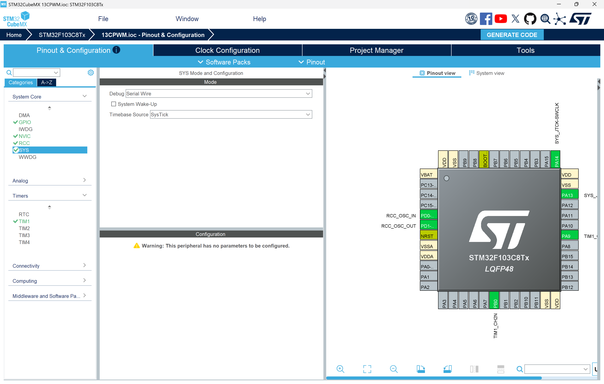
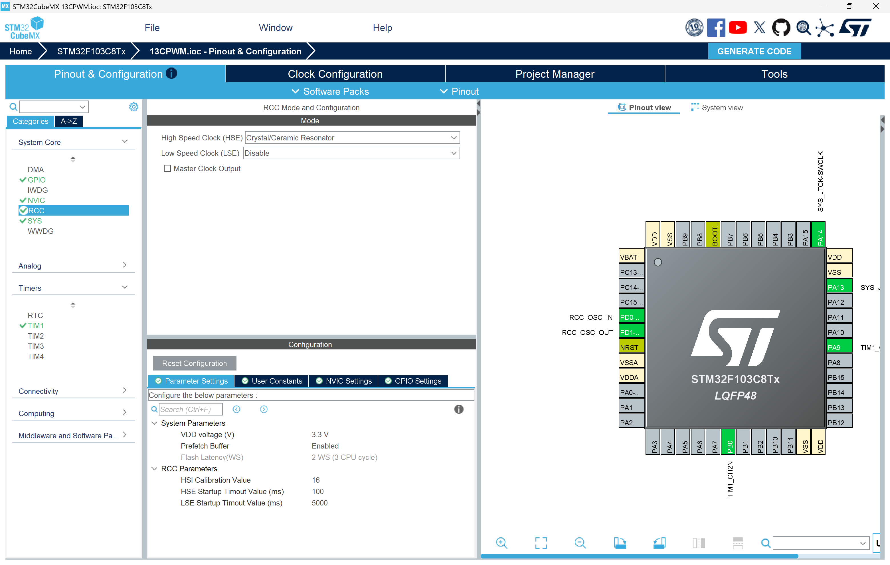
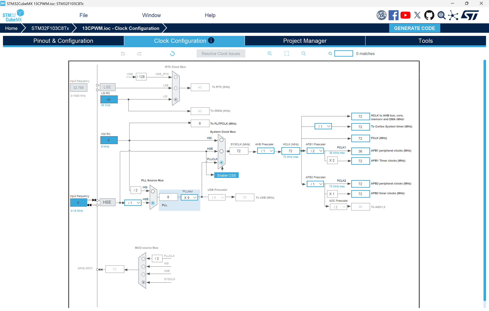
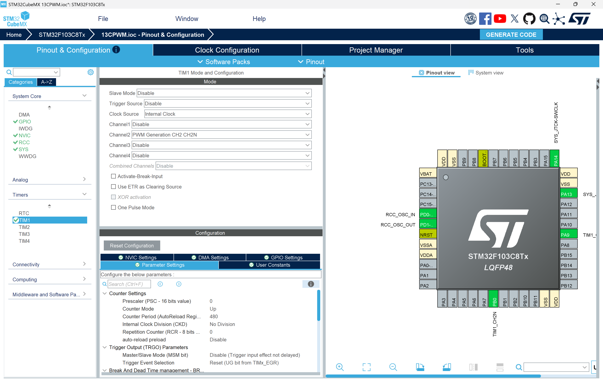
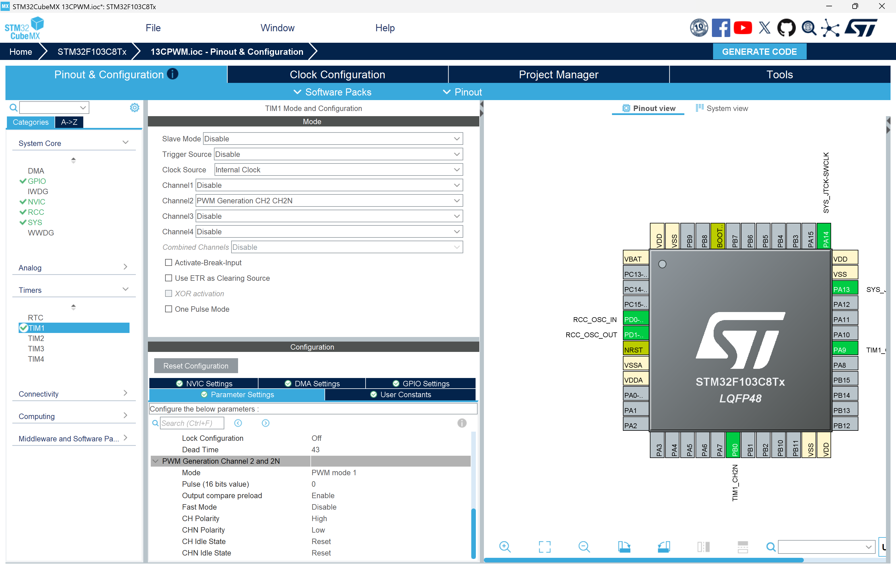
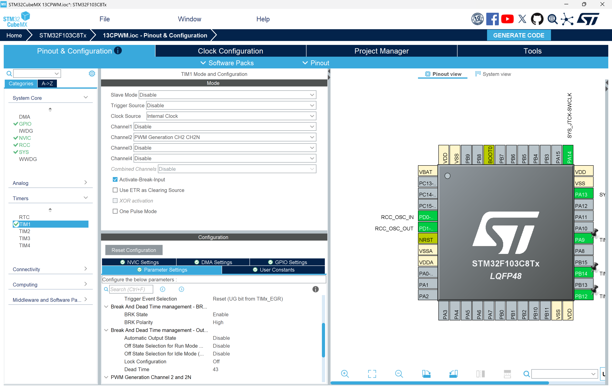
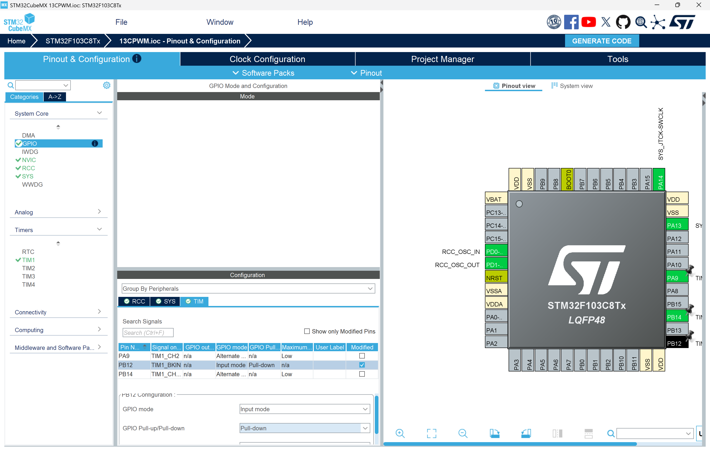
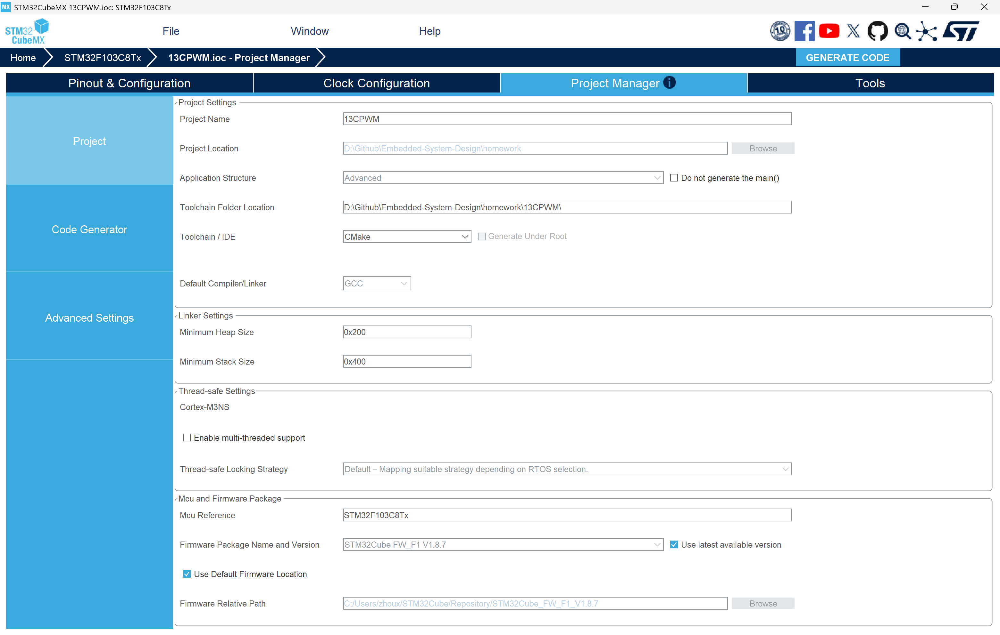
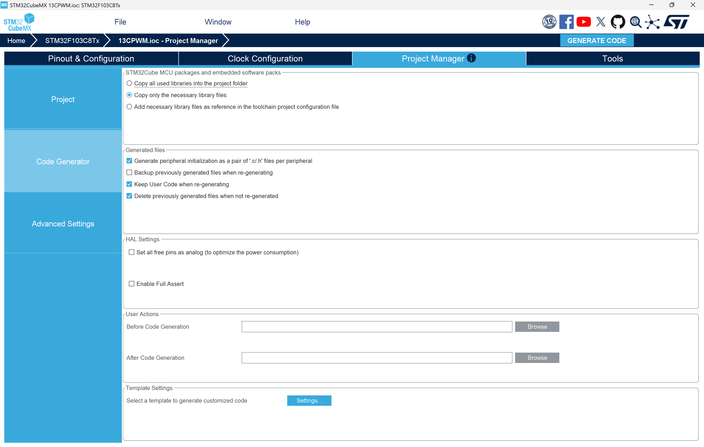
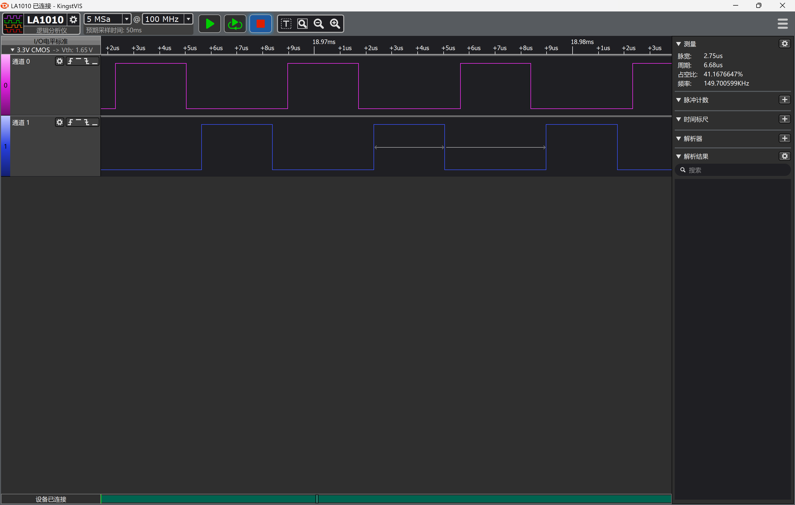

# STM32 高级定时器 — 互补 PWM 输出实验

## 统一作业说明

### 学生需要完成的核心任务

1. 使用 STM32CubeMX 完成 TIM1 高级定时器、互补 PWM 通道、死区时间、刹车输入、时钟树、调试接口等配置，并保留 `.ioc` 文件。
2. 基于 HAL 库与高级定时器实现硬件互补 PWM 输出，CH2 (PA9) 与 CH2N (PB14) 输出 50% 占空比的互补波形，带死区插入。
3. 成功编译、下载并在硬件上用逻辑分析仪验证互补 PWM 波形及死区时间。
4. 在实验报告中说明定时器配置参数、互补 PWM 原理、死区时间计算、代码结构、实验现象、问题排查和课后思考。
5. 按 [00Template/README.md](../00Template/README.md) 中提供的 LaTeX 模板撰写中文实验报告并提交 PDF。

### 本次作业验收目标

| 项目 | 要求 |
|------|------|
| 处理器平台 | STM32F103C8T6 |
| 外设 | TIM1 高级定时器 + CH2 (PA9) / CH2N (PB14) 互补输出 + BKIN (PB12) 刹车输入 |
| 必做功能 | 50% 占空比互补 PWM 输出，带死区时间 |
| 理论要求 | 能解释互补 PWM 原理、死区时间计算、高级定时器与通用定时器的区别、刹车功能的作用 |
| 验收方式 | 提交 PDF 格式实验报告，包含配置截图、代码分析、逻辑分析仪波形截图和课后思考题书面回答 |

### 本次必须提交的内容

1. 一份 PDF 格式实验报告（含 CubeMX 各步骤配置截图、关键代码截图、逻辑分析仪波形截图）。
2. 课后思考题的书面回答（写在报告中）。

### 报告必须回答的问题

1. 什么是互补 PWM？为什么电机驱动、开关电源等应用中需要互补 PWM 和死区时间？
2. 死区时间 DTG=43 对应的实际时间是多少？如何通过定时器时钟频率计算死区时间？
3. 高级定时器 TIM1 与通用定时器（如 TIM3）在功能上有哪些主要区别？
4. 刹车功能（Break）在互补 PWM 应用中的作用是什么？本实验中 BKIN 引脚为何要配置为 Pull-down？
5. 如果将 OCPolarity 和 OCNPolarity 分别改为不同极性（一个 HIGH 一个 LOW），输出波形会发生什么变化？为什么？

---

## 关键说明

TIM1 是 STM32F103 的高级定时器，自带死区发生器和互补 PWM 输出功能，可直接输出带死区保护的 CHx 和 CHxN 互补信号。互补 PWM 广泛用于电机驱动半桥 / 全桥电路、开关电源等需要上下桥臂交替导通的场景，死区时间用于防止上下桥臂同时导通造成短路。

---

## 实验目的

本实验基于 STM32 的高级定时器 TIM1 实现硬件互补 PWM 输出，要求学生完成从 CubeMX 配置、代码生成、程序编写到硬件验证的完整实验流程。通过本实验，你应掌握以下内容：

1. 理解高级定时器与通用定时器的功能区别。
2. 掌握 STM32CubeMX 中高级定时器互补 PWM 的配置方法。
3. 理解互补 PWM 的工作原理以及死区时间的作用和计算方法。
4. 理解刹车功能在电机驱动中的保护作用。
5. 学会使用逻辑分析仪验证互补 PWM 波形和死区时间。

---

## 实验环境

### 硬件环境

1. STM32F103C8T6 核心板一块。
2. ST-Link 下载器。
3. 逻辑分析仪（用于观察互补 PWM 波形和死区时间）。

### 软件环境

1. STM32CubeMX。
2. VS Code 或其他支持该工程的 STM32 开发环境。
3. ARM GCC / CMake 工具链或等效编译环境。
4. ST-Link 驱动。

---

## STM32CubeMX 配置步骤

下面每一步的截图必须保留在实验报告中，因为这些配置是实验成功的前提。你不仅要会"照着做"，还要理解每一步为什么这样设置。

### 新建工程并选择芯片

打开 STM32CubeMX，点击 **ACCESS TO MCU SELECTOR**，选择 **STM32F103C8T6**。

### 配置调试接口（SYS）

在 **Pinout & Configuration** → **System Core** → **SYS** 中，将 **Debug** 设置为 **Serial Wire**。

这样做的原因是：

1. 便于后续通过 ST-Link 下载和调试程序。
2. 如果未正确配置调试接口，可能出现芯片无法正常调试或下载的问题。

{ width=72% }

### 配置高速外部时钟（RCC）

在 **Pinout & Configuration** → **System Core** → **RCC** 中，将 **High Speed Clock (HSE)** 设置为 **Crystal/Ceramic Resonator**。

这样做的目的是为 PLL 和系统时钟提供稳定的外部时钟来源（8 MHz 晶振）。

{ width=72% }

### 配置时钟树（Clock Configuration）

进入 **Clock Configuration** 页面：

1. 将系统时钟源选择为 **PLLCLK**。
2. 设置 **HSE** 为 8 MHz。
3. 设置 **PLLMul** 为 x9，使 **PLLCLK** = 72 MHz。
4. 确保 **HCLK** = 72 MHz，**APB2 Timer Clocks** = 72 MHz（TIM1 挂在 APB2 总线上）。
5. 确认 **APB1 Prescaler** = /2，**APB2 Prescaler** = /1。

{ width=72% }

### 配置 TIM1 基本参数

在 **Pinout & Configuration** → **Timers** 中，选择 **TIM1**：

1. **Clock Source**：**Internal Clock**（使用内部时钟源）
2. 在下方参数设置区域：
   - **Prescaler**：0（不分频，定时器计数时钟 = 72 MHz）
   - **Counter Mode**：**Up**（向上计数模式）
   - **Counter Period (AutoReload - 16 bits value)**：480
   - **Auto-reload preload**：**Enable**

> **参数说明**：定时器 PWM 频率计算公式为——
>
> ```
> F_pwm = Tclk / ((Prescaler + 1) × (Counter Period + 1))
>       = 72 MHz / (1 × 481)
>       ≈ 149.7 kHz
> ```
>
> 占空比分辨率 = 481 级（0 ~ 480），设置 CCR = 240 即可获得约 50% 占空比。

{ width=72% }

### 配置互补 PWM 输出通道（CH2 + CH2N）

在 **TIM1 Mode and Configuration** 面板中：

1. 将 **Channel2** 设置为 **PWM Generation CH2 CH2N**（互补 PWM 输出模式）。
2. 在下方 Channel2 参数设置区域：
   - **Mode**：**PWM mode 1**（CNT < CCR 时输出有效电平）
   - **Pulse**：0（初始占空比，程序中设为 240）
   - **CH Polarity**：**High**（CH2 输出极性为高有效）
   - **CHN Polarity**：**High**（CH2N 输出极性为高有效，与 CH 相同极性才能得到互补输出）

> **互补输出原理**：TIM1 高级定时器的死区发生器内部已对 CHxN 做了反相处理。因此 CHx 和 CHxN 的极性必须设为**相同**，才能得到真正的互补波形。若设为不同极性，内部反相与极性反相抵消，两路输出将变为同相。

{ width=72% }

### 配置死区时间与刹车功能

在 TIM1 配置面板中找到 **Break and Dead-Time settings** 区域：

1. **Dead Time**：43（约 0.6 μs 死区时间）
2. **BRK**：勾选启用刹车功能
3. **BRK Polarity**：**High**（刹车输入高有效）

> **死区时间计算**：
>
> ```
> Tdts = 1 / 72 MHz ≈ 13.89 ns
> Dead Time = DTG × Tdts = 43 × 13.89 ns ≈ 0.6 μs
> ```
>
> **刹车功能说明**：当 BKIN 引脚（PB12）检测到有效电平时，硬件自动关闭 CHx 和 CHxN 输出，用于电机驱动中的过流、过压等故障保护。PB12 配置为 Pull-down 确保正常工作时刹车不被误触发。

{ width=72% }

### 配置 BKIN 刹车输入引脚（GPIO）

在右侧 **Pinout view** 中，点击 **PB12** 引脚，选择 **TIM1_BKIN**。

在 **System Core** → **GPIO** 中找到 PB12，进行以下设置：

1. **Mode**：**Input**（刹车输入）
2. **GPIO Pull-up/Pull-down**：**Pull-down**（下拉，确保正常工作时刹车不被触发）

这样做的原因是：刹车极性设为 High，若 PB12 浮空或为高电平，会误触发刹车导致 PWM 无输出。配置为 Pull-down 可确保默认不触发刹车。

{ width=72% }

### 工程设置与生成代码

在 **Project Manager** 页面：

1. **Project Name**：`13CPWM`
2. **Project Location**：选择当前 `13CPWM` 目录
3. **Toolchain / IDE**：选择 **CMake**



切换到 **Code Generator** 选项卡：

1. 勾选 **Generate peripheral initialization as a pair of '.c/.h' files per peripheral**，这样 TIM1 初始化代码会生成到独立的 `tim.c` / `tim.h` 文件中，便于代码管理。



最后点击 **GENERATE CODE** 生成工程。

---

## 硬件连接要点

| 引脚 | 功能 | 连接 |
|------|------|------|
| PA9 | TIM1_CH2（主输出） | 逻辑分析仪通道 0 |
| PB14 | TIM1_CH2N（互补输出） | 逻辑分析仪通道 1 |
| PB12 | TIM1_BKIN（刹车输入） | 板载 Pull-down，无需外部连接 |
| GND | 地 | 逻辑分析仪 GND |

注意：逻辑分析仪的 GND 必须与 STM32 核心板的 GND 共地，否则可能无法正确捕获波形。

---

## 本工程实现的实验内容

当前工程实现了基于 TIM1 高级定时器的硬件互补 PWM 输出，功能如下：

1. 系统启动后自动输出固定 50% 占空比的互补 PWM 波形。
2. CH2 (PA9) 与 CH2N (PB14) 输出极性相反的互补波形，带约 0.6 μs 死区时间。
3. PWM 频率约 149.7 kHz。
4. 刹车功能已启用，PB12 默认下拉确保正常输出。

---

## 核心代码说明

### 互补 PWM 硬件原理

硬件互补 PWM 通过 TIM1 高级定时器的以下硬件模块实现：

1. **时基单元**（Prescaler + Counter + ARR）：产生 PWM 载波。
2. **输出比较通道**（CCR）：根据比较值产生 OCxREF 参考信号。
3. **死区发生器**（Dead-Time Generator）：在 OCxREF 基础上插入死区，并产生互补的 CHx 和 CHxN 输出。
4. **刹车模块**（Break）：检测 BKIN 引脚，故障时硬件关闭输出。

下图展示了硬件互补 PWM 的信号流程：

```
时基单元 (CNT) ──→ 输出比较 (CCR) ──→ OCxREF ──→ 极性控制 (CCxP) ──→ CH2 (PA9)
                                              └─→ 死区+内建反相 ──→ 极性控制 (CCxNP) ──→ CH2N (PB14)
```

与软件 PWM 不同，硬件互补 PWM 的波形生成完全由定时器硬件完成，无需 CPU 中断参与，波形精度高、时序稳定、CPU 占用为零。

### main.c 中启动互补 PWM 的代码

在 `Core/Src/main.c` 中找到 `/* USER CODE BEGIN 2 */`，添加以下代码：

```c
/* USER CODE BEGIN 2 */
__HAL_TIM_SET_COMPARE(&htim1, TIM_CHANNEL_2, 240);  // 设置 CCR = 240，占空比 50%
HAL_TIM_PWM_Start(&htim1, TIM_CHANNEL_2);           // 启动 CH2 主输出 (PA9)
HAL_TIMEx_PWMN_Start(&htim1, TIM_CHANNEL_2);        // 启动 CH2N 互补输出 (PB14)
/* USER CODE END 2 */
```

代码解析：

1. `__HAL_TIM_SET_COMPARE` 宏用于设置捕获 / 比较寄存器 CCR 的值。ARR = 480，CCR = 240 表示占空比 = 240 / 480 = 50%。修改此值即可改变占空比。
2. `HAL_TIM_PWM_Start` 启动 CH2 主输出，使能 TIM1 计数器并使 PA9 输出 PWM。
3. `HAL_TIMEx_PWMN_Start` 启动 CH2N 互补输出，使 PB14 输出与 CH2 互补的 PWM 波形。

> 为什么 CubeMX 生成了 `MX_TIM1_Init()` 仍需手动启动？CubeMX 生成的初始化函数只配置寄存器（预分频器、ARR、CCR、输出比较模式等），不会启动定时器计数和 PWM 输出。必须手动调用 `HAL_TIM_PWM_Start` 和 `HAL_TIMEx_PWMN_Start` 来使能计数器并连接输出。

### CubeMX 生成的 TIM1 初始化代码

```c
htim1.Instance = TIM1;
htim1.Init.Prescaler = 0;                          // 不分频，72 MHz
htim1.Init.CounterMode = TIM_COUNTERMODE_UP;        // 向上计数
htim1.Init.Period = 480;                            // ARR = 480
htim1.Init.AutoReloadPreload = TIM_AUTORELOAD_PRELOAD_ENABLE;  // 预装载使能

sConfigOC.OCMode = TIM_OCMODE_PWM1;                 // PWM 模式 1
sConfigOC.Pulse = 0;                                // 初始 CCR = 0
sConfigOC.OCPolarity = TIM_OCPOLARITY_HIGH;          // CH2 极性：高有效
sConfigOC.OCNPolarity = TIM_OCNPOLARITY_HIGH;        // CH2N 极性：高有效（相同=互补）

sBreakDeadTimeConfig.DeadTime = 43;                  // 死区 ≈ 0.6 μs
sBreakDeadTimeConfig.BreakState = TIM_BREAK_ENABLE;  // 刹车使能
sBreakDeadTimeConfig.BreakPolarity = TIM_BREAKPOLARITY_HIGH;  // 刹车高有效
```

### 互补 PWM 波形示意图

```
CNT:   0 ──────────→ 240 ──────────→ 480 ──→ 0 ──→

OCxREF: ────────────┐                  ┌────────────
                     └──────────────────┘

PA9 (CH2): ────────┐                    ┌──────────
                    ├──── 死区 ──────────┤
PB14 (CH2N):        └────────────────────┘        ────────
                    ← 50% →              ← 50% →

死区细节（切换瞬间放大）：
        ┌──┐                              ┌──┐
CH2: ───┘  └──────────────────────────────┘  └───
           ├─ 死区 (~0.6μs) ─┤
CH2N: ─────┐                              ┌──────
           └──────────────────────────────┘
```

---

## 编程技巧总结

1. 高级定时器的互补 PWM 由硬件自动生成，不需要中断参与，CPU 可完全专注于其他任务。
2. CHx 和 CHxN 的极性必须设为**相同**，因为死区发生器内部已对互补通道做了反相。
3. 刹车输入引脚应配置为 Pull-down（刹车高有效时）或 Pull-up（刹车低有效时），避免浮空误触发。
4. CubeMX 生成的 `MX_TIMx_Init()` 只初始化配置，启动 PWM 需额外调用 `HAL_TIM_PWM_Start` 和 `HAL_TIMEx_PWMN_Start`。
5. 使能 Auto-reload preload 可保证修改 ARR 值时在新周期开始时生效，避免周期毛刺。

---

## 实验操作步骤

### 配置 CubeMX 并生成代码

按第 3 节步骤完成配置，点击 GENERATE CODE。

### 添加应用代码

在 `Core/Src/main.c` 中按第 6.2 节代码说明，在 `/* USER CODE BEGIN 2 */` 区域添加 PWM 启动代码。

### 编译工程

使用当前开发环境编译工程，确认无编译错误。

### 烧录程序

通过 ST-Link 将程序下载到 STM32 开发板。

### 逻辑分析仪验证

1. 将逻辑分析仪通道 0 接 PA9，通道 1 接 PB14，GND 接板子 GND。
2. 设置采样率 ≥ 10 MHz（PWM 频率约 150 kHz，至少 10 倍以上采样率）。
3. 观察两路波形：CH2 与 CH2N 应为互补关系，且切换瞬间存在约 0.6 μs 的死区（两路同时为低）。

---

## 实验现象与结果分析

如果实验成功，你应在逻辑分析仪上看到如下现象：

1. PA9 (CH2) 输出方波，频率约 149.7 kHz，占空比约 50%。
2. PB14 (CH2N) 输出方波，与 CH2 互补（CH2 为高时 CH2N 为低，反之亦然）。
3. 放大观察 PWM 切换边沿，可见两路信号同时为低的死区区域，持续时间约 0.6 μs。



这些现象说明：

1. TIM1 定时器及其 PWM 配置正确，时基正常计数并在 481 个时钟周期处溢出。
2. 互补 PWM 逻辑正确，CH2 和 CH2N 输出真正的互补波形。
3. 死区发生器工作正常，DTG=43 对应的约 0.6 μs 死区时间符合预期。
4. 刹车功能已启用但未触发（PB12 下拉），PWM 正常输出。

---

## 常见问题排查

| 问题 | 可能原因与解决方案 |
| :--- | :--- |
| 两路均无波形输出 | 检查是否调用了 `HAL_TIM_PWM_Start` 和 `HAL_TIMEx_PWMN_Start`；检查 PB12 是否为低电平（刹车是否误触发）。 |
| CH2 与 CH2N 波形完全相同 | 检查 OCPolarity 与 OCNPolarity 是否设为相同。TIM1 死区发生器内部已反相，极性必须相同才互补。 |
| 波形正常但看不到死区 | 逻辑分析仪采样率太低，需提高至 10 MHz 以上并放大边沿观察。 |
| 程序下载后无反应 | 检查 SYS Debug 是否配置为 Serial Wire；检查 HSE 和时钟树配置。 |
| 刹车功能误触发 | 检查 BKIN 引脚是否有上拉 / 下拉，确认与 Break Polarity 设置匹配。 |

---

## 课后思考题

请结合本次实验，在报告中认真回答以下问题：

1. 什么是互补 PWM？为什么电机驱动、开关电源等应用中需要互补 PWM 和死区时间？
2. 死区时间 DTG=43 对应的实际时间是多少？如何通过定时器时钟频率计算死区时间？
3. 高级定时器 TIM1 与通用定时器（如 TIM3）在功能上有哪些主要区别？
4. 刹车功能（Break）在互补 PWM 应用中的作用是什么？本实验中 BKIN 引脚为何要配置为 Pull-down？
5. 如果将 OCPolarity 和 OCNPolarity 分别改为不同极性（一个 HIGH 一个 LOW），输出波形会发生什么变化？为什么？

---

## 实验报告提交要求

### 报告建议结构

1. 封面：课程名称、作业名称、姓名、学号、班级、日期。
2. 作业目标：简述本实验需要实现的功能与验收指标。
3. 实验环境：开发板型号、调试器、逻辑分析仪、软件版本。
4. CubeMX 配置：必须说明 SYS、RCC、Clock Configuration、TIM1 基本参数、互补 PWM 通道、死区与刹车、BKIN GPIO、工程设置、代码生成选项的关键设置及其原因，并附上每一步的配置截图。
5. 程序设计：分析 `main.c` 中的 PWM 启动代码和 `tim.c` 中 CubeMX 生成的初始化代码。
6. 程序流程图：必须展示"时基计数 → 输出比较 → 死区发生器 → 极性控制 → 互补 PWM 输出"的硬件信号流程。
7. 实验步骤：包括编译、下载、逻辑分析仪测量的过程。
8. 实验结果：必须展示逻辑分析仪捕获的互补 PWM 波形和死区放大图。
9. 问题分析与调试记录：说明遇到的任何问题及排查方法。
10. 课后思考题答案：必须完整回答本 README 中 5 个思考题。
11. 总结：概括你对高级定时器、互补 PWM、死区时间和刹车功能的理解。
12. 附录：可附核心代码、更多截图、参考资料。

### 图片与流程图要求

1. 报告中至少包含 10 张截图（SYS、RCC、时钟树、TIM1 基本参数、互补 PWM 通道、死区与刹车、BKIN GPIO、工程设置、代码生成选项、逻辑分析仪波形）。
2. 每张图片必须标注图号和图题，并在正文中说明该图用于证明什么。
3. 程序流程图必须单独成图，不能只用文字描述替代。

### 提交规范

1. 报告文件建议命名为：`学号-姓名-作业13-互补PWM实验.pdf`。
2. 若实验未完全成功，也必须提交完整报告，重点说明失败现象、原因分析和改进方向。
3. 报告中不能只贴代码或截图，必须结合现象进行解释。

### 最低验收标准

1. 逻辑分析仪能够捕获到 PA9 和 PB14 的互补 PWM 波形。
2. 能够说明互补 PWM 的原理和死区时间的计算方法。
3. 报告能够解释高级定时器与通用定时器的区别，以及刹车功能的作用。

---

## 可进一步扩展的方向

1. 通过按键调整占空比，观察互补波形变化。
2. 实际驱动半桥电路 + 电机，验证互补 PWM 的驱动效果。
3. 使能刹车中断，在刹车触发时执行故障处理逻辑。
4. 使用多个通道输出多组互补 PWM，驱动多相电机。
5. 结合 ADC 采样实现闭环控制（如电流环、速度环）。

---

## 总结

本实验通过 STM32F103 的高级定时器 TIM1 实现硬件互补 PWM 输出，涵盖高级定时器时基配置、互补 PWM 通道配置、死区时间设定、刹车功能配置等核心内容。相比于通用定时器，高级定时器专为电机控制和电力电子应用设计，其内建的互补输出、死区发生器和刹车保护功能使驱动半桥 / 全桥电路变得简单可靠。本实验是入门电机驱动控制的基础。
