# 学生作品展示

### 基于STM32的LED驱动电路的设计

###### 小组名：做出来就算成功

 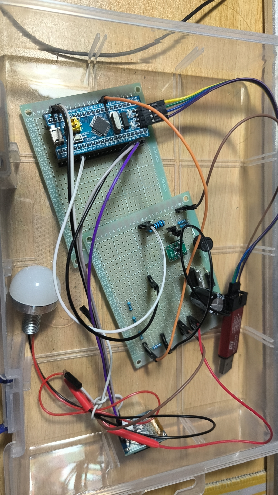 

### 基于STM32的Boost电压变换器的设计

###### 小组名：贴吧蝈楠

 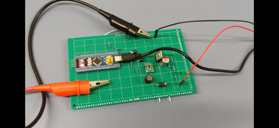 

 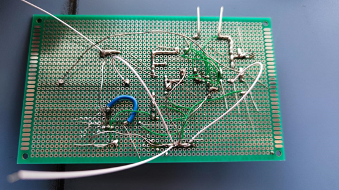 

### 基于STM32的Buck电路的设计

###### 小组名：芯芯向荣

 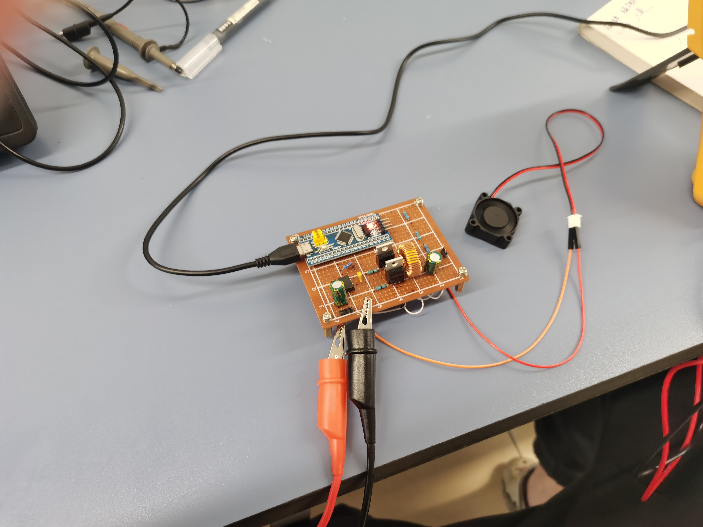 

###### 小组名：造梦东游

 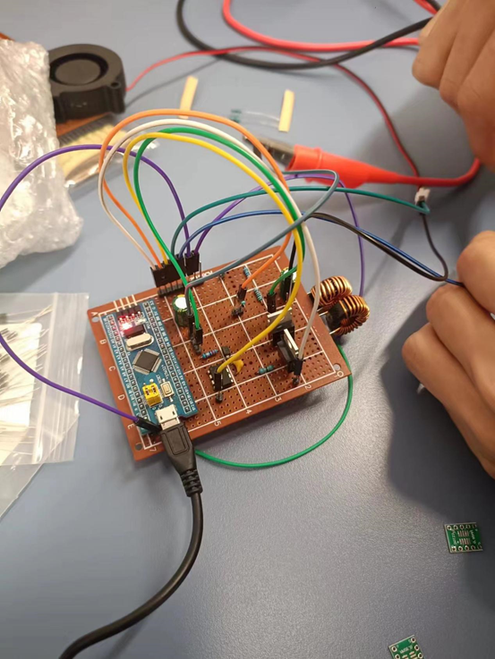 

###### 小组名：dddd

 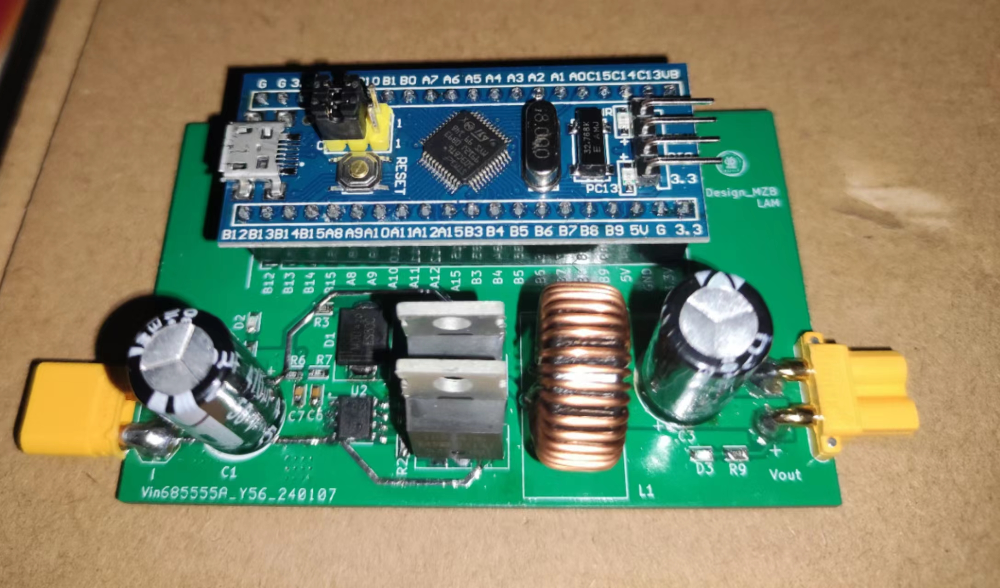 

### 基于STM32串口控制的直流电机

###### 小组名：xkydz

 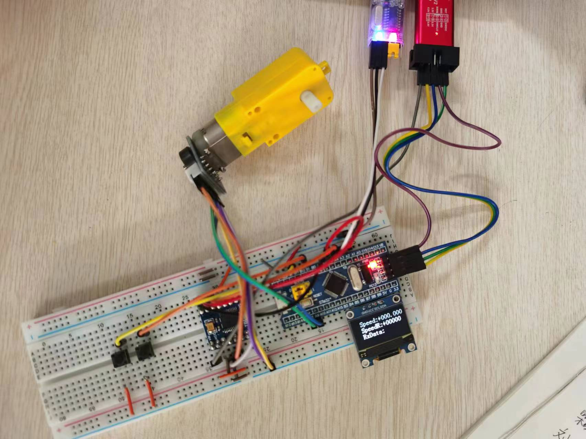 

###### 小组名：阿巴阿巴

 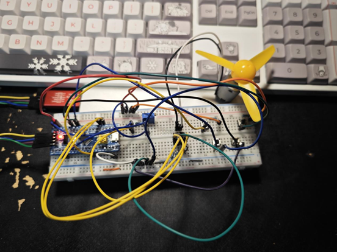 

###### 小组名：半壁江山

  

###### 小组名：好运连连

  

###### 小组名：摩尔庄园

  

###### 小组名：普芯男孩

 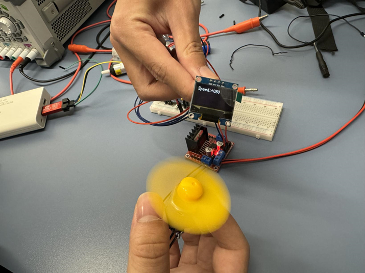 

###### 小组名：造梦西游

 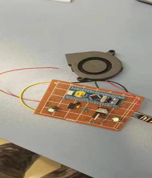 

###### 小组名：还没想好

  

###### 小组名：那咋办嘛

 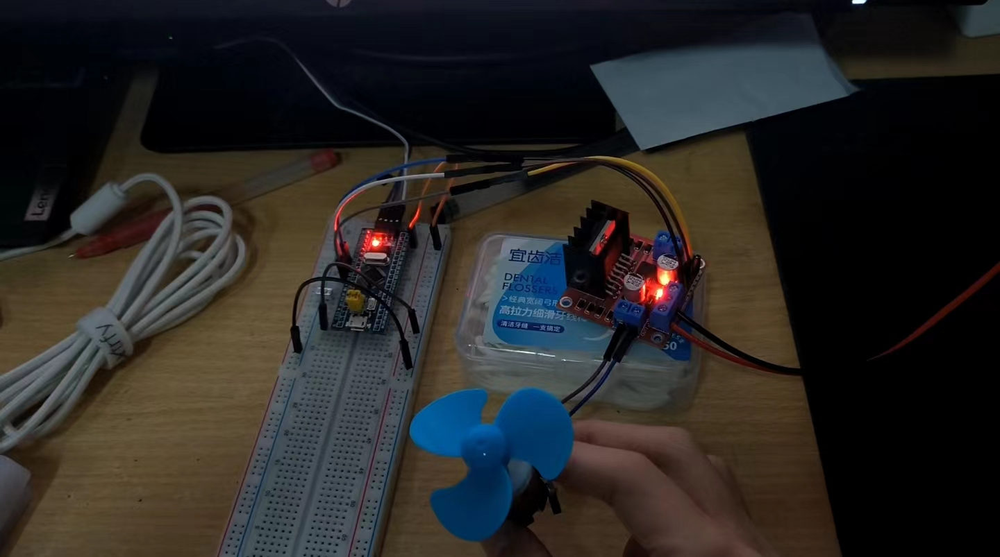 

###### 小组名：贞子满天飞

 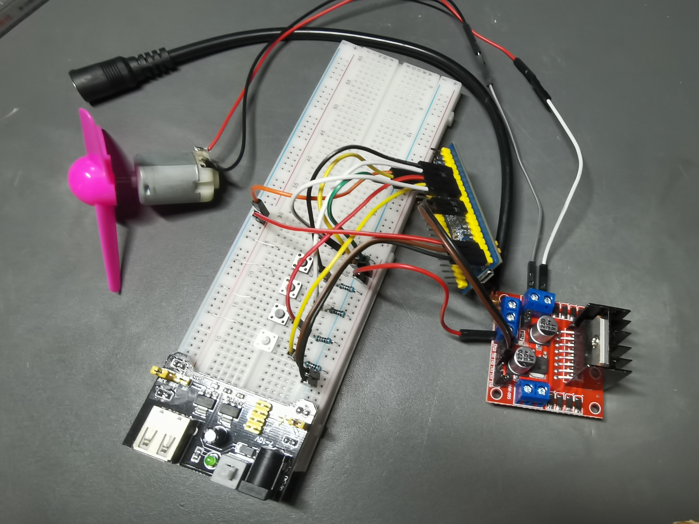 

