[TOC]

# 基于STM32的直流电机驱动

## 组名：不知道起什么名字

​       这是基于STM32F103C8T6微控制器通过TB6612电机驱动芯片的直流电机驱动系统，可以实现对直流电机的精确控制，包括速度控制和转向控制，而且增加OLED显示模块用来显示电机速度以及转向。

 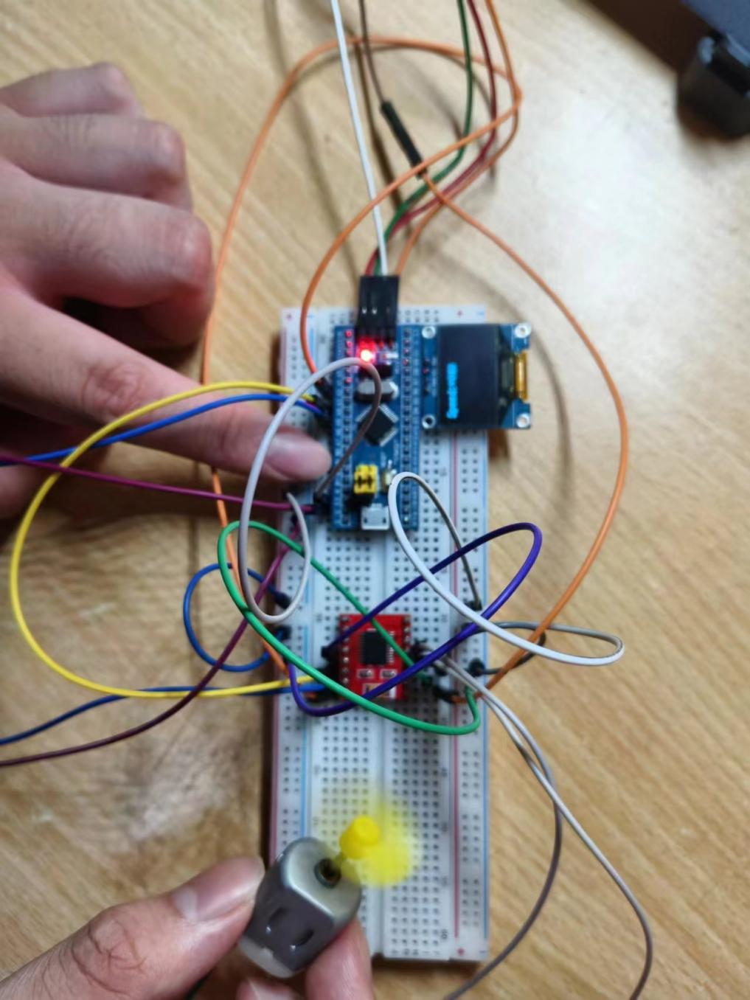 

## 组名：超越小队!

 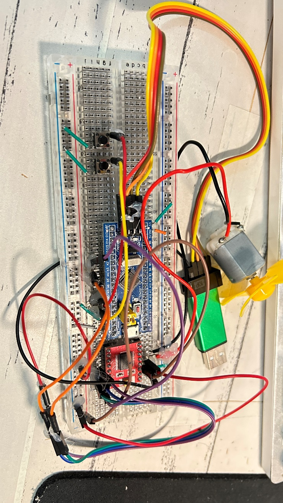 

​        简要说明：本作品是一个按键控制风扇正反转以及PWM调速的智能风扇。由ST-Link接入电机驱动芯片供电，STM32F103C8T6通过检测两个按钮的情况，输出PWM信号控制转速，和两个GPIO信号IO口控制正反转。

## 组名：呵呵

 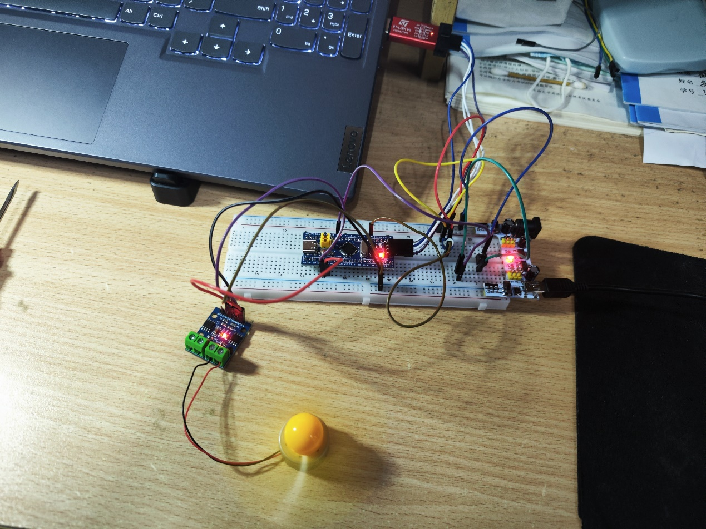 

​       在直流电机驱动中，控制电机的转速通常使用PWM（脉冲宽度调制）信号来实现。PWM信号以固定的频率在高和低电平之间切换，通过调整高电平的持续时间（占空比）来控制电机的转速。 在这个设计中，需要将STM32的GPIO配置为PWM输出模式，并设置合适的频率和占空比来生成PWM信号。PWM信号将连接到直流电机的驱动器上，从而控制电机的转速。 为了实现转速控制，将使用ADC来采集控制电机转速的信号。需要连接一个电机转速控制信号到STM32的ADC引脚上。ADC将读取传感器的输出值，并将其转换为数字信号。 通过比较设定的转速控制信号和实际采集到的转速控制信号，使用控制算法来调整PWM信号的占空比，从而实现转速的转速。通过开关来实现电机的正反转

成员：钟洋3122009684，周嘉乐3122009685

## 组名：卷狗龙颜大悦队

金岷数 黎展睿 傅崇峻

 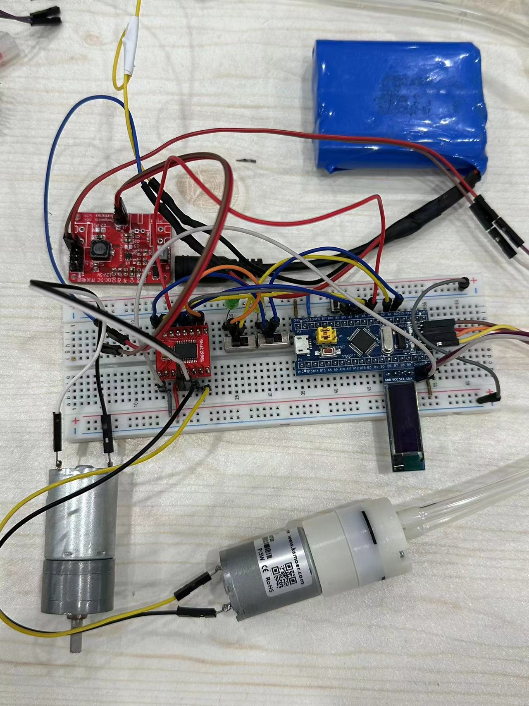 

​        本项目的设计基于**STM32F103C8T6**，专注于直流电机的驱动和转速控制；采用**TB6612驱动板**处理主控的GPIO口输出，以实现精确的电机控制；使用**MP2315系列开关电源芯片自行设计开关电源模块**以实现供电。

​        项目的核心是**通过PWM技术精确控制电机转速**，同时利用外围设备如**OLED显示屏、MP2315开关电源模块和LED呼吸灯**，实现实时状态监测和用户交互。

## 组名：来一把队

 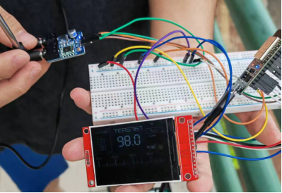 

​       基于ESP32 WROOM开发板，设计了一套无线电接收系统。以天线捕获信号并传输数据到处理器，用液晶显示屏显示这些信息

## 组名：列1小组

通电后，电机静止待命；

在电机静止状态下，每次按下图1左侧下方按键后，电机向负方向加速转动，最多向负方向加速三次即达到速度上限。此时按下图1右侧按键或左侧上方按键，电机将恢复静止状态；

在电机静止状态下，每次按下图1左侧上方按键后，电机向正方向加速转动，最多向正方向加速三次即达到速度上限。此时按下图1右侧按键或左侧下方按键，电机将恢复静止状态；

在电机静止状态下，按下图1右侧按键后，呼吸灯会按照节奏亮灭；

当光敏传感器被遮挡时，蜂鸣器会发出警报，以此模拟风扇实际使用时，扇叶运行空间被异物阻挡的危险情况的应对方法。

下附成品图：

 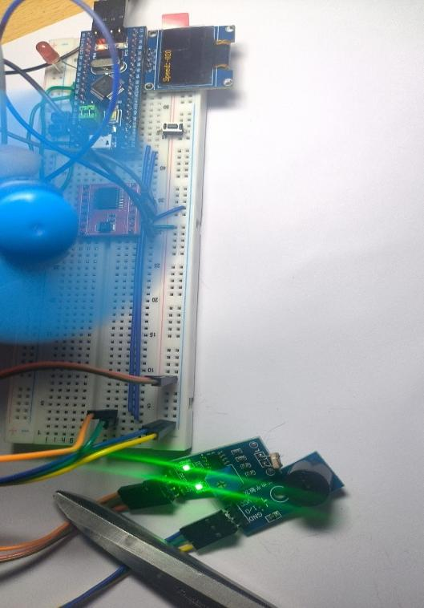 

 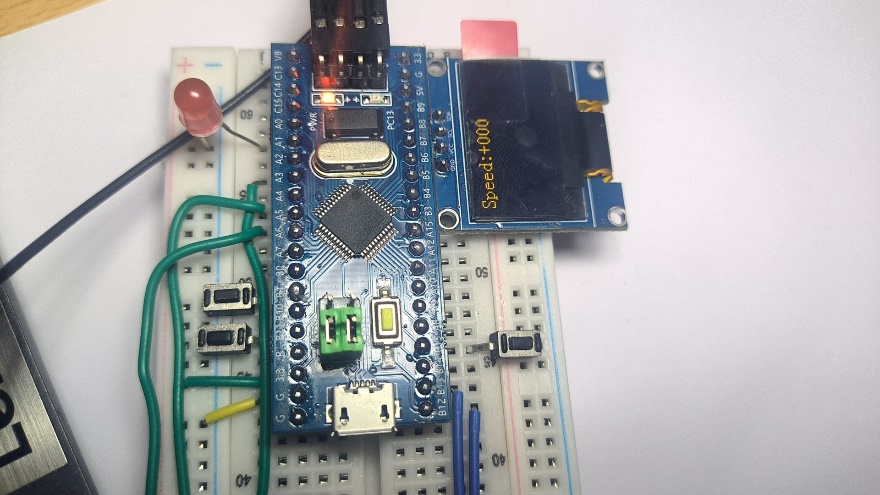 

## 组名：群聊

 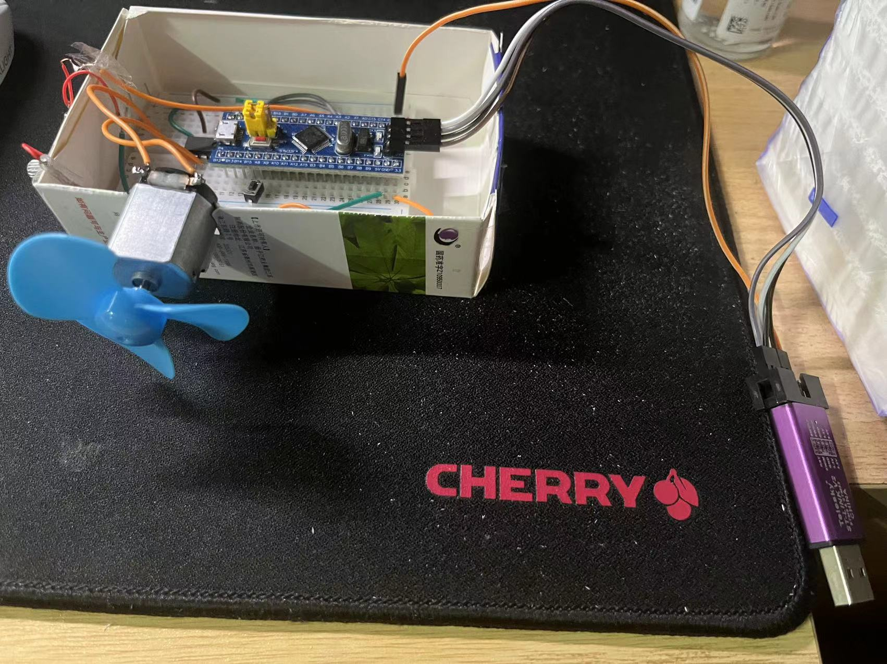 

队员：周元锐、朱纬韬、陈轩楠

说明：这是一个基于STM32F103C8T6最小系统版设计的电机，可以控制转速、调整正反转

## 组名：随便组个队

功能：利用 stm32微控制器实现对直流电机的控制，包括电机的启动、停止、正反转以及调速功能，并将电机的转速大小及方向显示在 OLED屏上，以便观察。同时增设 LED灯，使整体功能在黑暗环境下也能正常呈现。

成果展示：

 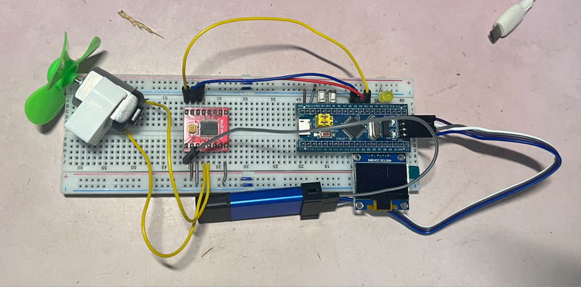 

## 组名：唐完就是宋

作品：可调速小风扇

主要元件：STM32最小系统板、L298N电机驱动、LCD1602显示屏

实现功能：四个按键分别控制启动/暂停、正反转、加速和减速，并实时在LCD显示屏上显示当前占空比与电机旋转方向。

 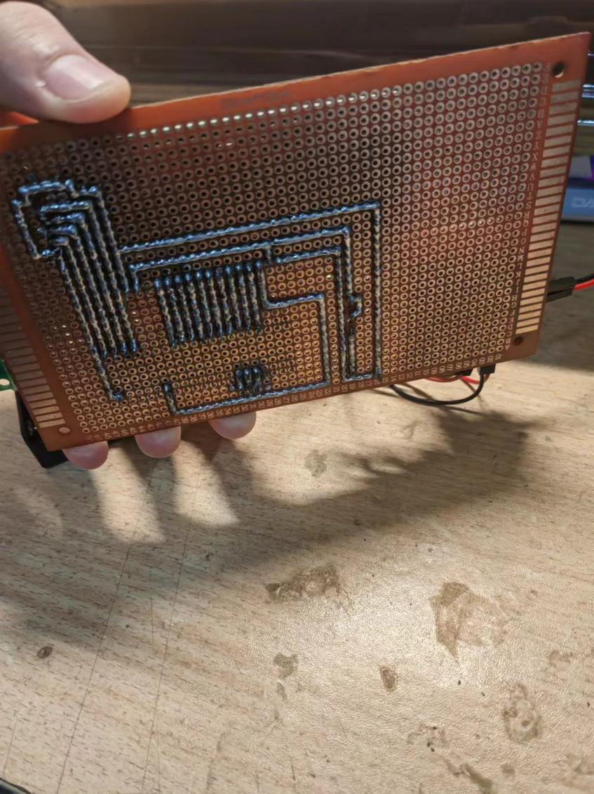 

 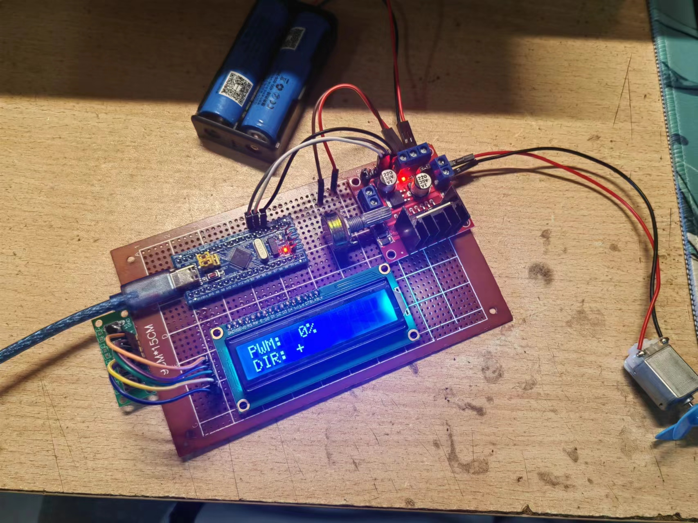 

## 组名：桃子拉勾

 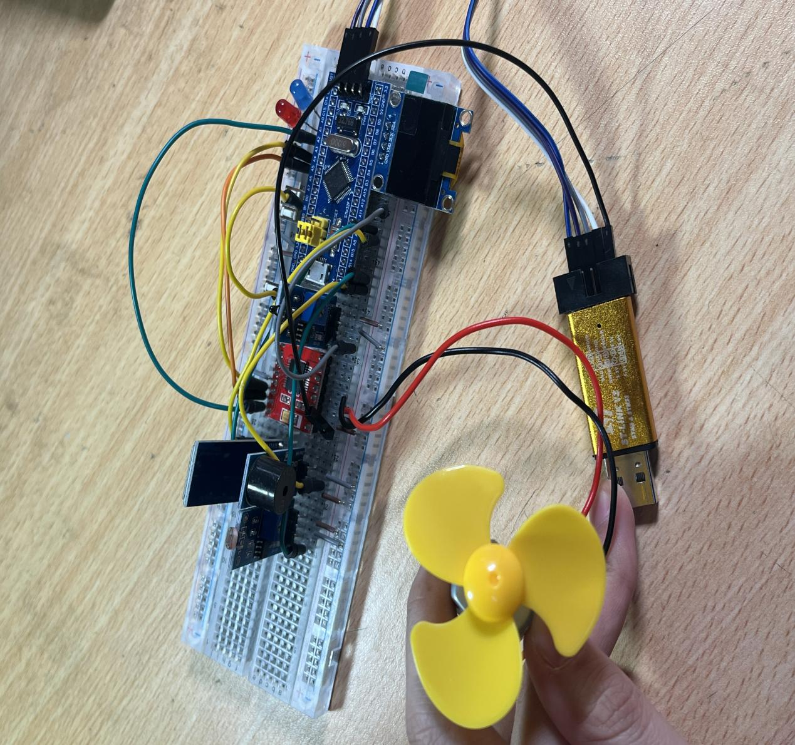 

说明：该作品是一个基于stm32f103C8T6最小系统板的小风扇。这个风扇有三个模式：手动调档模式、自动温控模式和蓝牙调档模式。我们还增加了OLED、蜂鸣器、光敏传感控制等模块作为辅助功能

## 组名：我没资格

​       在keil5上使用L9110S电机驱动芯片的电机驱动程序；通过输出PWM波来控制电机正反转；B0用于控制正反转的开关输入；A0用于检测ADC电压，控制PWM占空比；A8,A9口为PWM的输出端口；A8对应BAK管脚，A9对应FOR管脚。

1. **直流电机成果展示图**

   
 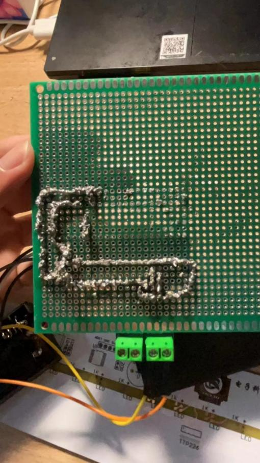 

   
 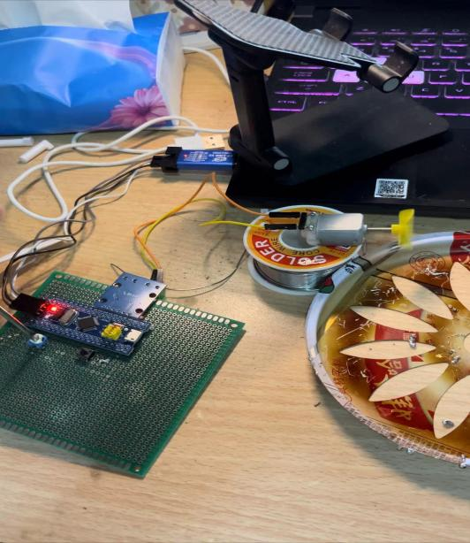 

## 组名：已老实求放过

 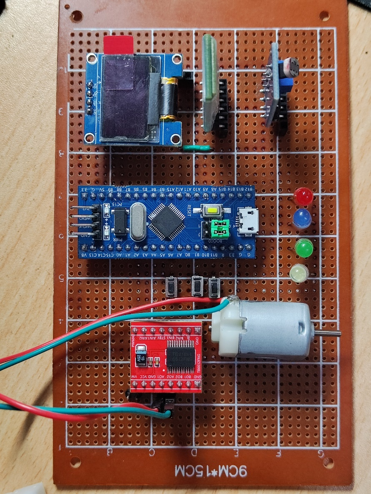 

选题：基于stm32的直流电机驱动

功能：按键1控制电机开启、调速，按键2控制电机正反转，按键3控制流水灯开启与关闭；

​        光敏传感器控制LED整体亮灭，环境暗时LED全部亮起（流水灯失效）；蓝牙模块接收手机发送的指令，L1开启流水灯，L0关闭流水灯，M1开启电机，M0关闭电机；OLED显示电机和LED状态