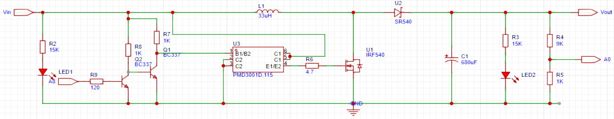

# 基于STM32的Boost电压变换器的设计

## 介绍

BOOST电压变换器是一种DC-DC电源转换器，用于将输入电压转换为高于输入电压的输出电压。它采用了电感储能和电容递送能量的方式来实现电压的升高。
BOOST电压变换器的基本原理是通过开关管（如MOSFET）的开关控制，使得电流在电感和电容之间循环流动，从而实现电压的变换。在工作周期内，切换管接通时，电感储能，贮存电能；切换管断开时，电容递送储存的能量给负载，实现输出电压的升高。
BOOST电压变换器常被广泛应用于以下场景： 1. 电源管理：在各种电子设备中，如计算机、手机、平板电脑等，BOOST电压变换器被用来提供稳定的电源电压，以满足设备的工作要求。 2. 太阳能和风能应用：由于太阳能和风能发电系统的输出电压通常较低，BOOST电压变换器可以提升电压水平，以便将电能注入电网或存储到蓄电池。 3. 汽车电子系统：BOOST电压变换器可用于汽车电子系统中，例如DC-DC转换器输入电压为12V的汽车电池升压到更高的电压级别，以供给汽车电子设备，如车载娱乐系统、车载导航等。

## 基本原理

BOOST电压变换器是一种DC-DC升压转换器，用于将输入电压转换为高于输入电压的输出电压。其基本原理是通过开关元件（通常是MOSFET）的周期性开关操作，控制能量的存储和释放。
Boost转换器的主要组成部分包括输入电源、开关元件、电感、输出电容和负载。当开关元件处于导通状态时，输入电源的电流通过电感储存能量。此时，电感上的电流增加，储存的磁能量也增加。当开关元件断开时，电感上的电流无法立即变为零，因为电感会产生反向电压。这导致电感上的电流继续流动，但方向相反。同时，输出电容通过电感和负载提供电流，以维持输出电压。
当开关断开时，电感上的电流逐渐减小，直到达到零。此时，电感储存的磁能量转化为电势能，并通过二极管传递到输出电容和负载。输出电容将这些能量平滑化，以提供稳定的输出电压。
为了控制输出电压，Boost转换器通常配备一个控制电路，例如脉宽调制（PWM）控制器。控制器通过调整开关元件的导通时间和断开时间来控制Boost转换器的工作频率和占空比，从而实现对输出电压的精确调节。
基本原理如下：
1.输入阶段：当开关管（通常为MOSFET）导通时，电感L储存电能，产生磁场；电感L断开时，磁场崩溃，使电感两端电压增加，将能量传递给电容C；电流放大阶段：开关管导通状态下，电感L带有输入电压Vin，此时电容C的另一端与地相连；电容C逐渐充电，逐渐存储电能；输出电压Vo随之上升。
2.输出阶段：当开关管断开时，电感L的磁场崩溃；电感的反向电势将电容C上的电能传递到输出端；输出电压Vo由电容C提供。
3.控制策略：通过控制开关管的导通和断开，可以调整输出电压的大小；通常使用脉宽调制（PWM）来控制开关管的导通时间，从而调节输出电压。总结：BOOST电压变换器通过电感储能和电容递送能量的方式，实现将输入电压升高到输出电压的目的。通过控制开关管的状态和工作周期，可以实现对输出电压的调节和稳定性控制。

## BOOST拓扑结构

  

### 设计步骤

1. 工作原理理解
   了解BOOST电压变换器拓扑结构的工作原理，分析BOOST拓扑结构的特点、优缺点和适用场景。
2. 元件选择
   研究BOOST电压变换器所需的元件，如开关管、电感、电容等。了解常用的元件选型方法、参数计算和特性要求。根据设计要求选择适合的元件的具体方法和步骤。
3. 控制策略设计
   分析BOOST电压变换器的控制原理和方式，如电压模式和电流模式控制。
   解释电压环和电流环控制策略的设计原理和方法，说明如何选择适合BOOST电压变换器的控制策略。
4. 电路参数计算和仿真
   了解BOOST电压变换器关键参数的计算方法，包括电感、电容、电流和功率等。使用电路仿真工具进行电路性能评估和参数调整，如PSPICE或SIMULINK等。进行仿真，理解和验证电路设计的正确性。
5. 实际制造
   根据电路参数计算和仿真结果进行实际电路的制造，分析实验结果，对电路的性能进行评估和优化。

### DEMO参考

参考DEMO所用器件,其中电阻、发光二极管等为列出：

| 器件              | 参数                                             |
| ----------------- | ------------------------------------------------ |
| 功率电感          | 33uH                                             |
| 输出电容          | 680uF                                            |
| 控制芯片          | STM32F103C8T6最小系统板                          |
| 晶体管             | BC337 2个                                          |
| 栅极驱动芯片       | PMD3001D,115                         |
| MOS管             | IRF540N                                          |
| 肖特基二极管      | SR540                                            |
| 负载12V灯泡或风扇 | |

stn32程序框图：

  

通过输出PWM波来控制BOOST电路运行；
对输出电压进行9：1分压，使用ADC检测输出电压值，  参考电压作为PID算法的参考输入，ADC输出值作为PID算法的反馈输入，PID算法据此得出相应的PWM占空比控制电路运行；  在定时器中断中完成PID算法的计算； A0口用于ADC输入；  A8口为PWM输出端口；

将VCC 5V输入升到Vout 12V输出。

原理图如下，其中A0、A8为STM32F103C8T6接口，其最小系统板未在原理图画出。
实例原理图：

  

实例图片：

  

实测数据：

| 输入电压 | 输入电流 | 输入功率 | 输出电压 | 输出电流 | 输出功率 | 效率   | 负载阻值 |
| -------- | -------- | -------- | -------- | -------- | -------- | ------ | -------- |
| 5V       | 0.833A   | 4.16W    | 12.22V   | 0.243A   | 2.97W    | 71.39% | 50R      |
| 5V       | 0.422A   | 2.12W    | 12.34V   | 0.122A   | 1.51W    | 71.22% | 100R     |
| 5V       | 0.239A   | 1.19W    | 12.46V   | 0.061A   | 0.76W    | 63.86% | 200R     |
| 5V       | 0.139A   | 0.70W    | 12.48V   | 0.03A    | 0.37W    | 52.85% | 400R     |
