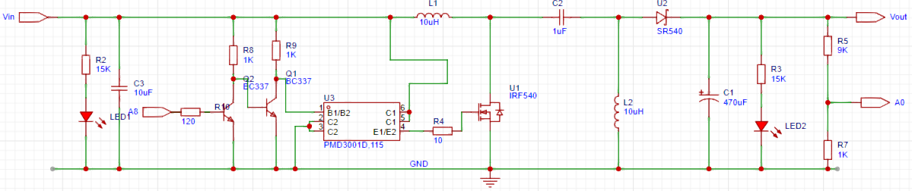
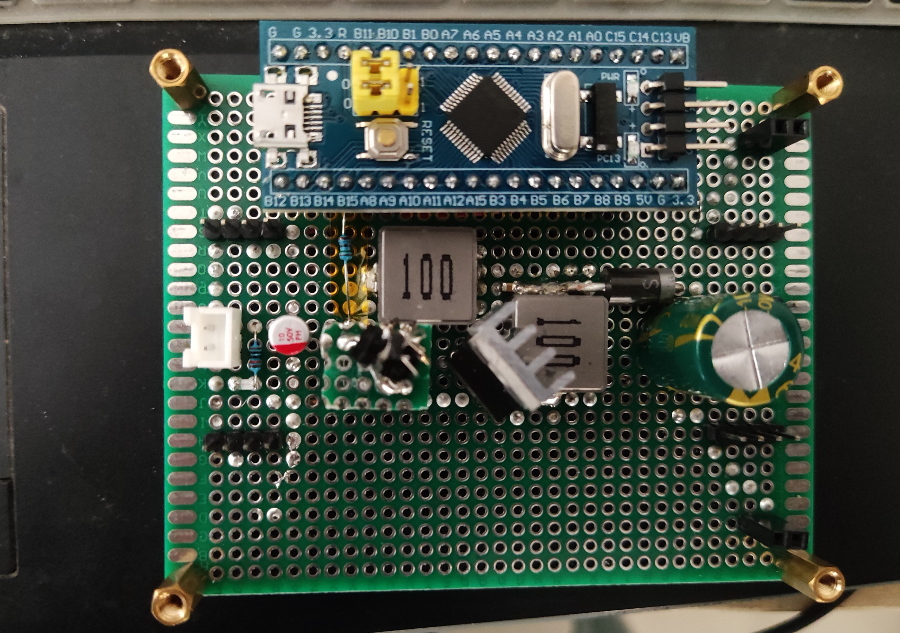

# 基于STM32的SEPIC电压变换器的设计
## 介绍
SEPIC（single ended primary inductor conver） 是一种允许输出电压大于、小于或者等于输入电压的DC-DC变换器。输出电压由主控开关（三极管或MOS管）的占空比控制。
这种电路最大的好处是输入输出同极性。尤其适合于电池供电的应用场合，允许电池电压高于或者小于所需要的输入电压。比如一块锂电池的电压为3V ~ 4.2V，如果负载需要3.3V，那么SEPIC电路可以实现这种转换。
基本拓扑如下图所示，可以看做是左侧的升压电路经电容C1耦合到右侧的升降压电路然后输出。SEPIC拓扑如下图所示：
 
  

##	基本原理
当开关管导通的时候，输入的电压对电感充电L，形成的回路是：电源正极→电感L→电源负极。电容C1在上一周期开关关闭时充了能，在本周期开关导通时要将这部分能量释放，C1将给电感L1充能，此时二极管D截止，输出电压由电容C维持；
当开关管关断时，输入的能量和电感能量一起向输出提供能量，形成的回路是：输入Vi→电感L→电容C1→二极管D→负载，电感L1也形成感应电动势，通过二极管VD续流，形成的回路是：电感L1→二极管D→负载。
SEPIC转换器通过电感储能和电容递送能量的方式，实现对输入电压的升压或降压转换。它具有独立的升压和降压能力，适用于直流电源转换和电源管理中的许多应用。通过控制开关管的状态和工作周期，可以实现对输出电压的调节和稳定性控制。
##	设计步骤
第一步：工作原理理解 
了解SEPIC变换器拓扑结构的工作原理，分析SEPIC变换器拓扑结构的特点、优缺点和适用场景。 
第二步：元件选择
研究SEPIC变换器电压变换器所需的元件，如开关管、电感、电容等。了解常用的元件选型方法、参数计算和特性要求。提供根据设计要求选择适合的元件的具体方法和步骤。
第三步：控制策略设计
分析SEPIC变换器电压变换器的控制原理和方式，如电压模式和电流模式控制。解释电压环和电流环控制策略的设计原理和方法，说明如何选择适合SEPIC变换器电压变换器的控制策略。
第四步：电路参数计算和仿真
了解SEPIC变换器电压变换器关键参数的计算方法，包括电感、电容、电流和功率等。使用电路仿真工具进行电路性能评估和参数调整，如PSPICE或SIMULINK等。进行仿真，理解和验证电路设计的正确性。
第五步：实际制造
根据电路参数计算和仿真结果进行实际电路的制造，分析实验结果，对电路的性能进行评估和优化。
##	DEMO参考

参考DEMO所用器件，其中电阻、发光二极管等为列出：
|  器件   | 参数  |
|  ----   | ----  |
| 输入电容  | 10uF|
| 功率电感  | L1 10uH, L2 10uH |
| 输出电容  | 470uF|
| 控制芯片  | STM32F103C8T6最小系统板  |
| MOS管     |  IRF540N|
| 肖特基二极管  |  SR540|
|栅极驱动  |  PMD3001D,115|
| 负载12V灯泡或风扇 | |

原理图如下，其中A0、A8为STM32F103C8T6接口，其最小系统板未在原理图画出。
DEMO原理图,其中VCC为5V：

  

stn32程序框图：

  

程序详细可见参考程序文件。通过输出PWM波来控制SEPIC电路运行；
 对输出电压进行10：1分压，使用ADC检测输出电压值，参考电压作为PID算法的参考输入，ADC输出值作为PID算法的反馈输入， PID算法据此得出相应的PWM占空比控制电路运行； 在定时器中断中完成PID算法的计算；A0口用于ADC输入； A8口为PWM输出端口；

实例图片：

  

实测数据：
| 5V | 1.152A |5.76W |11.66V |0.165A|1.92W|33.40%|70R|
| 5V | 1.179A |5.88W |11.63V |0.192A|2.23W|37.98%|60R|
| 5V | 1.506A |7.53W |11.57V |0.229A|2.65W|35.19%|50R|
| 5V | 1.831A |9.155W |11.48V |0.285A|3.27W|35.73%|40R|