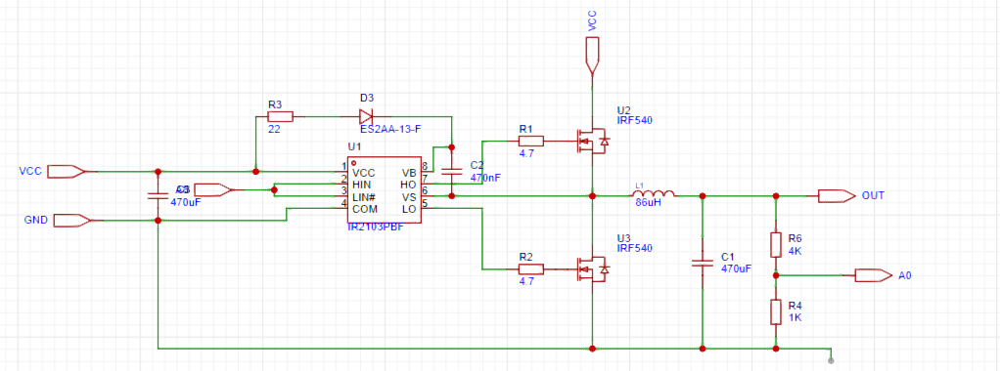

# 基于STM32的Buck电路的设计
## 	介绍
Buck电路作为一种降压电路，其核心功能在于将输入电压进行降低，以适应不同电压需求的用电设备。该电路主要依赖于晶体管、电感、电容和二极管等关键电子元件。电感在电路中起到了至关重要的作用，它不仅能够储存能量，还能提供电流。而二极管在此电路中的作用则是控制电流的方向。
Buck电路的工作模式有多种，包括连续电流模式（CCM）、不连续电流模式（DCM）以及边界模式（BCM）。这些模式的选择主要取决于具体的应用需求和电路设计。
此外，Buck电路还分为异步和同步两种类型。在异步Buck电路中，开关由mos管、三极管或单刀双掷开关等电子元件担任。当开关闭合时，二极管不导通，电感左侧为输入电压，右侧为输出电压，实现降压。当开关断开时，电感的电流不发生突变，从左端流向右端；电压反向，左侧为低电势，右侧为高电势，同时，电感之前存储的磁能就转化为电能释放给负载。
Buck电路在实际应用中具有显著的优势。首先，它能够实现电压的降低，满足不同电压等级的用电设备的需求。其次，它可以实现输出电压的连续调节，使得输出电压能够平滑变化。再者，Buck电路具有较高的转换效率，有助于减少能量的损失。最后，Buck电路具有较宽的输入和输出电压范围，能够适应不同的应用场景。这些优势使得Buck电路在实际应用中具有重要的价值。
## 基本原理
BUCK电路，又称降压电路，是一种基于电感储能原理的DC-DC变换器。其基本原理涉及电磁感应和电能转换的基本原理。在BUCK电路中，通过控制输入占空比可变的PWM波切换开关管的导通和断开状态，将输入电源提供的直流电压转换为可调的低电压输出，以满足不同电路的供电需求。
当PWM波为高电平时，开关管Q导通，储能电感L被充电，电流线性增加，同时对电容C充电并向负载提供能量。在这个阶段，电感将电流转化为磁能并存储在电感中。
当PWM波为低电平时，开关管Q关闭。由于电感的自感作用，磁场会产生电压，将电磁能转化为电能。电感通过续流二极管放电，电感电流线性减少。输出电压靠输出滤波电容C放电以及减小的电感电流维持。
通过控制开关管的导通和断开状态，电能在电容和电感之间实现周期性转换和调节，最终输出稳定的直流电压。同时，电容起到平滑输出电压的作用。在开关管导通状态下，电容储存电能；在断开状态下，电容释放电能，平滑输出电压波动。
为了确保输出电压的稳定性，BUCK电路通常采用负反馈控制。通过采样输出电压并反馈给微控制器，微控制器调节输出的PWM波的占空比，从而控制开关管的导通时间和断开时间，使输出电压保持在预定范围内。BUCK拓扑如下图所示：

  

## 设计步骤
第一步：工作原理理解 
了解Buck电路拓扑结构的工作原理，分析Buck拓扑结构的特点、优缺点和适用场景。 
第二步：元件选择
研究Buck电路所需的元件，如开关管、电感、电容等。了解常用的元件选型方法、参数计算和特性要求。提供根据设计要求选择适合的元件的具体方法和步骤。
第三步：控制策略设计
分析Buck电路的控制原理和方式，如电压模式和电流模式控制。
解释电压环和电流环控制策略的设计原理和方法，说明如何选择适合Buck电路的控制策略。
第四步：电路参数计算和仿真
了解Buck电路关键参数的计算方法，包括电感、电容、电流和功率等。使用电路仿真工具进行电路性能评估和参数调整，如PSPICE或SIMULINK等。进行仿真，理解和验证电路设计的正确性。
第五步：实际制造
根据电路参数计算和仿真结果进行实际电路的制造，分析实验结果，对电路的性能进行评估和优化。
##	DEMO参考

参考DEMO所用器件，其中电阻等为列出：
|  器件   | 参数  |
|  ----   | ----  |
| 自举电容  | 470nF |
| 输出电容  | 470uF |
| 输入电容  | 470uF |
| 驱动芯片 | IR2103|
| 控制芯片  | STM32F103C8T6最小系统板 |
| 功率电感  | 86uH |
| 二极管  |  ES2AA-13-F|
| 负载12V灯泡或风扇  |  |

原理图如下，其中A0、A8为STM32F103C8T6接口，其最小系统板未在原理图画出。

DEMO原理图,其中VCC为15V：

  

stn32程序框图：

  

程序详细可见参考程序文件。带反馈的同步BUCK结构变换器驱动程序	 通过输出PWM波来控制BUCK电路运行； 对输出电压进行4：1分压，使用ADC检测输出电压值，  参考电压作为PID算法的参考输入，ADC输出值作为PID算法的反馈输入，PID算法据此得出相应的PWM占空比控制电路运行； 在定时器中断中完成PID算法的计算；A0口用于ADC输入；    A8口为PWM输出端口；

将输入VCC15V降为OUT12V。

实例原理图：

  

实测数据：
|输入电压   | 输入电流  | 输入功率 |  输出电压   | 输出电流  | 输出功率 | 效率 |负载阻值 |
|----|----|----|----| ----|----| ----|----|
| 15V | 1.782A |26.72W |10.88V |2.174A|23.653W|88.52%|5R|
| 15V | 1.182A |17.73W |11.32V |1.401A|15.86W|89.60%|8R|
| 15V | 0.976A |14.64W |11.31V |1.131A|12.791W|87.37%|10R|    
| 15V | 0.501A |7.515W |11.53V |0.572A|6.595W|87.76%|20R|
| 15V | 0.361A |5.145W |11.54V |0.387A|4.466W|86.80%|30R|
| 15V | 0.301A |4.515W |11.54V |0.289A|3.33W|73.87%|40R|
| 15V | 0.239A |3.585W |11.56V |0.230A|2.66W|74.19%|50R|

