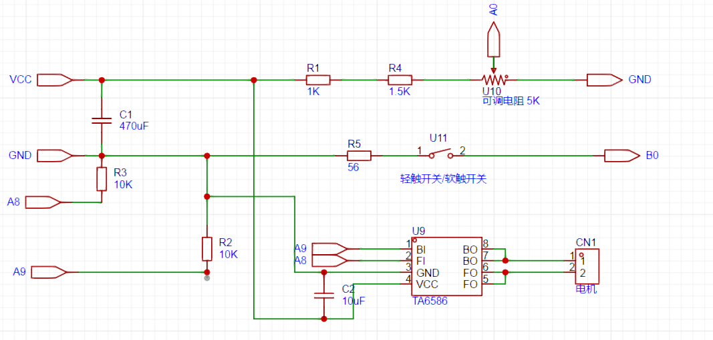

# 基于STM32的直流电机驱动
##	介绍
本课程设计基于STM32微控制器的直流电机驱动，使用ADC（模数转换器）进行控制。将学习如何利用STM32的GPIO（通用输入输出）配置电机驱动的PWM（脉冲宽度调制）信号，以及如何利用ADC采集电机转速控制信号实现控制。
直流电机是广泛应用于工业和机械领域的电动驱动装置。了解电机的驱动原理和控制方法对于工程师来说至关重要。本课程设计旨在深入了解使用STM32微控制器来驱动直流电机，并实现转速控制的基本原理和技术。

##	基本原理
在直流电机驱动中，控制电机的转速通常使用PWM（脉冲宽度调制）信号来实现。PWM信号以固定的频率在高和低电平之间切换，通过调整高电平的持续时间（占空比）来控制电机的转速。
在这个设计中，需要将STM32的GPIO配置为PWM输出模式，并设置合适的频率和占空比来生成PWM信号。PWM信号将连接到直流电机的驱动器上，从而控制电机的转速。
为了实现转速控制，将使用ADC来采集控制电机转速的信号。需要连接一个电机转速控制信号到STM32的ADC引脚上。ADC将读取传感器的输出值，并将其转换为数字信号。
通过比较设定的转速控制信号和实际采集到的转速控制信号，使用控制算法来调整PWM信号的占空比，从而实现转速的转速。
 

##	设计步骤
工作原理理解：了解直流电机驱动的工作原理，分析直流电机驱动的特点、优缺点和适用场景。明确课程目标，了解直流电机驱动的基本原理原理，具备设计和实现直流电机驱动的能力，以及能够编写相应的反馈控制程序。
根据课程目标，确定课程内容和结构。了解直流电机的基本原理、驱动电路和电机控制算法的设计和实现等。
设计与课程内容相关的实验和项目，进行实际操作和应用所学知识。搭建一个直流电机驱动电路并进行调试。
##	DEMO参考
参考DEMO所用器件，其中电阻、按键为列出：
|  器件   | 参数  |
|  ----   | ----  |
| 输入电容  | 470uF |
| 电机驱动芯片 | TA6586|
| 控制芯片  | STM32F103C8T6最小系统板 |
| 负载电机5V直流 |  |

原理图如下，其中A0、A9、A8、B0为STM32F103C8T6接口，其最小系统板未在原理图画出。
DEMO原理图：

  

stn32程序框图：

  

程序详细可见参考程序文件。通过输出PWM波来控制电机正反转； B0口用于控制正反转的开关输入； A0口用于ADC检测电压，控制PWM占空比；A8、A9口为PWM输出端口；  A8对应BI管脚、A9对应FI管脚。VCC为5V；

实例图：

  

