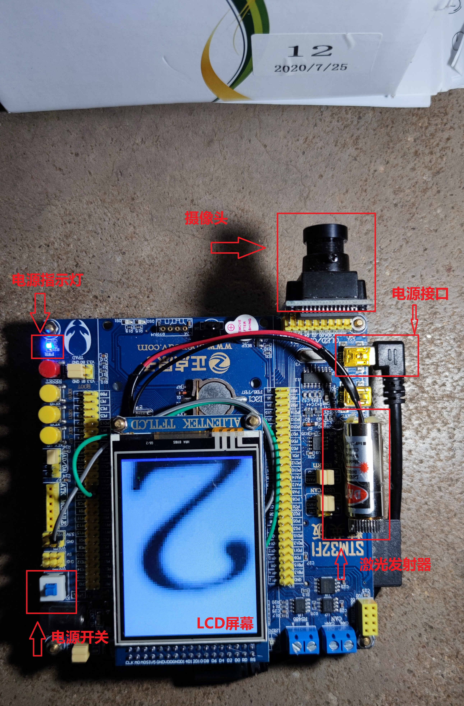
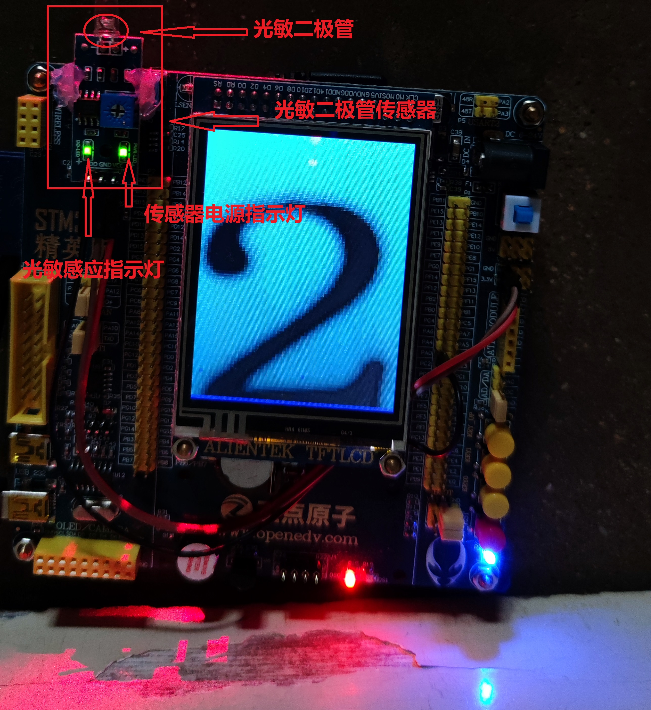

# 一种基于可见光的图像传输系统

本实用新型公开了一种基于可见光的无线图像传输系统，此系统分为图像采集和信号发送端及信号接收图像显示端。
在发射端使用摄像头进行图像数据采集，再发送到单片机，在屏幕上显示，并通过PWM调制的方式，对图像数据进行编码，然后输送到光源模块，实现电信号向光信号的转换，最后将携带数据的光信号发射出去；在接收端，使用光敏二极管进行光信号采集，实现光信号向电信号的转换，再输送给单片机，单片机通过定时器的输入捕获功能获取信号，然后解码还原图像数据，最后在屏幕显示，并和发射端的图片对比检验。

## 说明书

### 技术领域
本发明涉及图像数据的无线传输系统，更具体的是利用可见光进行无线传输。
### 背景技术
目前，主流的日常无线传输手段主要为WIFI和蓝牙。这些都是通过电磁波来进行传输的。以2.4GHz频段的WIFI为例，其具有较强的穿透性，但是当处于较远的地方或有多重墙壁隔离的地点，其数据传输往往会变得不稳定，且与距离和隔离墙的数量呈负相关关系。此外，WIFI的数据传输速度还会受到频段的限制，这使得它的速度增长受限。
### 发明内容
本实用新型实现了通过可见光进行图像数据传输，发射端通过光源发射数据信号，而后在接收端通过光敏二极管来采集数据信号，并在屏幕上显示。
本实用新型采用PWM调制进行数据编码。根据PWM的脉宽长度定义“0”和“1”的数据信号。
发射端，使用摄像头进行图像数据采集，再发送到单片机，并在屏幕上显示和通过单片机的定时器实现PWM调制信号的生成，然后输送到光源处，将携带数据的光信号发射出去。
接收端，实用光敏二极管进行光信号采集，再输送给单片机，单片机通过定时器进行定时计数，然后解码还原图像数据，最后在屏幕显示，并与发射端的图像进行对比，确定图像数据传输的真实性和准确性。
本实用新型的优点是，通过可见光进行传输，不受频段的限制，且可见光是室内的照明手段，发射光源处处可在。
附图说明
下面结合附图和实施案例对本实用新型进一步说明。
图1为本实用新型的总体结构图；

  

图2为本实用新型的发射端程序流程图；

  

图3为本实用新型的接收端程序流程图；

  

图4为本实用新型的数据编码时序图。

  

具体实施方式
根据图1，本实用新型分为发射端和接收端两部分。在发射端使用摄像头进行图像数据采集，再发送到单片机，并在屏幕上显示和通过单片机的定时器实现PWM调制信号的生成，然后输送到光源处，将携带数据的光信号发射出去；在接收端，使用光敏二极管进行光信号采集，再输送给单片机，单片机通过定时器进行定时计数，然后解码还原图像数据，最后在屏幕显示。
根据图2，本实用新型在发射端使用摄像头进行图像数据采集，再发送到单片机，并在屏幕上显示。再通过单片机的定时器实现PWM调制信号的生成，并对图像数据的进行信号编码。然后把携带图像数据的电信号输送到光源模块处，实现电信号向光信号的转换。最后，将携带数据的光信号发射出去。
根据图3，本实用新型在接收端，采用光敏二极管对光信号进行采集，实现光信号向电信号的转换，再经由改传感器模块的LM393电路实现向单片机传输一个数字信号。单片机通过配置定时器的输入捕获功能，通过边沿触发进行定时计数，从而获取捕获到的信号的脉宽，再与编码的信号脉宽进行比较，实现图像数据的解码，还原发射端传输过来的图像数据。最后在屏幕显示，并与发射端的图片进行对比检验。
根据图3，本实用新型采用PWM调制的方式来编码数据信号。空闲或等待状态，维持低电平。起始信号和数据信号均由一个低电平和高电平信号组成，本实验系统固定了前端的低电平信号宽度（也可任意设置），再分别接上不同的高电平脉宽来实现。一个完整的信号由一个起始信号和若干个数据信号（其数值等于像素点的深度）组成。为了实现对传输过程的误码处理，采用分块的格式打包图像数据，将一系列完整的图像数据，按列分割成若干个数据包，并以列号作为该数据包的标志信号。接收端，首先接收到图像数据的列位置，再接收该列的图像数据，并在屏幕上显示，并不断刷新。若在传输过程中出现了误码、丢包等情况，未能正确接收的数据由处理器自动填充，直到接收到了正确的数据再重新刷新；对于钢线受阻的情况，接收端的屏幕不再刷新图像，当重新接收到列的位置标志后，则从该列开始继续刷新图片。
另外，由于摄像头模块采集的图像为80*60个像素，而使用的LCD屏幕为320*240，因此，在图像显示时，通过把一个像素点填充成一个4*4的像素块，把屏幕填充满，从而达到图像放大的效果，更易查看。
 

 

## 使用说明
本可见光传输系统，包含发射和接收两个独立部分。（注意，不可直视激光，伤眼）

### 发射端 
在上电后，便立即开始工作，激光发射器默认为点亮状态，摄像头开始采集数据，并在屏幕显示，以和接收端进行比对，再通过编码，通过激光头进行数据发送；激光为直线收束的光线，故接收端的光敏二极管最好能够激光通路直线上。

  

- 激光发射器 
其前端的螺纹圈，是可活动的，旋转可调节光束的粗细，操作时不可下手太重！便于与光敏二极管传感器对准。
- 摄像头拍摄位置说明
测试高度大约7cm，测试距离约9cm（图片与蓝色开发板边缘的距离），实际效果需根据实际情况微调。

  

### 接收端

实现了光信号校准后，便开始接收数据，并实时在屏幕刷新。由于光敏二极管为指向性对光敏型器件，故发射端的激光能够直接照射在二极管尖端为佳。同时，光敏二极管模块有一个指示灯，当光敏二极管感应到激光后，该指示灯会被点亮，否则为熄灭状态。

- 特别说明
本系统，可在自然光条件下工作。但是，由于是光传输系统，自然光的干扰是存在的。如果环境光光强达到（或接近）了光敏二极管的阈值，本系统将无法正常工作。因此，最佳的工作条件是在弱环境光（或黑暗）条件下。

- 接线说明（针对本系统）
1. 发射端：仅激光发射器需接线，其他模块均以排针接入开发板。
激光发射器：
- 正极（红-灰色线）接开发板的3.3V引脚；
- 负极（黑-绿色线）接开发板的PA4引脚。

2. 接收端：仅光敏二极管模块需引线。
光敏二极管：
- VCC（正极）引脚：接开发板的3.3V引脚；
- GND（地线）引脚：接开发板的GND引脚；
- DO（数据）引脚：接开发板的PA0引脚。

3. 测试工作时间：超过1小时。
